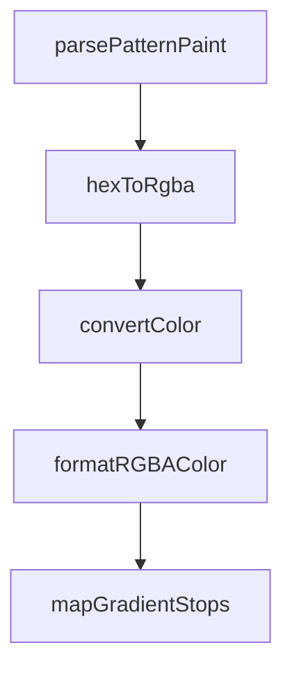

# Chapter 5: MCP Client Integrations

Welcome to **Chapter 5: MCP Client Integrations**. In this part of **Figma Context MCP Tutorial: Design-to-Code Workflows for Coding Agents**, you will build an intuitive mental model first, then move into concrete implementation details and practical production tradeoffs.


Figma Context MCP can be integrated into Cursor and other MCP-capable clients through standard configuration patterns.

## Integration Checklist

- register MCP server with token handling
- verify tool discovery in client
- test with known Figma frame
- establish local team config template

## Summary

You now know how to operationalize Figma Context MCP across coding-agent clients.

Next: [Chapter 6: Performance and Token Optimization](06-performance-and-token-optimization.md)

## Source Code Walkthrough

### `src/transformers/style.ts`

The `parsePatternPaint` function in [`src/transformers/style.ts`](https://github.com/GLips/Figma-Context-MCP/blob/HEAD/src/transformers/style.ts) handles a key part of this chapter's functionality:

```ts
    }
  } else if (raw.type === "PATTERN") {
    return parsePatternPaint(raw);
  } else if (
    ["GRADIENT_LINEAR", "GRADIENT_RADIAL", "GRADIENT_ANGULAR", "GRADIENT_DIAMOND"].includes(
      raw.type,
    )
  ) {
    return {
      type: raw.type as
        | "GRADIENT_LINEAR"
        | "GRADIENT_RADIAL"
        | "GRADIENT_ANGULAR"
        | "GRADIENT_DIAMOND",
      gradient: convertGradientToCss(raw),
    };
  } else {
    throw new Error(`Unknown paint type: ${raw.type}`);
  }
}

/**
 * Convert a Figma PatternPaint to a CSS-like pattern fill.
 *
 * Ignores `tileType` and `spacing` from the Figma API currently as there's
 * no great way to translate them to CSS.
 *
 * @param raw - The Figma PatternPaint to convert
 * @returns The converted pattern SimplifiedFill
 */
function parsePatternPaint(
  raw: Extract<Paint, { type: "PATTERN" }>,
```

This function is important because it defines how Figma Context MCP Tutorial: Design-to-Code Workflows for Coding Agents implements the patterns covered in this chapter.

### `src/transformers/style.ts`

The `hexToRgba` function in [`src/transformers/style.ts`](https://github.com/GLips/Figma-Context-MCP/blob/HEAD/src/transformers/style.ts) handles a key part of this chapter's functionality:

```ts
 * @returns Color string in rgba format
 */
export function hexToRgba(hex: string, opacity: number = 1): string {
  // Remove possible # prefix
  hex = hex.replace("#", "");

  // Handle shorthand hex values (e.g., #FFF)
  if (hex.length === 3) {
    hex = hex[0] + hex[0] + hex[1] + hex[1] + hex[2] + hex[2];
  }

  // Convert hex to RGB values
  const r = parseInt(hex.substring(0, 2), 16);
  const g = parseInt(hex.substring(2, 4), 16);
  const b = parseInt(hex.substring(4, 6), 16);

  // Ensure opacity is in the 0-1 range
  const validOpacity = Math.min(Math.max(opacity, 0), 1);

  return `rgba(${r}, ${g}, ${b}, ${validOpacity})`;
}

/**
 * Convert color from RGBA to { hex, opacity }
 *
 * @param color - The color to convert, including alpha channel
 * @param opacity - The opacity of the color, if not included in alpha channel
 * @returns The converted color
 **/
export function convertColor(color: RGBA, opacity = 1): ColorValue {
  const r = Math.round(color.r * 255);
  const g = Math.round(color.g * 255);
```

This function is important because it defines how Figma Context MCP Tutorial: Design-to-Code Workflows for Coding Agents implements the patterns covered in this chapter.

### `src/transformers/style.ts`

The `convertColor` function in [`src/transformers/style.ts`](https://github.com/GLips/Figma-Context-MCP/blob/HEAD/src/transformers/style.ts) handles a key part of this chapter's functionality:

```ts
  } else if (raw.type === "SOLID") {
    // treat as SOLID
    const { hex, opacity } = convertColor(raw.color!, raw.opacity);
    if (opacity === 1) {
      return hex;
    } else {
      return formatRGBAColor(raw.color!, opacity);
    }
  } else if (raw.type === "PATTERN") {
    return parsePatternPaint(raw);
  } else if (
    ["GRADIENT_LINEAR", "GRADIENT_RADIAL", "GRADIENT_ANGULAR", "GRADIENT_DIAMOND"].includes(
      raw.type,
    )
  ) {
    return {
      type: raw.type as
        | "GRADIENT_LINEAR"
        | "GRADIENT_RADIAL"
        | "GRADIENT_ANGULAR"
        | "GRADIENT_DIAMOND",
      gradient: convertGradientToCss(raw),
    };
  } else {
    throw new Error(`Unknown paint type: ${raw.type}`);
  }
}

/**
 * Convert a Figma PatternPaint to a CSS-like pattern fill.
 *
 * Ignores `tileType` and `spacing` from the Figma API currently as there's
```

This function is important because it defines how Figma Context MCP Tutorial: Design-to-Code Workflows for Coding Agents implements the patterns covered in this chapter.

### `src/transformers/style.ts`

The `formatRGBAColor` function in [`src/transformers/style.ts`](https://github.com/GLips/Figma-Context-MCP/blob/HEAD/src/transformers/style.ts) handles a key part of this chapter's functionality:

```ts
      return hex;
    } else {
      return formatRGBAColor(raw.color!, opacity);
    }
  } else if (raw.type === "PATTERN") {
    return parsePatternPaint(raw);
  } else if (
    ["GRADIENT_LINEAR", "GRADIENT_RADIAL", "GRADIENT_ANGULAR", "GRADIENT_DIAMOND"].includes(
      raw.type,
    )
  ) {
    return {
      type: raw.type as
        | "GRADIENT_LINEAR"
        | "GRADIENT_RADIAL"
        | "GRADIENT_ANGULAR"
        | "GRADIENT_DIAMOND",
      gradient: convertGradientToCss(raw),
    };
  } else {
    throw new Error(`Unknown paint type: ${raw.type}`);
  }
}

/**
 * Convert a Figma PatternPaint to a CSS-like pattern fill.
 *
 * Ignores `tileType` and `spacing` from the Figma API currently as there's
 * no great way to translate them to CSS.
 *
 * @param raw - The Figma PatternPaint to convert
 * @returns The converted pattern SimplifiedFill
```

This function is important because it defines how Figma Context MCP Tutorial: Design-to-Code Workflows for Coding Agents implements the patterns covered in this chapter.


## How These Components Connect


