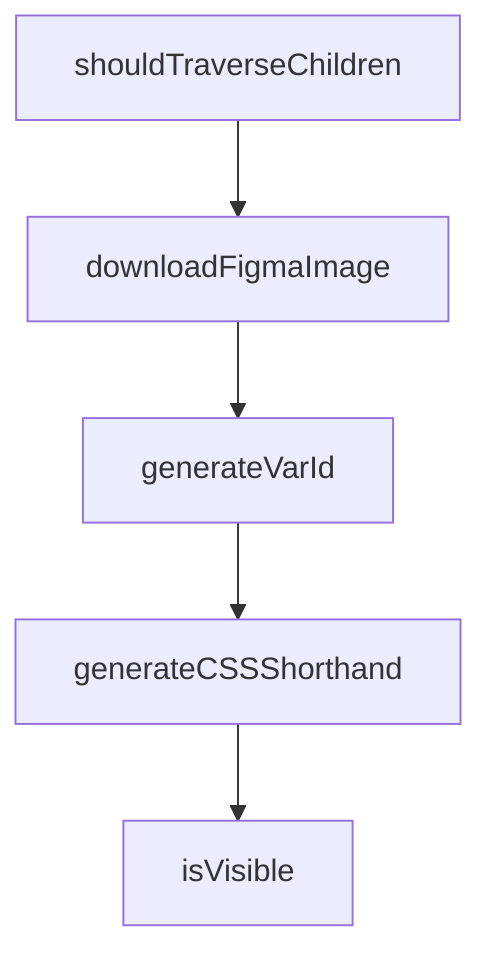

# Chapter 6: Performance and Token Optimization

Welcome to **Chapter 6: Performance and Token Optimization**. In this part of **Figma Context MCP Tutorial: Design-to-Code Workflows for Coding Agents**, you will build an intuitive mental model first, then move into concrete implementation details and practical production tradeoffs.


Performance improves when context payloads are scoped and prompts are structured for deterministic outputs.

## Optimization Levers

| Lever | Effect |
|:------|:-------|
| tighter frame scope | lower payload size |
| explicit output requirements | fewer retries |
| staged generation | reduced error propagation |

## Summary

You now have token and latency controls for efficient design-to-code workflows.

Next: [Chapter 7: Team Workflows and Design Governance](07-team-workflows-and-design-governance.md)

## Depth Expansion Playbook

## Source Code Walkthrough

### `src/extractors/node-walker.ts`

The `shouldTraverseChildren` function in [`src/extractors/node-walker.ts`](https://github.com/GLips/Figma-Context-MCP/blob/HEAD/src/extractors/node-walker.ts) handles a key part of this chapter's functionality:

```ts

  // Handle children recursively
  if (shouldTraverseChildren(node, context, options)) {
    const childContext: TraversalContext = {
      ...context,
      currentDepth: context.currentDepth + 1,
      parent: node,
    };

    // Use the same pattern as the existing parseNode function
    if (hasValue("children", node) && node.children.length > 0) {
      const children = node.children
        .filter((child) => shouldProcessNode(child, options))
        .map((child) => processNodeWithExtractors(child, extractors, childContext, options))
        .filter((child): child is SimplifiedNode => child !== null);

      if (children.length > 0) {
        // Allow custom logic to modify parent and control which children to include
        const childrenToInclude = options.afterChildren
          ? options.afterChildren(node, result, children)
          : children;

        if (childrenToInclude.length > 0) {
          result.children = childrenToInclude;
        }
      }
    }
  }

  return result;
}

```

This function is important because it defines how Figma Context MCP Tutorial: Design-to-Code Workflows for Coding Agents implements the patterns covered in this chapter.

### `src/utils/common.ts`

The `downloadFigmaImage` function in [`src/utils/common.ts`](https://github.com/GLips/Figma-Context-MCP/blob/HEAD/src/utils/common.ts) handles a key part of this chapter's functionality:

```ts
 * @throws Error if download fails
 */
export async function downloadFigmaImage(
  fileName: string,
  localPath: string,
  imageUrl: string,
): Promise<string> {
  try {
    // Ensure local path exists
    if (!fs.existsSync(localPath)) {
      fs.mkdirSync(localPath, { recursive: true });
    }

    // Build the complete file path and verify it stays within localPath
    const fullPath = path.resolve(path.join(localPath, fileName));
    const resolvedLocalPath = path.resolve(localPath);
    if (!fullPath.startsWith(resolvedLocalPath + path.sep)) {
      throw new Error(`File path escapes target directory: ${fileName}`);
    }

    // Use fetch to download the image
    const response = await fetch(imageUrl, {
      method: "GET",
    });

    if (!response.ok) {
      throw new Error(`Failed to download image: ${response.statusText}`);
    }

    // Create write stream
    const writer = fs.createWriteStream(fullPath);

```

This function is important because it defines how Figma Context MCP Tutorial: Design-to-Code Workflows for Coding Agents implements the patterns covered in this chapter.

### `src/utils/common.ts`

The `generateVarId` function in [`src/utils/common.ts`](https://github.com/GLips/Figma-Context-MCP/blob/HEAD/src/utils/common.ts) handles a key part of this chapter's functionality:

```ts
 * @returns A 6-character random ID string with prefix
 */
export function generateVarId(prefix: string = "var"): StyleId {
  const chars = "ABCDEFGHIJKLMNOPQRSTUVWXYZ0123456789";
  let result = "";

  for (let i = 0; i < 6; i++) {
    const randomIndex = Math.floor(Math.random() * chars.length);
    result += chars[randomIndex];
  }

  return `${prefix}_${result}` as StyleId;
}

/**
 * Generate a CSS shorthand for values that come with top, right, bottom, and left
 *
 * input: { top: 10, right: 10, bottom: 10, left: 10 }
 * output: "10px"
 *
 * input: { top: 10, right: 20, bottom: 10, left: 20 }
 * output: "10px 20px"
 *
 * input: { top: 10, right: 20, bottom: 30, left: 40 }
 * output: "10px 20px 30px 40px"
 *
 * @param values - The values to generate the shorthand for
 * @returns The generated shorthand
 */
export function generateCSSShorthand(
  values: {
    top: number;
```

This function is important because it defines how Figma Context MCP Tutorial: Design-to-Code Workflows for Coding Agents implements the patterns covered in this chapter.

### `src/utils/common.ts`

The `generateCSSShorthand` function in [`src/utils/common.ts`](https://github.com/GLips/Figma-Context-MCP/blob/HEAD/src/utils/common.ts) handles a key part of this chapter's functionality:

```ts
 * @returns The generated shorthand
 */
export function generateCSSShorthand(
  values: {
    top: number;
    right: number;
    bottom: number;
    left: number;
  },
  {
    ignoreZero = true,
    suffix = "px",
  }: {
    /**
     * If true and all values are 0, return undefined. Defaults to true.
     */
    ignoreZero?: boolean;
    /**
     * The suffix to add to the shorthand. Defaults to "px".
     */
    suffix?: string;
  } = {},
) {
  const { top, right, bottom, left } = values;
  if (ignoreZero && top === 0 && right === 0 && bottom === 0 && left === 0) {
    return undefined;
  }
  if (top === right && right === bottom && bottom === left) {
    return `${top}${suffix}`;
  }
  if (right === left) {
    if (top === bottom) {
```

This function is important because it defines how Figma Context MCP Tutorial: Design-to-Code Workflows for Coding Agents implements the patterns covered in this chapter.


## How These Components Connect


