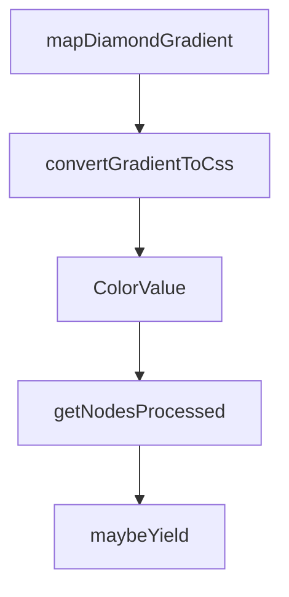

# Chapter 6: Performance and Token Optimization

Welcome to **Chapter 6: Performance and Token Optimization**. In this part of **Figma Context MCP Tutorial: Design-to-Code Workflows for Coding Agents**, you will build an intuitive mental model first, then move into concrete implementation details and practical production tradeoffs.


Performance improves when context payloads are scoped and prompts are structured for deterministic outputs.

## Optimization Levers

| Lever | Effect |
|:------|:-------|
| tighter frame scope | lower payload size |
| explicit output requirements | fewer retries |
| staged generation | reduced error propagation |

## Summary

You now have token and latency controls for efficient design-to-code workflows.

Next: [Chapter 7: Team Workflows and Design Governance](07-team-workflows-and-design-governance.md)

## Source Code Walkthrough

### `src/transformers/style.ts`

The `mapDiamondGradient` function in [`src/transformers/style.ts`](https://github.com/GLips/Figma-Context-MCP/blob/HEAD/src/transformers/style.ts) handles a key part of this chapter's functionality:

```ts
    }
    case "GRADIENT_DIAMOND": {
      return mapDiamondGradient(gradient.gradientStops, handle1, handle2, handle3, elementBounds);
    }
    default: {
      const stops = gradient.gradientStops
        .map(({ position, color }) => {
          const cssColor = formatRGBAColor(color, 1);
          return `${cssColor} ${Math.round(position * 100)}%`;
        })
        .join(", ");
      return { stops, cssGeometry: "0deg" };
    }
  }
}

/**
 * Map linear gradient from Figma handles to CSS
 */
function mapLinearGradient(
  gradientStops: { position: number; color: RGBA }[],
  start: Vector,
  end: Vector,
  _elementBounds: { width: number; height: number },
): { stops: string; cssGeometry: string } {
  // Calculate the gradient line in element space
  const dx = end.x - start.x;
  const dy = end.y - start.y;
  const gradientLength = Math.sqrt(dx * dx + dy * dy);

  // Handle degenerate case
  if (gradientLength === 0) {
```

This function is important because it defines how Figma Context MCP Tutorial: Design-to-Code Workflows for Coding Agents implements the patterns covered in this chapter.

### `src/transformers/style.ts`

The `convertGradientToCss` function in [`src/transformers/style.ts`](https://github.com/GLips/Figma-Context-MCP/blob/HEAD/src/transformers/style.ts) handles a key part of this chapter's functionality:

```ts
        | "GRADIENT_ANGULAR"
        | "GRADIENT_DIAMOND",
      gradient: convertGradientToCss(raw),
    };
  } else {
    throw new Error(`Unknown paint type: ${raw.type}`);
  }
}

/**
 * Convert a Figma PatternPaint to a CSS-like pattern fill.
 *
 * Ignores `tileType` and `spacing` from the Figma API currently as there's
 * no great way to translate them to CSS.
 *
 * @param raw - The Figma PatternPaint to convert
 * @returns The converted pattern SimplifiedFill
 */
function parsePatternPaint(
  raw: Extract<Paint, { type: "PATTERN" }>,
): Extract<SimplifiedFill, { type: "PATTERN" }> {
  /**
   * The only CSS-like repeat value supported by Figma is repeat.
   *
   * They also have hexagonal horizontal and vertical repeats, but
   * those aren't easy to pull off in CSS, so we just use repeat.
   */
  let backgroundRepeat = "repeat";

  let horizontal = "left";
  switch (raw.horizontalAlignment) {
    case "START":
```

This function is important because it defines how Figma Context MCP Tutorial: Design-to-Code Workflows for Coding Agents implements the patterns covered in this chapter.

### `src/transformers/style.ts`

The `ColorValue` interface in [`src/transformers/style.ts`](https://github.com/GLips/Figma-Context-MCP/blob/HEAD/src/transformers/style.ts) handles a key part of this chapter's functionality:

```ts
export type CSSRGBAColor = `rgba(${number}, ${number}, ${number}, ${number})`;
export type CSSHexColor = `#${string}`;
export interface ColorValue {
  hex: CSSHexColor;
  opacity: number;
}

/**
 * Simplified image fill with CSS properties and processing metadata
 *
 * This type represents an image fill that can be used as either:
 * - background-image (when parent node has children)
 * -  tag (when parent node has no children)
 *
 * The CSS properties are mutually exclusive based on usage context.
 */
export type SimplifiedImageFill = {
  type: "IMAGE";
  imageRef: string;
  /**
   * Present when the fill is an animated GIF. Use this ref (instead of imageRef) when calling
   * download_figma_images to retrieve the animated GIF file; imageRef only points to a static
   * snapshot frame.
   */
  gifRef?: string;
  scaleMode: "FILL" | "FIT" | "TILE" | "STRETCH";
  /**
   * For TILE mode, the scaling factor relative to original image size
   */
  scalingFactor?: number;

  // CSS properties for background-image usage (when node has children)
```

This interface is important because it defines how Figma Context MCP Tutorial: Design-to-Code Workflows for Coding Agents implements the patterns covered in this chapter.

### `src/extractors/node-walker.ts`

The `getNodesProcessed` function in [`src/extractors/node-walker.ts`](https://github.com/GLips/Figma-Context-MCP/blob/HEAD/src/extractors/node-walker.ts) handles a key part of this chapter's functionality:

```ts
let nodesProcessed = 0;

export function getNodesProcessed(): number {
  return nodesProcessed;
}

async function maybeYield(): Promise<void> {
  nodesProcessed++;
  if (nodesProcessed % YIELD_INTERVAL === 0) {
    await new Promise<void>((resolve) => setImmediate(resolve));
  }
}

/**
 * Extract data from Figma nodes using a flexible, single-pass approach.
 *
 * @param nodes - The Figma nodes to process
 * @param extractors - Array of extractor functions to apply during traversal
 * @param options - Traversal options (filtering, depth limits, etc.)
 * @param globalVars - Global variables for style deduplication
 * @returns Object containing processed nodes and updated global variables
 */
export async function extractFromDesign(
  nodes: FigmaDocumentNode[],
  extractors: ExtractorFn[],
  options: TraversalOptions = {},
  globalVars: GlobalVars = { styles: {} },
): Promise<{ nodes: SimplifiedNode[]; globalVars: GlobalVars }> {
  const context: TraversalContext = {
    globalVars,
    currentDepth: 0,
  };
```

This function is important because it defines how Figma Context MCP Tutorial: Design-to-Code Workflows for Coding Agents implements the patterns covered in this chapter.


## How These Components Connect


