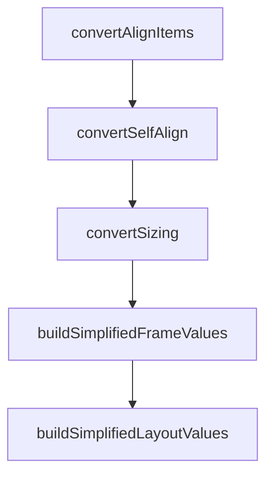

# Chapter 7: Team Workflows and Design Governance

Welcome to **Chapter 7: Team Workflows and Design Governance**. In this part of **Figma Context MCP Tutorial: Design-to-Code Workflows for Coding Agents**, you will build an intuitive mental model first, then move into concrete implementation details and practical production tradeoffs.


Teams need standardized patterns for design-to-code workflows to avoid inconsistent outputs.

## Governance Pattern

1. define approved prompt templates
2. enforce component library and token alignment
3. require diff review against design requirements
4. track recurring mismatch classes and fix root causes

## Summary

You now have a team governance baseline for consistent design-to-code execution.

Next: [Chapter 8: Production Security and Operations](08-production-security-and-operations.md)

## Depth Expansion Playbook

## Source Code Walkthrough

### `src/transformers/layout.ts`

The `convertAlignItems` function in [`src/transformers/layout.ts`](https://github.com/GLips/Figma-Context-MCP/blob/HEAD/src/transformers/layout.ts) handles a key part of this chapter's functionality:

```ts
}

function convertAlignItems(
  align: HasFramePropertiesTrait["counterAxisAlignItems"] | undefined,
  children: FigmaDocumentNode[],
  mode: "row" | "column",
) {
  // Row cross-axis is vertical; column cross-axis is horizontal
  const crossSizing = mode === "row" ? "layoutSizingVertical" : "layoutSizingHorizontal";
  const allStretch =
    children.length > 0 &&
    children.every(
      (c) =>
        ("layoutPositioning" in c && c.layoutPositioning === "ABSOLUTE") ||
        (crossSizing in c && (c as Record<string, unknown>)[crossSizing] === "FILL"),
    );
  if (allStretch) return "stretch";

  switch (align) {
    case "MIN":
      return undefined;
    case "MAX":
      return "flex-end";
    case "CENTER":
      return "center";
    case "BASELINE":
      return "baseline";
    default:
      return undefined;
  }
}

```

This function is important because it defines how Figma Context MCP Tutorial: Design-to-Code Workflows for Coding Agents implements the patterns covered in this chapter.

### `src/transformers/layout.ts`

The `convertSelfAlign` function in [`src/transformers/layout.ts`](https://github.com/GLips/Figma-Context-MCP/blob/HEAD/src/transformers/layout.ts) handles a key part of this chapter's functionality:

```ts
}

function convertSelfAlign(align?: HasLayoutTrait["layoutAlign"]) {
  switch (align) {
    case "MIN":
      // MIN, AKA flex-start, is the default alignment
      return undefined;
    case "MAX":
      return "flex-end";
    case "CENTER":
      return "center";
    case "STRETCH":
      return "stretch";
    default:
      return undefined;
  }
}

// interpret sizing
function convertSizing(
  s?: HasLayoutTrait["layoutSizingHorizontal"] | HasLayoutTrait["layoutSizingVertical"],
) {
  if (s === "FIXED") return "fixed";
  if (s === "FILL") return "fill";
  if (s === "HUG") return "hug";
  return undefined;
}

function buildSimplifiedFrameValues(n: FigmaDocumentNode): SimplifiedLayout | { mode: "none" } {
  if (!isFrame(n)) {
    return { mode: "none" };
  }
```

This function is important because it defines how Figma Context MCP Tutorial: Design-to-Code Workflows for Coding Agents implements the patterns covered in this chapter.

### `src/transformers/layout.ts`

The `convertSizing` function in [`src/transformers/layout.ts`](https://github.com/GLips/Figma-Context-MCP/blob/HEAD/src/transformers/layout.ts) handles a key part of this chapter's functionality:

```ts

// interpret sizing
function convertSizing(
  s?: HasLayoutTrait["layoutSizingHorizontal"] | HasLayoutTrait["layoutSizingVertical"],
) {
  if (s === "FIXED") return "fixed";
  if (s === "FILL") return "fill";
  if (s === "HUG") return "hug";
  return undefined;
}

function buildSimplifiedFrameValues(n: FigmaDocumentNode): SimplifiedLayout | { mode: "none" } {
  if (!isFrame(n)) {
    return { mode: "none" };
  }

  const frameValues: SimplifiedLayout = {
    mode:
      !n.layoutMode || n.layoutMode === "NONE"
        ? "none"
        : n.layoutMode === "HORIZONTAL"
          ? "row"
          : "column",
  };

  const overflowScroll: SimplifiedLayout["overflowScroll"] = [];
  if (n.overflowDirection?.includes("HORIZONTAL")) overflowScroll.push("x");
  if (n.overflowDirection?.includes("VERTICAL")) overflowScroll.push("y");
  if (overflowScroll.length > 0) frameValues.overflowScroll = overflowScroll;

  if (frameValues.mode === "none") {
    return frameValues;
```

This function is important because it defines how Figma Context MCP Tutorial: Design-to-Code Workflows for Coding Agents implements the patterns covered in this chapter.

### `src/transformers/layout.ts`

The `buildSimplifiedFrameValues` function in [`src/transformers/layout.ts`](https://github.com/GLips/Figma-Context-MCP/blob/HEAD/src/transformers/layout.ts) handles a key part of this chapter's functionality:

```ts
  parent?: FigmaDocumentNode,
): SimplifiedLayout {
  const frameValues = buildSimplifiedFrameValues(n);
  const layoutValues = buildSimplifiedLayoutValues(n, parent, frameValues.mode) || {};

  return { ...frameValues, ...layoutValues };
}

function convertJustifyContent(align?: HasFramePropertiesTrait["primaryAxisAlignItems"]) {
  switch (align) {
    case "MIN":
      return undefined;
    case "MAX":
      return "flex-end";
    case "CENTER":
      return "center";
    case "SPACE_BETWEEN":
      return "space-between";
    default:
      return undefined;
  }
}

function convertAlignItems(
  align: HasFramePropertiesTrait["counterAxisAlignItems"] | undefined,
  children: FigmaDocumentNode[],
  mode: "row" | "column",
) {
  // Row cross-axis is vertical; column cross-axis is horizontal
  const crossSizing = mode === "row" ? "layoutSizingVertical" : "layoutSizingHorizontal";
  const allStretch =
    children.length > 0 &&
```

This function is important because it defines how Figma Context MCP Tutorial: Design-to-Code Workflows for Coding Agents implements the patterns covered in this chapter.


## How These Components Connect


