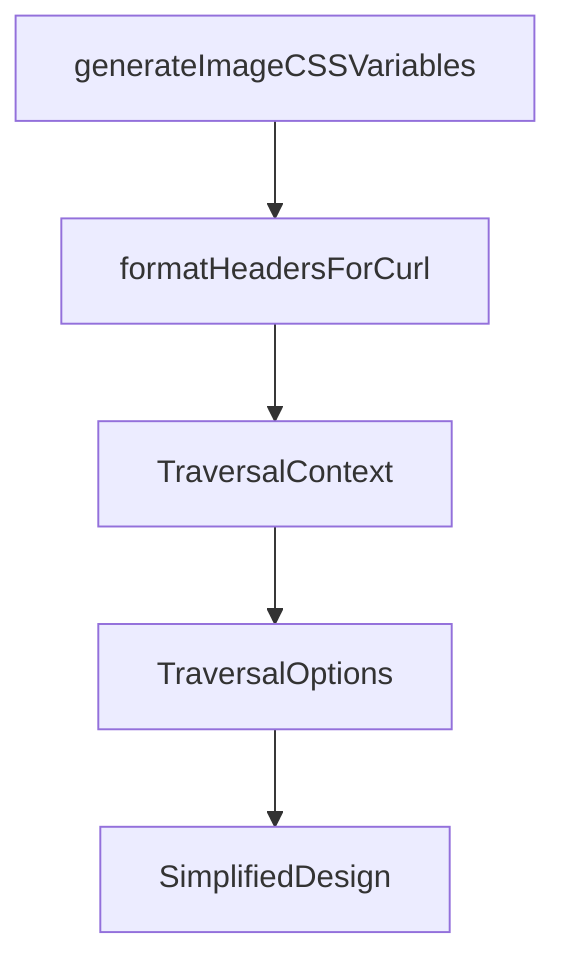

# Chapter 8: Production Security and Operations

Welcome to **Chapter 8: Production Security and Operations**. In this part of **Figma Context MCP Tutorial: Design-to-Code Workflows for Coding Agents**, you will build an intuitive mental model first, then move into concrete implementation details and practical production tradeoffs.


This chapter covers secure deployment and operational policies for Figma context pipelines.

## Security Checklist

- store Figma tokens in secret manager, not plain files
- scope token usage to required access only
- rotate credentials on schedule
- audit MCP requests and response metadata

## Operational Metrics

| Metric | Why It Matters |
|:-------|:---------------|
| design-to-code success rate | outcome quality |
| average retries per screen | prompt/context quality signal |
| mean implementation latency | productivity and cost |

## Summary

You now have the security and operations baseline for running Figma Context MCP in production teams.

## Source Code Walkthrough

### `src/utils/image-processing.ts`

The `generateImageCSSVariables` function in [`src/utils/image-processing.ts`](https://github.com/GLips/Figma-Context-MCP/blob/HEAD/src/utils/image-processing.ts) handles a key part of this chapter's functionality:

```ts
  let cssVariables: string | undefined;
  if (requiresImageDimensions) {
    cssVariables = generateImageCSSVariables(finalDimensions);
  }

  return {
    filePath: finalPath,
    originalDimensions,
    finalDimensions,
    wasCropped,
    cropRegion,
    cssVariables,
    processingLog,
  };
}

/**
 * Create CSS custom properties for image dimensions
 * @param imagePath - Path to the image file
 * @returns Promise<string> - CSS custom properties
 */
export function generateImageCSSVariables({
  width,
  height,
}: {
  width: number;
  height: number;
}): string {
  return `--original-width: ${width}px; --original-height: ${height}px;`;
}

```

This function is important because it defines how Figma Context MCP Tutorial: Design-to-Code Workflows for Coding Agents implements the patterns covered in this chapter.

### `src/utils/fetch-with-retry.ts`

The `formatHeadersForCurl` function in [`src/utils/fetch-with-retry.ts`](https://github.com/GLips/Figma-Context-MCP/blob/HEAD/src/utils/fetch-with-retry.ts) handles a key part of this chapter's functionality:

```ts
    );

    const curlHeaders = formatHeadersForCurl(options.headers);
    // Most options here are to ensure stderr only contains errors, so we can use it to confidently check if an error occurred.
    // -s: Silent mode—no progress bar in stderr
    // -S: Show errors in stderr
    // --fail-with-body: curl errors with code 22, and outputs body of failed request, e.g. "Fetch failed with status 404"
    // -L: Follow redirects
    const curlArgs = ["-s", "-S", "--fail-with-body", "-L", ...curlHeaders, url];

    try {
      // Fallback to curl for  corporate networks that have proxies that sometimes block fetch
      Logger.log(`[fetchWithRetry] Executing curl with args: ${JSON.stringify(curlArgs)}`);
      const { stdout, stderr } = await execFileAsync("curl", curlArgs);

      if (stderr) {
        // curl often outputs progress to stderr, so only treat as error if stdout is empty
        // or if stderr contains typical error keywords.
        if (
          !stdout ||
          stderr.toLowerCase().includes("error") ||
          stderr.toLowerCase().includes("fail")
        ) {
          throw new Error(`Curl command failed with stderr: ${stderr}`);
        }
        Logger.log(
          `[fetchWithRetry] Curl command for ${url} produced stderr (but might be informational): ${stderr}`,
        );
      }

      if (!stdout) {
        throw new Error("Curl command returned empty stdout.");
```

This function is important because it defines how Figma Context MCP Tutorial: Design-to-Code Workflows for Coding Agents implements the patterns covered in this chapter.

### `src/extractors/types.ts`

The `TraversalContext` interface in [`src/extractors/types.ts`](https://github.com/GLips/Figma-Context-MCP/blob/HEAD/src/extractors/types.ts) handles a key part of this chapter's functionality:

```ts
};

export interface TraversalContext {
  globalVars: GlobalVars & { extraStyles?: Record<string, Style> };
  currentDepth: number;
  parent?: FigmaDocumentNode;
}

export interface TraversalOptions {
  maxDepth?: number;
  nodeFilter?: (node: FigmaDocumentNode) => boolean;
  /**
   * Called after children are processed, allowing modification of the parent node
   * and control over which children to include in the output.
   *
   * @param node - Original Figma node
   * @param result - SimplifiedNode being built (can be mutated)
   * @param children - Processed children
   * @returns Children to include (return empty array to omit children)
   */
  afterChildren?: (
    node: FigmaDocumentNode,
    result: SimplifiedNode,
    children: SimplifiedNode[],
  ) => SimplifiedNode[];
}

/**
 * An extractor function that can modify a SimplifiedNode during traversal.
 *
 * @param node - The current Figma node being processed
 * @param result - SimplifiedNode object being built—this can be mutated inside the extractor
```

This interface is important because it defines how Figma Context MCP Tutorial: Design-to-Code Workflows for Coding Agents implements the patterns covered in this chapter.

### `src/extractors/types.ts`

The `TraversalOptions` interface in [`src/extractors/types.ts`](https://github.com/GLips/Figma-Context-MCP/blob/HEAD/src/extractors/types.ts) handles a key part of this chapter's functionality:

```ts
}

export interface TraversalOptions {
  maxDepth?: number;
  nodeFilter?: (node: FigmaDocumentNode) => boolean;
  /**
   * Called after children are processed, allowing modification of the parent node
   * and control over which children to include in the output.
   *
   * @param node - Original Figma node
   * @param result - SimplifiedNode being built (can be mutated)
   * @param children - Processed children
   * @returns Children to include (return empty array to omit children)
   */
  afterChildren?: (
    node: FigmaDocumentNode,
    result: SimplifiedNode,
    children: SimplifiedNode[],
  ) => SimplifiedNode[];
}

/**
 * An extractor function that can modify a SimplifiedNode during traversal.
 *
 * @param node - The current Figma node being processed
 * @param result - SimplifiedNode object being built—this can be mutated inside the extractor
 * @param context - Traversal context including globalVars and parent info. This can also be mutated inside the extractor.
 */
export type ExtractorFn = (
  node: FigmaDocumentNode,
  result: SimplifiedNode,
  context: TraversalContext,
```

This interface is important because it defines how Figma Context MCP Tutorial: Design-to-Code Workflows for Coding Agents implements the patterns covered in this chapter.


## How These Components Connect


