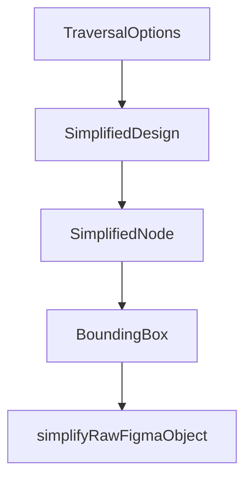

# Chapter 8: Production Security and Operations

Welcome to **Chapter 8: Production Security and Operations**. In this part of **Figma Context MCP Tutorial: Design-to-Code Workflows for Coding Agents**, you will build an intuitive mental model first, then move into concrete implementation details and practical production tradeoffs.


This chapter covers secure deployment and operational policies for Figma context pipelines.

## Security Checklist

- store Figma tokens in secret manager, not plain files
- scope token usage to required access only
- rotate credentials on schedule
- audit MCP requests and response metadata

## Operational Metrics

| Metric | Why It Matters |
|:-------|:---------------|
| design-to-code success rate | outcome quality |
| average retries per screen | prompt/context quality signal |
| mean implementation latency | productivity and cost |

## Summary

You now have the security and operations baseline for running Figma Context MCP in production teams.

## Depth Expansion Playbook

## Source Code Walkthrough

### `src/extractors/types.ts`

The `TraversalOptions` interface in [`src/extractors/types.ts`](https://github.com/GLips/Figma-Context-MCP/blob/HEAD/src/extractors/types.ts) handles a key part of this chapter's functionality:

```ts
}

export interface TraversalOptions {
  maxDepth?: number;
  nodeFilter?: (node: FigmaDocumentNode) => boolean;
  /**
   * Called after children are processed, allowing modification of the parent node
   * and control over which children to include in the output.
   *
   * @param node - Original Figma node
   * @param result - SimplifiedNode being built (can be mutated)
   * @param children - Processed children
   * @returns Children to include (return empty array to omit children)
   */
  afterChildren?: (
    node: FigmaDocumentNode,
    result: SimplifiedNode,
    children: SimplifiedNode[],
  ) => SimplifiedNode[];
}

/**
 * An extractor function that can modify a SimplifiedNode during traversal.
 *
 * @param node - The current Figma node being processed
 * @param result - SimplifiedNode object being built—this can be mutated inside the extractor
 * @param context - Traversal context including globalVars and parent info. This can also be mutated inside the extractor.
 */
export type ExtractorFn = (
  node: FigmaDocumentNode,
  result: SimplifiedNode,
  context: TraversalContext,
```

This interface is important because it defines how Figma Context MCP Tutorial: Design-to-Code Workflows for Coding Agents implements the patterns covered in this chapter.

### `src/extractors/types.ts`

The `SimplifiedDesign` interface in [`src/extractors/types.ts`](https://github.com/GLips/Figma-Context-MCP/blob/HEAD/src/extractors/types.ts) handles a key part of this chapter's functionality:

```ts
) => void;

export interface SimplifiedDesign {
  name: string;
  nodes: SimplifiedNode[];
  components: Record<string, SimplifiedComponentDefinition>;
  componentSets: Record<string, SimplifiedComponentSetDefinition>;
  globalVars: GlobalVars;
}

export interface SimplifiedNode {
  id: string;
  name: string;
  type: string; // e.g. FRAME, TEXT, INSTANCE, RECTANGLE, etc.
  // text
  text?: string;
  textStyle?: string;
  // appearance
  fills?: string;
  styles?: string;
  strokes?: string;
  // Non-stylable stroke properties are kept on the node when stroke uses a named color style
  strokeWeight?: string;
  strokeDashes?: number[];
  strokeWeights?: string;
  effects?: string;
  opacity?: number;
  borderRadius?: string;
  // layout & alignment
  layout?: string;
  // for rect-specific strokes, etc.
  componentId?: string;
```

This interface is important because it defines how Figma Context MCP Tutorial: Design-to-Code Workflows for Coding Agents implements the patterns covered in this chapter.

### `src/extractors/types.ts`

The `SimplifiedNode` interface in [`src/extractors/types.ts`](https://github.com/GLips/Figma-Context-MCP/blob/HEAD/src/extractors/types.ts) handles a key part of this chapter's functionality:

```ts
   *
   * @param node - Original Figma node
   * @param result - SimplifiedNode being built (can be mutated)
   * @param children - Processed children
   * @returns Children to include (return empty array to omit children)
   */
  afterChildren?: (
    node: FigmaDocumentNode,
    result: SimplifiedNode,
    children: SimplifiedNode[],
  ) => SimplifiedNode[];
}

/**
 * An extractor function that can modify a SimplifiedNode during traversal.
 *
 * @param node - The current Figma node being processed
 * @param result - SimplifiedNode object being built—this can be mutated inside the extractor
 * @param context - Traversal context including globalVars and parent info. This can also be mutated inside the extractor.
 */
export type ExtractorFn = (
  node: FigmaDocumentNode,
  result: SimplifiedNode,
  context: TraversalContext,
) => void;

export interface SimplifiedDesign {
  name: string;
  nodes: SimplifiedNode[];
  components: Record<string, SimplifiedComponentDefinition>;
  componentSets: Record<string, SimplifiedComponentSetDefinition>;
  globalVars: GlobalVars;
```

This interface is important because it defines how Figma Context MCP Tutorial: Design-to-Code Workflows for Coding Agents implements the patterns covered in this chapter.

### `src/extractors/types.ts`

The `BoundingBox` interface in [`src/extractors/types.ts`](https://github.com/GLips/Figma-Context-MCP/blob/HEAD/src/extractors/types.ts) handles a key part of this chapter's functionality:

```ts
}

export interface BoundingBox {
  x: number;
  y: number;
  width: number;
  height: number;
}

```

This interface is important because it defines how Figma Context MCP Tutorial: Design-to-Code Workflows for Coding Agents implements the patterns covered in this chapter.


## How These Components Connect


