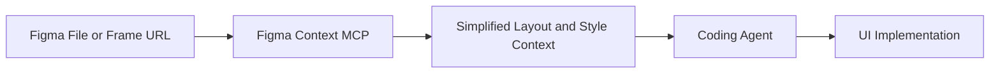

# Figma Context MCP Tutorial: Design-to-Code Workflows for Coding Agents

> Learn how to use `GLips/Figma-Context-MCP` (Framelink MCP for Figma) to give coding agents structured design context for higher-fidelity implementation.

## Why This Track Matters

Design-to-code quality often fails because coding agents receive screenshots instead of structured layout semantics. Figma Context MCP improves implementation accuracy by exposing simplified Figma metadata directly through MCP.

This track focuses on:

- robust MCP setup with Figma API tokens
- better prompt and frame-scoping strategies
- integration patterns for Cursor and MCP-capable clients
- governance and security for team-wide design-to-code pipelines

## Current Snapshot (auto-updated)

- repository: [`GLips/Figma-Context-MCP`](https://github.com/GLips/Figma-Context-MCP)
- stars: about **13.1k**
- latest release: [`v0.6.4`](https://github.com/GLips/Figma-Context-MCP/releases/tag/v0.6.4)
- development activity: active with recent updates
- project positioning: MCP bridge that simplifies Figma API output for coding agents

## Mental Model

## Chapter Guide

| Chapter | Key Question | Outcome |
|:--------|:-------------|:--------|
| [01 - Getting Started](01-getting-started.md) | How do I connect Figma Context MCP to my coding client? | Working MCP baseline |
| [02 - Architecture and Context Translation](02-architecture-and-context-translation.md) | How does raw Figma API data become model-usable context? | Better architecture understanding |
| [03 - Frame Targeting and Context Scope](03-frame-targeting-and-context-scope.md) | How do I request the right design slice for implementation? | Lower token waste and better fidelity |
| [04 - Prompt Patterns for One-Shot UI Implementation](04-prompt-patterns-for-one-shot-ui-implementation.md) | How do I prompt agents for accurate design translation? | Higher one-shot success rate |
| [05 - MCP Client Integrations](05-mcp-client-integrations.md) | How do Cursor and other clients consume this server? | Integration playbook |
| [06 - Performance and Token Optimization](06-performance-and-token-optimization.md) | How do I reduce noise and speed up generation? | Cost/latency improvements |
| [07 - Team Workflows and Design Governance](07-team-workflows-and-design-governance.md) | How do teams standardize design-to-code operations? | Repeatable team process |
| [08 - Production Security and Operations](08-production-security-and-operations.md) | How do I run this safely in production orgs? | Operational security baseline |

## What You Will Learn

- how to connect Figma design context to coding agents via MCP
- how to scope and prompt design requests for accurate implementation
- how to integrate design context into team development workflows
- how to secure and operate Figma context pipelines at scale

## Source References

- [Figma Context MCP Repository](https://github.com/GLips/Figma-Context-MCP)
- [Figma Context MCP Releases](https://github.com/GLips/Figma-Context-MCP/releases)
- [Framelink Quickstart](https://www.framelink.ai/docs/quickstart)
- [Model Context Protocol Intro](https://modelcontextprotocol.io/introduction)

## Related Tutorials

- [MCP Servers Tutorial](../mcp-servers-tutorial/)
- [Cline Tutorial](../cline-tutorial/)
- [Roo Code Tutorial](../roo-code-tutorial/)
- [OpenCode Tutorial](../opencode-tutorial/)

---

Start with [Chapter 1: Getting Started](01-getting-started.md).

## Navigation & Backlinks

- [Start Here: Chapter 1: Getting Started](01-getting-started.md)
- [Back to Main Catalog](../../README.md#-tutorial-catalog)
- [Browse A-Z Tutorial Directory](../../discoverability/tutorial-directory.md)
- [Search by Intent](../../discoverability/query-hub.md)
- [Explore Category Hubs](../../README.md#category-hubs)

## Full Chapter Map

1. [Chapter 1: Getting Started](01-getting-started.md)
2. [Chapter 2: Architecture and Context Translation](02-architecture-and-context-translation.md)
3. [Chapter 3: Frame Targeting and Context Scope](03-frame-targeting-and-context-scope.md)
4. [Chapter 4: Prompt Patterns for One-Shot UI Implementation](04-prompt-patterns-for-one-shot-ui-implementation.md)
5. [Chapter 5: MCP Client Integrations](05-mcp-client-integrations.md)
6. [Chapter 6: Performance and Token Optimization](06-performance-and-token-optimization.md)
7. [Chapter 7: Team Workflows and Design Governance](07-team-workflows-and-design-governance.md)
8. [Chapter 8: Production Security and Operations](08-production-security-and-operations.md)

*Generated by [AI Codebase Knowledge Builder](https://github.com/The-Pocket/Tutorial-Codebase-Knowledge)*
