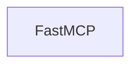

# Chapter 1: Getting Started and Core Setup

Welcome to **Chapter 1: Getting Started and Core Setup**. In this part of **Firecrawl MCP Server Tutorial: Web Scraping and Search Tools for MCP Clients**, you will build an intuitive mental model first, then move into concrete implementation details and practical production tradeoffs.


This chapter gets Firecrawl MCP running with minimum viable configuration.

## Learning Goals

- launch Firecrawl MCP with cloud credentials
- verify tool availability in your client
- capture initial connectivity checks

## Quick Start Command

```bash
env FIRECRAWL_API_KEY=fc-YOUR_API_KEY npx -y firecrawl-mcp
```

## First-Run Checklist

1. API key is valid
2. client connects to server process
3. at least one scrape/search call succeeds
4. logs show no repeated auth or rate-limit failures

## Source References

- [README Installation](https://github.com/firecrawl/firecrawl-mcp-server/blob/main/README.md)

## Summary

You now have a working Firecrawl MCP baseline.

Next: [Chapter 2: Architecture, Transports, and Versioning](02-architecture-transports-and-versioning.md)

## Depth Expansion Playbook

## Source Code Walkthrough

### `src/types/fastmcp.d.ts`

The `FastMCP` class in [`src/types/fastmcp.d.ts`](https://github.com/firecrawl/firecrawl-mcp-server/blob/HEAD/src/types/fastmcp.d.ts) handles a key part of this chapter's functionality:

```ts
  ) => unknown | Promise<unknown>;

  export class FastMCP<Session = unknown> {
    constructor(options: {
      name: string;
      version?: string;
      logger?: Logger;
      roots?: { enabled?: boolean };
      authenticate?: (
        request: { headers: IncomingHttpHeaders }
      ) => Promise<Session> | Session;
      health?: {
        enabled?: boolean;
        message?: string;
        path?: string;
        status?: number;
      };
    });

    addTool(tool: {
      name: string;
      description?: string;
      parameters?: unknown;
      execute: ToolExecute<Session>;
    }): void;

    start(args?: TransportArgs): Promise<void>;
  }
}


```

This class is important because it defines how Firecrawl MCP Server Tutorial: Web Scraping and Search Tools for MCP Clients implements the patterns covered in this chapter.


## How These Components Connect


