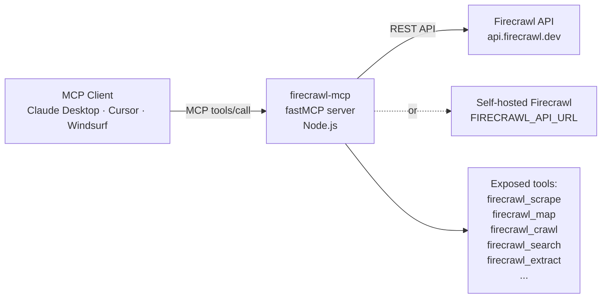
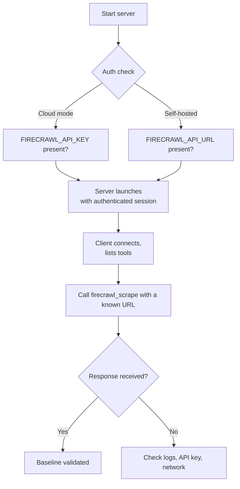

# Chapter 1: Getting Started and Core Setup

Firecrawl MCP Server (`firecrawl-mcp`) is a TypeScript MCP server that exposes the Firecrawl web-scraping API as MCP tools. This lets LLM-powered clients like Claude Desktop, Cursor, and Windsurf scrape URLs, search the web, crawl sites, and extract structured data — all through the standard MCP tool-call interface.

## Learning Goals

- Launch Firecrawl MCP with cloud credentials in under five minutes
- Understand the two deployment modes: stdio (local) and HTTP service (cloud)
- Verify tool availability in your MCP client
- Capture initial connectivity and authentication checks

## Architecture at a Glance



The server is built on top of the `firecrawl-fastmcp` library (a custom FastMCP variant), uses `zod` for tool input validation, and delegates all scraping to the `@mendable/firecrawl-js` SDK.

## Prerequisites

- Node.js 18 or higher
- A Firecrawl API key from [firecrawl.dev](https://firecrawl.dev) (or a self-hosted instance URL)
- `npx` available (bundled with Node.js)

## Quick Start (stdio mode)

```bash
# Cloud mode — pass API key via environment
FIRECRAWL_API_KEY=fc-your-api-key npx -y firecrawl-mcp
```

That single command downloads and runs the server. The server starts in stdio mode and waits for an MCP client to connect.

## Quick Start (Claude Desktop)

Add to `claude_desktop_config.json`:

```json
{
  "mcpServers": {
    "firecrawl": {
      "command": "npx",
      "args": ["-y", "firecrawl-mcp"],
      "env": {
        "FIRECRAWL_API_KEY": "fc-your-api-key"
      }
    }
  }
}
```

Restart Claude Desktop. The Firecrawl tools appear in the hammer icon menu.

## Self-Hosted Mode

If you run a private Firecrawl instance:

```json
{
  "mcpServers": {
    "firecrawl": {
      "command": "npx",
      "args": ["-y", "firecrawl-mcp"],
      "env": {
        "FIRECRAWL_API_URL": "http://localhost:3002"
      }
    }
  }
}
```

When `FIRECRAWL_API_URL` is set, `FIRECRAWL_API_KEY` becomes optional.

## First-Run Checklist



1. API key is valid and not expired
2. `npx` can reach the npm registry (or use `--prefer-offline` with local cache)
3. Client connects and lists at least 5 tools
4. A basic scrape call returns markdown content for a known URL
5. Logs show no repeated auth or rate-limit failures

## Key Dependencies

From `package.json`:

| Package | Role |
|:--------|:-----|
| `firecrawl-fastmcp` | FastMCP server framework providing MCP transport |
| `@mendable/firecrawl-js` | Official Firecrawl REST API client |
| `zod` | Runtime input validation for all tool parameters |
| `dotenv` | Optional `.env` file support for local development |

## Source Code Walkthrough

### `src/index.ts`

The `createClient` function in [`src/index.ts`](https://github.com/mendableai/firecrawl-mcp-server/blob/main/src/index.ts) shows how the MCP server connects to the Firecrawl API:

```ts
function createClient(apiKey?: string): FirecrawlApp {
  const config: any = {
    ...(process.env.FIRECRAWL_API_URL && {
      apiUrl: process.env.FIRECRAWL_API_URL,
    }),
  };

  // Only add apiKey if it's provided (required for cloud, optional for self-hosted)
  if (apiKey) {
    config.apiKey = apiKey;
  }

  return new FirecrawlApp(config);
}
```

This function is important because it implements the two-mode setup covered in this chapter: cloud mode uses `FIRECRAWL_API_KEY`, while self-hosted mode uses `FIRECRAWL_API_URL` — making the API key optional when a custom endpoint is configured.

## Summary

Firecrawl MCP runs as a Node.js process that bridges MCP tool calls to the Firecrawl REST API. The quickest path to a working setup is `FIRECRAWL_API_KEY=fc-... npx -y firecrawl-mcp` for stdio testing, or the Claude Desktop config block for integrated usage. Self-hosted deployments use `FIRECRAWL_API_URL` instead of the API key.

Next: [Chapter 2: Architecture, Transports, and Versioning](02-architecture-transports-and-versioning.md)
