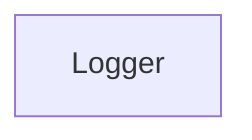

# Chapter 2: Architecture, Transports, and Versioning

Welcome to **Chapter 2: Architecture, Transports, and Versioning**. In this part of **Firecrawl MCP Server Tutorial: Web Scraping and Search Tools for MCP Clients**, you will build an intuitive mental model first, then move into concrete implementation details and practical production tradeoffs.


Firecrawl MCP supports local transports and cloud-mode versioned endpoints, with V2 as the default modern path.

## Learning Goals

- understand transport mode implications
- map V1 vs V2 endpoint differences
- avoid migration mistakes in existing integrations

## Endpoint Model Highlights

| Mode | Notes |
|:-----|:------|
| local stdio/streamable | V2 behavior by default |
| cloud service mode | versioned V1 and V2 endpoint paths |

## Versioning Guidance

- V1 endpoints remain for backward compatibility.
- V2 is the current path for modern tool behavior and API support.
- migration requires endpoint and tool-surface awareness.

## Source References

- [Versioning Guide](https://github.com/firecrawl/firecrawl-mcp-server/blob/main/VERSIONING.md)
- [README Transport Setup](https://github.com/firecrawl/firecrawl-mcp-server/blob/main/README.md)

## Summary

You now understand the transport and version boundaries that shape deployment architecture.

Next: [Chapter 3: Tool Selection: Scrape, Map, Crawl, Search, Extract](03-tool-selection-scrape-map-crawl-search-extract.md)

## Depth Expansion Playbook

## Source Code Walkthrough

### `src/types/fastmcp.d.ts`

The `Logger` interface in [`src/types/fastmcp.d.ts`](https://github.com/firecrawl/firecrawl-mcp-server/blob/HEAD/src/types/fastmcp.d.ts) handles a key part of this chapter's functionality:

```ts
  import type { IncomingHttpHeaders } from 'http';

  export interface Logger {
    debug(...args: unknown[]): void;
    error(...args: unknown[]): void;
    info(...args: unknown[]): void;
    log(...args: unknown[]): void;
    warn(...args: unknown[]): void;
  }

  export type TransportArgs =
    | { transportType: 'stdio' }
    | {
        transportType: 'httpStream';
        httpStream: { port: number; host?: string; stateless?: boolean };
      };

  export interface ToolContext<Session = unknown> {
    session?: Session;
    log: Logger;
  }

  export type ToolExecute<Session = unknown> = (
    args: unknown,
    context: ToolContext<Session>
  ) => unknown | Promise<unknown>;

  export class FastMCP<Session = unknown> {
    constructor(options: {
      name: string;
      version?: string;
      logger?: Logger;
```

This interface is important because it defines how Firecrawl MCP Server Tutorial: Web Scraping and Search Tools for MCP Clients implements the patterns covered in this chapter.


## How These Components Connect


