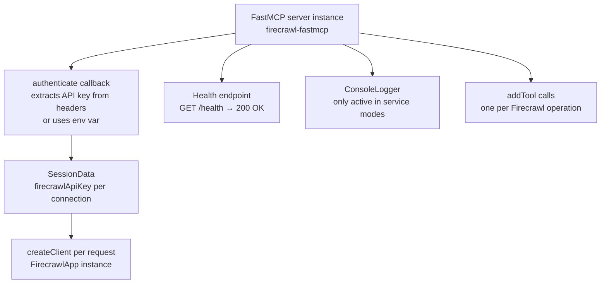
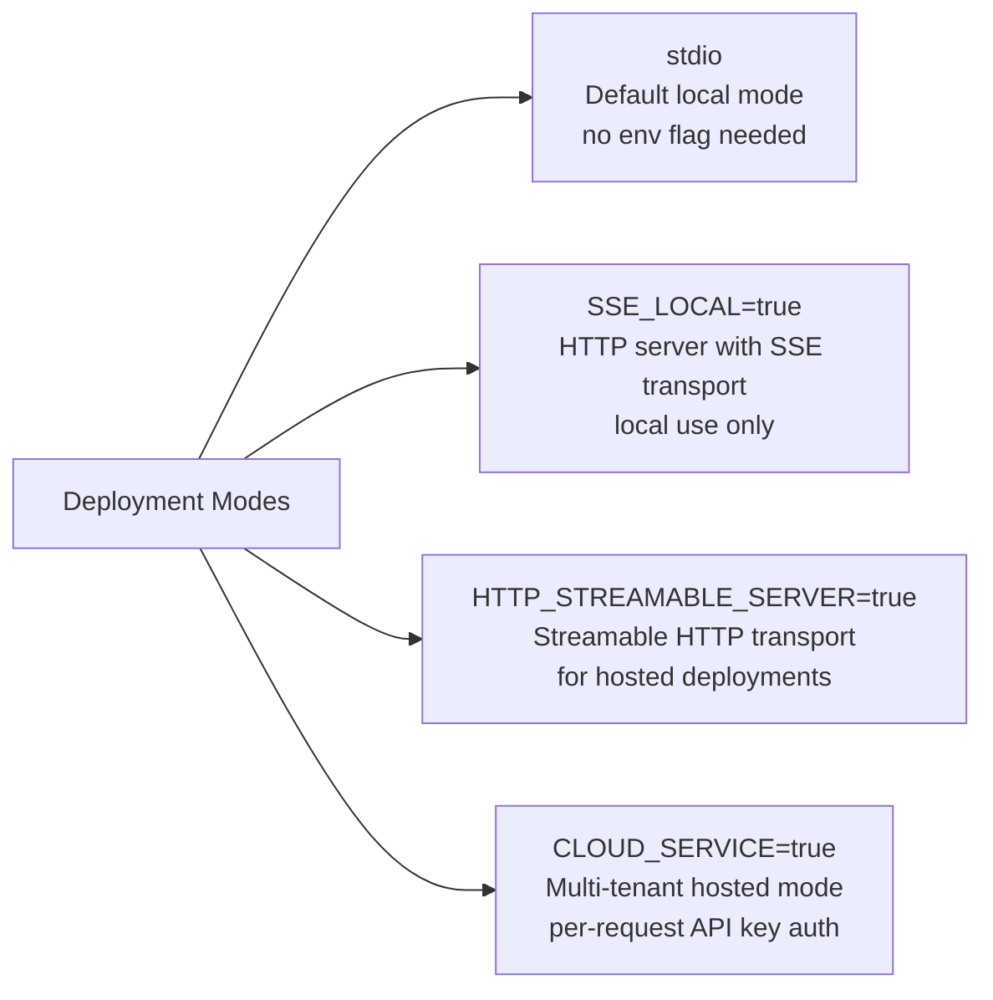
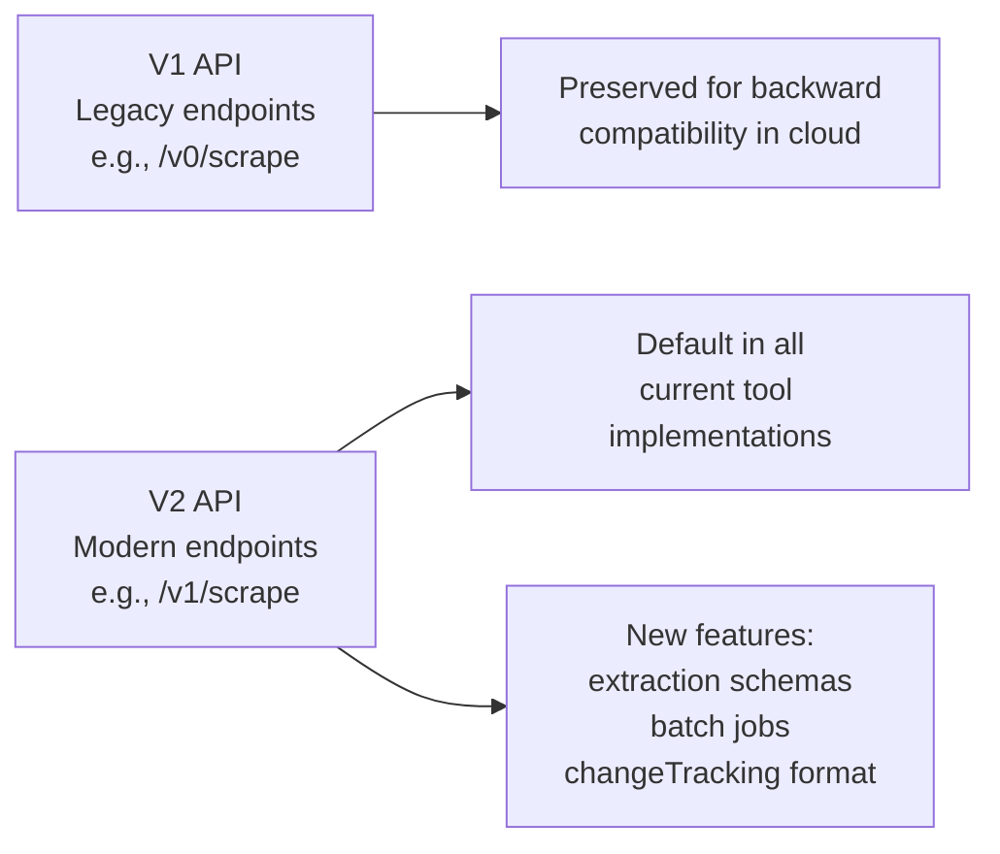

# Chapter 2: Architecture, Transports, and Versioning

This chapter explains the internal architecture of the `firecrawl-mcp` server — how it uses `firecrawl-fastmcp` to manage sessions and transports, the three deployment modes (stdio, SSE local, HTTP streamable), and the V1-to-V2 API versioning model.

## Learning Goals

- Understand the server's deployment transport options and their tradeoffs
- Map how cloud mode and local mode differ in authentication and session handling
- Understand V1 vs V2 Firecrawl API endpoint differences
- Avoid migration mistakes in existing client integrations

## Server Initialization Architecture



The server is built using `new FastMCP<SessionData>(options)` from `firecrawl-fastmcp`. Key initialization choices:

```typescript
const server = new FastMCP<SessionData>({
  name: 'firecrawl-fastmcp',
  version: '3.0.0',
  logger: new ConsoleLogger(),
  roots: { enabled: false },  // no roots support
  authenticate: async (request) => {
    if (process.env.CLOUD_SERVICE === 'true') {
      // Per-request API key from headers
      const apiKey = extractApiKey(request.headers);
      if (!apiKey) throw new Error('Firecrawl API key is required');
      return { firecrawlApiKey: apiKey };
    } else {
      // Shared API key from environment
      return { firecrawlApiKey: process.env.FIRECRAWL_API_KEY };
    }
  },
  health: { enabled: true, message: 'ok', path: '/health', status: 200 },
});
```

## Transport Modes



### Stdio Mode (Default)

The standard local mode used by Claude Desktop, Cursor, and other desktop clients. The `npx -y firecrawl-mcp` command defaults to stdio. No HTTP server is started; the MCP protocol flows through stdin/stdout.

```bash
# stdio mode — Claude Desktop spawns this as a subprocess
FIRECRAWL_API_KEY=fc-... npx -y firecrawl-mcp
```

### SSE Local Mode

Starts an HTTP server with SSE transport for local testing. Useful when connecting multiple clients to the same server instance:

```bash
SSE_LOCAL=true FIRECRAWL_API_KEY=fc-... node dist/index.js
```

### HTTP Streamable Mode

Starts a server using the modern StreamableHTTP transport for hosted deployments:

```bash
HTTP_STREAMABLE_SERVER=true FIRECRAWL_API_KEY=fc-... node dist/index.js
```

### Cloud Service Mode

Multi-tenant mode for hosted Firecrawl MCP deployments. Each request must include an API key in the request headers:

```bash
CLOUD_SERVICE=true node dist/index.js
```

Accepted headers for API key in cloud mode:
- `x-firecrawl-api-key: fc-...`
- `x-api-key: fc-...`
- `Authorization: Bearer fc-...`

```typescript
function extractApiKey(headers: IncomingHttpHeaders): string | undefined {
  const headerApiKey = headers['x-firecrawl-api-key'] || headers['x-api-key'];
  if (headerApiKey) return Array.isArray(headerApiKey) ? headerApiKey[0] : headerApiKey;
  const headerAuth = headers['authorization'];
  if (typeof headerAuth === 'string' && headerAuth.toLowerCase().startsWith('bearer ')) {
    return headerAuth.slice(7).trim();
  }
  return undefined;
}
```

## Safe Mode

When `CLOUD_SERVICE=true`, the server automatically enables **safe mode**, which restricts the browser action types available in `firecrawl_scrape` to a safe subset:

```typescript
const SAFE_MODE = process.env.CLOUD_SERVICE === 'true';

// Safe mode: only wait, screenshot, scroll, scrape
// Full mode: also click, write, press, executeJavascript, generatePDF
const allowedActionTypes = SAFE_MODE ? safeActionTypes : allActionTypes;
```

This is designed to comply with ChatGPT plugin safety requirements for hosted deployments.

## Firecrawl API Versioning (V1 vs V2)

The server's `VERSIONING.md` documents the transition from V1 to V2 Firecrawl API endpoints.



The MCP server itself always calls V2 endpoints through the `@mendable/firecrawl-js` SDK (v4.x). V1 compatibility is handled at the Firecrawl API service level, not in the MCP server code.

**Practical impact**: If you pin the `firecrawl-mcp` version, you get consistent API behavior. Upgrading the MCP server version may change the available tool parameters as new V2 features are exposed.

## Transport Mode Environment Variables Summary

| Environment Variable | Effect |
|:---------------------|:-------|
| (none) | stdio mode — default for desktop clients |
| `SSE_LOCAL=true` | HTTP + SSE transport on a local port |
| `HTTP_STREAMABLE_SERVER=true` | StreamableHTTP transport |
| `CLOUD_SERVICE=true` | Multi-tenant hosted mode, enables per-request API key auth and safe mode |
| `FIRECRAWL_API_KEY` | API key for cloud usage |
| `FIRECRAWL_API_URL` | Base URL for self-hosted instance |

## Source Code Walkthrough

### `src/index.ts`

The transport selection block at the bottom of [`src/index.ts`](https://github.com/mendableai/firecrawl-mcp-server/blob/main/src/index.ts) shows how the four deployment modes are wired:

```ts
const PORT = Number(process.env.PORT || 3000);
const HOST =
  process.env.CLOUD_SERVICE === 'true'
    ? '0.0.0.0'
    : process.env.HOST || 'localhost';

if (
  process.env.CLOUD_SERVICE === 'true' ||
  process.env.SSE_LOCAL === 'true' ||
  process.env.HTTP_STREAMABLE_SERVER === 'true'
) {
  args = {
    transportType: 'httpStream',
    httpStream: {
      port: PORT,
      host: HOST,
      stateless: true,
    },
  };
} else {
  // default: stdio
  args = {
    transportType: 'stdio',
  };
}

await server.start(args);
```

This block is important because it implements the transport architecture covered in this chapter: a single codebase serves stdio (local MCP clients), SSE/StreamableHTTP (local HTTP), and cloud multi-tenant mode — selected entirely via environment variables.

## Summary

The server supports four deployment modes (stdio, SSE local, StreamableHTTP, and cloud multi-tenant) controlled by environment variables. Cloud mode adds per-request API key extraction from HTTP headers and enables safe mode to restrict browser action types. The underlying Firecrawl API runs V2 endpoints by default via the `@mendable/firecrawl-js` SDK; V1 is a legacy cloud-side concern, not an MCP-layer concern.

Next: [Chapter 3: Tool Selection: Scrape, Map, Crawl, Search, Extract](03-tool-selection-scrape-map-crawl-search-extract.md)
