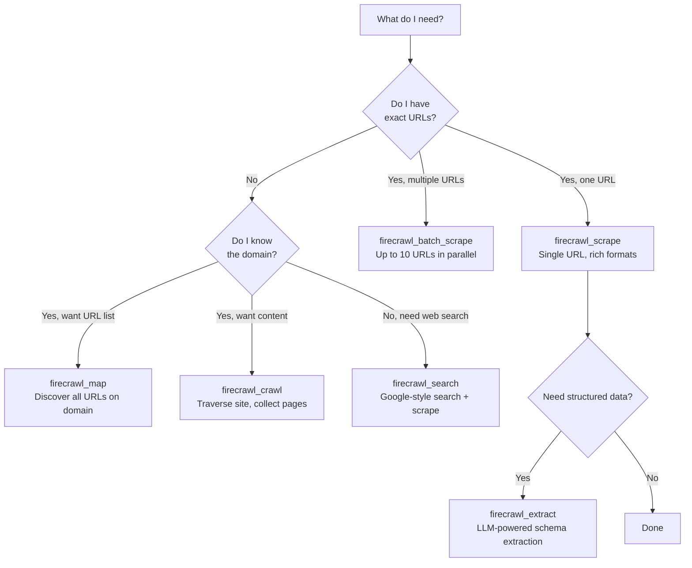
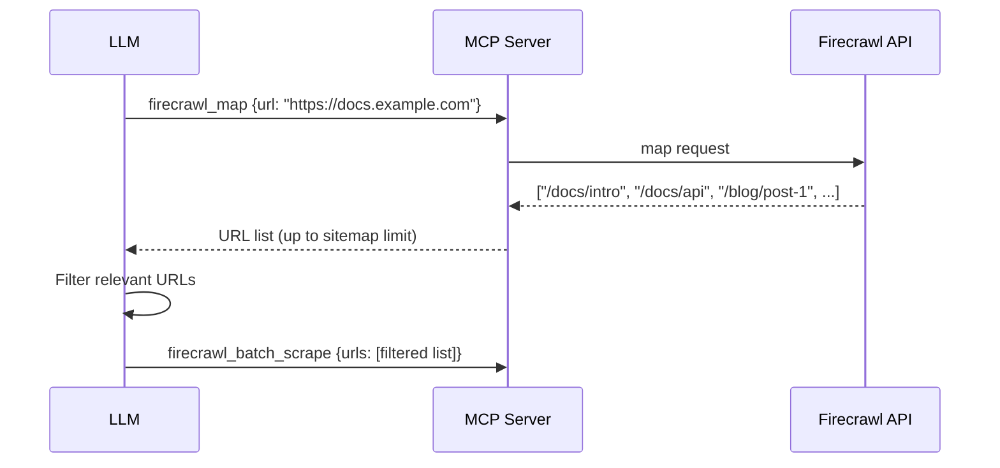
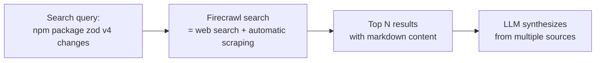

# Chapter 3: Tool Selection: Scrape, Map, Crawl, Search, Extract

Firecrawl MCP exposes distinct tools for each information-retrieval pattern. Choosing the right tool avoids unnecessary API credits and reduces latency. This chapter maps each tool to its use case, explains key parameters, and provides the decision logic for complex research tasks.

## Learning Goals

- Choose tools based on known vs. unknown URL scope
- Combine tools for multi-step research pipelines
- Understand format options and extraction schemas
- Avoid over-crawling when simpler methods suffice

## Tool Decision Framework



## `firecrawl_scrape` — Single URL Content Extraction

The primary workhorse. Fetches and converts a single URL to the requested output formats. The description in source code: *"The most powerful, fastest and most reliable scraper tool."*

```typescript
// From src/index.ts — scrapeParamsSchema (key parameters)
const scrapeParamsSchema = z.object({
  url: z.string().url(),
  formats: z.array(z.enum([
    'markdown', 'html', 'rawHtml', 'screenshot',
    'links', 'summary', 'changeTracking', 'branding',
    'json', 'query'
  ])).optional(),
  onlyMainContent: z.boolean().optional(),  // strip nav/footer
  waitFor: z.number().optional(),           // ms to wait for JS rendering
  mobile: z.boolean().optional(),           // use mobile viewport
  proxy: z.enum(['basic', 'stealth', 'enhanced', 'auto']).optional(),
  location: z.object({ country: z.string().optional() }).optional(),
  storeInCache: z.boolean().optional(),     // cache result
  zeroDataRetention: z.boolean().optional(),// delete after return
});
```

Key `formats` options:

| Format | Output |
|:-------|:-------|
| `markdown` | Clean markdown (default, best for LLMs) |
| `html` | Processed HTML |
| `rawHtml` | Raw HTML before processing |
| `screenshot` | Base64-encoded PNG screenshot |
| `links` | Array of all links on the page |
| `summary` | LLM-generated page summary |
| `json` | Structured extraction (requires `jsonOptions.prompt` or `.schema`) |
| `query` | Answer a specific question about the page content |

## `firecrawl_map` — URL Discovery

Returns a list of all URLs on a domain without fetching content. Use this when you need to discover what pages exist before deciding what to scrape.



Parameters: `url`, `limit` (max URLs to return), `search` (filter by keyword), `ignoreSitemap`, `includeSubdomains`.

## `firecrawl_crawl` — Recursive Site Traversal

Crawls a site by following internal links, collecting content from each page. Returns a job ID; content is returned asynchronously or polled via `firecrawl_check_crawl_status`.

**Use carefully**: Crawls can consume significant API credits. Always set `maxDepth` and `limit`:

```json
{
  "url": "https://docs.example.com",
  "maxDepth": 2,
  "limit": 50,
  "scrapeOptions": {
    "formats": ["markdown"],
    "onlyMainContent": true
  }
}
```

## `firecrawl_search` — Web Search + Scrape

Performs a web search and returns scraped content for the top results in a single call. Useful when you don't know which domain contains the information you need.



Parameters: `query`, `limit` (number of results), `lang`, `country`, `scrapeOptions` (format control for each result).

## `firecrawl_extract` — LLM-Powered Structured Extraction

Extracts structured data from one or more URLs using a schema or natural language prompt. Returns a JSON object rather than raw content.

```json
{
  "urls": ["https://example.com/product"],
  "prompt": "Extract product name, price, and availability",
  "schema": {
    "type": "object",
    "properties": {
      "name": { "type": "string" },
      "price": { "type": "number" },
      "available": { "type": "boolean" }
    }
  }
}
```

Best for: pricing data, contact information, structured product catalogs, repeated page patterns.

## `firecrawl_batch_scrape` — Parallel Multi-URL Scraping

Submits up to 10 URLs for parallel scraping. Returns a job ID. Poll with `firecrawl_check_batch_scrape_status` to get results.

## Tool Selection Summary

| Tool | Best For | Credit Cost | Response Mode |
|:-----|:---------|:------------|:--------------|
| `firecrawl_scrape` | Single known URL | Low (1 credit) | Synchronous |
| `firecrawl_batch_scrape` | 2–10 known URLs | Medium | Async (poll) |
| `firecrawl_map` | Discover URLs on domain | Low | Synchronous |
| `firecrawl_crawl` | Full site content harvest | High | Async (poll) |
| `firecrawl_search` | Unknown source, topic-first | Medium | Synchronous |
| `firecrawl_extract` | Structured data extraction | Medium | Sync or Async |

## Source Code Walkthrough

### `src/index.ts`

The `firecrawl_map` tool definition in [`src/index.ts`](https://github.com/mendableai/firecrawl-mcp-server/blob/main/src/index.ts) illustrates the tool registration pattern used by all tools in this chapter:

```ts
server.addTool({
  name: 'firecrawl_map',
  description: `Map a website to discover all indexed URLs on the site.

**Best for:** Discovering URLs on a website before deciding what to scrape...
**Not recommended for:** When you already know which specific URL you need (use scrape)...`,
  parameters: z.object({
    url: z.string().url(),
    search: z.string().optional(),
    sitemap: z.enum(['include', 'skip', 'only']).optional(),
    includeSubdomains: z.boolean().optional(),
    limit: z.number().optional(),
    ignoreQueryParameters: z.boolean().optional(),
  }),
  execute: async (
    args: unknown,
    { session, log }: { session?: SessionData; log: Logger }
  ): Promise<string> => {
    const { url, ...options } = args as { url: string } & Record<string, unknown>;
    const client = getClient(session);
    const cleaned = removeEmptyTopLevel(options as Record<string, unknown>);
    log.info('Mapping URL', { url: String(url) });
    const res = await client.map(String(url), { ...cleaned, origin: ORIGIN } as any);
    return asText(res);
  },
});
```

This registration pattern is important because it defines how each tool in this chapter connects Zod-validated inputs to the `@mendable/firecrawl-js` SDK client — with `removeEmptyTopLevel` stripping null/empty fields before the API call.

## Summary

`firecrawl_scrape` is the default choice for any known URL. Use `firecrawl_map` to discover URLs before batch-scraping. Use `firecrawl_search` when you don't know the source. Use `firecrawl_crawl` only with explicit depth and limit constraints. Use `firecrawl_extract` when you need structured JSON instead of prose content.

Next: [Chapter 4: Client Integrations: Cursor, Claude, Windsurf, VS Code](04-client-integrations-cursor-claude-windsurf-vscode.md)
