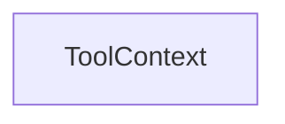

# Chapter 3: Tool Selection: Scrape, Map, Crawl, Search, Extract

Welcome to **Chapter 3: Tool Selection: Scrape, Map, Crawl, Search, Extract**. In this part of **Firecrawl MCP Server Tutorial: Web Scraping and Search Tools for MCP Clients**, you will build an intuitive mental model first, then move into concrete implementation details and practical production tradeoffs.


Effective Firecrawl usage depends on selecting the right tool for each information-retrieval task.

## Learning Goals

- choose tools based on known vs unknown URL scope
- combine tools for multi-step research tasks
- avoid over-crawling when simpler methods suffice

## Tool Selection Matrix

| Task Type | Preferred Tool |
|:----------|:---------------|
| single known URL | `scrape` |
| many known URLs | batch scrape variants |
| discover URLs on a domain | `map` |
| broad web discovery | `search` |
| large site traversal | `crawl` with strict limits |
| structured extraction | `extract` with schema guidance |

## Source References

- [README Tool Guide](https://github.com/firecrawl/firecrawl-mcp-server/blob/main/README.md)

## Summary

You now have a decision framework for tool selection that balances depth, cost, and speed.

Next: [Chapter 4: Client Integrations: Cursor, Claude, Windsurf, VS Code](04-client-integrations-cursor-claude-windsurf-vscode.md)

## Depth Expansion Playbook

## Source Code Walkthrough

### `src/types/fastmcp.d.ts`

The `ToolContext` interface in [`src/types/fastmcp.d.ts`](https://github.com/firecrawl/firecrawl-mcp-server/blob/HEAD/src/types/fastmcp.d.ts) handles a key part of this chapter's functionality:

```ts
      };

  export interface ToolContext<Session = unknown> {
    session?: Session;
    log: Logger;
  }

  export type ToolExecute<Session = unknown> = (
    args: unknown,
    context: ToolContext<Session>
  ) => unknown | Promise<unknown>;

  export class FastMCP<Session = unknown> {
    constructor(options: {
      name: string;
      version?: string;
      logger?: Logger;
      roots?: { enabled?: boolean };
      authenticate?: (
        request: { headers: IncomingHttpHeaders }
      ) => Promise<Session> | Session;
      health?: {
        enabled?: boolean;
        message?: string;
        path?: string;
        status?: number;
      };
    });

    addTool(tool: {
      name: string;
      description?: string;
```

This interface is important because it defines how Firecrawl MCP Server Tutorial: Web Scraping and Search Tools for MCP Clients implements the patterns covered in this chapter.


## How These Components Connect


