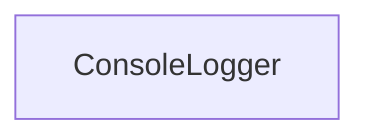

# Chapter 4: Client Integrations: Cursor, Claude, Windsurf, VS Code

Welcome to **Chapter 4: Client Integrations: Cursor, Claude, Windsurf, VS Code**. In this part of **Firecrawl MCP Server Tutorial: Web Scraping and Search Tools for MCP Clients**, you will build an intuitive mental model first, then move into concrete implementation details and practical production tradeoffs.


Firecrawl MCP is widely used because it can be configured across major coding-agent clients.

## Learning Goals

- configure Firecrawl MCP for major client ecosystems
- standardize environment key handling across clients
- reduce configuration drift between local and team setups

## Integration Patterns

| Client | Integration Style |
|:-------|:------------------|
| Cursor | MCP server JSON in settings |
| Claude Desktop | `claude_desktop_config.json` command block |
| Windsurf | model config MCP section |
| VS Code | `mcp.servers` or workspace `mcp.json` |

## Source References

- [README Client Config Sections](https://github.com/firecrawl/firecrawl-mcp-server/blob/main/README.md)

## Summary

You now have a cross-client setup model for consistent Firecrawl MCP usage.

Next: [Chapter 5: Configuration, Retries, and Credit Monitoring](05-configuration-retries-and-credit-monitoring.md)

## Source Code Walkthrough

### `src/index.ts`

The `ConsoleLogger` class in [`src/index.ts`](https://github.com/firecrawl/firecrawl-mcp-server/blob/HEAD/src/index.ts) handles a key part of this chapter's functionality:

```ts
}

class ConsoleLogger implements Logger {
  private shouldLog =
    process.env.CLOUD_SERVICE === 'true' ||
    process.env.SSE_LOCAL === 'true' ||
    process.env.HTTP_STREAMABLE_SERVER === 'true';

  debug(...args: unknown[]): void {
    if (this.shouldLog) {
      console.debug('[DEBUG]', new Date().toISOString(), ...args);
    }
  }
  error(...args: unknown[]): void {
    if (this.shouldLog) {
      console.error('[ERROR]', new Date().toISOString(), ...args);
    }
  }
  info(...args: unknown[]): void {
    if (this.shouldLog) {
      console.log('[INFO]', new Date().toISOString(), ...args);
    }
  }
  log(...args: unknown[]): void {
    if (this.shouldLog) {
      console.log('[LOG]', new Date().toISOString(), ...args);
    }
  }
  warn(...args: unknown[]): void {
    if (this.shouldLog) {
      console.warn('[WARN]', new Date().toISOString(), ...args);
    }
```

This class is important because it defines how Firecrawl MCP Server Tutorial: Web Scraping and Search Tools for MCP Clients implements the patterns covered in this chapter.


## How These Components Connect


