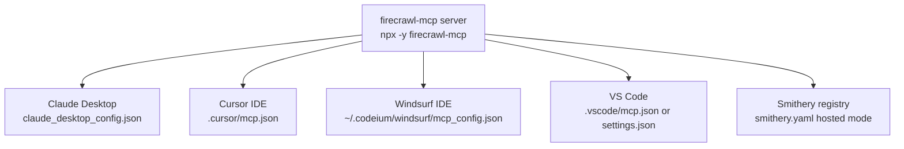
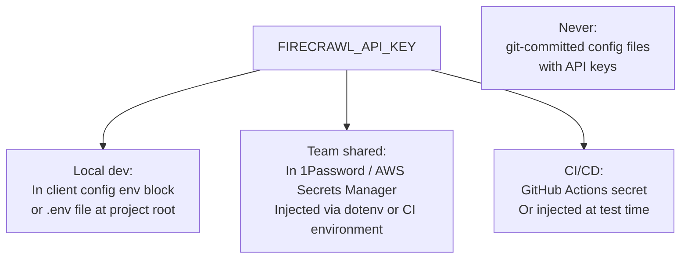

# Chapter 4: Client Integrations: Cursor, Claude, Windsurf, VS Code

Firecrawl MCP is used across multiple MCP host clients. This chapter gives precise configuration blocks for each major integration, explains environment variable handling differences between clients, and covers team standardization practices.

## Learning Goals

- Configure Firecrawl MCP for each major client ecosystem with accurate config blocks
- Standardize API key handling across clients and environments
- Reduce configuration drift between local and team setups
- Know where each client stores and reads its MCP configuration

## Integration Overview



## Claude Desktop

Config file: `~/Library/Application Support/Claude/claude_desktop_config.json` (macOS) or `%APPDATA%\Claude\claude_desktop_config.json` (Windows)

```json
{
  "mcpServers": {
    "firecrawl": {
      "command": "npx",
      "args": ["-y", "firecrawl-mcp"],
      "env": {
        "FIRECRAWL_API_KEY": "fc-your-api-key"
      }
    }
  }
}
```

For self-hosted Firecrawl:
```json
{
  "mcpServers": {
    "firecrawl-local": {
      "command": "npx",
      "args": ["-y", "firecrawl-mcp"],
      "env": {
        "FIRECRAWL_API_URL": "http://localhost:3002"
      }
    }
  }
}
```

## Cursor

Config file: `~/.cursor/mcp.json` (global) or `.cursor/mcp.json` in the project root (workspace-scoped)

```json
{
  "mcpServers": {
    "firecrawl": {
      "command": "npx",
      "args": ["-y", "firecrawl-mcp"],
      "env": {
        "FIRECRAWL_API_KEY": "fc-your-api-key"
      }
    }
  }
}
```

Cursor supports both global and project-level MCP configs. The project-level config takes precedence. This is useful for teams that need different API keys per project.

## Windsurf

Config file: `~/.codeium/windsurf/mcp_config.json`

```json
{
  "mcpServers": {
    "firecrawl": {
      "command": "npx",
      "args": ["-y", "firecrawl-mcp"],
      "env": {
        "FIRECRAWL_API_KEY": "fc-your-api-key"
      }
    }
  }
}
```

## VS Code (with MCP-capable extensions)

Config in `.vscode/mcp.json` (workspace) or user settings:

```json
{
  "servers": {
    "firecrawl": {
      "type": "stdio",
      "command": "npx",
      "args": ["-y", "firecrawl-mcp"],
      "env": {
        "FIRECRAWL_API_KEY": "fc-your-api-key"
      }
    }
  }
}
```

## Docker-Based Config

For teams that prefer a containerized server (from `Dockerfile` in the repo):

```json
{
  "mcpServers": {
    "firecrawl": {
      "command": "docker",
      "args": [
        "run", "--rm", "-i",
        "-e", "FIRECRAWL_API_KEY=fc-your-api-key",
        "firecrawl-mcp:latest"
      ]
    }
  }
}
```

Build the image first:
```bash
docker build -t firecrawl-mcp:latest .
```

## Smithery Registry (Hosted Mode)

Firecrawl MCP is listed on [Smithery](https://smithery.ai) as `io.github.firecrawl/firecrawl-mcp-server` (matching the `mcpName` in `package.json`). Smithery-managed hosts can connect directly without running a local process.

## API Key Management Across Environments



**Best practice**: Never put real API keys in config files committed to source control. Use:
- Cursor/Windsurf/Claude Desktop: local config files outside the project directory (already excluded from git by default since they live in `~/.config` or `~/Library/...`)
- VS Code workspace configs: add `.vscode/mcp.json` to `.gitignore` if it contains credentials, or reference environment variables via `${env:FIRECRAWL_API_KEY}` syntax if supported by your extension

## Cross-Client Validation

After setting up any client:

```
1. Open a conversation or coding session in the client
2. Ask: "List all available MCP tools"
   → Should include firecrawl_scrape, firecrawl_search, etc.
3. Ask: "Scrape https://example.com and give me the main content as markdown"
   → Should return clean markdown content
4. Ask: "Search the web for 'MCP TypeScript SDK v2 changes'"
   → Should return search results with scraped content
```

## Source Code Walkthrough

### `smithery.yaml`

The [`smithery.yaml`](https://github.com/mendableai/firecrawl-mcp-server/blob/main/smithery.yaml) config file defines the canonical client integration pattern used by Smithery and serves as the reference spec for all client configs in this chapter:

```yaml
startCommand:
  type: stdio
  configSchema:
    type: object
    required:
      - fireCrawlApiKey
    properties:
      fireCrawlApiKey:
        type: string
        description: Your Firecrawl API key. Required for cloud API usage.
      fireCrawlApiUrl:
        type: string
        description:
          Custom API endpoint for self-hosted instances. If provided, API key
          becomes optional.
  commandFunction:
    |-
    (config) => ({ command: 'node', args: ['dist/index.js'], env: {
      FIRECRAWL_API_KEY: config.fireCrawlApiKey,
      FIRECRAWL_API_URL: config.fireCrawlApiUrl || ''
    } })
```

This file is important because it defines the canonical config interface: `FIRECRAWL_API_KEY` is required for cloud use, and `FIRECRAWL_API_URL` makes the key optional for self-hosted deployments — the same contract mirrored in every client config (Cursor, Claude Desktop, Windsurf, VS Code) covered in this chapter.

## Summary

All major MCP-capable clients use the same config pattern: `command: npx, args: [-y, firecrawl-mcp], env: {FIRECRAWL_API_KEY: ...}`. The only variation is the config file location. Avoid committing API keys — use environment injection or local-only config files. Docker provides a reproducible alternative to `npx` for teams that need version-pinned deployments.

Next: [Chapter 5: Configuration, Retries, and Credit Monitoring](05-configuration-retries-and-credit-monitoring.md)
