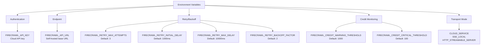
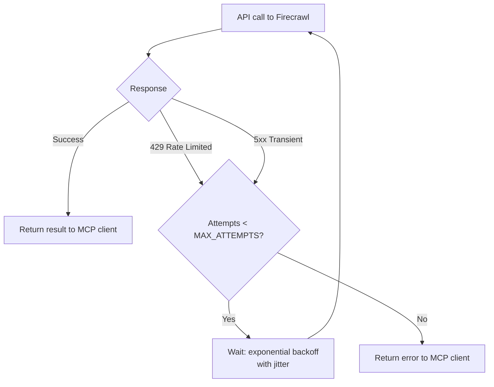
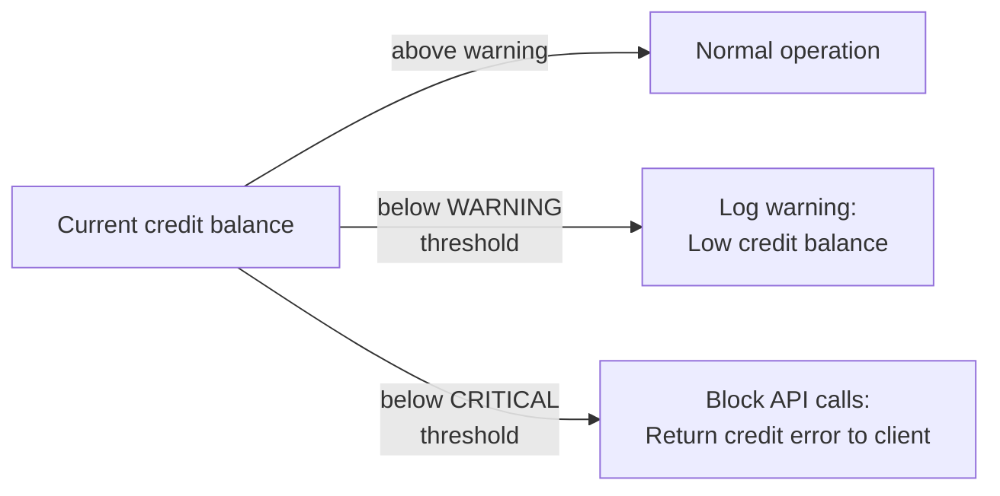

# Chapter 5: Configuration, Retries, and Credit Monitoring

Production reliability of Firecrawl MCP depends on correct retry behavior, credit threshold awareness, and proper endpoint configuration. This chapter covers all environment variables that affect runtime behavior and how to tune them for your workload.

## Learning Goals

- Configure retry behavior for rate-limited and transient failure environments
- Tune credit warning and critical thresholds to prevent service interruptions
- Support cloud and self-hosted API endpoints cleanly
- Understand how the logger activates and what it captures

## Full Environment Variable Reference



## Retry Configuration

The server implements exponential backoff with jitter for all Firecrawl API calls. Configure with:

| Variable | Default | Description |
|:---------|:--------|:------------|
| `FIRECRAWL_RETRY_MAX_ATTEMPTS` | `3` | Maximum retry attempts per call |
| `FIRECRAWL_RETRY_INITIAL_DELAY` | `1000` | Initial delay in milliseconds |
| `FIRECRAWL_RETRY_MAX_DELAY` | `10000` | Maximum delay cap in milliseconds |
| `FIRECRAWL_RETRY_BACKOFF_FACTOR` | `2` | Exponential backoff multiplier |

### Backoff Calculation

With defaults, the retry delays work as:
- Attempt 1 fail → wait ~1000ms (+ jitter)
- Attempt 2 fail → wait ~2000ms (+ jitter)
- Attempt 3 fail → return error to client

```
delay = min(INITIAL_DELAY * BACKOFF_FACTOR^(attempt-1), MAX_DELAY) + jitter
```



### Tuning for Your Workload

For batch research workloads (many calls in sequence):
```bash
FIRECRAWL_RETRY_MAX_ATTEMPTS=5
FIRECRAWL_RETRY_INITIAL_DELAY=2000
FIRECRAWL_RETRY_MAX_DELAY=30000
FIRECRAWL_RETRY_BACKOFF_FACTOR=2
```

For interactive use (user waiting for response):
```bash
FIRECRAWL_RETRY_MAX_ATTEMPTS=2
FIRECRAWL_RETRY_INITIAL_DELAY=500
FIRECRAWL_RETRY_MAX_DELAY=3000
```

## Credit Monitoring

Firecrawl cloud accounts have an API credit balance. The server watches credit usage and can warn or fail gracefully before credits are exhausted.

| Variable | Default | Effect |
|:---------|:--------|:-------|
| `FIRECRAWL_CREDIT_WARNING_THRESHOLD` | `1000` | Log a warning when credits fall below this level |
| `FIRECRAWL_CREDIT_CRITICAL_THRESHOLD` | `100` | Return an error instead of calling API when below this level |

### Credit Thresholds in Practice



Set thresholds based on your usage patterns:
- **High-volume batch jobs**: Raise `FIRECRAWL_CREDIT_WARNING_THRESHOLD` to 5000 to get earlier notice
- **Shared team account**: Set `FIRECRAWL_CREDIT_CRITICAL_THRESHOLD` to 500 to leave a buffer for other users
- **Individual developer**: Lower thresholds are fine

## Self-Hosted Configuration

For a self-hosted Firecrawl instance:

```bash
FIRECRAWL_API_URL=http://localhost:3002
# No FIRECRAWL_API_KEY needed when API_URL is set
```

The `createClient` function in `src/index.ts` handles this:
```typescript
function createClient(apiKey?: string): FirecrawlApp {
  const config: any = {
    ...(process.env.FIRECRAWL_API_URL && {
      apiUrl: process.env.FIRECRAWL_API_URL,
    }),
  };
  if (apiKey) config.apiKey = apiKey;
  return new FirecrawlApp(config);
}
```

When `FIRECRAWL_API_URL` is set, the `apiKey` is passed only if provided — allowing anonymous self-hosted access.

## Logging Configuration

The `ConsoleLogger` in `src/index.ts` only activates when running in a service transport mode:

```typescript
class ConsoleLogger {
  private shouldLog =
    process.env.CLOUD_SERVICE === 'true' ||
    process.env.SSE_LOCAL === 'true' ||
    process.env.HTTP_STREAMABLE_SERVER === 'true';
}
```

In stdio mode (desktop clients), logging is suppressed to keep stdout clean for the JSON-RPC protocol. Enable it by running in SSE or HTTP mode, or add your own stderr-based logging.

## Complete Production Config Example

```json
{
  "mcpServers": {
    "firecrawl": {
      "command": "npx",
      "args": ["-y", "firecrawl-mcp@3"],
      "env": {
        "FIRECRAWL_API_KEY": "fc-your-api-key",
        "FIRECRAWL_RETRY_MAX_ATTEMPTS": "4",
        "FIRECRAWL_RETRY_INITIAL_DELAY": "1500",
        "FIRECRAWL_RETRY_MAX_DELAY": "15000",
        "FIRECRAWL_CREDIT_WARNING_THRESHOLD": "2000",
        "FIRECRAWL_CREDIT_CRITICAL_THRESHOLD": "200"
      }
    }
  }
}
```

## Source References

- [README Configuration](https://github.com/mendableai/firecrawl-mcp-server/blob/main/README.md)
- [CHANGELOG](https://github.com/mendableai/firecrawl-mcp-server/blob/main/CHANGELOG.md)
- [src/index.ts — createClient, ConsoleLogger](https://github.com/mendableai/firecrawl-mcp-server/blob/main/src/index.ts)

## Summary

Retry behavior is configured via four `FIRECRAWL_RETRY_*` environment variables using exponential backoff with defaults that work for most cases. Credit monitoring uses two threshold variables that trigger warnings and hard blocks. Self-hosted deployments set `FIRECRAWL_API_URL` (making `FIRECRAWL_API_KEY` optional). Logging only activates in non-stdio transport modes to protect the JSON-RPC stream.

Next: [Chapter 6: Batch Workflows, Deep Research, and API Evolution](06-batch-workflows-deep-research-and-api-evolution.md)
