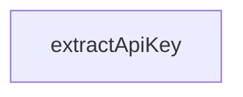

# Chapter 5: Configuration, Retries, and Credit Monitoring

Welcome to **Chapter 5: Configuration, Retries, and Credit Monitoring**. In this part of **Firecrawl MCP Server Tutorial: Web Scraping and Search Tools for MCP Clients**, you will build an intuitive mental model first, then move into concrete implementation details and practical production tradeoffs.


Production reliability depends on proper retry controls and credit thresholds.

## Learning Goals

- configure retry behavior for rate-limited environments
- tune warning and critical thresholds for credits
- support cloud and self-hosted API endpoints cleanly

## Key Environment Variables

| Variable | Purpose |
|:---------|:--------|
| `FIRECRAWL_API_KEY` | authentication for cloud usage |
| `FIRECRAWL_API_URL` | custom endpoint for self-hosted deployments |
| `FIRECRAWL_RETRY_*` | retry/backoff behavior controls |
| `FIRECRAWL_CREDIT_*` | warning and critical credit thresholds |

## Source References

- [README Configuration](https://github.com/firecrawl/firecrawl-mcp-server/blob/main/README.md)
- [Changelog 1.2.4 and 1.2.0](https://github.com/firecrawl/firecrawl-mcp-server/blob/main/CHANGELOG.md)

## Summary

You now know which controls matter most for resilient Firecrawl MCP operations.

Next: [Chapter 6: Batch Workflows, Deep Research, and API Evolution](06-batch-workflows-deep-research-and-api-evolution.md)

## Depth Expansion Playbook

## Source Code Walkthrough

### `src/index.ts`

The `extractApiKey` function in [`src/index.ts`](https://github.com/firecrawl/firecrawl-mcp-server/blob/HEAD/src/index.ts) handles a key part of this chapter's functionality:

```ts
}

function extractApiKey(headers: IncomingHttpHeaders): string | undefined {
  const headerAuth = headers['authorization'];
  const headerApiKey = (headers['x-firecrawl-api-key'] ||
    headers['x-api-key']) as string | string[] | undefined;

  if (headerApiKey) {
    return Array.isArray(headerApiKey) ? headerApiKey[0] : headerApiKey;
  }

  if (
    typeof headerAuth === 'string' &&
    headerAuth.toLowerCase().startsWith('bearer ')
  ) {
    return headerAuth.slice(7).trim();
  }

  return undefined;
}

function removeEmptyTopLevel<T extends Record<string, any>>(
  obj: T
): Partial<T> {
  const out: Partial<T> = {};
  for (const [k, v] of Object.entries(obj)) {
    if (v == null) continue;
    if (typeof v === 'string' && v.trim() === '') continue;
    if (Array.isArray(v) && v.length === 0) continue;
    if (
      typeof v === 'object' &&
      !Array.isArray(v) &&
```

This function is important because it defines how Firecrawl MCP Server Tutorial: Web Scraping and Search Tools for MCP Clients implements the patterns covered in this chapter.


## How These Components Connect


