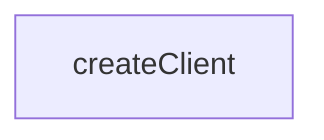

# Chapter 6: Batch Workflows, Deep Research, and API Evolution

Welcome to **Chapter 6: Batch Workflows, Deep Research, and API Evolution**. In this part of **Firecrawl MCP Server Tutorial: Web Scraping and Search Tools for MCP Clients**, you will build an intuitive mental model first, then move into concrete implementation details and practical production tradeoffs.


Firecrawl MCP has evolved from legacy V1 tooling to modern V2 behavior; teams need to plan around those differences.

## Learning Goals

- understand batch processing behavior and limits
- map V1-only capabilities versus V2 defaults
- plan endpoint migration without breaking clients

## Evolution Highlights

| Version | Notable Focus |
|:--------|:--------------|
| V1 | legacy endpoints plus deep-research/llmstxt oriented tools |
| V2 | modern API methods, improved extraction/search behavior |

## Source References

- [Versioning Guide](https://github.com/firecrawl/firecrawl-mcp-server/blob/main/VERSIONING.md)
- [README Tool Guidance](https://github.com/firecrawl/firecrawl-mcp-server/blob/main/README.md)

## Summary

You now have a migration-aware perspective on batch and advanced Firecrawl MCP usage.

Next: [Chapter 7: Reliability, Observability, and Failure Handling](07-reliability-observability-and-failure-handling.md)

## Source Code Walkthrough

### `src/index.ts`

The `createClient` function in [`src/index.ts`](https://github.com/firecrawl/firecrawl-mcp-server/blob/HEAD/src/index.ts) handles a key part of this chapter's functionality:

```ts
});

function createClient(apiKey?: string): FirecrawlApp {
  const config: any = {
    ...(process.env.FIRECRAWL_API_URL && {
      apiUrl: process.env.FIRECRAWL_API_URL,
    }),
  };

  // Only add apiKey if it's provided (required for cloud, optional for self-hosted)
  if (apiKey) {
    config.apiKey = apiKey;
  }

  return new FirecrawlApp(config);
}

const ORIGIN = 'mcp-fastmcp';

// Safe mode is enabled by default for cloud service to comply with ChatGPT safety requirements
const SAFE_MODE = process.env.CLOUD_SERVICE === 'true';

function getClient(session?: SessionData): FirecrawlApp {
  // For cloud service, API key is required
  if (process.env.CLOUD_SERVICE === 'true') {
    if (!session || !session.firecrawlApiKey) {
      throw new Error('Unauthorized');
    }
    return createClient(session.firecrawlApiKey);
  }

  // For self-hosted instances, API key is optional if FIRECRAWL_API_URL is provided
```

This function is important because it defines how Firecrawl MCP Server Tutorial: Web Scraping and Search Tools for MCP Clients implements the patterns covered in this chapter.


## How These Components Connect


