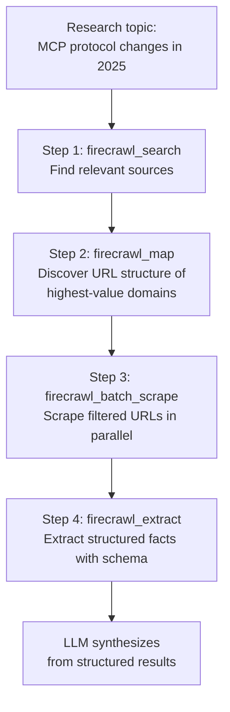
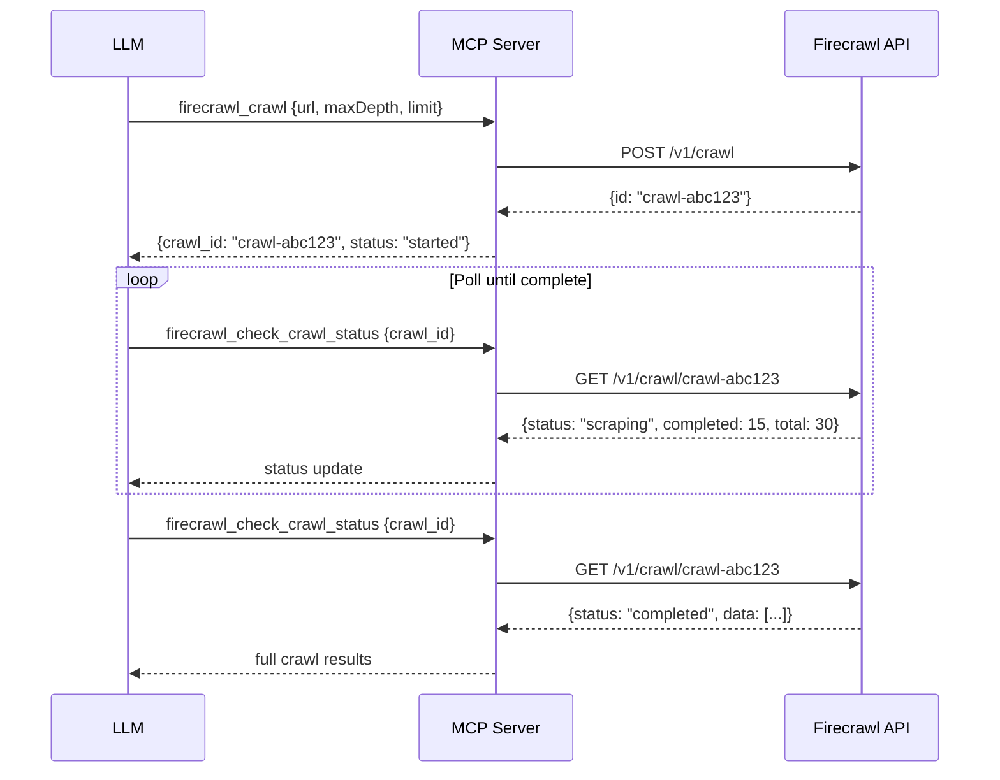

# Chapter 6: Batch Workflows, Deep Research, and API Evolution

This chapter covers multi-step research workflows using Firecrawl MCP tools in sequence, explains the async batch job model, and documents the historical evolution from V1-era tools to the current V2 API surface.

## Learning Goals

- Build multi-step deep research pipelines with combined tools
- Use batch jobs and polling patterns correctly for async operations
- Map V1-only capabilities versus V2 defaults
- Plan endpoint migration without breaking LLM workflows

## Multi-Step Research Pattern

Firecrawl tools compose naturally in agentic workflows. A typical deep research pipeline:



### Pattern 1: Search → Batch Scrape

When you don't know the source domain:

```
1. firecrawl_search("MCP protocol StreamableHTTP transport", limit=5)
   → Returns top 5 URLs with initial content snippets

2. firecrawl_batch_scrape([url1, url2, url3, ...], formats=["markdown"])
   → Submits batch job, returns job_id

3. firecrawl_check_batch_scrape_status(job_id)
   → Poll until status == "completed", returns full content per URL
```

### Pattern 2: Map → Targeted Scrape

When you know the domain but need specific pages:

```
1. firecrawl_map("https://modelcontextprotocol.io", search="transport")
   → Returns filtered URL list matching "transport"

2. firecrawl_scrape(url, formats=["markdown"], onlyMainContent=true)
   → For each relevant URL (if small number)
   Or
   firecrawl_batch_scrape([urls], ...)
   → For larger URL sets
```

### Pattern 3: Crawl + Extract for Structured Research

```
1. firecrawl_crawl("https://docs.example.com", maxDepth=2, limit=30)
   → Starts crawl job, returns crawl_id

2. firecrawl_check_crawl_status(crawl_id)
   → Poll until complete

3. firecrawl_extract([all crawled URLs],
     schema={"type":"object","properties":{"summary":{"type":"string"}}})
   → Extract structured summaries across all pages
```

## Async Job Model

Several tools run asynchronously and return job IDs:



## V1 vs V2 API Evolution

The server's `VERSIONING.md` documents the transition. The MCP server (v3+) always calls V2 endpoints via the `@mendable/firecrawl-js` SDK.

```mermaid
graph LR
    V1[V1 legacy API\n/v0/* endpoints]
    V2[V2 modern API\n/v1/* endpoints]

    V1 --> CRAWL1[v0/crawl\nblocking, simpler params]
    V1 --> SCRAPE1[v0/scrape\nbasic formats]
    V1 --> SEARCH1[/search\nbasic search]

    V2 --> CRAWL2[v1/crawl\nasync, webhook support\nbatch scraping]
    V2 --> SCRAPE2[v1/scrape\nrich formats: json, query,\nchangeTracking, branding]
    V2 --> SEARCH2[v1/search\ncountry, language filters]
    V2 --> EXTRACT2[v1/extract\nLLM-powered extraction]
    V2 --> BATCH2[v1/batch/scrape\nparallel job model]
```

### MCP Server Version to API Version Mapping

| MCP Server Version | Default API | Notes |
|:-------------------|:------------|:------|
| v1.x | V1 (legacy) | Deprecated |
| v2.x | V1 + V2 mixed | Transition period |
| v3.x (current) | V2 exclusively | All new features, `@mendable/firecrawl-js` v4 |

If you pin `npx -y firecrawl-mcp@2`, you get V1-era tool behavior. Always use `firecrawl-mcp@3` or latest for V2 tools.

## Special Tools: `firecrawl_deep_research` and `firecrawl_generate_llmstxt`

V3 introduced dedicated high-level research tools that orchestrate multiple API calls internally:

### `firecrawl_deep_research`

Runs a multi-step research workflow automatically — searches, maps, scrapes, and synthesizes. Returns a comprehensive research report.

```json
{
  "query": "How does the MCP protocol handle authentication in 2025?",
  "maxDepth": 3,
  "timeLimit": 120,
  "maxUrls": 20
}
```

### `firecrawl_generate_llmstxt`

Generates an `llms.txt`-format document from a website, suitable for providing a site's content as LLM context. Based on the [llms.txt standard](https://llmstxt.org).

## `removeEmptyTopLevel` Parameter Cleaning

The server includes a utility function that removes empty, null, or zero-length fields from request payloads before sending to the API:

```typescript
function removeEmptyTopLevel<T extends Record<string, any>>(obj: T): Partial<T> {
  const out: Partial<T> = {};
  for (const [k, v] of Object.entries(obj)) {
    if (v == null) continue;
    if (typeof v === 'string' && v.trim() === '') continue;
    if (Array.isArray(v) && v.length === 0) continue;
    if (typeof v === 'object' && !Array.isArray(v) && Object.keys(v).length === 0) continue;
    out[k] = v;
  }
  return out;
}
```

This prevents sending empty `actions: []` or `location: {}` to the API, which would otherwise cause validation errors.

## Source References

- [VERSIONING.md](https://github.com/mendableai/firecrawl-mcp-server/blob/main/VERSIONING.md)
- [src/index.ts — tool implementations](https://github.com/mendableai/firecrawl-mcp-server/blob/main/src/index.ts)

## Summary

Firecrawl tools compose into powerful research pipelines: search to discover sources, map to navigate domains, batch-scrape for parallel collection, extract for structured output. Async tools (crawl, batch_scrape) use a poll-and-wait pattern with job IDs. The v3 MCP server runs V2 API endpoints exclusively — pin to `firecrawl-mcp@3` or use `latest` for current tool behavior.

Next: [Chapter 7: Reliability, Observability, and Failure Handling](07-reliability-observability-and-failure-handling.md)
