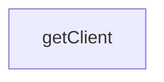

# Chapter 7: Reliability, Observability, and Failure Handling

Welcome to **Chapter 7: Reliability, Observability, and Failure Handling**. In this part of **Firecrawl MCP Server Tutorial: Web Scraping and Search Tools for MCP Clients**, you will build an intuitive mental model first, then move into concrete implementation details and practical production tradeoffs.


This chapter turns error handling and operational controls into an explicit runbook.

## Learning Goals

- detect and handle rate-limit and transient failure patterns
- instrument enough logging to debug tool-call failures
- prevent runaway crawl workloads

## Reliability Practices

1. set retry values intentionally for your workload profile
2. cap crawl depth and scope per request
3. monitor credit thresholds and alert before service interruption
4. track client errors by transport and endpoint version

## Source References

- [README Rate Limiting and Configuration](https://github.com/firecrawl/firecrawl-mcp-server/blob/main/README.md)
- [Changelog](https://github.com/firecrawl/firecrawl-mcp-server/blob/main/CHANGELOG.md)

## Summary

You now have a reliability checklist for sustained Firecrawl MCP operations.

Next: [Chapter 8: Security, Governance, and Contribution Workflow](08-security-governance-and-contribution-workflow.md)

## Depth Expansion Playbook

## Source Code Walkthrough

### `src/index.ts`

The `getClient` function in [`src/index.ts`](https://github.com/firecrawl/firecrawl-mcp-server/blob/HEAD/src/index.ts) handles a key part of this chapter's functionality:

```ts
const SAFE_MODE = process.env.CLOUD_SERVICE === 'true';

function getClient(session?: SessionData): FirecrawlApp {
  // For cloud service, API key is required
  if (process.env.CLOUD_SERVICE === 'true') {
    if (!session || !session.firecrawlApiKey) {
      throw new Error('Unauthorized');
    }
    return createClient(session.firecrawlApiKey);
  }

  // For self-hosted instances, API key is optional if FIRECRAWL_API_URL is provided
  if (
    !process.env.FIRECRAWL_API_URL &&
    (!session || !session.firecrawlApiKey)
  ) {
    throw new Error(
      'Unauthorized: API key is required when not using a self-hosted instance'
    );
  }

  return createClient(session?.firecrawlApiKey);
}

function asText(data: unknown): string {
  return JSON.stringify(data, null, 2);
}

// scrape tool (v2 semantics, minimal args)
// Centralized scrape params (used by scrape, and referenced in search/crawl scrapeOptions)

// Define safe action types
```

This function is important because it defines how Firecrawl MCP Server Tutorial: Web Scraping and Search Tools for MCP Clients implements the patterns covered in this chapter.


## How These Components Connect


