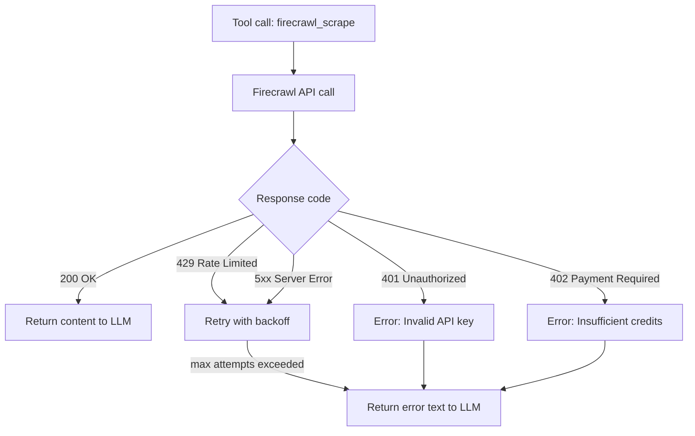
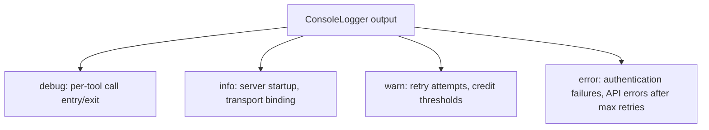

# Chapter 7: Reliability, Observability, and Failure Handling

This chapter turns error handling and operational controls into a concrete runbook. It covers how the server handles Firecrawl API failures, what constitutes a reliable tool response, and how to instrument enough observability to diagnose failures.

## Learning Goals

- Detect and handle rate-limit and transient failure patterns from the Firecrawl API
- Instrument sufficient logging to debug tool-call failures
- Prevent runaway crawl workloads from consuming excessive credits
- Understand the error response format MCP clients receive

## Error Response Model

When a Firecrawl API call fails after exhausting retries, the server returns an error as a tool result — not as a JSON-RPC error. This means the LLM receives the error message and can communicate it to the user or retry with different parameters.



Error responses from the server follow this pattern:
```json
{
  "content": [
    {
      "type": "text",
      "text": "Error: Failed to scrape URL after 3 attempts. Last error: 429 Too Many Requests"
    }
  ]
}
```

The LLM can parse this and decide to retry, try an alternative URL, or report the failure to the user.

## Authentication Failure Modes

```mermaid
flowchart LR
    AUTHFAIL[Authentication failures]
    AUTHFAIL --> F1[FIRECRAWL_API_KEY missing\n→ server exits at startup]
    AUTHFAIL --> F2[Invalid API key\n→ 401 on first API call\nreturned as tool error]
    AUTHFAIL --> F3[Expired API key\n→ 401 on first API call\nreturned as tool error]
    AUTHFAIL --> F4[Cloud mode: no header key\n→ authenticate() throws\nconnection rejected]
```

For cloud mode (`CLOUD_SERVICE=true`), authentication failures reject the MCP connection at the `authenticate` callback level — before any tools can be called. For local mode, the API key is validated on the first actual API call.

## Rate Limiting Defense

The primary protection against rate limiting is the exponential backoff retry system (see Chapter 5). Additional strategies:

### Tool Call Throttling

If you're driving many tool calls from an agentic loop, add delays between calls in your agent logic:

```python
# In an agentic framework driving Firecrawl tool calls
import asyncio

for url in urls_to_scrape:
    result = await client.call_tool("firecrawl_scrape", {"url": url, "formats": ["markdown"]})
    await asyncio.sleep(0.5)  # 500ms between calls to stay under rate limits
```

### Prefer Batch Operations

Use `firecrawl_batch_scrape` instead of calling `firecrawl_scrape` in a loop — the batch endpoint is optimized for parallel processing within Firecrawl's infrastructure and counts against rate limits differently than sequential single-URL calls.

## Preventing Runaway Crawls

`firecrawl_crawl` without limits can consume hundreds of credits on large sites. Always set explicit limits:

```json
{
  "url": "https://docs.example.com",
  "maxDepth": 2,
  "limit": 50,
  "maxDiscoveryDepth": 2,
  "scrapeOptions": {
    "formats": ["markdown"],
    "onlyMainContent": true
  }
}
```

| Parameter | Recommended Limit | Rationale |
|:----------|:------------------|:----------|
| `maxDepth` | 2–3 | Prevents infinite link-following |
| `limit` | 20–100 | Hard cap on total pages |
| `maxDiscoveryDepth` | Same as `maxDepth` | Controls URL discovery breadth |

## Observability: What to Monitor

### In Stdio Mode (Desktop Clients)

Logging is suppressed by `ConsoleLogger` in stdio mode. To add diagnostic output without polluting the JSON-RPC stream:

```typescript
// Write debug info to stderr (safe in stdio mode)
process.stderr.write(`[debug] Scraping URL: ${url}\n`);
```

Stderr output is captured to Claude Desktop's MCP log: `~/Library/Logs/Claude/mcp-server-firecrawl.log`

### In Service Mode

With `CLOUD_SERVICE=true`, `SSE_LOCAL=true`, or `HTTP_STREAMABLE_SERVER=true`, the `ConsoleLogger` activates and writes timestamped `[DEBUG]`, `[INFO]`, `[WARN]`, `[ERROR]` lines to stdout.



## Failure Recovery Runbook

| Failure | Diagnosis | Recovery |
|:--------|:----------|:---------|
| Tool not appearing in client | Config syntax error | Validate JSON, check npx path |
| All tools return "Unauthorized" | Invalid or missing API key | Check `FIRECRAWL_API_KEY` in env |
| Tools fail with "credit" error | Credits below critical threshold | Top up Firecrawl account credits |
| Scrape returns empty content | JavaScript-heavy page, no wait | Add `waitFor: 2000` to scrape params |
| Crawl job stuck in "scraping" | Site has anti-bot protection | Use `proxy: "stealth"` option |
| Batch job returns partial results | Some URLs failed | Check per-URL status in batch result |

## Health Endpoint

In HTTP transport modes, the server exposes a health endpoint:

```
GET /health → 200 OK  body: "ok"
```

This is configured in `server` initialization and is useful for load balancer health checks in hosted deployments.

## Source References

- [src/index.ts — error handling and retry logic](https://github.com/mendableai/firecrawl-mcp-server/blob/main/src/index.ts)
- [CHANGELOG](https://github.com/mendableai/firecrawl-mcp-server/blob/main/CHANGELOG.md)

## Summary

Firecrawl MCP returns errors as tool content (not JSON-RPC errors) so the LLM can handle them gracefully. Authentication failures in local mode surface on first API call; in cloud mode they reject the connection at authentication time. The most important reliability controls are: exponential backoff (tuned via env vars), crawl depth and page limits, and credit monitoring thresholds. In stdio mode, log to stderr for diagnostics without corrupting the MCP stream.

Next: [Chapter 8: Security, Governance, and Contribution Workflow](08-security-governance-and-contribution-workflow.md)
