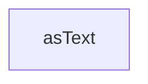

# Chapter 8: Security, Governance, and Contribution Workflow

Welcome to **Chapter 8: Security, Governance, and Contribution Workflow**. In this part of **Firecrawl MCP Server Tutorial: Web Scraping and Search Tools for MCP Clients**, you will build an intuitive mental model first, then move into concrete implementation details and practical production tradeoffs.


This chapter concludes with governance patterns for production use and contribution pathways.

## Learning Goals

- manage API keys and endpoint trust boundaries safely
- define governance around scraping behavior and data handling
- align contribution work with versioning and release rhythm

## Governance Questions

| Question | Why It Matters |
|:---------|:---------------|
| where are API keys stored and rotated? | prevents credential leakage |
| which domains are allowed for crawl/search jobs? | controls data and compliance risk |
| what release channel is approved for production clients? | avoids unplanned breaking changes |

## Source References

- [README](https://github.com/firecrawl/firecrawl-mcp-server/blob/main/README.md)
- [Versioning](https://github.com/firecrawl/firecrawl-mcp-server/blob/main/VERSIONING.md)
- [Releases](https://github.com/firecrawl/firecrawl-mcp-server/releases)

## Summary

You now have an end-to-end model for adopting and operating Firecrawl MCP Server with strong governance.

Next: combine this with [MCP Chrome](../mcp-chrome-tutorial/) and [MCP Inspector](../mcp-inspector-tutorial/) for full browsing-data toolchains.

## Depth Expansion Playbook

## Source Code Walkthrough

### `src/index.ts`

The `asText` function in [`src/index.ts`](https://github.com/firecrawl/firecrawl-mcp-server/blob/HEAD/src/index.ts) handles a key part of this chapter's functionality:

```ts
}

function asText(data: unknown): string {
  return JSON.stringify(data, null, 2);
}

// scrape tool (v2 semantics, minimal args)
// Centralized scrape params (used by scrape, and referenced in search/crawl scrapeOptions)

// Define safe action types
const safeActionTypes = ['wait', 'screenshot', 'scroll', 'scrape'] as const;
const otherActions = [
  'click',
  'write',
  'press',
  'executeJavascript',
  'generatePDF',
] as const;
const allActionTypes = [...safeActionTypes, ...otherActions] as const;

// Use appropriate action types based on safe mode
const allowedActionTypes = SAFE_MODE ? safeActionTypes : allActionTypes;

function buildFormatsArray(
  args: Record<string, unknown>
): Record<string, unknown>[] | undefined {
  const formats = args.formats as string[] | undefined;
  if (!formats || formats.length === 0) return undefined;

  const result: Record<string, unknown>[] = [];
  for (const fmt of formats) {
    if (fmt === 'json') {
```

This function is important because it defines how Firecrawl MCP Server Tutorial: Web Scraping and Search Tools for MCP Clients implements the patterns covered in this chapter.


## How These Components Connect


