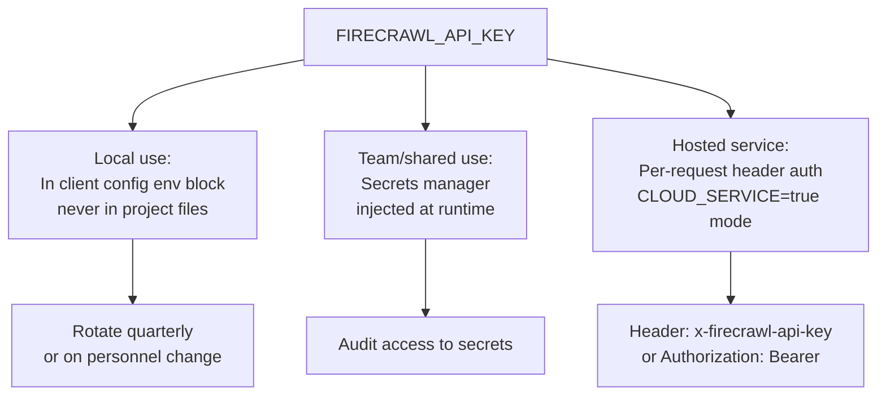
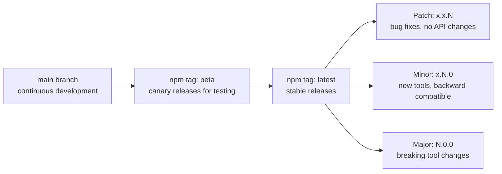
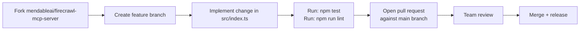

# Chapter 8: Security, Governance, and Contribution Workflow

This chapter covers API key security, scraping governance policies, Docker-based deployment controls, and the contribution workflow for `firecrawl-mcp`.

## Learning Goals

- Manage API keys and endpoint trust boundaries safely
- Define governance around scraping behavior and data handling
- Align contribution work with versioning and release rhythm
- Understand safe mode and its compliance implications

## API Key Security



### Key Rotation

Firecrawl API keys are long-lived bearer tokens. Rotation practices:
- Generate a new key in the Firecrawl dashboard before revoking the old one
- Update all client configs simultaneously (or use a secrets manager to propagate automatically)
- Verify the new key works in Inspector before updating production configs
- Revoke the old key only after confirming zero active usage

### Never Commit Keys

The `docker/entrypoint.sh` and `docker/nginx.conf` files demonstrate environment variable injection at the container level. Use the same pattern for any deployment:

```yaml
# docker-compose.yml pattern
services:
  firecrawl-mcp:
    image: firecrawl-mcp:latest
    environment:
      - FIRECRAWL_API_KEY=${FIRECRAWL_API_KEY}  # from .env or CI secret
```

## Safe Mode and Compliance

When `CLOUD_SERVICE=true`, safe mode is automatically enabled. This restricts browser automation actions to a safe subset:

```typescript
const safeActionTypes = ['wait', 'screenshot', 'scroll', 'scrape'] as const;
const otherActions = ['click', 'write', 'press', 'executeJavascript', 'generatePDF'] as const;
const allowedActionTypes = SAFE_MODE ? safeActionTypes : allActionTypes;
```

Safe mode was designed for ChatGPT plugin compliance. Implications:
- In hosted deployments, users cannot automate interactive browser actions (click, fill forms, execute JavaScript)
- In local deployments (`CLOUD_SERVICE` not set), all action types are available

If your use case requires JavaScript execution or form filling, run the server locally without `CLOUD_SERVICE=true`.

## Scraping Governance

When deploying Firecrawl MCP as a shared team tool, define governance policies:

| Policy Area | Questions to Answer |
|:-----------|:--------------------|
| Allowed domains | Which external domains can be scraped? Is competitor content allowed? |
| Data retention | Does scraped content stay in LLM context only, or is it persisted? Set `zeroDataRetention: true` for sensitive requests |
| Rate limits | Per-user or per-team credit budgets? Monitor via credit threshold env vars |
| Robots.txt compliance | Firecrawl respects robots.txt by default — document any overrides |
| Legal/copyright | Review terms of service for scraped content before using in products |

### Zero Data Retention

For sensitive scraping operations (internal documents, regulated content), use:

```json
{
  "url": "https://internal.example.com/sensitive-doc",
  "formats": ["markdown"],
  "zeroDataRetention": true
}
```

When `zeroDataRetention: true`, Firecrawl deletes the scraped content from its servers immediately after returning the response.

## Docker Security

The repo includes a `Dockerfile` and `Dockerfile.service` for containerized deployments. Security practices:

```dockerfile
# Recommended additions to the Docker build
# Pin Node.js version for reproducibility
FROM node:18.20-alpine

# Run as non-root user
RUN addgroup -S firecrawl && adduser -S firecrawl -G firecrawl
USER firecrawl

# Read-only filesystem where possible
# Secrets injected via environment, never COPY'd
```

The `docker/nginx.conf` provides a reverse proxy configuration for service deployments, including SSL termination and request buffering.

## Versioning and Release Policy

The `VERSIONING.md` documents the release cadence:



For production clients, pin to a minor version:
```json
{ "args": ["-y", "firecrawl-mcp@3"] }
```

Avoid unpinned `firecrawl-mcp` in production — `npx -y firecrawl-mcp` always fetches latest and may break on major version bumps.

## Contribution Workflow

The `firecrawl-mcp` server is maintained by the Mendable/Firecrawl team. Contributions follow a standard GitHub flow:



### CI Checks

The `.github/workflows/ci.yml` runs on every PR:
```bash
npm install
npm run lint    # ESLint on src/**/*.ts
npm test        # Jest test suite
```

Build before testing locally:
```bash
npm run build   # tsc + chmod
npm test
```

## Reporting Security Issues

The project uses GitHub's security advisory feature. For vulnerabilities:
1. Go to the repository's Security tab
2. Click "Report a vulnerability"
3. Do not disclose in public issues

## Source References

- [README](https://github.com/mendableai/firecrawl-mcp-server/blob/main/README.md)
- [VERSIONING.md](https://github.com/mendableai/firecrawl-mcp-server/blob/main/VERSIONING.md)
- [Dockerfile](https://github.com/mendableai/firecrawl-mcp-server/blob/main/Dockerfile)
- [docker/nginx.conf](https://github.com/mendableai/firecrawl-mcp-server/blob/main/docker/nginx.conf)
- [GitHub Releases](https://github.com/mendableai/firecrawl-mcp-server/releases)

## Summary

API key security requires environment injection (never git-committed), quarterly rotation, and secrets manager usage for shared deployments. Safe mode (enabled automatically in cloud service mode) restricts browser automation to a safe subset for compliance. For sensitive scraping, use `zeroDataRetention: true`. Pin the MCP server version in production configs to avoid unexpected breaking changes on major version bumps.

Return to the [Firecrawl MCP Server Tutorial index](README.md).
