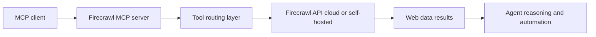

# Firecrawl MCP Server Tutorial: Web Scraping and Search Tools for MCP Clients

> Learn how to use `firecrawl/firecrawl-mcp-server` to add robust web scraping, crawling, search, and extraction capabilities to MCP-enabled coding and research agents.

## Why This Track Matters

Firecrawl MCP Server gives AI agents production-grade web data access through a standard MCP interface. It supports scraping, crawl orchestration, search, extraction, retries, and deployment modes across popular MCP clients.

This track focuses on:

- setting up Firecrawl MCP for hosted and self-hosted environments
- selecting the right tool for scrape/map/crawl/search/extract tasks
- configuring reliability controls for retries and credit monitoring
- operating versioned endpoints and client integrations safely

## Current Snapshot (Verified February 12, 2026)

- repository: [`firecrawl/firecrawl-mcp-server`](https://github.com/firecrawl/firecrawl-mcp-server)
- stars: about **5.5k**
- latest release: [`v3.2.1`](https://github.com/firecrawl/firecrawl-mcp-server/releases/tag/v3.2.1) (**September 26, 2025**)
- recent activity: updated on **February 5, 2026**
- positioning: official Firecrawl MCP server for scraping, crawling, extraction, and search workflows

## Mental Model

## Chapter Guide

| Chapter | Key Question | Outcome |
|:--------|:-------------|:--------|
| [01 - Getting Started and Core Setup](01-getting-started-and-core-setup.md) | How do I run Firecrawl MCP quickly with API credentials? | Working integration baseline |
| [02 - Architecture, Transports, and Versioning](02-architecture-transports-and-versioning.md) | How do stdio, HTTP, and versioned endpoints affect behavior? | Cleaner deployment model |
| [03 - Tool Selection: Scrape, Map, Crawl, Search, Extract](03-tool-selection-scrape-map-crawl-search-extract.md) | Which tool should I use for each web data task? | Better tool choice |
| [04 - Client Integrations: Cursor, Claude, Windsurf, VS Code](04-client-integrations-cursor-claude-windsurf-vscode.md) | How do I connect Firecrawl MCP across major clients? | Reliable multi-client setup |
| [05 - Configuration, Retries, and Credit Monitoring](05-configuration-retries-and-credit-monitoring.md) | Which env vars and thresholds matter in production? | Better resilience |
| [06 - Batch Workflows, Deep Research, and API Evolution](06-batch-workflows-deep-research-and-api-evolution.md) | How do advanced tools and v1/v2 differences impact usage? | Safer migration planning |
| [07 - Reliability, Observability, and Failure Handling](07-reliability-observability-and-failure-handling.md) | How do we keep scraping workloads reliable over time? | Operational readiness |
| [08 - Security, Governance, and Contribution Workflow](08-security-governance-and-contribution-workflow.md) | How do teams run Firecrawl MCP responsibly at scale? | Long-term governance model |

## What You Will Learn

- how to integrate Firecrawl MCP in everyday coding/research agent loops
- how to choose and compose tools for web data acquisition tasks
- how to tune retry, credit, and environment settings for stability
- how to handle endpoint versioning and lifecycle governance

## Source References

- [Repository](https://github.com/firecrawl/firecrawl-mcp-server)
- [README](https://github.com/firecrawl/firecrawl-mcp-server/blob/main/README.md)
- [Changelog](https://github.com/firecrawl/firecrawl-mcp-server/blob/main/CHANGELOG.md)
- [Versioning Guide](https://github.com/firecrawl/firecrawl-mcp-server/blob/main/VERSIONING.md)

## Related Tutorials

- [Firecrawl Tutorial](../firecrawl-tutorial/)
- [MCP Servers Tutorial](../mcp-servers-tutorial/)
- [MCP Chrome Tutorial](../mcp-chrome-tutorial/)
- [MCP Use Tutorial](../mcp-use-tutorial/)

---

Start with [Chapter 1: Getting Started and Core Setup](01-getting-started-and-core-setup.md).
