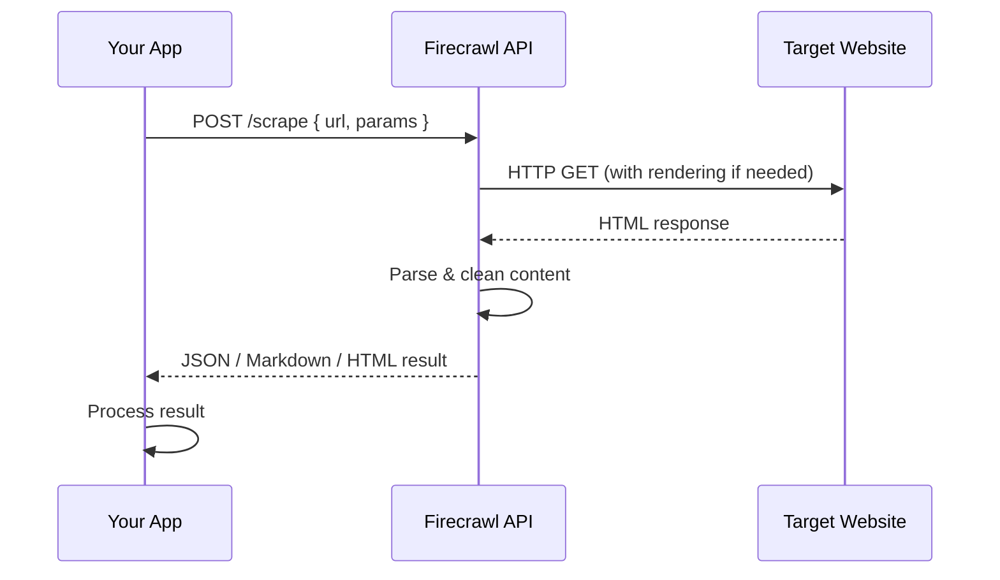
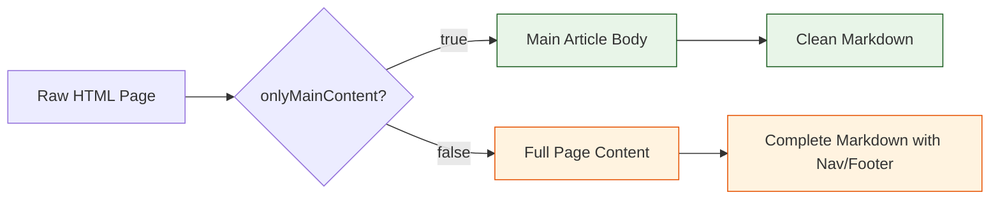
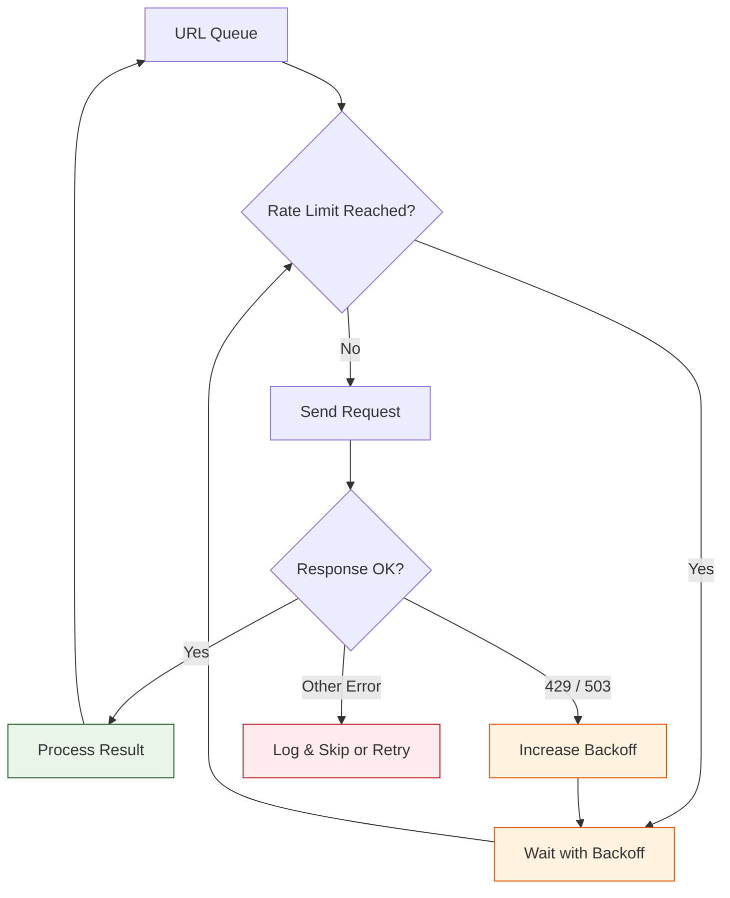

# Chapter 2: Basic Web Scraping

In [Chapter 1](01-getting-started.md), you installed Firecrawl and ran your first scrape. Now it is time to build a solid foundation in basic web scraping -- learning how to extract content from single pages, batch multiple URLs efficiently, choose the right output format, and handle the errors that inevitably arise when talking to the open web.

## What You Will Learn

| Skill | Description |
|-------|-------------|
| Single-page scraping | Fetch and parse one URL at a time |
| Batch scraping | Process many URLs in parallel with concurrency control |
| Output formats | Choose between JSON, Markdown, and raw HTML |
| Error handling | Retry transient failures with exponential backoff |
| Rate limiting | Respect server limits and avoid bans |
| URL filtering | Include or exclude paths during a crawl |

## How a Basic Scrape Works

Before writing code, it helps to understand the flow that Firecrawl follows for every request.



Firecrawl acts as a proxy that handles the messy details -- JavaScript execution, cookie management, header rotation, and content cleaning -- and returns a tidy payload you can feed straight into an LLM or store for later.

## Prerequisites

Before starting, make sure you have:

- Completed [Chapter 1](01-getting-started.md) (Firecrawl installed and API key configured)
- Python 3.8+ or Node.js 16+
- The `FIRECRAWL_API_KEY` environment variable set

```bash
# Verify your setup
export FIRECRAWL_API_KEY="fc-your-api-key-here"
echo $FIRECRAWL_API_KEY
```

## Single-Page Scraping

The simplest operation is scraping a single URL. Firecrawl returns content in your preferred format along with metadata such as the page title, description, and source URL.

### Python

```python
from firecrawl import FirecrawlApp

app = FirecrawlApp(api_key="YOUR_KEY")

# Scrape a single page -- returns markdown by default
result = app.scrape_url("https://example.com")

print("Title:", result.get("metadata", {}).get("title"))
print("Description:", result.get("metadata", {}).get("description"))
print("Content preview:")
print(result["markdown"][:500])
```

### TypeScript

```typescript
import FirecrawlApp from "@mendable/firecrawl-js";

const app = new FirecrawlApp({ apiKey: process.env.FIRECRAWL_API_KEY });

const result = await app.scrapeUrl("https://example.com", {
  formats: ["markdown"],
});

console.log("Title:", result.metadata?.title);
console.log("Content preview:", result.markdown?.slice(0, 500));
```

### curl

```bash
curl -X POST https://api.firecrawl.dev/v1/scrape \
  -H "Authorization: Bearer $FIRECRAWL_API_KEY" \
  -H "Content-Type: application/json" \
  -d '{
    "url": "https://example.com",
    "formats": ["markdown"]
  }'
```

## Output Formats

Firecrawl supports three primary output formats. Choose the one that fits your downstream use case.

| Format | Best For | Size | Fidelity |
|--------|----------|------|----------|
| `markdown` | LLM prompts, RAG ingestion, human reading | Small | Structural (headings, lists, links) |
| `html` | Preserving exact layout, re-rendering | Large | Full DOM fidelity |
| `json` | Programmatic extraction with schemas | Medium | Structured fields |

### Requesting Multiple Formats

You can request more than one format in a single call:

```python
result = app.scrape_url(
    "https://example.com/blog/post-1",
    params={
        "formats": ["markdown", "html"],
        "onlyMainContent": True,
    }
)

# Both formats available on the result
markdown_content = result["markdown"]
html_content = result["html"]
print(f"Markdown length: {len(markdown_content)}")
print(f"HTML length: {len(html_content)}")
```

### Filtering Content with `onlyMainContent`

Setting `onlyMainContent: True` strips navigation bars, footers, sidebars, and ads, leaving only the primary article or page body. This is almost always what you want when preparing data for an LLM.



## Crawling Multiple Pages

When you need content from an entire section or site, use the **crawl** endpoint. It follows links starting from a seed URL and collects pages according to your rules.

### Python

```python
# Crawl an entire blog section
crawl_result = app.crawl_url(
    "https://example.com/blog",
    params={
        "limit": 20,                       # Max pages to crawl
        "maxDepth": 3,                     # Follow links up to 3 levels deep
        "includePaths": ["/blog/*"],       # Only keep blog URLs
        "excludePaths": ["/blog/drafts/*"],# Skip draft posts
    },
    poll_interval=5,  # Check status every 5 seconds
)

print(f"Crawled {len(crawl_result)} pages")
for page in crawl_result:
    title = page.get("metadata", {}).get("title", "Untitled")
    print(f"  - {title}: {page['metadata']['sourceURL']}")
```

### TypeScript

```typescript
const crawlResult = await app.crawlUrl("https://example.com/blog", {
  limit: 20,
  maxDepth: 3,
  includePaths: ["/blog/*"],
  excludePaths: ["/blog/drafts/*"],
});

console.log(`Crawled ${crawlResult.length} pages`);
crawlResult.forEach((page) => {
  console.log(`  - ${page.metadata?.title}: ${page.metadata?.sourceURL}`);
});
```

### curl

```bash
# Start a crawl job (returns a job ID)
curl -X POST https://api.firecrawl.dev/v1/crawl \
  -H "Authorization: Bearer $FIRECRAWL_API_KEY" \
  -H "Content-Type: application/json" \
  -d '{
    "url": "https://example.com/blog",
    "limit": 20,
    "maxDepth": 3,
    "includePaths": ["/blog/*"]
  }'

# Poll the job status
curl -X GET https://api.firecrawl.dev/v1/crawl/<JOB_ID> \
  -H "Authorization: Bearer $FIRECRAWL_API_KEY"
```

### Crawl Parameters Reference

| Parameter | Type | Default | Description |
|-----------|------|---------|-------------|
| `limit` | int | 10 | Maximum number of pages to crawl |
| `maxDepth` | int | 2 | How many link-hops from the seed URL |
| `includePaths` | string[] | `[]` | Glob patterns for URLs to include |
| `excludePaths` | string[] | `[]` | Glob patterns for URLs to exclude |
| `allowExternalLinks` | bool | `false` | Whether to follow links to other domains |
| `allowBackwardLinks` | bool | `false` | Whether to follow links to parent paths |

## Batch Scraping

For scraping a known list of URLs (rather than discovering them via crawl), use the batch scrape endpoint. It processes URLs in parallel on the server side.

```python
urls = [
    "https://example.com/page-1",
    "https://example.com/page-2",
    "https://example.com/page-3",
    "https://example.com/page-4",
    "https://example.com/page-5",
]

batch_result = app.batch_scrape_urls(
    urls,
    params={
        "formats": ["markdown"],
        "onlyMainContent": True,
    }
)

for page in batch_result:
    title = page.get("metadata", {}).get("title", "Untitled")
    length = len(page.get("markdown", ""))
    print(f"{title}: {length} chars of markdown")
```

## Error Handling and Retries

The open web is unpredictable. Servers go down, rate limits kick in, and pages load slowly. Robust error handling separates production scraping from throwaway scripts.

### Common HTTP Errors

| Status | Meaning | Recommended Action |
|--------|---------|-------------------|
| 403 | Forbidden / blocked | Reduce request rate, check robots.txt |
| 429 | Rate limited | Back off exponentially, add jitter |
| 500 | Server error | Retry with backoff |
| 502/503 | Gateway / unavailable | Retry after a delay |
| Timeout | Page too slow | Increase timeout or skip URL |

### Retry with Exponential Backoff (Python)

```python
import time
import random

def scrape_with_retry(app, url, max_retries=3, base_delay=1.0):
    """Scrape a URL with exponential backoff and jitter."""
    last_error = None

    for attempt in range(1, max_retries + 1):
        try:
            result = app.scrape_url(url, params={"formats": ["markdown"]})
            return result
        except Exception as exc:
            last_error = exc
            if attempt == max_retries:
                break
            # Exponential backoff with jitter
            delay = base_delay * (2 ** (attempt - 1)) + random.uniform(0, 1)
            print(f"Attempt {attempt} failed for {url}: {exc}")
            print(f"  Retrying in {delay:.1f}s...")
            time.sleep(delay)

    print(f"All {max_retries} attempts failed for {url}")
    raise last_error

# Usage
result = scrape_with_retry(app, "https://example.com/flaky-page")
```

### Retry with Exponential Backoff (TypeScript)

```typescript
async function scrapeWithRetry(
  app: FirecrawlApp,
  url: string,
  maxRetries = 3,
  baseDelay = 1000
): Promise<any> {
  let lastError: Error | null = null;

  for (let attempt = 1; attempt <= maxRetries; attempt++) {
    try {
      return await app.scrapeUrl(url, { formats: ["markdown"] });
    } catch (err) {
      lastError = err as Error;
      if (attempt === maxRetries) break;
      const delay = baseDelay * Math.pow(2, attempt - 1) + Math.random() * 1000;
      console.log(`Attempt ${attempt} failed: ${err}. Retrying in ${delay}ms...`);
      await new Promise((r) => setTimeout(r, delay));
    }
  }
  throw lastError;
}
```

## Rate Limiting Best Practices



Key guidelines for staying within rate limits:

1. **Start conservative** -- Begin with 2-3 concurrent requests and increase gradually.
2. **Add jitter** -- Random delays between 0-1 seconds prevent request bursts.
3. **Respect `Retry-After` headers** -- If the server tells you when to retry, listen.
4. **Deduplicate URLs** -- Scraping the same URL twice wastes your quota.
5. **Cache aggressively** -- Store results locally so re-runs skip already-scraped pages.

```python
import asyncio

async def rate_limited_scrape(app, urls, concurrency=3, delay=1.0):
    """Scrape URLs with bounded concurrency and delay."""
    semaphore = asyncio.Semaphore(concurrency)
    results = []

    async def scrape_one(url):
        async with semaphore:
            result = app.scrape_url(url, params={"formats": ["markdown"]})
            results.append({"url": url, "result": result})
            await asyncio.sleep(delay)  # Polite delay between requests

    tasks = [scrape_one(url) for url in urls]
    await asyncio.gather(*tasks, return_exceptions=True)
    return results
```

## Building a Simple Scraping Pipeline

Putting it all together, here is a complete pipeline that scrapes a list of URLs, handles errors, and saves results.

```python
import json
import time
import random
from pathlib import Path
from firecrawl import FirecrawlApp

app = FirecrawlApp(api_key="YOUR_KEY")

def scrape_pipeline(urls, output_dir="./scraped_data"):
    """End-to-end scraping pipeline with error handling and persistence."""
    output_path = Path(output_dir)
    output_path.mkdir(parents=True, exist_ok=True)

    results = []
    errors = []

    for i, url in enumerate(urls):
        print(f"[{i+1}/{len(urls)}] Scraping: {url}")
        try:
            result = scrape_with_retry(app, url)

            # Save individual result
            filename = url.replace("https://", "").replace("/", "_") + ".json"
            filepath = output_path / filename
            with open(filepath, "w") as f:
                json.dump(result, f, indent=2)

            results.append({"url": url, "status": "success", "file": str(filepath)})

        except Exception as exc:
            print(f"  FAILED: {exc}")
            errors.append({"url": url, "error": str(exc)})

        # Polite delay between requests
        time.sleep(random.uniform(0.5, 1.5))

    # Write summary report
    summary = {"total": len(urls), "success": len(results), "failed": len(errors)}
    with open(output_path / "summary.json", "w") as f:
        json.dump({"summary": summary, "results": results, "errors": errors}, f, indent=2)

    print(f"\nDone: {summary['success']} succeeded, {summary['failed']} failed")
    return results, errors


# Run the pipeline
urls = [
    "https://example.com/page-1",
    "https://example.com/page-2",
    "https://example.com/page-3",
]
scrape_pipeline(urls)
```

## Troubleshooting

| Problem | Possible Cause | Solution |
|---------|---------------|----------|
| 403 Forbidden | IP blocked or bot detection | Reduce concurrency, rotate user agents |
| 429 Too Many Requests | Rate limit exceeded | Add exponential backoff with jitter |
| Empty content | JS-rendered page (not rendered yet) | Enable `waitFor` (see [Chapter 4](04-javascript-handling.md)) |
| Timeout errors | Slow target server | Increase `timeout`, skip URL if persistent |
| Garbled text | Character encoding issues | Force UTF-8 in params |
| Duplicate content | Same URL crawled multiple times | Deduplicate URL list before scraping |

## Security and Ethics

- **Respect `robots.txt`** -- Check what the site allows before scraping.
- **Honor rate limits** -- Hammering a server can get your IP banned and may violate terms of service.
- **Never store credentials in code** -- Use environment variables for API keys.
- **Avoid scraping authenticated pages** without explicit permission from the site owner.
- **Store only what you need** -- Minimize data retention to reduce risk.

## Summary

In this chapter you learned the core mechanics of web scraping with Firecrawl -- from fetching a single page to crawling entire site sections. You now know how to choose the right output format, handle errors gracefully, and respect rate limits. These fundamentals form the foundation for everything that follows.

## Key Takeaways

1. **`scrape_url`** fetches a single page; **`crawl_url`** follows links across a site; **`batch_scrape_urls`** processes a known URL list in parallel.
2. Use **`onlyMainContent: True`** to strip boilerplate and get clean text suitable for LLMs.
3. **Exponential backoff with jitter** is essential for handling transient failures without overwhelming servers.
4. **Markdown** is the best output format for most LLM and RAG use cases due to its compact size and preserved structure.
5. Always **deduplicate URLs** and **cache results** to avoid wasted requests.

## Next Steps

You can now scrape pages reliably. In [Chapter 3: Advanced Data Extraction](03-advanced-extraction.md), you will learn how to define schemas, extract structured fields from pages, and build reusable extraction rules that turn messy HTML into clean, typed data.

---

*Built with insights from the [Firecrawl](https://github.com/mendableai/firecrawl) project.*
