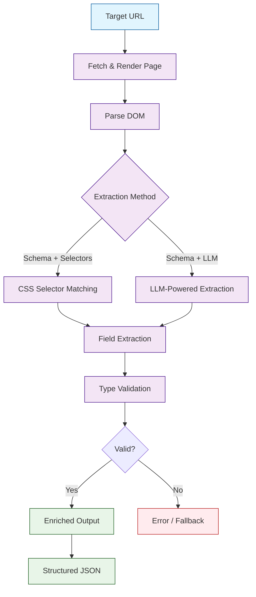
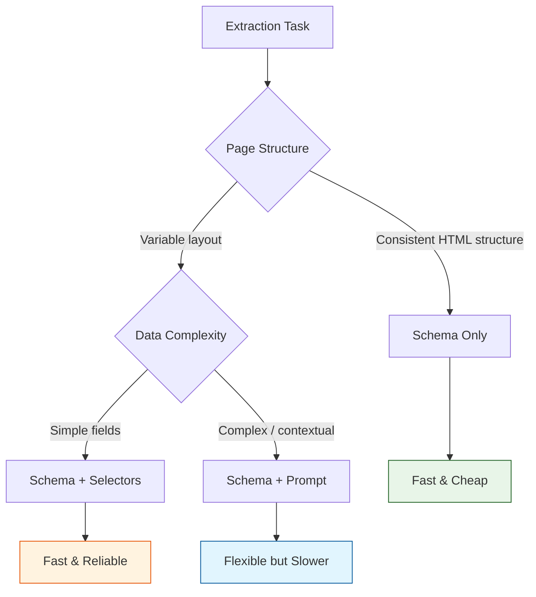

# Chapter 3: Advanced Data Extraction

In [Chapter 2](02-basic-scraping.md), you learned how to scrape pages and get back raw content in Markdown, HTML, or JSON. But raw content is only the starting point. Most AI applications need **structured data** -- typed fields like titles, prices, dates, and authors extracted from messy web pages into clean, predictable objects.

Firecrawl's extraction capabilities let you define schemas that describe what you want, and the engine returns exactly that. This chapter covers schema-driven extraction, CSS selector rules, LLM-powered extraction, validation, and building reusable extraction pipelines.

## What You Will Learn

| Skill | Description |
|-------|-------------|
| Schema-driven extraction | Define typed schemas and let Firecrawl extract matching data |
| CSS selector rules | Target specific DOM elements with precision |
| LLM-powered extraction | Use natural language prompts to extract complex data |
| Data validation | Ensure extracted fields meet type and completeness constraints |
| Metadata enrichment | Augment results with source URLs, timestamps, and language |
| Reusable pipelines | Build extraction templates for different page types |

## The Extraction Pipeline

When you use Firecrawl's extract endpoint, data flows through a multi-stage pipeline.



## Schema-Driven Extraction

The most powerful extraction approach is defining a schema that describes the data you expect. Firecrawl uses this schema to locate and extract matching content from the page.

### Defining a Schema (Python)

```python
from firecrawl import FirecrawlApp

app = FirecrawlApp(api_key="YOUR_KEY")

# Define a schema for blog articles
article_schema = {
    "type": "object",
    "properties": {
        "title": {"type": "string"},
        "author": {"type": "string"},
        "published_date": {"type": "string"},
        "summary": {"type": "string"},
        "body": {"type": "string"},
        "tags": {
            "type": "array",
            "items": {"type": "string"}
        }
    },
    "required": ["title", "body"]
}

# Extract structured data from a blog post
result = app.scrape_url(
    "https://example.com/blog/ai-trends-2025",
    params={
        "formats": ["extract"],
        "extract": {
            "schema": article_schema
        }
    }
)

article = result["extract"]
print(f"Title: {article['title']}")
print(f"Author: {article.get('author', 'Unknown')}")
print(f"Tags: {', '.join(article.get('tags', []))}")
print(f"Body preview: {article['body'][:300]}...")
```

### Defining a Schema (TypeScript)

```typescript
import FirecrawlApp from "@mendable/firecrawl-js";

const app = new FirecrawlApp({ apiKey: process.env.FIRECRAWL_API_KEY });

const articleSchema = {
  type: "object",
  properties: {
    title: { type: "string" },
    author: { type: "string" },
    published_date: { type: "string" },
    summary: { type: "string" },
    body: { type: "string" },
    tags: { type: "array", items: { type: "string" } },
  },
  required: ["title", "body"],
};

const result = await app.scrapeUrl("https://example.com/blog/ai-trends-2025", {
  formats: ["extract"],
  extract: { schema: articleSchema },
});

console.log("Title:", result.extract?.title);
console.log("Author:", result.extract?.author);
```

### curl

```bash
curl -X POST https://api.firecrawl.dev/v1/scrape \
  -H "Authorization: Bearer $FIRECRAWL_API_KEY" \
  -H "Content-Type: application/json" \
  -d '{
    "url": "https://example.com/blog/ai-trends-2025",
    "formats": ["extract"],
    "extract": {
      "schema": {
        "type": "object",
        "properties": {
          "title": {"type": "string"},
          "author": {"type": "string"},
          "body": {"type": "string"},
          "tags": {"type": "array", "items": {"type": "string"}}
        },
        "required": ["title", "body"]
      }
    }
  }'
```

## Supported Schema Types

Firecrawl schemas follow JSON Schema conventions. Here are the types you can use.

| Type | Example Value | Use Case |
|------|--------------|----------|
| `string` | `"Hello World"` | Titles, names, descriptions, body text |
| `number` | `42.99` | Prices, ratings, counts |
| `integer` | `2025` | Years, quantities, IDs |
| `boolean` | `true` | Availability flags, feature toggles |
| `array` | `["tag1", "tag2"]` | Lists of tags, categories, authors |
| `object` | `{"name": "...", "url": "..."}` | Nested structures (author details, etc.) |

### Nested Object Schemas

For complex pages, you can nest objects to capture hierarchical data.

```python
product_schema = {
    "type": "object",
    "properties": {
        "name": {"type": "string"},
        "price": {"type": "number"},
        "currency": {"type": "string"},
        "in_stock": {"type": "boolean"},
        "rating": {
            "type": "object",
            "properties": {
                "score": {"type": "number"},
                "count": {"type": "integer"}
            }
        },
        "specifications": {
            "type": "array",
            "items": {
                "type": "object",
                "properties": {
                    "label": {"type": "string"},
                    "value": {"type": "string"}
                }
            }
        }
    }
}

result = app.scrape_url(
    "https://example.com/products/widget-pro",
    params={
        "formats": ["extract"],
        "extract": {"schema": product_schema}
    }
)

product = result["extract"]
print(f"{product['name']}: ${product['price']} {product['currency']}")
print(f"Rating: {product['rating']['score']}/5 ({product['rating']['count']} reviews)")
for spec in product.get("specifications", []):
    print(f"  {spec['label']}: {spec['value']}")
```

## LLM-Powered Extraction with Prompts

Sometimes CSS selectors are too rigid and schemas alone are not enough context. Firecrawl supports **prompt-based extraction**, where you describe what you want in natural language and the LLM interprets the page content to fill your schema.

```python
# Use a natural language prompt to guide extraction
result = app.scrape_url(
    "https://example.com/company/about",
    params={
        "formats": ["extract"],
        "extract": {
            "prompt": "Extract the company name, founding year, number of employees, "
                      "headquarters location, and a one-sentence mission statement.",
            "schema": {
                "type": "object",
                "properties": {
                    "company_name": {"type": "string"},
                    "founded_year": {"type": "integer"},
                    "employee_count": {"type": "integer"},
                    "headquarters": {"type": "string"},
                    "mission": {"type": "string"}
                }
            }
        }
    }
)

company = result["extract"]
print(f"{company['company_name']} (est. {company['founded_year']})")
print(f"HQ: {company['headquarters']}")
print(f"Employees: {company['employee_count']}")
print(f"Mission: {company['mission']}")
```

### When to Use Prompts vs. Pure Schemas



| Approach | Speed | Cost | Flexibility | Best For |
|----------|-------|------|-------------|----------|
| Schema only | Fast | Low | Moderate | Uniform page structures (e-commerce, docs) |
| Schema + selectors | Fast | Low | Low | Known, stable DOM layouts |
| Schema + prompt | Slower | Higher | High | Variable layouts, contextual extraction |

## Extracting from Multiple Page Types

Real-world scraping often involves different page types on the same site. Create a registry of schemas and select the right one based on URL patterns.

```python
# Schema registry for different page types
SCHEMAS = {
    "article": {
        "type": "object",
        "properties": {
            "title": {"type": "string"},
            "author": {"type": "string"},
            "date": {"type": "string"},
            "body": {"type": "string"},
            "tags": {"type": "array", "items": {"type": "string"}}
        }
    },
    "product": {
        "type": "object",
        "properties": {
            "name": {"type": "string"},
            "price": {"type": "number"},
            "description": {"type": "string"},
            "in_stock": {"type": "boolean"}
        }
    },
    "profile": {
        "type": "object",
        "properties": {
            "name": {"type": "string"},
            "title": {"type": "string"},
            "bio": {"type": "string"},
            "social_links": {"type": "array", "items": {"type": "string"}}
        }
    }
}

def detect_page_type(url: str) -> str:
    """Select schema based on URL pattern."""
    if "/blog/" in url or "/posts/" in url:
        return "article"
    elif "/products/" in url or "/shop/" in url:
        return "product"
    elif "/team/" in url or "/people/" in url:
        return "profile"
    return "article"  # default

def extract_structured(app, url: str):
    """Extract data using the appropriate schema for the URL."""
    page_type = detect_page_type(url)
    schema = SCHEMAS[page_type]

    result = app.scrape_url(
        url,
        params={
            "formats": ["extract", "markdown"],
            "extract": {"schema": schema}
        }
    )

    return {
        "type": page_type,
        "url": url,
        "data": result["extract"],
        "markdown": result.get("markdown", ""),
    }

# Extract from different page types
urls = [
    "https://example.com/blog/ai-news",
    "https://example.com/products/widget",
    "https://example.com/team/jane-doe",
]

for url in urls:
    extracted = extract_structured(app, url)
    print(f"[{extracted['type']}] {url}")
    print(f"  Data: {extracted['data']}")
    print()
```

## Data Validation and Cleaning

Extracted data is not always perfect. Build validation logic to catch missing fields, wrong types, and low-quality results.

```python
from dataclasses import dataclass, field
from typing import Optional, List

@dataclass
class ValidationResult:
    is_valid: bool
    errors: List[str] = field(default_factory=list)
    warnings: List[str] = field(default_factory=list)

def validate_article(data: dict) -> ValidationResult:
    """Validate extracted article data."""
    errors = []
    warnings = []

    # Required fields
    if not data.get("title"):
        errors.append("Missing required field: title")
    if not data.get("body"):
        errors.append("Missing required field: body")

    # Quality checks
    if data.get("body") and len(data["body"]) < 100:
        warnings.append(f"Body is very short ({len(data['body'])} chars)")
    if data.get("title") and len(data["title"]) > 200:
        warnings.append("Title is unusually long")

    # Type checks
    if data.get("tags") and not isinstance(data["tags"], list):
        errors.append("Tags must be a list")

    return ValidationResult(
        is_valid=len(errors) == 0,
        errors=errors,
        warnings=warnings,
    )

# Validate extracted data
article_data = result["extract"]
validation = validate_article(article_data)

if validation.is_valid:
    print("Extraction valid")
    for w in validation.warnings:
        print(f"  Warning: {w}")
else:
    print("Extraction failed validation:")
    for e in validation.errors:
        print(f"  Error: {e}")
```

## Metadata Enrichment

Add context to every extraction result so you can trace data back to its source and understand when it was collected.

```python
from datetime import datetime, timezone

def enrich_with_metadata(extracted_data: dict, url: str) -> dict:
    """Add metadata to extraction results."""
    return {
        **extracted_data,
        "_metadata": {
            "source_url": url,
            "fetched_at": datetime.now(timezone.utc).isoformat(),
            "extractor_version": "1.0.0",
            "schema_type": detect_page_type(url),
        }
    }

enriched = enrich_with_metadata(result["extract"], "https://example.com/blog/post")
print(f"Source: {enriched['_metadata']['source_url']}")
print(f"Fetched: {enriched['_metadata']['fetched_at']}")
```

## Building a Reusable Extraction Pipeline

Combine schema selection, extraction, validation, and enrichment into a single pipeline class.

```python
import json
from pathlib import Path
from firecrawl import FirecrawlApp

class ExtractionPipeline:
    """Reusable pipeline for structured data extraction."""

    def __init__(self, app: FirecrawlApp, schemas: dict):
        self.app = app
        self.schemas = schemas

    def extract(self, url: str, page_type: str = None) -> dict:
        """Extract, validate, and enrich data from a URL."""
        if page_type is None:
            page_type = detect_page_type(url)

        schema = self.schemas.get(page_type)
        if not schema:
            raise ValueError(f"No schema found for page type: {page_type}")

        # Extract
        result = self.app.scrape_url(
            url,
            params={
                "formats": ["extract", "markdown"],
                "extract": {"schema": schema},
                "onlyMainContent": True,
            }
        )

        # Enrich
        data = enrich_with_metadata(result["extract"], url)

        return data

    def extract_batch(self, urls: list, output_dir: str = "./extracted"):
        """Extract data from multiple URLs and save results."""
        output_path = Path(output_dir)
        output_path.mkdir(parents=True, exist_ok=True)

        results = []
        for url in urls:
            try:
                data = self.extract(url)
                results.append({"url": url, "status": "success", "data": data})
            except Exception as exc:
                results.append({"url": url, "status": "error", "error": str(exc)})

        # Save results
        with open(output_path / "extractions.json", "w") as f:
            json.dump(results, f, indent=2, default=str)

        success = sum(1 for r in results if r["status"] == "success")
        print(f"Extracted {success}/{len(urls)} URLs successfully")
        return results


# Usage
pipeline = ExtractionPipeline(app, SCHEMAS)
results = pipeline.extract_batch([
    "https://example.com/blog/post-1",
    "https://example.com/products/widget",
    "https://example.com/team/ceo",
])
```

## Troubleshooting

| Problem | Possible Cause | Solution |
|---------|---------------|----------|
| Missing fields in output | Page layout does not match schema | Inspect the page HTML and adjust selectors or add a prompt |
| Wrong data types | Schema mismatch | Ensure schema types match the actual content |
| Empty extraction result | Page requires JavaScript rendering | Add `waitFor` parameter (see [Chapter 4](04-javascript-handling.md)) |
| Garbled or encoded text | Character encoding issue | Force UTF-8 decoding in params |
| Repeated content in arrays | Selector too broad | Narrow the CSS selector or add deduplication logic |
| Slow extraction | LLM prompt extraction on large pages | Reduce page size with `onlyMainContent: True` |

## Performance Tips

- **Reuse schemas** -- Define schemas once and reference them across extractions.
- **Combine formats** -- Request `extract` and `markdown` in one call to avoid double-fetching.
- **Batch similar pages** -- Group URLs by page type so you can use the same schema and parameters.
- **Cache results** -- Store extracted JSON so re-runs can skip already-processed URLs.
- **Limit page content** -- Use `onlyMainContent: True` to reduce the input size for LLM-based extraction.

## Security Notes

- **Sanitize extracted HTML** -- Never render user-sourced HTML without sanitization.
- **Redact PII** -- If scraping user-generated content, filter out personal data before storing.
- **Log extraction failures** -- Track which pages fail so you can audit data quality.
- **Avoid executing scripts** -- Always rely on Firecrawl's sandboxed rendering rather than running page scripts locally.

## Summary

Structured extraction turns raw web pages into clean, typed data objects that your applications can work with directly. By defining schemas, using LLM-powered prompts for flexible extraction, validating results, and enriching outputs with metadata, you build reliable data pipelines that feed AI applications with high-quality inputs.

## Key Takeaways

1. **Schema-driven extraction** uses JSON Schema to define expected fields and types, giving you predictable structured output.
2. **LLM-powered prompts** add flexibility for pages with variable layouts -- use them when pure schemas are insufficient.
3. **Validation is essential** -- always check that required fields are present and values are reasonable before downstream use.
4. **Metadata enrichment** (source URL, timestamp, schema type) makes data traceable and auditable.
5. **Reusable pipelines** with schema registries let you scale extraction across many page types with minimal code changes.

## Next Steps

Now that you can extract structured data, many websites hide their content behind JavaScript rendering. In [Chapter 4: JavaScript & Dynamic Content](04-javascript-handling.md), you will learn how to handle SPAs, infinite scroll, and Ajax-loaded data to ensure Firecrawl captures every piece of content.

---

*Built with insights from the [Firecrawl](https://github.com/mendableai/firecrawl) project.*
