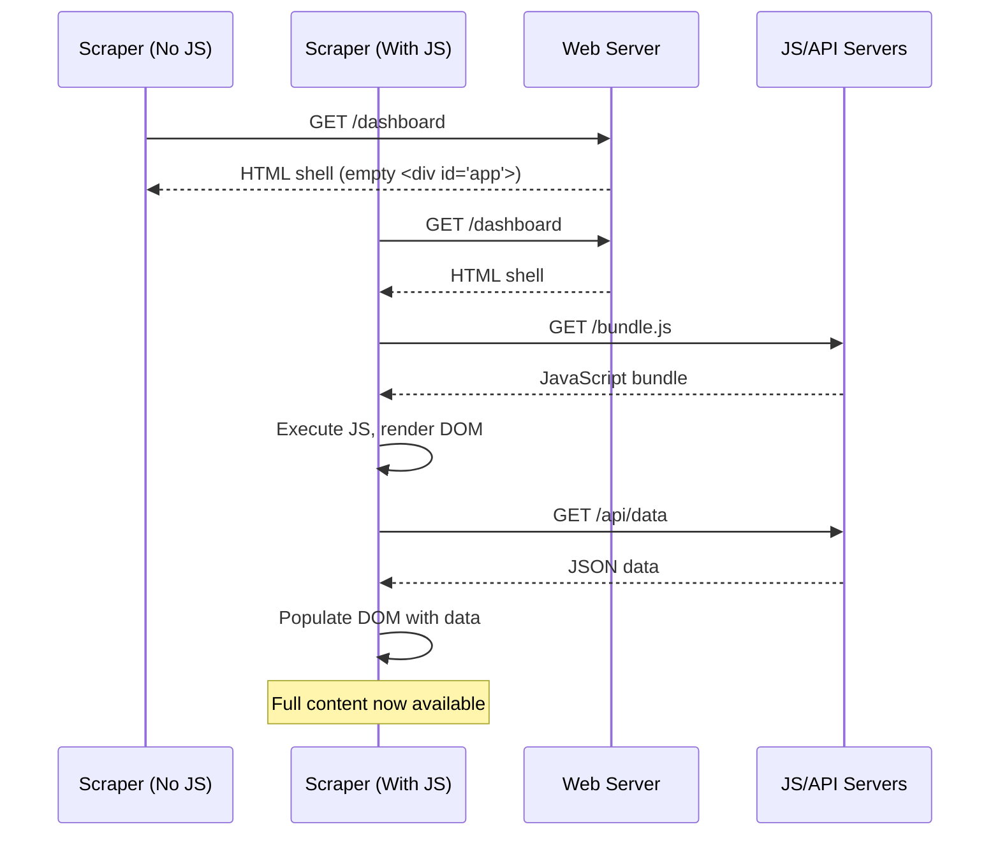
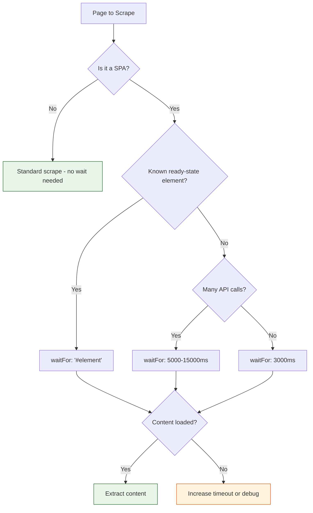
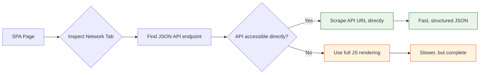

# Chapter 4: JavaScript & Dynamic Content

Welcome to **Chapter 4: JavaScript & Dynamic Content**. In this part of **Firecrawl Tutorial: Building LLM-Ready Web Scraping and Data Extraction Systems**, you will build an intuitive mental model first, then move into concrete implementation details and practical production tradeoffs.


The modern web runs on JavaScript. Single-page applications (SPAs), infinite scroll feeds, lazy-loaded images, and Ajax-powered dashboards all render content dynamically in the browser -- meaning that a simple HTTP GET returns an empty shell. If your scraper does not execute JavaScript, you get nothing.

Firecrawl solves this with built-in browser rendering. In this chapter you will learn how to configure rendering options, wait for dynamic content, handle infinite scroll and pagination, intercept Ajax requests, and debug blank-page issues.

## What You Will Learn

| Skill | Description |
|-------|-------------|
| JavaScript rendering | Enable headless browser rendering for SPAs |
| Wait strategies | Wait for selectors, network idle, or fixed timeouts |
| Infinite scroll | Automatically scroll to load all content |
| Pagination handling | Follow "next page" links or API cursors |
| Ajax interception | Target underlying JSON APIs directly |
| Debugging | Diagnose and fix blank pages, partial content, and timeouts |

## Why JavaScript Rendering Matters

Most websites today use JavaScript frameworks like React, Vue, or Angular. When you fetch these pages without rendering, you get a minimal HTML skeleton with no actual content.



With rendering enabled, Firecrawl launches a headless browser, executes all JavaScript, waits for the content to appear, and then extracts the fully-rendered DOM.

## Enabling JavaScript Rendering

### Python

```python
from firecrawl import FirecrawlApp

app = FirecrawlApp(api_key="YOUR_KEY")

# Scrape a JavaScript-heavy SPA
result = app.scrape_url(
    "https://example-spa.com/dashboard",
    params={
        "formats": ["markdown"],
        "waitFor": 5000,  # Wait 5 seconds for JS to render
    }
)

print("Rendered content:")
print(result["markdown"][:500])
```

### TypeScript

```typescript
import FirecrawlApp from "@mendable/firecrawl-js";

const app = new FirecrawlApp({ apiKey: process.env.FIRECRAWL_API_KEY });

const result = await app.scrapeUrl("https://example-spa.com/dashboard", {
  formats: ["markdown"],
  waitFor: 5000,
});

console.log("Rendered content:");
console.log(result.markdown?.slice(0, 500));
```

### curl

```bash
curl -X POST https://api.firecrawl.dev/v1/scrape \
  -H "Authorization: Bearer $FIRECRAWL_API_KEY" \
  -H "Content-Type: application/json" \
  -d '{
    "url": "https://example-spa.com/dashboard",
    "formats": ["markdown"],
    "waitFor": 5000
  }'
```

## Wait Strategies

Different pages need different wait strategies. Choosing the right one is the key to reliable dynamic content scraping.

### Strategy Comparison

| Strategy | Parameter | Best For | Trade-off |
|----------|-----------|----------|-----------|
| Fixed timeout | `waitFor: 3000` | Simple SPAs with predictable load times | May wait too long or not long enough |
| CSS selector | `waitFor: "#content"` | Pages where a known element signals readiness | Fast and precise, but requires DOM knowledge |
| Network idle | Built-in heuristic | Complex apps with many API calls | Slower but thorough |

### Waiting for a CSS Selector

The most reliable strategy is waiting for a specific DOM element that only appears once the page has fully loaded.

```python
# Wait until a specific element appears
result = app.scrape_url(
    "https://example-spa.com/products",
    params={
        "formats": ["markdown", "extract"],
        "waitFor": ".product-grid",  # Wait for product grid to render
        "extract": {
            "schema": {
                "type": "object",
                "properties": {
                    "products": {
                        "type": "array",
                        "items": {
                            "type": "object",
                            "properties": {
                                "name": {"type": "string"},
                                "price": {"type": "number"}
                            }
                        }
                    }
                }
            }
        }
    }
)

for product in result["extract"]["products"]:
    print(f"  {product['name']}: ${product['price']}")
```

### Combining Wait Strategies

For complex pages, combine a selector wait with a fixed timeout as a safety net.

```python
result = app.scrape_url(
    "https://example-spa.com/analytics",
    params={
        "formats": ["markdown"],
        "waitFor": ".chart-container",  # Wait for charts to render
        "timeout": 30000,               # Give up after 30 seconds
    }
)
```

## Wait Strategy Decision Tree



## Handling Infinite Scroll

Many social media feeds, news sites, and product catalogs use infinite scroll to load content as the user scrolls down. Firecrawl can simulate this scrolling behavior.

### Python -- Scrolling Strategy

```python
def scrape_infinite_scroll(app, url, max_scrolls=10, scroll_delay=2000):
    """Scrape a page with infinite scroll by using actions."""
    # Use Firecrawl's actions to simulate scrolling
    actions = []
    for i in range(max_scrolls):
        actions.append({"type": "scroll", "direction": "down"})
        actions.append({"type": "wait", "milliseconds": scroll_delay})

    result = app.scrape_url(
        url,
        params={
            "formats": ["markdown"],
            "actions": actions,
            "waitFor": 5000,
        }
    )

    return result

# Scrape a feed with infinite scroll
result = scrape_infinite_scroll(
    app,
    "https://example.com/feed",
    max_scrolls=5,
    scroll_delay=2000,
)

print(f"Collected content: {len(result['markdown'])} characters")
```

### TypeScript -- Scrolling Strategy

```typescript
async function scrapeInfiniteScroll(
  app: FirecrawlApp,
  url: string,
  maxScrolls = 10,
  scrollDelay = 2000
) {
  const actions = [];
  for (let i = 0; i < maxScrolls; i++) {
    actions.push({ type: "scroll", direction: "down" });
    actions.push({ type: "wait", milliseconds: scrollDelay });
  }

  return await app.scrapeUrl(url, {
    formats: ["markdown"],
    actions,
    waitFor: 5000,
  });
}

const result = await scrapeInfiniteScroll(app, "https://example.com/feed", 5);
console.log(`Collected: ${result.markdown?.length} characters`);
```

## Handling Pagination

For sites that use traditional pagination (page 1, 2, 3...) or "Load More" buttons, build a loop that follows page links.

```python
def scrape_paginated(app, base_url, max_pages=10):
    """Scrape multiple pages of paginated content."""
    all_content = []

    for page_num in range(1, max_pages + 1):
        url = f"{base_url}?page={page_num}"
        print(f"Scraping page {page_num}: {url}")

        try:
            result = app.scrape_url(
                url,
                params={
                    "formats": ["markdown", "extract"],
                    "onlyMainContent": True,
                    "extract": {
                        "schema": {
                            "type": "object",
                            "properties": {
                                "items": {
                                    "type": "array",
                                    "items": {"type": "object", "properties": {
                                        "title": {"type": "string"},
                                        "url": {"type": "string"}
                                    }}
                                },
                                "has_next_page": {"type": "boolean"}
                            }
                        }
                    }
                }
            )

            items = result["extract"].get("items", [])
            all_content.extend(items)
            print(f"  Found {len(items)} items")

            # Stop if no more pages
            if not result["extract"].get("has_next_page", False):
                print("  No more pages.")
                break

        except Exception as exc:
            print(f"  Error on page {page_num}: {exc}")
            break

    print(f"\nTotal items collected: {len(all_content)}")
    return all_content

# Scrape paginated search results
items = scrape_paginated(app, "https://example.com/search?q=ai", max_pages=5)
```

## Targeting Ajax APIs Directly

The fastest approach for JavaScript-heavy sites is to skip the rendering entirely and call the underlying API that the frontend uses. Inspect the browser's Network tab to find these endpoints.



```python
# Option 1: Scrape the API endpoint directly (much faster)
api_result = app.scrape_url(
    "https://example.com/api/v1/products?category=electronics&limit=50",
    params={"formats": ["markdown"]}
)

# Option 2: Render the full page (slower but captures everything)
page_result = app.scrape_url(
    "https://example.com/products/electronics",
    params={
        "formats": ["markdown"],
        "waitFor": ".product-list",
        "timeout": 15000,
    }
)

# Compare sizes
print(f"API approach: {len(api_result['markdown'])} chars")
print(f"Rendered approach: {len(page_result['markdown'])} chars")
```

## Handling Authentication Walls

Some dynamic content sits behind login pages. Firecrawl can handle these with cookie injection or header-based authentication.

```python
# Pass authentication headers
result = app.scrape_url(
    "https://example.com/members/dashboard",
    params={
        "formats": ["markdown"],
        "headers": {
            "Cookie": "session_id=abc123; auth_token=xyz789",
        },
        "waitFor": ".dashboard-content",
    }
)
```

> **Security Note**: Never hardcode credentials. Always load authentication tokens from environment variables or a secrets manager.

## Debugging Dynamic Content Issues

When scraping JavaScript-heavy sites, things often go wrong. Here is a systematic debugging approach.

### Common Problems and Solutions

| Symptom | Likely Cause | Solution |
|---------|-------------|----------|
| Blank or empty content | JavaScript not rendered | Add `waitFor` with a timeout or selector |
| Partial content only | Page not fully loaded | Increase `waitFor` timeout; use a selector that appears last |
| Missing images/media | Lazy loading not triggered | Add scroll actions before extraction |
| Login redirect | Authentication required | Pass session cookies in headers |
| Timeout errors | Page too slow or hanging | Increase `timeout`; check if the site is down |
| Anti-bot challenge | Bot detection triggered | Reduce request rate; use Firecrawl's built-in anti-bot handling |

### Step-by-Step Debugging

```python
def debug_scrape(app, url):
    """Scrape with verbose output for debugging."""
    print(f"1. Attempting raw scrape (no JS)...")
    try:
        raw = app.scrape_url(url, params={"formats": ["markdown"]})
        raw_len = len(raw.get("markdown", ""))
        print(f"   Raw content: {raw_len} chars")
    except Exception as e:
        print(f"   Raw scrape failed: {e}")
        raw_len = 0

    print(f"\n2. Attempting rendered scrape (with JS)...")
    try:
        rendered = app.scrape_url(url, params={
            "formats": ["markdown"],
            "waitFor": 5000,
        })
        rendered_len = len(rendered.get("markdown", ""))
        print(f"   Rendered content: {rendered_len} chars")
    except Exception as e:
        print(f"   Rendered scrape failed: {e}")
        rendered_len = 0

    print(f"\n3. Comparison:")
    if rendered_len > raw_len * 2:
        print("   Page heavily relies on JS rendering.")
        print("   Recommendation: Always use waitFor for this site.")
    elif raw_len > 0 and rendered_len > 0:
        print("   Both approaches work. Prefer raw scrape for speed.")
    else:
        print("   Investigation needed. Check URL accessibility.")

# Debug a problematic URL
debug_scrape(app, "https://example-spa.com/dashboard")
```

## Performance Optimization for JS-Heavy Sites

Rendering JavaScript is significantly more expensive than raw HTTP fetching. Use these strategies to minimize cost and maximize speed.

| Strategy | Impact | Effort |
|----------|--------|--------|
| Target APIs directly | 10x faster, much cheaper | Medium -- requires network inspection |
| Use selector waits instead of fixed timeouts | 2-5x faster on average | Low -- pick the right selector |
| Reduce scroll count | Proportional savings | Low -- stop when content is sufficient |
| Cache rendered results | Avoids re-rendering | Low -- add a caching layer |
| Limit concurrent rendering | Reduces resource contention | Low -- use semaphores |

```python
import asyncio

async def optimized_js_scrape(app, urls, concurrency=2):
    """Scrape JS-heavy pages with limited concurrency to control costs."""
    semaphore = asyncio.Semaphore(concurrency)  # Limit concurrent renders
    results = []

    async def scrape_one(url):
        async with semaphore:
            result = app.scrape_url(url, params={
                "formats": ["markdown"],
                "waitFor": ".main-content",
                "timeout": 15000,
                "onlyMainContent": True,
            })
            return {"url": url, "content": result["markdown"]}

    tasks = [scrape_one(url) for url in urls]
    results = await asyncio.gather(*tasks, return_exceptions=True)
    return results
```

## Security and Ethics

- **Never scrape authenticated areas** without explicit written permission from the site owner.
- **Avoid leaking session cookies** -- do not log request headers that contain authentication tokens.
- **Obey `robots.txt`** -- even if JavaScript rendering bypasses some client-side restrictions, respect the site's crawling policies.
- **Rate limit aggressively** -- rendered scrapes consume more server resources than raw fetches, so be extra polite.
- **Do not circumvent paywalls** -- extracting content from behind a paywall without authorization may violate terms of service and applicable laws.

## Summary

JavaScript rendering is the key to scraping the modern web. By enabling Firecrawl's headless browser, choosing the right wait strategy, and handling infinite scroll and pagination, you can reliably extract content from even the most complex single-page applications. When possible, target underlying APIs directly for maximum speed and efficiency.

## Key Takeaways

1. **Most modern websites require JavaScript rendering** to produce meaningful content. Always test with and without rendering to understand what a page needs.
2. **CSS selector waits** (`waitFor: ".element"`) are faster and more reliable than fixed timeouts.
3. **Infinite scroll** can be handled with scroll actions, but set a reasonable cap to avoid scraping indefinitely.
4. **Targeting Ajax APIs directly** is the fastest extraction method -- inspect the browser's Network tab to find JSON endpoints.
5. **Rendered scrapes cost more** in time and resources. Limit concurrency and cache results aggressively.

## Next Steps

Now that you can extract content from any website -- static or dynamic -- the next challenge is preparing that content for AI consumption. In [Chapter 5: Content Cleaning & Processing](05-content-cleaning.md), you will learn how to strip boilerplate, normalize text, deduplicate content, and produce clean, LLM-ready output.

---

*Built with insights from the [Firecrawl](https://github.com/mendableai/firecrawl) project.*

## What Problem Does This Solve?

Most teams struggle here because the hard part is not writing more code, but deciding clear boundaries for `markdown`, `print`, `result` so behavior stays predictable as complexity grows.

In practical terms, this chapter helps you avoid three common failures:

- coupling core logic too tightly to one implementation path
- missing the handoff boundaries between setup, execution, and validation
- shipping changes without clear rollback or observability strategy

After working through this chapter, you should be able to reason about `Chapter 4: JavaScript & Dynamic Content` as an operating subsystem inside **Firecrawl Tutorial: Building LLM-Ready Web Scraping and Data Extraction Systems**, with explicit contracts for inputs, state transitions, and outputs.

Use the implementation notes around `waitFor`, `formats`, `https` as your checklist when adapting these patterns to your own repository.

## How it Works Under the Hood

Under the hood, `Chapter 4: JavaScript & Dynamic Content` usually follows a repeatable control path:

1. **Context bootstrap**: initialize runtime config and prerequisites for `markdown`.
2. **Input normalization**: shape incoming data so `print` receives stable contracts.
3. **Core execution**: run the main logic branch and propagate intermediate state through `result`.
4. **Policy and safety checks**: enforce limits, auth scopes, and failure boundaries.
5. **Output composition**: return canonical result payloads for downstream consumers.
6. **Operational telemetry**: emit logs/metrics needed for debugging and performance tuning.

When debugging, walk this sequence in order and confirm each stage has explicit success/failure conditions.

## Source Walkthrough

Use the following upstream sources to verify implementation details while reading this chapter:

- [View Repo](https://github.com/firecrawl/firecrawl)
  Why it matters: authoritative reference on `View Repo` (github.com).

Suggested trace strategy:
- search upstream code for `markdown` and `print` to map concrete implementation paths
- compare docs claims against actual runtime/config code before reusing patterns in production

## Chapter Connections

- [Tutorial Index](index.md)
- [Previous Chapter: Chapter 3: Advanced Data Extraction](03-advanced-extraction.md)
- [Next Chapter: Chapter 5: Content Cleaning & Processing](05-content-cleaning.md)
- [Main Catalog](../../README.md#-tutorial-catalog)
- [A-Z Tutorial Directory](../../discoverability/tutorial-directory.md)
