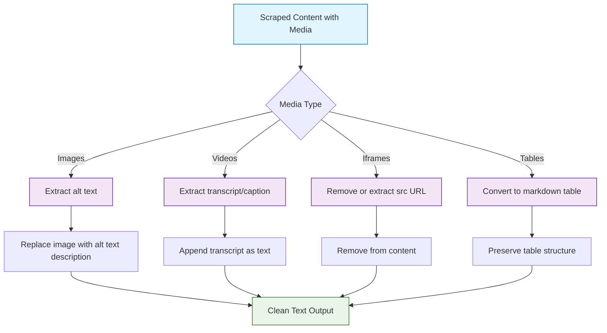

# Chapter 5: Content Cleaning & Processing

You have scraped web pages, rendered JavaScript, and extracted structured data. But raw scraped content is still noisy -- full of navigation menus, cookie banners, ad blocks, duplicate paragraphs, broken links, and inconsistent formatting. Before feeding content to an LLM, you need to clean, normalize, and validate it.

This chapter covers the full content cleaning pipeline: removing boilerplate, normalizing text and links, deduplicating content, scoring quality, handling media, and producing output that is optimized for LLM token budgets.

## What You Will Learn

| Skill | Description |
|-------|-------------|
| Boilerplate removal | Strip navigation, footers, ads, and cookie banners |
| Text normalization | Fix whitespace, encoding, and character issues |
| Link resolution | Convert relative URLs to absolute |
| Deduplication | Detect and remove repeated content blocks |
| Quality scoring | Rate content quality to filter low-value pages |
| Media handling | Process images, alt text, and embedded media |
| Token optimization | Prepare content for efficient LLM consumption |

## The Content Cleaning Pipeline

Every piece of scraped content flows through a multi-stage cleaning pipeline before it is ready for an LLM.


## Boilerplate Removal with Firecrawl

Firecrawl's `onlyMainContent` flag handles the heavy lifting of boilerplate removal, but you can fine-tune it further with tag inclusion and exclusion.

### Python

```python
from firecrawl import FirecrawlApp

app = FirecrawlApp(api_key="YOUR_KEY")

# Level 1: Basic boilerplate removal
result = app.scrape_url(
    "https://example.com/blog/article",
    params={
        "formats": ["markdown"],
        "onlyMainContent": True,      # Removes nav, footer, sidebar
    }
)

print(f"Clean content: {len(result['markdown'])} chars")
```

### TypeScript

```typescript
import FirecrawlApp from "@mendable/firecrawl-js";

const app = new FirecrawlApp({ apiKey: process.env.FIRECRAWL_API_KEY });

const result = await app.scrapeUrl("https://example.com/blog/article", {
  formats: ["markdown"],
  onlyMainContent: true,
});

console.log(`Clean content: ${result.markdown?.length} chars`);
```

### curl

```bash
curl -X POST https://api.firecrawl.dev/v1/scrape \
  -H "Authorization: Bearer $FIRECRAWL_API_KEY" \
  -H "Content-Type: application/json" \
  -d '{
    "url": "https://example.com/blog/article",
    "formats": ["markdown"],
    "onlyMainContent": true
  }'
```

### Content Comparison: With and Without Cleaning

| Metric | Raw Content | `onlyMainContent: true` | Reduction |
|--------|------------|------------------------|-----------|
| Character count | ~45,000 | ~12,000 | 73% |
| Token count (GPT-4) | ~11,000 | ~3,000 | 73% |
| Relevant paragraphs | 15 of 42 | 15 of 15 | 100% signal |
| Navigation elements | 12 | 0 | 100% removed |
| Ad blocks | 5 | 0 | 100% removed |

## HTML Sanitization

When working with raw HTML output, sanitize it to remove potentially dangerous elements before processing.

```python
import re
from html import unescape

def sanitize_html(html_content: str) -> str:
    """Remove dangerous HTML elements and attributes."""
    # Remove script tags and their contents
    html_content = re.sub(r'<script[^>]*>.*?</script>', '', html_content, flags=re.DOTALL)

    # Remove style tags and their contents
    html_content = re.sub(r'<style[^>]*>.*?</style>', '', html_content, flags=re.DOTALL)

    # Remove iframes
    html_content = re.sub(r'<iframe[^>]*>.*?</iframe>', '', html_content, flags=re.DOTALL)

    # Remove event handlers (onclick, onload, etc.)
    html_content = re.sub(r'\s+on\w+="[^"]*"', '', html_content)

    # Decode HTML entities
    html_content = unescape(html_content)

    return html_content

# Apply sanitization
raw_html = result.get("html", "")
clean_html = sanitize_html(raw_html)
print(f"Before: {len(raw_html)} chars")
print(f"After: {len(clean_html)} chars")
```

## Text Normalization

Scraped text often has inconsistent whitespace, broken encoding, and control characters. Normalize everything before downstream use.

```python
import re
import unicodedata

def normalize_text(text: str) -> str:
    """Normalize text for consistent LLM input."""
    # Unicode normalization (NFC form)
    text = unicodedata.normalize('NFC', text)

    # Replace common unicode quotes and dashes with ASCII equivalents
    replacements = {
        '\u2018': "'", '\u2019': "'",   # Smart single quotes
        '\u201c': '"', '\u201d': '"',   # Smart double quotes
        '\u2013': '-', '\u2014': '--',  # En-dash, em-dash
        '\u2026': '...',                # Ellipsis
        '\u00a0': ' ',                  # Non-breaking space
        '\u200b': '',                   # Zero-width space
    }
    for old, new in replacements.items():
        text = text.replace(old, new)

    # Collapse multiple blank lines into two (paragraph break)
    text = re.sub(r'\n{3,}', '\n\n', text)

    # Collapse multiple spaces into one
    text = re.sub(r'[ \t]+', ' ', text)

    # Strip leading/trailing whitespace from each line
    lines = [line.strip() for line in text.split('\n')]
    text = '\n'.join(lines)

    # Remove control characters (except newline and tab)
    text = re.sub(r'[\x00-\x08\x0b\x0c\x0e-\x1f\x7f]', '', text)

    return text.strip()

# Normalize scraped content
raw_content = result["markdown"]
clean_content = normalize_text(raw_content)
print(f"Normalized: {len(raw_content)} -> {len(clean_content)} chars")
```

## Link Resolution

Scraped markdown often contains relative links that break when the content is used outside the original page context. Resolve all links to absolute URLs.

```python
from urllib.parse import urljoin, urlparse

def resolve_links(markdown: str, base_url: str) -> str:
    """Convert relative links to absolute URLs in markdown."""
    # Match markdown links: [text](url)
    def replace_link(match):
        text = match.group(1)
        url = match.group(2)

        # Skip anchors, mailto, and already-absolute URLs
        if url.startswith(('#', 'mailto:', 'http://', 'https://')):
            return match.group(0)

        absolute_url = urljoin(base_url, url)
        return f'[{text}]({absolute_url})'

    resolved = re.sub(r'\[([^\]]*)\]\(([^)]+)\)', replace_link, markdown)

    # Also handle markdown images: 
    def replace_image(match):
        alt = match.group(1)
        url = match.group(2)
        if url.startswith(('http://', 'https://')):
            return match.group(0)
        absolute_url = urljoin(base_url, url)
        return f''

    resolved = re.sub(r'!\[([^\]]*)\]\(([^)]+)\)', replace_image, resolved)

    return resolved

# Resolve links in scraped content
source_url = result.get("metadata", {}).get("sourceURL", "https://example.com")
resolved_content = resolve_links(clean_content, source_url)
```

## Content Deduplication

When crawling multiple pages from a site, shared elements (headers, footers, sidebars) often leak through. Deduplicate at the paragraph level to remove repeated content.

```python
import hashlib
from collections import Counter

def deduplicate_paragraphs(text: str, min_length: int = 50) -> str:
    """Remove duplicate paragraphs while preserving order."""
    paragraphs = text.split('\n\n')
    seen_hashes = set()
    unique_paragraphs = []

    for para in paragraphs:
        stripped = para.strip()
        if len(stripped) < min_length:
            # Keep short paragraphs (headers, etc.) without dedup
            unique_paragraphs.append(para)
            continue

        para_hash = hashlib.sha256(stripped.lower().encode()).hexdigest()
        if para_hash not in seen_hashes:
            seen_hashes.add(para_hash)
            unique_paragraphs.append(para)

    return '\n\n'.join(unique_paragraphs)


def deduplicate_across_documents(documents: list) -> list:
    """Remove paragraphs that appear in multiple documents (boilerplate)."""
    # Count paragraph frequency across all documents
    paragraph_counts = Counter()
    for doc in documents:
        paragraphs = set(doc["content"].split('\n\n'))
        for para in paragraphs:
            if len(para.strip()) >= 50:
                para_hash = hashlib.sha256(para.strip().lower().encode()).hexdigest()
                paragraph_counts[para_hash] += 1

    # Threshold: if a paragraph appears in >50% of documents, it is boilerplate
    threshold = len(documents) * 0.5
    boilerplate_hashes = {h for h, count in paragraph_counts.items() if count > threshold}

    # Remove boilerplate from all documents
    cleaned_docs = []
    for doc in documents:
        paragraphs = doc["content"].split('\n\n')
        clean_paragraphs = []
        for para in paragraphs:
            para_hash = hashlib.sha256(para.strip().lower().encode()).hexdigest()
            if para_hash not in boilerplate_hashes:
                clean_paragraphs.append(para)
        cleaned_docs.append({**doc, "content": '\n\n'.join(clean_paragraphs)})

    print(f"Removed {len(boilerplate_hashes)} boilerplate paragraphs")
    return cleaned_docs
```

## Quality Scoring

Not all scraped pages are worth keeping. Score content quality to filter out low-value pages before they consume LLM tokens.

```python
from dataclasses import dataclass

@dataclass
class QualityScore:
    overall: float          # 0.0 to 1.0
    length_score: float
    structure_score: float
    link_ratio_score: float
    language_score: float
    reasons: list

def score_content_quality(text: str) -> QualityScore:
    """Score the quality of scraped content for LLM consumption."""
    reasons = []

    # Length score: penalize very short or very long content
    char_count = len(text)
    if char_count < 200:
        length_score = 0.2
        reasons.append("Content too short")
    elif char_count < 500:
        length_score = 0.5
    elif char_count > 50000:
        length_score = 0.7
        reasons.append("Content very long -- may need chunking")
    else:
        length_score = 1.0

    # Structure score: presence of headings and paragraphs
    headings = text.count('\n#')
    paragraphs = text.count('\n\n')
    if headings >= 2 and paragraphs >= 3:
        structure_score = 1.0
    elif paragraphs >= 2:
        structure_score = 0.7
    else:
        structure_score = 0.3
        reasons.append("Poor document structure")

    # Link-to-text ratio: high ratio suggests navigation-heavy content
    link_count = text.count('](')
    words = len(text.split())
    link_ratio = link_count / max(words, 1)
    if link_ratio > 0.1:
        link_ratio_score = 0.3
        reasons.append("High link density -- possibly navigation")
    elif link_ratio > 0.05:
        link_ratio_score = 0.7
    else:
        link_ratio_score = 1.0

    # Simple language quality check (ASCII ratio)
    ascii_chars = sum(1 for c in text if ord(c) < 128)
    ascii_ratio = ascii_chars / max(len(text), 1)
    language_score = min(ascii_ratio + 0.2, 1.0)
    if ascii_ratio < 0.5:
        reasons.append("Low ASCII ratio -- check encoding")

    # Overall weighted score
    overall = (
        length_score * 0.25 +
        structure_score * 0.30 +
        link_ratio_score * 0.25 +
        language_score * 0.20
    )

    return QualityScore(
        overall=round(overall, 2),
        length_score=round(length_score, 2),
        structure_score=round(structure_score, 2),
        link_ratio_score=round(link_ratio_score, 2),
        language_score=round(language_score, 2),
        reasons=reasons,
    )

# Score scraped content
score = score_content_quality(clean_content)
print(f"Quality score: {score.overall}")
print(f"  Length: {score.length_score}")
print(f"  Structure: {score.structure_score}")
print(f"  Link ratio: {score.link_ratio_score}")
print(f"  Language: {score.language_score}")
if score.reasons:
    print(f"  Issues: {', '.join(score.reasons)}")
```

## Media Handling

Images, videos, and embedded content need special treatment when preparing data for LLMs.



```python
def process_media_references(markdown: str) -> str:
    """Process media references for LLM consumption."""
    # Replace images with descriptive text using alt text
    def replace_image(match):
        alt_text = match.group(1)
        if alt_text:
            return f"[Image: {alt_text}]"
        return "[Image]"

    processed = re.sub(r'!\[([^\]]*)\]\([^)]+\)', replace_image, markdown)

    # Remove empty image references
    processed = re.sub(r'\[Image\]\s*', '', processed)

    return processed

# Process media in scraped content
content_for_llm = process_media_references(resolved_content)
```

## Token Optimization

LLMs have token limits and charge per token. Optimize content to maximize information density within your token budget.

```python
def optimize_for_tokens(text: str, max_chars: int = 12000) -> str:
    """Optimize content for LLM token budgets."""
    if len(text) <= max_chars:
        return text

    # Strategy: keep headings and first paragraph of each section
    sections = re.split(r'(^#{1,3}\s.+$)', text, flags=re.MULTILINE)
    optimized_parts = []
    current_length = 0

    for part in sections:
        if current_length + len(part) > max_chars:
            # Truncate the last section
            remaining = max_chars - current_length
            if remaining > 100:
                optimized_parts.append(part[:remaining] + "\n\n[Content truncated...]")
            break
        optimized_parts.append(part)
        current_length += len(part)

    return ''.join(optimized_parts)


def estimate_tokens(text: str) -> int:
    """Rough token estimate (1 token ~ 4 chars for English)."""
    return len(text) // 4

# Optimize for a 4K token context window
optimized = optimize_for_tokens(content_for_llm, max_chars=16000)
print(f"Original: ~{estimate_tokens(content_for_llm)} tokens")
print(f"Optimized: ~{estimate_tokens(optimized)} tokens")
```

## Complete Cleaning Pipeline

Combine all cleaning stages into a single reusable pipeline.

```python
from firecrawl import FirecrawlApp

class ContentCleaningPipeline:
    """End-to-end content cleaning pipeline for LLM consumption."""

    def __init__(self, quality_threshold: float = 0.5, max_tokens: int = 4000):
        self.quality_threshold = quality_threshold
        self.max_chars = max_tokens * 4  # Rough char-to-token ratio

    def clean(self, markdown: str, source_url: str) -> dict:
        """Run the full cleaning pipeline on a scraped document."""
        # Step 1: Normalize text
        content = normalize_text(markdown)

        # Step 2: Resolve links
        content = resolve_links(content, source_url)

        # Step 3: Deduplicate paragraphs
        content = deduplicate_paragraphs(content)

        # Step 4: Process media references
        content = process_media_references(content)

        # Step 5: Score quality
        quality = score_content_quality(content)

        # Step 6: Token optimization
        content = optimize_for_tokens(content, self.max_chars)

        return {
            "content": content,
            "quality_score": quality.overall,
            "quality_issues": quality.reasons,
            "passed_threshold": quality.overall >= self.quality_threshold,
            "estimated_tokens": estimate_tokens(content),
            "source_url": source_url,
        }

    def clean_batch(self, documents: list) -> list:
        """Clean a batch of documents and filter by quality."""
        results = []
        for doc in documents:
            cleaned = self.clean(doc["markdown"], doc["source_url"])
            results.append(cleaned)

        passed = sum(1 for r in results if r["passed_threshold"])
        print(f"Quality filter: {passed}/{len(results)} documents passed")
        return results


# Usage
pipeline = ContentCleaningPipeline(quality_threshold=0.6, max_tokens=4000)

# Clean a single document
app = FirecrawlApp(api_key="YOUR_KEY")
result = app.scrape_url("https://example.com/blog/post", params={
    "formats": ["markdown"],
    "onlyMainContent": True,
})

cleaned = pipeline.clean(
    result["markdown"],
    result["metadata"]["sourceURL"]
)

print(f"Quality: {cleaned['quality_score']}")
print(f"Tokens: ~{cleaned['estimated_tokens']}")
print(f"Passed: {cleaned['passed_threshold']}")
if cleaned["quality_issues"]:
    print(f"Issues: {', '.join(cleaned['quality_issues'])}")
```

## Troubleshooting

| Problem | Possible Cause | Solution |
|---------|---------------|----------|
| Navigation still in content | `onlyMainContent` missed site-specific nav | Add exclude tags for the specific site |
| Garbled characters | Encoding mismatch | Apply `unicodedata.normalize('NFC', text)` |
| Broken links in output | Relative URLs not resolved | Apply `resolve_links()` with the source URL |
| Duplicate paragraphs | Shared content across crawled pages | Use `deduplicate_across_documents()` |
| Content too long for LLM | No token optimization | Apply `optimize_for_tokens()` with your model's limit |
| Low quality score | Too many links or too little text | Check the page -- it may be a navigation page, not content |

## Performance Tips

- **Stream large documents** -- For pages over 100KB, process content in chunks rather than loading everything into memory.
- **Cache cleaned output** -- Store cleaned markdown so you only clean each URL once.
- **Batch deduplication** -- Deduplicate across all documents in a crawl rather than one at a time.
- **Parallelize cleaning** -- The cleaning pipeline is CPU-bound and easily parallelizable with `multiprocessing`.

## Security Notes

- **Sanitize all HTML** before rendering or storing -- remove `<script>`, `<iframe>`, and event handlers.
- **Strip PII** -- If scraping user-generated content, redact emails, phone numbers, and personal data before storage.
- **Respect copyright** -- Store only what you need and attribute sources properly.
- **Do not hotlink images** -- Download and store images locally if needed rather than linking to the original server.

## Summary

Content cleaning transforms raw scraped data into LLM-ready text. By removing boilerplate, normalizing text, resolving links, deduplicating paragraphs, scoring quality, and optimizing for token budgets, you ensure that every token sent to an LLM carries maximum informational value. The pipeline approach makes cleaning reproducible, testable, and easy to extend.

## Key Takeaways

1. **`onlyMainContent: true`** removes most boilerplate, but site-specific cleaning may still be needed.
2. **Text normalization** (Unicode, whitespace, control characters) prevents encoding issues downstream.
3. **Deduplication** across documents eliminates shared boilerplate that leaks through Firecrawl's main-content filter.
4. **Quality scoring** lets you filter out navigation pages, error pages, and low-value content before wasting LLM tokens.
5. **Token optimization** is critical for cost control -- always estimate and cap token usage based on your model's context window.

## Next Steps

Your content is now clean and ready for AI consumption. In [Chapter 6: Building RAG Systems](06-rag-integration.md), you will learn how to chunk this content, generate embeddings, store them in a vector database, and build retrieval-augmented generation pipelines.

---

*Built with insights from the [Firecrawl](https://github.com/mendableai/firecrawl) project.*
