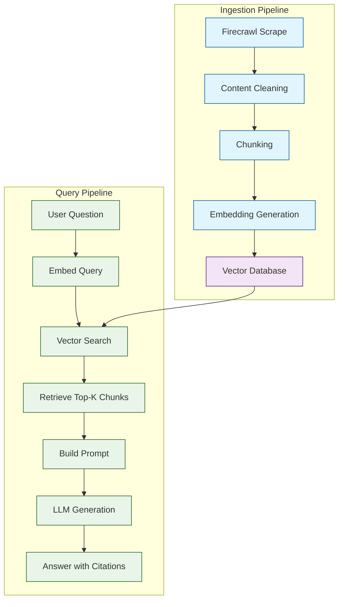
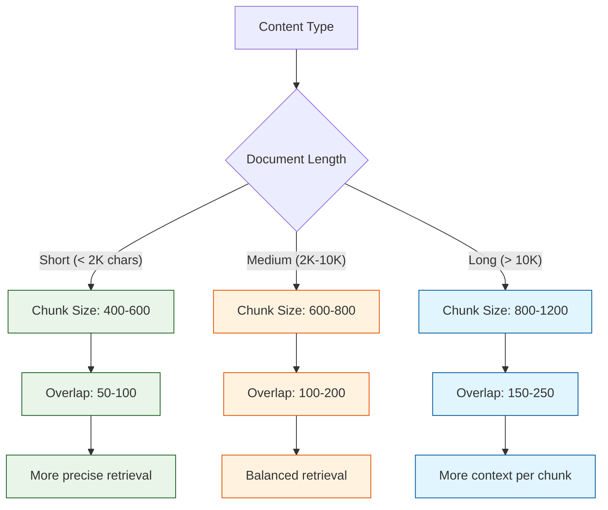

# Chapter 6: Building RAG Systems

Retrieval-Augmented Generation (RAG) is the most impactful application of web scraping for AI. Instead of relying solely on an LLM's training data, RAG retrieves relevant content from your scraped corpus and injects it into the prompt -- giving the model up-to-date, domain-specific knowledge without fine-tuning.

In this chapter you will build a complete RAG pipeline: scrape websites with Firecrawl, chunk content intelligently, generate embeddings, store them in a vector database, and build a question-answering system that grounds its answers in your scraped data.

## What You Will Learn

| Skill | Description |
|-------|-------------|
| Chunking strategies | Split documents into optimal segments for retrieval |
| Embedding generation | Convert text chunks into vector representations |
| Vector storage | Store and query embeddings in ChromaDB and Pinecone |
| Retrieval pipeline | Find the most relevant chunks for a given query |
| RAG prompting | Construct prompts that use retrieved context effectively |
| Evaluation | Measure retrieval quality, latency, and cost |

## RAG Architecture Overview



## Step 1: Scrape and Clean Content

Start by scraping a documentation site or knowledge base with Firecrawl, then clean it using the pipeline from [Chapter 5](05-content-cleaning.md).

### Python

```python
from firecrawl import FirecrawlApp

app = FirecrawlApp(api_key="YOUR_KEY")

# Crawl a documentation site
crawl_result = app.crawl_url(
    "https://docs.example.com",
    params={
        "limit": 50,
        "maxDepth": 3,
        "includePaths": ["/docs/*", "/guides/*"],
        "excludePaths": ["/docs/api-ref/*"],  # Skip auto-generated API refs
    },
    poll_interval=5,
)

# Collect cleaned documents
documents = []
for page in crawl_result:
    if page.get("markdown") and len(page["markdown"]) > 200:
        documents.append({
            "content": page["markdown"],
            "url": page["metadata"]["sourceURL"],
            "title": page["metadata"].get("title", "Untitled"),
        })

print(f"Collected {len(documents)} documents for RAG pipeline")
```

### TypeScript

```typescript
import FirecrawlApp from "@mendable/firecrawl-js";

const app = new FirecrawlApp({ apiKey: process.env.FIRECRAWL_API_KEY });

const crawlResult = await app.crawlUrl("https://docs.example.com", {
  limit: 50,
  maxDepth: 3,
  includePaths: ["/docs/*", "/guides/*"],
});

const documents = crawlResult
  .filter((page) => page.markdown && page.markdown.length > 200)
  .map((page) => ({
    content: page.markdown!,
    url: page.metadata?.sourceURL || "",
    title: page.metadata?.title || "Untitled",
  }));

console.log(`Collected ${documents.length} documents for RAG pipeline`);
```

## Step 2: Chunking Strategies

Chunking determines how well your RAG system retrieves relevant information. Chunks that are too large dilute relevance; chunks that are too small lose context.

### Chunking Strategy Comparison

| Strategy | Chunk Size | Overlap | Best For | Weakness |
|----------|-----------|---------|----------|----------|
| Fixed-size | 500-1000 chars | 100-200 chars | Simple implementation | May split mid-sentence |
| Recursive character | 500-1000 chars | 100-200 chars | General use | Slightly better boundaries |
| Markdown-aware | Varies by section | Section headers preserved | Documentation | Uneven chunk sizes |
| Semantic | Varies | Based on topic shifts | Diverse content | Requires additional model |

### Recursive Character Splitting (Recommended)

```python
from langchain.text_splitter import RecursiveCharacterTextSplitter

def chunk_document(content: str, chunk_size: int = 800, chunk_overlap: int = 150):
    """Split a document into overlapping chunks."""
    splitter = RecursiveCharacterTextSplitter(
        chunk_size=chunk_size,
        chunk_overlap=chunk_overlap,
        separators=["\n\n", "\n", ". ", " "],
        length_function=len,
    )
    return splitter.split_text(content)

# Chunk all documents
all_chunks = []
for doc in documents:
    chunks = chunk_document(doc["content"])
    for i, chunk in enumerate(chunks):
        all_chunks.append({
            "text": chunk,
            "metadata": {
                "source_url": doc["url"],
                "title": doc["title"],
                "chunk_index": i,
                "total_chunks": len(chunks),
            }
        })

print(f"Created {len(all_chunks)} chunks from {len(documents)} documents")
print(f"Average chunk size: {sum(len(c['text']) for c in all_chunks) // len(all_chunks)} chars")
```

### Markdown-Aware Splitting

For documentation sites, split on markdown headers to preserve section boundaries.

```python
from langchain.text_splitter import MarkdownHeaderTextSplitter

def chunk_markdown(content: str):
    """Split markdown by headers, preserving section structure."""
    headers_to_split = [
        ("#", "h1"),
        ("##", "h2"),
        ("###", "h3"),
    ]

    splitter = MarkdownHeaderTextSplitter(headers_to_split_on=headers_to_split)
    splits = splitter.split_text(content)

    # Further split large sections
    char_splitter = RecursiveCharacterTextSplitter(
        chunk_size=800,
        chunk_overlap=150,
    )

    final_chunks = []
    for split in splits:
        if len(split.page_content) > 1000:
            sub_chunks = char_splitter.split_text(split.page_content)
            for sub in sub_chunks:
                final_chunks.append({
                    "text": sub,
                    "headers": split.metadata,
                })
        else:
            final_chunks.append({
                "text": split.page_content,
                "headers": split.metadata,
            })

    return final_chunks
```

## Choosing Chunk Size



## Step 3: Generate Embeddings

Convert text chunks into vector representations using an embedding model. The embeddings capture semantic meaning, allowing you to find relevant chunks even when the query uses different words than the source text.

### Using sentence-transformers (Local)

```python
from sentence_transformers import SentenceTransformer

# Load a lightweight embedding model
model = SentenceTransformer("all-MiniLM-L6-v2")

# Generate embeddings for all chunks
texts = [chunk["text"] for chunk in all_chunks]
embeddings = model.encode(texts, show_progress_bar=True, batch_size=32)

print(f"Generated {len(embeddings)} embeddings")
print(f"Embedding dimension: {embeddings.shape[1]}")
```

### Using OpenAI Embeddings (Cloud)

```python
from openai import OpenAI

openai_client = OpenAI(api_key="YOUR_OPENAI_KEY")

def generate_openai_embeddings(texts: list, model: str = "text-embedding-3-small"):
    """Generate embeddings using OpenAI's API."""
    # Process in batches of 100
    all_embeddings = []
    for i in range(0, len(texts), 100):
        batch = texts[i:i+100]
        response = openai_client.embeddings.create(input=batch, model=model)
        batch_embeddings = [item.embedding for item in response.data]
        all_embeddings.extend(batch_embeddings)

    return all_embeddings

embeddings = generate_openai_embeddings(texts)
```

### Embedding Model Comparison

| Model | Dimensions | Speed | Quality | Cost |
|-------|-----------|-------|---------|------|
| `all-MiniLM-L6-v2` | 384 | Fast | Good | Free (local) |
| `all-mpnet-base-v2` | 768 | Medium | Better | Free (local) |
| `text-embedding-3-small` | 1536 | Fast (API) | Very good | $0.02/1M tokens |
| `text-embedding-3-large` | 3072 | Fast (API) | Best | $0.13/1M tokens |

## Step 4: Store in a Vector Database

### Using ChromaDB (Local)

```python
import chromadb

# Create a persistent ChromaDB client
chroma_client = chromadb.PersistentClient(path="./chroma_db")

# Create or get a collection
collection = chroma_client.get_or_create_collection(
    name="firecrawl-docs",
    metadata={"hnsw:space": "cosine"}  # Use cosine similarity
)

# Add chunks with embeddings and metadata
collection.add(
    ids=[f"chunk-{i}" for i in range(len(all_chunks))],
    documents=[chunk["text"] for chunk in all_chunks],
    embeddings=embeddings.tolist(),
    metadatas=[chunk["metadata"] for chunk in all_chunks],
)

print(f"Stored {collection.count()} chunks in ChromaDB")
```

### Using Pinecone (Cloud)

```python
from pinecone import Pinecone, ServerlessSpec

# Initialize Pinecone
pc = Pinecone(api_key="YOUR_PINECONE_KEY")

# Create an index
index_name = "firecrawl-docs"
if index_name not in pc.list_indexes().names():
    pc.create_index(
        name=index_name,
        dimension=384,  # Match your embedding model
        metric="cosine",
        spec=ServerlessSpec(cloud="aws", region="us-east-1"),
    )

index = pc.Index(index_name)

# Upsert vectors in batches
batch_size = 100
for i in range(0, len(all_chunks), batch_size):
    batch = []
    for j in range(i, min(i + batch_size, len(all_chunks))):
        batch.append({
            "id": f"chunk-{j}",
            "values": embeddings[j].tolist(),
            "metadata": {
                **all_chunks[j]["metadata"],
                "text": all_chunks[j]["text"][:1000],  # Store text preview
            }
        })
    index.upsert(vectors=batch)

print(f"Upserted {len(all_chunks)} vectors to Pinecone")
```

## Step 5: Build the Retrieval Pipeline

### Query and Retrieve (ChromaDB)

```python
def retrieve_context(query: str, n_results: int = 5) -> list:
    """Retrieve the most relevant chunks for a query."""
    # Embed the query
    query_embedding = model.encode([query]).tolist()

    # Search the vector database
    results = collection.query(
        query_embeddings=query_embedding,
        n_results=n_results,
        include=["documents", "metadatas", "distances"],
    )

    # Format results with metadata
    contexts = []
    for i in range(len(results["documents"][0])):
        contexts.append({
            "text": results["documents"][0][i],
            "source": results["metadatas"][0][i].get("source_url", ""),
            "title": results["metadatas"][0][i].get("title", ""),
            "relevance": 1 - results["distances"][0][i],  # Convert distance to similarity
        })

    return contexts

# Test retrieval
contexts = retrieve_context("How does Firecrawl handle JavaScript rendering?")
for ctx in contexts:
    print(f"[{ctx['relevance']:.2f}] {ctx['title']}")
    print(f"  {ctx['text'][:150]}...")
    print(f"  Source: {ctx['source']}")
    print()
```

## Step 6: Generate Answers with RAG

### Building the RAG Prompt

```python
from openai import OpenAI

openai_client = OpenAI(api_key="YOUR_OPENAI_KEY")

def build_rag_prompt(query: str, contexts: list) -> str:
    """Build a RAG prompt with retrieved context."""
    context_text = ""
    for i, ctx in enumerate(contexts, 1):
        context_text += f"\n--- Source {i}: {ctx['title']} ---\n"
        context_text += f"URL: {ctx['source']}\n"
        context_text += ctx["text"] + "\n"

    return f"""Answer the following question based on the provided context.
If the context does not contain enough information to answer fully,
say so and provide what you can.

Always cite the source URL when referencing specific information.

Context:
{context_text}

Question: {query}

Answer:"""


def ask_rag(query: str, n_results: int = 5) -> dict:
    """Complete RAG pipeline: retrieve context and generate answer."""
    # Step 1: Retrieve relevant chunks
    contexts = retrieve_context(query, n_results=n_results)

    # Step 2: Build prompt
    prompt = build_rag_prompt(query, contexts)

    # Step 3: Generate answer
    response = openai_client.chat.completions.create(
        model="gpt-4o-mini",
        messages=[
            {"role": "system", "content": "You are a helpful technical assistant. "
                                           "Answer questions using the provided context. "
                                           "Always cite sources."},
            {"role": "user", "content": prompt},
        ],
        temperature=0.2,
        max_tokens=1000,
    )

    answer = response.choices[0].message.content
    tokens_used = response.usage.total_tokens

    return {
        "query": query,
        "answer": answer,
        "sources": [ctx["source"] for ctx in contexts],
        "tokens_used": tokens_used,
    }

# Ask a question
result = ask_rag("How do I scrape a JavaScript-rendered website with Firecrawl?")
print("Answer:", result["answer"])
print(f"\nSources: {', '.join(result['sources'])}")
print(f"Tokens used: {result['tokens_used']}")
```

### TypeScript RAG Implementation

```typescript
import { OpenAI } from "openai";

const openai = new OpenAI({ apiKey: process.env.OPENAI_API_KEY });

async function askRAG(query: string, nResults = 5): Promise<{
  answer: string;
  sources: string[];
}> {
  // Retrieve relevant chunks (using your vector DB client)
  const contexts = await retrieveContext(query, nResults);

  // Build context string
  const contextText = contexts
    .map((ctx, i) => `--- Source ${i + 1}: ${ctx.title} ---\nURL: ${ctx.source}\n${ctx.text}`)
    .join("\n\n");

  // Generate answer
  const response = await openai.chat.completions.create({
    model: "gpt-4o-mini",
    messages: [
      { role: "system", content: "Answer using the provided context. Cite sources." },
      { role: "user", content: `Context:\n${contextText}\n\nQuestion: ${query}` },
    ],
    temperature: 0.2,
  });

  return {
    answer: response.choices[0].message.content || "",
    sources: contexts.map((ctx) => ctx.source),
  };
}
```

## Keeping the Knowledge Base Fresh

Web content changes frequently. Build an update pipeline that re-scrapes and re-indexes content on a schedule.

```python
import hashlib
from datetime import datetime

class RAGUpdater:
    """Keep the RAG knowledge base up to date."""

    def __init__(self, app, collection, embed_model):
        self.app = app
        self.collection = collection
        self.embed_model = embed_model
        self.content_hashes = {}  # URL -> content hash

    def update(self, urls: list):
        """Re-scrape URLs and update only changed content."""
        updated = 0
        unchanged = 0

        for url in urls:
            try:
                result = self.app.scrape_url(url, params={
                    "formats": ["markdown"],
                    "onlyMainContent": True,
                })

                content = result.get("markdown", "")
                content_hash = hashlib.sha256(content.encode()).hexdigest()

                # Skip if content has not changed
                if self.content_hashes.get(url) == content_hash:
                    unchanged += 1
                    continue

                # Re-chunk and re-embed
                chunks = chunk_document(content)
                embeddings = self.embed_model.encode(chunks)

                # Update vector database
                ids = [f"{url}-{i}" for i in range(len(chunks))]
                self.collection.upsert(
                    ids=ids,
                    documents=chunks,
                    embeddings=embeddings.tolist(),
                    metadatas=[{"source_url": url, "updated_at": datetime.utcnow().isoformat()}] * len(chunks),
                )

                self.content_hashes[url] = content_hash
                updated += 1

            except Exception as exc:
                print(f"Error updating {url}: {exc}")

        print(f"Updated: {updated}, Unchanged: {unchanged}")
```

## Evaluation and Metrics

```mermaid
flowchart LR
    A[RAG Pipeline] --> B[Retrieval Metrics]
    A --> C[Generation Metrics]
    A --> D[System Metrics]

    B --> B1[Precision@K]
    B --> B2[Recall@K]
    B --> B3[MRR]

    C --> C1[Faithfulness]
    C --> C2[Relevance]
    C --> C3[Completeness]

    D --> D1[Latency]
    D --> D2[Tokens/Query]
    D --> D3[Cost/Query]

    classDef metric fill:#e8f5e8,stroke:#1b5e20
    class B1,B2,B3,C1,C2,C3,D1,D2,D3 metric
```

| Metric | What It Measures | Target |
|--------|-----------------|--------|
| Retrieval precision@5 | % of retrieved chunks that are relevant | > 60% |
| Answer faithfulness | Does the answer stay grounded in context? | > 90% |
| End-to-end latency | Total time from query to answer | < 3 seconds |
| Tokens per query | Total tokens used (embedding + generation) | < 2000 |
| Cost per query | Dollar cost per question answered | < $0.01 |

```python
def evaluate_retrieval(query: str, expected_urls: list, n_results: int = 5) -> dict:
    """Evaluate retrieval quality for a test query."""
    contexts = retrieve_context(query, n_results=n_results)
    retrieved_urls = [ctx["source"] for ctx in contexts]

    # Precision: what fraction of retrieved results are relevant?
    relevant_retrieved = len(set(retrieved_urls) & set(expected_urls))
    precision = relevant_retrieved / n_results if n_results > 0 else 0

    # Recall: what fraction of relevant results were retrieved?
    recall = relevant_retrieved / len(expected_urls) if expected_urls else 0

    return {
        "query": query,
        "precision": round(precision, 2),
        "recall": round(recall, 2),
        "retrieved": retrieved_urls,
        "expected": expected_urls,
    }
```

## Troubleshooting

| Problem | Possible Cause | Solution |
|---------|---------------|----------|
| Low retrieval relevance | Chunks too large or too small | Experiment with chunk sizes (400-1200 chars) |
| Hallucinated answers | Insufficient context | Increase `n_results` or improve chunking |
| Slow queries | Large embedding dimension | Use a smaller model or add an HNSW index |
| Outdated answers | Stale content in vector DB | Set up periodic re-scraping with `RAGUpdater` |
| High cost per query | Too many tokens | Reduce `n_results` or use a cheaper LLM |
| Duplicate results | Same content in multiple chunks | Improve deduplication (see [Chapter 5](05-content-cleaning.md)) |

## Performance Tips

- **Pre-compute embeddings** offline in batches rather than one-by-one at query time.
- **Use smaller embedding models** (384 dimensions) unless you need maximum quality.
- **Cache frequent queries** -- if the same question is asked often, cache the answer.
- **Persist vector stores** to disk (ChromaDB) or use a managed service (Pinecone, Weaviate) to avoid re-indexing.
- **Batch embedding generation** -- encode 32-64 texts at a time for GPU efficiency.

## Security Notes

- **Filter sensitive content** before embedding -- do not store PII in your vector database.
- **Respect copyright** for stored content -- ensure your use complies with the source site's terms.
- **Secure API keys** -- never expose OpenAI, Pinecone, or Firecrawl keys in client-side code.
- **Audit retrieved context** -- log what context was used for each answer to enable traceability.

## Summary

You have built a complete RAG pipeline: scraping content with Firecrawl, chunking it intelligently, generating embeddings, storing them in a vector database, and generating grounded answers. This architecture gives your LLM access to up-to-date, domain-specific knowledge without the cost and complexity of fine-tuning.

## Key Takeaways

1. **Chunking is the most impactful parameter** in a RAG system -- experiment with sizes between 400-1200 characters with 10-20% overlap.
2. **Recursive character splitting** works well for most content; use markdown-aware splitting for documentation sites.
3. **ChromaDB** is ideal for local development; **Pinecone** or **Weaviate** for production deployments.
4. **Always cite sources** in RAG answers to enable verification and build trust.
5. **Keep your knowledge base fresh** with periodic re-scraping and content-hash-based update detection.

## Next Steps

Your RAG pipeline works. Now you need to scale it. In [Chapter 7: Scaling & Performance](07-scaling-performance.md), you will learn how to distribute scraping jobs across workers, optimize concurrency, add caching layers, and handle thousands of pages without hitting rate limits.

---

*Built with insights from the [Firecrawl](https://github.com/mendableai/firecrawl) project.*
