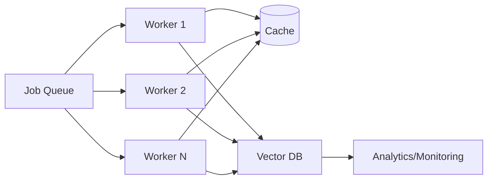

# Chapter 7: Scaling & Performance

Design a scalable scraping and processing architecture for large crawls.

## Objectives
- Distribute scraping jobs across workers
- Control concurrency and rate limits
- Add caching and retries at scale
- Monitor costs and performance

## Reference Architecture (Mermaid)


## Concurrency Control (Python)
```python
import asyncio
from firecrawl import Firecrawl

client = Firecrawl(api_key="YOUR_KEY")

async def bounded_scrape(urls, limit=5):
    sem = asyncio.Semaphore(limit)
    results = []

    async def scrape(url):
        async with sem:
            return await client.scrape(url, output="json")

    coros = [scrape(u) for u in urls]
    for coro in asyncio.as_completed(coros):
        results.append(await coro)
    return results
```

## Caching Strategies
- URL fingerprinting to skip duplicates
- Store cleaned Markdown; re-embed only on content change
- Use ETag/Last-Modified when available

## Monitoring & Alerts
- Track success/error rates per domain
- Monitor p95 latency and throughput
- Alert on spike in 429/403 responses

## Cost Controls
- Cap rendered-page scrapes; prefer raw fetch when possible
- Batch embedding jobs; choose smaller embedding models when acceptable

## Troubleshooting
- Throttling: reduce concurrency per domain; add jitter
- Timeouts: increase timeouts only when needed; log slow domains
- Memory pressure: stream processing; avoid large in-memory buffers

## Security Notes
- Respect crawl-delay directives
- Isolate worker credentials; least privilege

## Next Steps
Finish with Chapter 8 to package and deploy the system to production.
