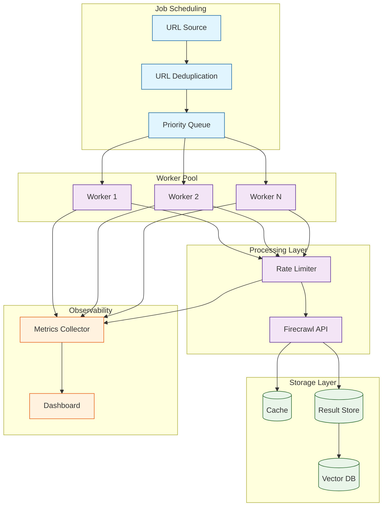
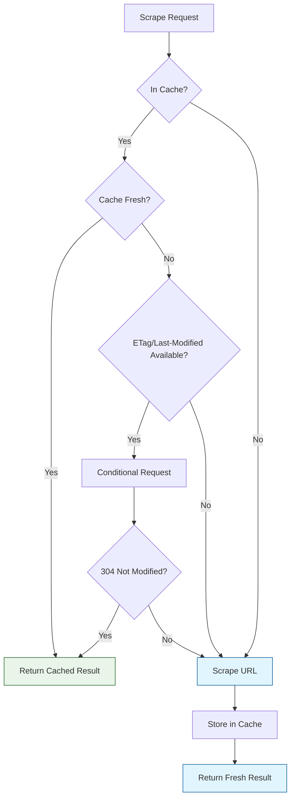
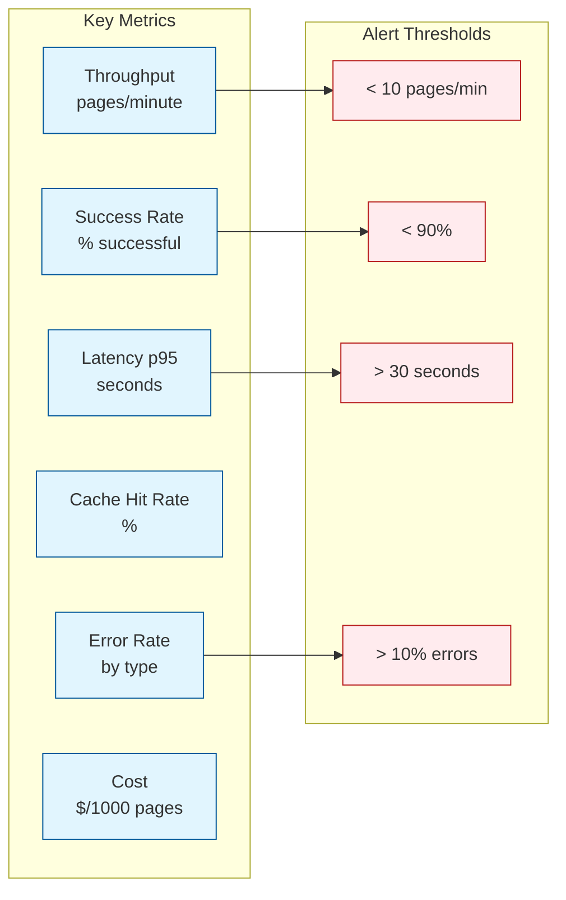

# Chapter 7: Scaling & Performance

Scraping ten pages is easy. Scraping ten thousand pages -- reliably, efficiently, and without getting blocked -- requires a fundamentally different approach. This chapter covers the architecture and engineering practices needed to scale Firecrawl-based scraping and RAG pipelines from prototype to production.

You will learn how to distribute work across multiple workers, control concurrency and rate limits, build intelligent caching layers, implement job queues, and monitor performance to identify bottlenecks before they become outages.

## What You Will Learn

| Skill | Description |
|-------|-------------|
| Distributed architecture | Design a scalable scraping system with workers and queues |
| Concurrency control | Manage parallel requests without overwhelming targets |
| Job queues | Distribute and track scraping jobs reliably |
| Caching strategies | Avoid redundant scrapes with smart caching |
| Rate limit management | Stay within API and target site limits |
| Monitoring | Track throughput, latency, errors, and costs |
| Cost optimization | Minimize API and compute costs at scale |

## Scaling Architecture

A production scraping system separates job scheduling, execution, caching, and storage into independent components that can scale independently.



## Concurrency Control

The most important scaling parameter is concurrency -- how many requests you send simultaneously. Too few and you waste time. Too many and you get rate-limited or blocked.

### Bounded Concurrency with asyncio (Python)

```python
import asyncio
import time
from firecrawl import FirecrawlApp

app = FirecrawlApp(api_key="YOUR_KEY")

async def bounded_scrape(urls: list, concurrency: int = 5, delay: float = 0.5):
    """Scrape URLs with bounded concurrency and per-request delay."""
    semaphore = asyncio.Semaphore(concurrency)
    results = []
    errors = []

    async def scrape_one(url: str):
        async with semaphore:
            try:
                result = app.scrape_url(url, params={
                    "formats": ["markdown"],
                    "onlyMainContent": True,
                })
                results.append({"url": url, "content": result["markdown"]})
            except Exception as exc:
                errors.append({"url": url, "error": str(exc)})
            finally:
                await asyncio.sleep(delay)  # Polite delay

    tasks = [scrape_one(url) for url in urls]
    await asyncio.gather(*tasks)

    return results, errors

# Scrape 100 URLs with 5 concurrent workers
urls = [f"https://example.com/page/{i}" for i in range(100)]
results, errors = asyncio.run(bounded_scrape(urls, concurrency=5, delay=0.5))
print(f"Success: {len(results)}, Failed: {len(errors)}")
```

### Bounded Concurrency with p-limit (TypeScript)

```typescript
import FirecrawlApp from "@mendable/firecrawl-js";

const app = new FirecrawlApp({ apiKey: process.env.FIRECRAWL_API_KEY });

async function boundedScrape(
  urls: string[],
  concurrency = 5,
  delayMs = 500
): Promise<{ results: any[]; errors: any[] }> {
  const results: any[] = [];
  const errors: any[] = [];
  let running = 0;

  const queue = [...urls];

  async function processNext(): Promise<void> {
    if (queue.length === 0) return;
    const url = queue.shift()!;
    running++;

    try {
      const result = await app.scrapeUrl(url, {
        formats: ["markdown"],
        onlyMainContent: true,
      });
      results.push({ url, content: result.markdown });
    } catch (err) {
      errors.push({ url, error: String(err) });
    } finally {
      running--;
      await new Promise((r) => setTimeout(r, delayMs));
      await processNext();
    }
  }

  // Start workers up to concurrency limit
  const workers = Array(Math.min(concurrency, urls.length))
    .fill(null)
    .map(() => processNext());

  await Promise.all(workers);
  return { results, errors };
}

const { results, errors } = await boundedScrape(urls, 5, 500);
console.log(`Success: ${results.length}, Failed: ${errors.length}`);
```

### Concurrency Guidelines

| Scenario | Recommended Concurrency | Delay Between Requests |
|----------|------------------------|----------------------|
| Single domain, polite | 2-3 | 1-2 seconds |
| Single domain, aggressive | 5-10 | 0.5-1 second |
| Multiple domains | 10-20 (2-3 per domain) | 0.5 seconds |
| Firecrawl cloud API | Based on plan limits | Per plan guidelines |
| Self-hosted Firecrawl | Based on server capacity | Based on load testing |

## Job Queue Architecture

For large-scale scraping, use a job queue to decouple URL discovery from scraping. This provides reliability (jobs survive crashes), scalability (add more workers), and observability (track progress).

### Using Redis as a Job Queue (Python)

```python
import json
import redis
from datetime import datetime

class ScrapeJobQueue:
    """Redis-backed job queue for scraping tasks."""

    def __init__(self, redis_url: str = "redis://localhost:6379"):
        self.redis = redis.from_url(redis_url)
        self.queue_key = "scrape:pending"
        self.processing_key = "scrape:processing"
        self.completed_key = "scrape:completed"
        self.failed_key = "scrape:failed"

    def enqueue(self, urls: list, priority: int = 0):
        """Add URLs to the scrape queue."""
        for url in urls:
            job = json.dumps({
                "url": url,
                "priority": priority,
                "enqueued_at": datetime.utcnow().isoformat(),
                "attempts": 0,
            })
            self.redis.zadd(self.queue_key, {job: priority})
        print(f"Enqueued {len(urls)} URLs")

    def dequeue(self) -> dict:
        """Get the next URL to scrape (highest priority first)."""
        result = self.redis.zpopmax(self.queue_key, 1)
        if not result:
            return None
        job_data, score = result[0]
        job = json.loads(job_data)
        self.redis.sadd(self.processing_key, job_data)
        return job

    def complete(self, job: dict, result: dict):
        """Mark a job as completed."""
        job_data = json.dumps(job)
        self.redis.srem(self.processing_key, job_data)
        self.redis.hset(self.completed_key, job["url"], json.dumps({
            "result": result,
            "completed_at": datetime.utcnow().isoformat(),
        }))

    def fail(self, job: dict, error: str):
        """Mark a job as failed."""
        job_data = json.dumps(job)
        self.redis.srem(self.processing_key, job_data)
        job["attempts"] += 1
        job["last_error"] = error

        if job["attempts"] < 3:
            # Retry with lower priority
            retry_data = json.dumps(job)
            self.redis.zadd(self.queue_key, {retry_data: job["priority"] - 1})
        else:
            self.redis.hset(self.failed_key, job["url"], json.dumps(job))

    def stats(self) -> dict:
        """Get queue statistics."""
        return {
            "pending": self.redis.zcard(self.queue_key),
            "processing": self.redis.scard(self.processing_key),
            "completed": self.redis.hlen(self.completed_key),
            "failed": self.redis.hlen(self.failed_key),
        }
```

### Worker Process

```python
import time
from firecrawl import FirecrawlApp

def run_worker(queue: ScrapeJobQueue, app: FirecrawlApp, worker_id: int):
    """Run a scraping worker that processes jobs from the queue."""
    print(f"Worker {worker_id} started")

    while True:
        job = queue.dequeue()
        if job is None:
            time.sleep(1)  # No jobs available, wait
            continue

        url = job["url"]
        print(f"Worker {worker_id}: scraping {url}")

        try:
            result = app.scrape_url(url, params={
                "formats": ["markdown"],
                "onlyMainContent": True,
                "timeout": 30000,
            })

            queue.complete(job, {
                "content_length": len(result.get("markdown", "")),
                "title": result.get("metadata", {}).get("title", ""),
            })
            print(f"Worker {worker_id}: completed {url}")

        except Exception as exc:
            queue.fail(job, str(exc))
            print(f"Worker {worker_id}: failed {url}: {exc}")

        time.sleep(0.5)  # Polite delay between jobs

# Run multiple workers
queue = ScrapeJobQueue()
app = FirecrawlApp(api_key="YOUR_KEY")

# In production, run workers as separate processes
# For development:
run_worker(queue, app, worker_id=1)
```

## Caching Strategies

Caching prevents redundant scrapes, reduces API costs, and speeds up re-runs. Choose the right cache strategy based on your content freshness requirements.



### File-Based Cache (Simple)

```python
import json
import hashlib
import time
from pathlib import Path

class FileCache:
    """Simple file-based cache for scrape results."""

    def __init__(self, cache_dir: str = "./scrape_cache", ttl_hours: int = 24):
        self.cache_dir = Path(cache_dir)
        self.cache_dir.mkdir(parents=True, exist_ok=True)
        self.ttl_seconds = ttl_hours * 3600

    def _key(self, url: str) -> str:
        return hashlib.sha256(url.encode()).hexdigest()

    def get(self, url: str) -> dict:
        """Get cached result, or None if expired/missing."""
        path = self.cache_dir / f"{self._key(url)}.json"
        if not path.exists():
            return None

        with open(path) as f:
            cached = json.load(f)

        if time.time() - cached["timestamp"] > self.ttl_seconds:
            return None  # Expired

        return cached["data"]

    def set(self, url: str, data: dict):
        """Store a result in the cache."""
        path = self.cache_dir / f"{self._key(url)}.json"
        with open(path, "w") as f:
            json.dump({"url": url, "timestamp": time.time(), "data": data}, f)

    def stats(self) -> dict:
        """Get cache statistics."""
        files = list(self.cache_dir.glob("*.json"))
        total_size = sum(f.stat().st_size for f in files)
        return {
            "entries": len(files),
            "total_size_mb": round(total_size / 1_000_000, 2),
        }

# Usage with Firecrawl
cache = FileCache(ttl_hours=24)

def cached_scrape(app, url):
    """Scrape with caching."""
    cached = cache.get(url)
    if cached:
        print(f"Cache hit: {url}")
        return cached

    print(f"Cache miss: {url}")
    result = app.scrape_url(url, params={"formats": ["markdown"], "onlyMainContent": True})
    cache.set(url, result)
    return result
```

### Redis Cache (Production)

```python
import json
import redis

class RedisCache:
    """Redis-backed cache for scrape results."""

    def __init__(self, redis_url: str = "redis://localhost:6379", ttl_hours: int = 24):
        self.redis = redis.from_url(redis_url)
        self.ttl_seconds = ttl_hours * 3600
        self.prefix = "scrape_cache:"

    def get(self, url: str) -> dict:
        data = self.redis.get(f"{self.prefix}{url}")
        return json.loads(data) if data else None

    def set(self, url: str, data: dict):
        self.redis.setex(
            f"{self.prefix}{url}",
            self.ttl_seconds,
            json.dumps(data, default=str),
        )

    def invalidate(self, url: str):
        self.redis.delete(f"{self.prefix}{url}")
```

### Cache Strategy Comparison

| Strategy | Speed | Persistence | Shared Across Workers | Best For |
|----------|-------|-------------|----------------------|----------|
| In-memory dict | Fastest | No | No | Single-process scripts |
| File-based | Fast | Yes | No (unless NFS) | Small-scale, single machine |
| Redis | Fast | Yes | Yes | Multi-worker production |
| S3/GCS | Moderate | Yes | Yes | Long-term archival |

## Domain-Aware Rate Limiting

When scraping multiple domains, apply rate limits per domain rather than globally. This prevents you from overwhelming any single server while maintaining high overall throughput.

```python
import asyncio
import time
from collections import defaultdict
from urllib.parse import urlparse

class DomainRateLimiter:
    """Per-domain rate limiting for polite scraping."""

    def __init__(self, requests_per_second: float = 1.0, global_concurrency: int = 20):
        self.requests_per_second = requests_per_second
        self.min_interval = 1.0 / requests_per_second
        self.last_request_time = defaultdict(float)
        self.domain_locks = defaultdict(asyncio.Lock)
        self.global_semaphore = asyncio.Semaphore(global_concurrency)

    def _get_domain(self, url: str) -> str:
        return urlparse(url).netloc

    async def acquire(self, url: str):
        """Wait until it is safe to make a request to this domain."""
        domain = self._get_domain(url)

        async with self.global_semaphore:
            async with self.domain_locks[domain]:
                elapsed = time.time() - self.last_request_time[domain]
                if elapsed < self.min_interval:
                    await asyncio.sleep(self.min_interval - elapsed)
                self.last_request_time[domain] = time.time()

# Usage
limiter = DomainRateLimiter(requests_per_second=2, global_concurrency=10)

async def polite_scrape(app, urls):
    """Scrape with domain-aware rate limiting."""
    results = []

    async def scrape_one(url):
        await limiter.acquire(url)
        result = app.scrape_url(url, params={"formats": ["markdown"]})
        results.append({"url": url, "content": result["markdown"]})

    tasks = [scrape_one(url) for url in urls]
    await asyncio.gather(*tasks, return_exceptions=True)
    return results
```

## URL Deduplication and Prioritization

Before scraping, deduplicate and prioritize URLs to maximize the value of every API call.

```python
from urllib.parse import urlparse, urlunparse, parse_qs, urlencode

def normalize_url(url: str) -> str:
    """Normalize a URL for deduplication."""
    parsed = urlparse(url.lower().strip())

    # Remove trailing slashes
    path = parsed.path.rstrip("/") or "/"

    # Sort query parameters
    query = urlencode(sorted(parse_qs(parsed.query).items()))

    # Remove fragments
    return urlunparse((parsed.scheme, parsed.netloc, path, "", query, ""))


def deduplicate_urls(urls: list) -> list:
    """Deduplicate and normalize a list of URLs."""
    seen = set()
    unique = []
    for url in urls:
        normalized = normalize_url(url)
        if normalized not in seen:
            seen.add(normalized)
            unique.append(url)  # Keep original URL

    print(f"Deduplicated: {len(urls)} -> {len(unique)} URLs")
    return unique


def prioritize_urls(urls: list, priority_patterns: dict) -> list:
    """Sort URLs by priority based on path patterns."""
    def get_priority(url):
        for pattern, priority in priority_patterns.items():
            if pattern in url:
                return priority
        return 0

    return sorted(urls, key=get_priority, reverse=True)

# Usage
urls = deduplicate_urls(raw_urls)
urls = prioritize_urls(urls, {
    "/docs/": 10,       # Documentation is highest priority
    "/blog/": 5,        # Blog posts are medium priority
    "/about": 1,        # About pages are low priority
})
```

## Monitoring and Observability

Track key metrics to understand your scraping system's health and performance.



### Metrics Collector

```python
import time
from collections import defaultdict
from dataclasses import dataclass, field

@dataclass
class ScrapeMetrics:
    """Collect and report scraping metrics."""
    total_requests: int = 0
    successful: int = 0
    failed: int = 0
    cache_hits: int = 0
    total_latency: float = 0.0
    latencies: list = field(default_factory=list)
    errors_by_type: dict = field(default_factory=lambda: defaultdict(int))
    start_time: float = field(default_factory=time.time)

    def record_success(self, latency: float):
        self.total_requests += 1
        self.successful += 1
        self.total_latency += latency
        self.latencies.append(latency)

    def record_failure(self, error_type: str):
        self.total_requests += 1
        self.failed += 1
        self.errors_by_type[error_type] += 1

    def record_cache_hit(self):
        self.total_requests += 1
        self.cache_hits += 1

    def report(self) -> dict:
        elapsed = time.time() - self.start_time
        sorted_latencies = sorted(self.latencies)
        p95_idx = int(len(sorted_latencies) * 0.95)

        return {
            "total_requests": self.total_requests,
            "success_rate": round(self.successful / max(self.total_requests, 1) * 100, 1),
            "cache_hit_rate": round(self.cache_hits / max(self.total_requests, 1) * 100, 1),
            "throughput_per_min": round(self.total_requests / max(elapsed / 60, 1), 1),
            "avg_latency_s": round(self.total_latency / max(self.successful, 1), 2),
            "p95_latency_s": round(sorted_latencies[p95_idx], 2) if sorted_latencies else 0,
            "errors": dict(self.errors_by_type),
            "elapsed_minutes": round(elapsed / 60, 1),
        }

# Usage
metrics = ScrapeMetrics()

start = time.time()
try:
    result = app.scrape_url(url, params={"formats": ["markdown"]})
    metrics.record_success(time.time() - start)
except Exception as exc:
    metrics.record_failure(type(exc).__name__)

# Print periodic report
print(json.dumps(metrics.report(), indent=2))
```

## Cost Optimization

At scale, Firecrawl API costs and compute costs add up. Use these strategies to minimize spend.

| Strategy | Savings | Implementation Effort |
|----------|---------|----------------------|
| Cache results aggressively | 30-60% fewer API calls | Low |
| Use `onlyMainContent` | Faster processing, less storage | Low |
| Prefer raw scrapes over rendered | 5-10x cheaper per page | Low |
| Batch similar domains | Better rate limit utilization | Medium |
| Deduplicate URLs before scraping | Variable, depends on duplication | Low |
| Use smaller embedding models | 5-10x cheaper embeddings | Low |
| Skip low-quality pages early | Variable | Medium |

```python
def estimate_scraping_cost(url_count: int, rendered_pct: float = 0.2):
    """Estimate the cost of a scraping job."""
    raw_cost_per_page = 0.001     # Approximate raw scrape cost
    rendered_cost_per_page = 0.005  # Approximate rendered scrape cost

    raw_pages = int(url_count * (1 - rendered_pct))
    rendered_pages = int(url_count * rendered_pct)

    raw_cost = raw_pages * raw_cost_per_page
    rendered_cost = rendered_pages * rendered_cost_per_page
    total = raw_cost + rendered_cost

    print(f"Estimated cost for {url_count} pages:")
    print(f"  Raw scrapes ({raw_pages}): ${raw_cost:.2f}")
    print(f"  Rendered scrapes ({rendered_pages}): ${rendered_cost:.2f}")
    print(f"  Total: ${total:.2f}")
    return total

estimate_scraping_cost(10000, rendered_pct=0.3)
```

## Troubleshooting

| Problem | Possible Cause | Solution |
|---------|---------------|----------|
| Throughput too low | Concurrency too conservative | Increase semaphore limit gradually |
| 429 errors spike | Too many requests to one domain | Add per-domain rate limiting |
| Workers idle | Queue empty or stuck jobs | Check queue depth; clear stale processing jobs |
| Memory growing | Buffering too many results | Write results to disk/DB as they arrive |
| Cache hit rate low | TTL too short or URLs not normalized | Increase TTL; normalize URLs before cache lookup |
| Cost too high | Too many rendered scrapes | Identify which domains need JS and render only those |

## Performance Tips

- **Start with 3-5 concurrent workers** and increase based on error rates and throughput.
- **Profile before optimizing** -- measure where time is actually spent (network, parsing, embedding).
- **Use async I/O** for scraping since it is network-bound; use multiprocessing for CPU-bound cleaning.
- **Set aggressive timeouts** (15-30 seconds) so slow pages do not block your queue.
- **Log per-domain statistics** to identify which sites are slow, rate-limited, or error-prone.

## Security Notes

- **Isolate worker credentials** -- each worker should use the minimum required permissions.
- **Respect `crawl-delay`** directives in `robots.txt` -- these specify the minimum delay between requests.
- **Do not store API keys in code** -- use environment variables or a secrets manager.
- **Audit queue contents** -- ensure no malicious URLs are injected into your scrape queue.
- **Rate limit your own API** if you expose scraping results via an endpoint.

## Summary

Scaling a scraping system from tens to thousands of pages requires distributed architecture with job queues, bounded concurrency, smart caching, domain-aware rate limiting, and continuous monitoring. By applying these patterns, you can build a system that scrapes reliably at scale while staying within rate limits and budget.

## Key Takeaways

1. **Bounded concurrency** with semaphores prevents overwhelming target servers and your own infrastructure.
2. **Job queues** (Redis, RabbitMQ, SQS) decouple URL discovery from scraping, enabling reliable distributed processing.
3. **Caching** is the single most impactful cost optimization -- a 50% cache hit rate halves your API costs.
4. **Domain-aware rate limiting** lets you maximize throughput across many domains while being polite to each individual server.
5. **Monitor continuously** -- track throughput, success rate, latency, cache hit rate, and cost to catch problems early.

## Next Steps

Your scraping system can now handle thousands of pages reliably. In [Chapter 8: Production Deployment](08-production-deployment.md), you will learn how to containerize, deploy, secure, and operate this system in a production environment with proper CI/CD, observability, and disaster recovery.

---

*Built with insights from the [Firecrawl](https://github.com/mendableai/firecrawl) project.*
