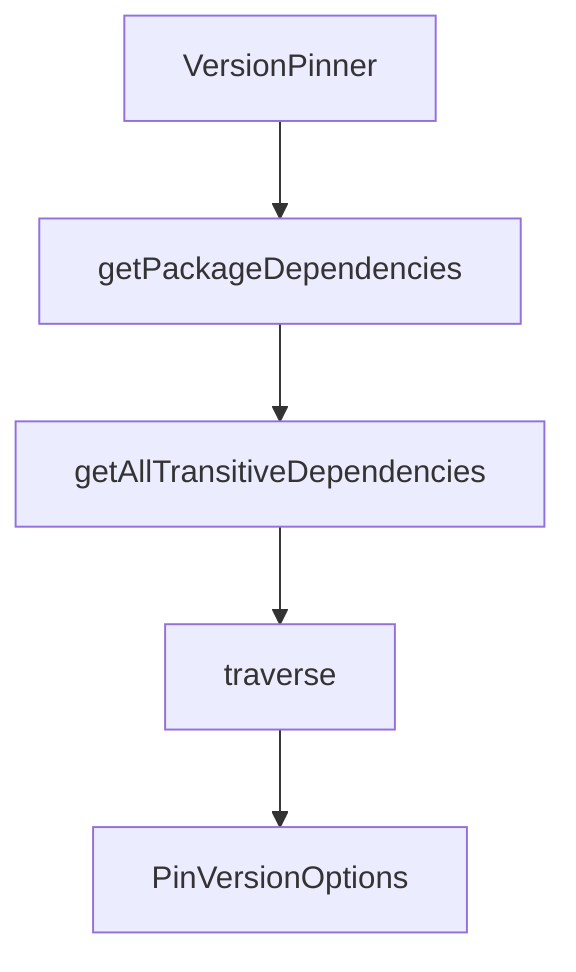

# Chapter 1: Getting Started

Welcome to **Chapter 1: Getting Started**. In this part of **Fireproof Tutorial: Local-First Document Database for AI-Native Apps**, you will build an intuitive mental model first, then move into concrete implementation details and practical production tradeoffs.


This chapter gets Fireproof running with both React-hook and core API entry points.

## Quick Start

```bash
npm install use-fireproof
```

Or core API only:

```bash
npm install @fireproof/core
```

## Minimal Core Example

```js
import { fireproof } from "@fireproof/core";

const db = fireproof("music-app");
await db.put({ _id: "beyonce", name: "Beyonce", hitSingles: 29 });
const doc = await db.get("beyonce");
```

## Learning Goals

- initialize a Fireproof database
- write and read documents
- confirm local-first behavior in your runtime

## Source References

- [Fireproof README: installation](https://github.com/fireproof-storage/fireproof/blob/main/README.md)

## Summary

You now have Fireproof running with a minimal document lifecycle.

Next: [Chapter 2: Core Document API and Query Lifecycle](02-core-document-api-and-query-lifecycle.md)

## Depth Expansion Playbook

## Source Code Walkthrough

### `cli/version-pinner.ts`

The `VersionPinner` class in [`cli/version-pinner.ts`](https://github.com/fireproof-storage/fireproof/blob/HEAD/cli/version-pinner.ts) handles a key part of this chapter's functionality:

```ts
}

export class VersionPinner {
  private allDeps: Record<string, string> = {};

  private constructor(allDeps: Record<string, string>) {
    this.allDeps = allDeps;
  }

  /**
   * Helper function to pin dependencies
   */
  private pinDependencies(
    deps: Record<string, string> | undefined,
    workspaceVersion: string,
    _3rdPartyVersionModifier: "~" | "^" | "" | undefined,
  ): Record<string, string> {
    const pinnedDeps: Record<string, string> = {};

    if (!deps) {
      return pinnedDeps;
    }

    for (const [name, version] of Object.entries(deps)) {
      // Check if version is not pinned (starts with ^ or ~ or *)
      // Note: Also catch malformed versions like "1-beta" that should be resolved from lockfile
      if (version.startsWith("workspace:")) {
        // Replace workspace dependencies with the workspace version
        pinnedDeps[name] = workspaceVersion;
      } else {
        // Look up the exact version in lockfile
        if (this.allDeps[name]) {
```

This class is important because it defines how Fireproof Tutorial: Local-First Document Database for AI-Native Apps implements the patterns covered in this chapter.

### `cli/version-pinner.ts`

The `getPackageDependencies` function in [`cli/version-pinner.ts`](https://github.com/fireproof-storage/fireproof/blob/HEAD/cli/version-pinner.ts) handles a key part of this chapter's functionality:

```ts
 * @returns Package dependencies information or null if not found
 */
export async function getPackageDependencies(packageName: string, lockfilePath: string): Promise<PackageDependencies | null> {
  const projectDir = lockfilePath.replace(/\/[^/]+$/, "");
  const lockfile = await readWantedLockfile(projectDir, { ignoreIncompatible: false });

  if (!lockfile?.packages) {
    throw new Error(`No lockfile found at ${lockfilePath}`);
  }

  // Find the package in the lockfile
  // Key format examples:
  // - "/@adviser/cement@0.5.2"
  // - "/@adviser/cement@0.5.2(typescript@5.9.3)"
  for (const [key, pkgInfo] of Object.entries(lockfile.packages)) {
    const match = key.match(/^\/?(@?[^@]+)@(.+?)(?:\(|$)/);
    if (match) {
      const [, name, version] = match;
      if (name === packageName) {
        return {
          name,
          version,
          dependencies: pkgInfo.dependencies || {},
          peerDependencies: pkgInfo.peerDependencies || {},
          transitivePeerDependencies: pkgInfo.transitivePeerDependencies || [],
        };
      }
    }
  }

  return null;
}
```

This function is important because it defines how Fireproof Tutorial: Local-First Document Database for AI-Native Apps implements the patterns covered in this chapter.

### `cli/version-pinner.ts`

The `getAllTransitiveDependencies` function in [`cli/version-pinner.ts`](https://github.com/fireproof-storage/fireproof/blob/HEAD/cli/version-pinner.ts) handles a key part of this chapter's functionality:

```ts
 * @returns Map of package name to version
 */
export async function getAllTransitiveDependencies(
  packageName: string,
  lockfilePath: string,
  depth = Infinity,
): Promise<Map<string, string>> {
  const result = new Map<string, string>();
  const visited = new Set<string>();

  async function traverse(pkgName: string, currentDepth: number) {
    if (currentDepth > depth || visited.has(pkgName)) {
      return;
    }
    visited.add(pkgName);

    const pkgInfo = await getPackageDependencies(pkgName, lockfilePath);
    if (!pkgInfo) {
      return;
    }

    result.set(pkgName, pkgInfo.version);

    // Traverse dependencies
    for (const [depName] of Object.entries(pkgInfo.dependencies)) {
      await traverse(depName, currentDepth + 1);
    }
  }

  await traverse(packageName, 0);
  return result;
}
```

This function is important because it defines how Fireproof Tutorial: Local-First Document Database for AI-Native Apps implements the patterns covered in this chapter.

### `cli/version-pinner.ts`

The `traverse` function in [`cli/version-pinner.ts`](https://github.com/fireproof-storage/fireproof/blob/HEAD/cli/version-pinner.ts) handles a key part of this chapter's functionality:

```ts
 * @param packageName - Name of the package
 * @param lockfilePath - Path to the directory containing pnpm-lock.yaml
 * @param depth - Maximum depth to traverse (default: Infinity)
 * @returns Map of package name to version
 */
export async function getAllTransitiveDependencies(
  packageName: string,
  lockfilePath: string,
  depth = Infinity,
): Promise<Map<string, string>> {
  const result = new Map<string, string>();
  const visited = new Set<string>();

  async function traverse(pkgName: string, currentDepth: number) {
    if (currentDepth > depth || visited.has(pkgName)) {
      return;
    }
    visited.add(pkgName);

    const pkgInfo = await getPackageDependencies(pkgName, lockfilePath);
    if (!pkgInfo) {
      return;
    }

    result.set(pkgName, pkgInfo.version);

    // Traverse dependencies
    for (const [depName] of Object.entries(pkgInfo.dependencies)) {
      await traverse(depName, currentDepth + 1);
    }
  }

```

This function is important because it defines how Fireproof Tutorial: Local-First Document Database for AI-Native Apps implements the patterns covered in this chapter.


## How These Components Connect


