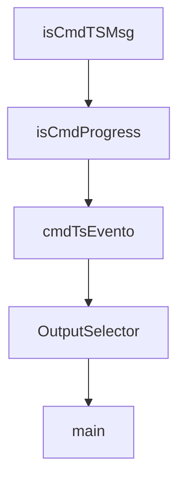

# Chapter 1: Getting Started

Welcome to **Chapter 1: Getting Started**. In this part of **Fireproof Tutorial: Local-First Document Database for AI-Native Apps**, you will build an intuitive mental model first, then move into concrete implementation details and practical production tradeoffs.


This chapter gets Fireproof running with both React-hook and core API entry points.

## Quick Start

```bash
npm install use-fireproof
```

Or core API only:

```bash
npm install @fireproof/core
```

## Minimal Core Example

```js
import { fireproof } from "@fireproof/core";

const db = fireproof("music-app");
await db.put({ _id: "beyonce", name: "Beyonce", hitSingles: 29 });
const doc = await db.get("beyonce");
```

## Learning Goals

- initialize a Fireproof database
- write and read documents
- confirm local-first behavior in your runtime

## Source References

- [Fireproof README: installation](https://github.com/fireproof-storage/fireproof/blob/main/README.md)

## Summary

You now have Fireproof running with a minimal document lifecycle.

Next: [Chapter 2: Core Document API and Query Lifecycle](02-core-document-api-and-query-lifecycle.md)

## Source Code Walkthrough

### `cli/cmd-evento.ts`

The `isCmdTSMsg` function in [`cli/cmd-evento.ts`](https://github.com/fireproof-storage/fireproof/blob/HEAD/cli/cmd-evento.ts) handles a key part of this chapter's functionality:

```ts
});
export type CmdTSMsg = typeof CmdTSMsg.infer;
export function isCmdTSMsg(u: unknown): u is CmdTSMsg {
  return !(CmdTSMsg(u) instanceof type.errors);
}
export type WrapCmdTSMsg<T> = Omit<CmdTSMsg, "result"> & { result: T };

export const CmdProgress = type({
  type: "'core-cli.progress'",
  level: "'info'|'warn'|'error'",
  message: "string",
});
export type CmdProgress = typeof CmdProgress.infer;

export function isCmdProgress(u: unknown): u is CmdProgress {
  return !(CmdProgress(u) instanceof type.errors);
}

export async function sendMsg<Q, S>(
  ctx: HandleTriggerCtx<WrapCmdTSMsg<unknown>, Q, S>,
  result: S,
): Promise<Result<EventoResultType>> {
  await ctx.send.send(ctx, {
    ...ctx.request,
    result,
  } satisfies WrapCmdTSMsg<S>);
  return Result.Ok(EventoResult.Continue);
}

export async function sendProgress<Q, S>(
  ctx: HandleTriggerCtx<WrapCmdTSMsg<unknown>, Q, S>,
  level: CmdProgress["level"],
```

This function is important because it defines how Fireproof Tutorial: Local-First Document Database for AI-Native Apps implements the patterns covered in this chapter.

### `cli/cmd-evento.ts`

The `isCmdProgress` function in [`cli/cmd-evento.ts`](https://github.com/fireproof-storage/fireproof/blob/HEAD/cli/cmd-evento.ts) handles a key part of this chapter's functionality:

```ts
export type CmdProgress = typeof CmdProgress.infer;

export function isCmdProgress(u: unknown): u is CmdProgress {
  return !(CmdProgress(u) instanceof type.errors);
}

export async function sendMsg<Q, S>(
  ctx: HandleTriggerCtx<WrapCmdTSMsg<unknown>, Q, S>,
  result: S,
): Promise<Result<EventoResultType>> {
  await ctx.send.send(ctx, {
    ...ctx.request,
    result,
  } satisfies WrapCmdTSMsg<S>);
  return Result.Ok(EventoResult.Continue);
}

export async function sendProgress<Q, S>(
  ctx: HandleTriggerCtx<WrapCmdTSMsg<unknown>, Q, S>,
  level: CmdProgress["level"],
  message: string,
): Promise<void> {
  await ctx.send.send(ctx, {
    ...ctx.request,
    result: {
      type: "core-cli.progress",
      level,
      message,
    } satisfies CmdProgress,
  } satisfies WrapCmdTSMsg<CmdProgress>);
}

```

This function is important because it defines how Fireproof Tutorial: Local-First Document Database for AI-Native Apps implements the patterns covered in this chapter.

### `cli/cmd-evento.ts`

The `cmdTsEvento` function in [`cli/cmd-evento.ts`](https://github.com/fireproof-storage/fireproof/blob/HEAD/cli/cmd-evento.ts) handles a key part of this chapter's functionality:

```ts
}

export function cmdTsEvento() {
  const evento = new Evento({
    encode: (i) => {
      if (isCmdTSMsg(i)) {
        return Promise.resolve(Result.Ok(i.result));
      }
      return Promise.resolve(Result.Err("not a cmd-ts-msg"));
    },
    decode: (i) => Promise.resolve(Result.Ok(i)),
  });
  evento.push([
    wellKnownEvento,
    writeEnvEvento,
    keyEvento,
    preSignedUrlEvento,
    retryEvento,
    dependabotEvento,
    updateDepsEvento,
    setScriptsEvento,
    setDependenciesEvento,
    tscEvento,
    testContainerBuildEvento,
    testContainerTemplateEvento,
    testContainerPublishEvento,
    deviceIdCreateEvento,
    deviceIdCsrEvento,
    deviceIdExportEvento,
    deviceIdCertEvento,
    deviceIdCaCertEvento,
    deviceIdRegisterEvento,
```

This function is important because it defines how Fireproof Tutorial: Local-First Document Database for AI-Native Apps implements the patterns covered in this chapter.

### `cli/main.ts`

The `OutputSelector` class in [`cli/main.ts`](https://github.com/fireproof-storage/fireproof/blob/HEAD/cli/main.ts) handles a key part of this chapter's functionality:

```ts
import { updateDepsCmd, isResUpdateDeps } from "./cmds/update-deps-cmd.js";

class OutputSelector implements EventoSendProvider<unknown, unknown, unknown> {
  readonly tstream = new TransformStream<unknown, WrapCmdTSMsg<unknown>>();
  readonly outputStream: ReadableStream<WrapCmdTSMsg<unknown>> = this.tstream.readable;
  readonly writer = this.tstream.writable.getWriter();
  async send<IS, OS>(_trigger: HandleTriggerCtx<unknown, unknown, unknown>, data: IS): Promise<Result<OS, Error>> {
    await this.writer.write(data);
    return Promise.resolve(Result.Ok());
  }
  done(_trigger: HandleTriggerCtx<unknown, unknown, unknown>): Promise<Result<void>> {
    this.writer.releaseLock();
    this.tstream.writable.close();
    return Promise.resolve(Result.Ok());
  }
}

async function main() {
  dotenv.config(process.env.FP_ENV ?? ".env");
  const sthis = ensureSuperThis();

  // tsc bypass: called directly before cmd-ts runs
  if (process.argv[2] === "tsc") {
    return handleTsc(process.argv.slice(3), sthis);
  }

  const ctx: CliCtx = {
    sthis,
    cliStream: createCliStream(),
  };

  const rs = await runSafely(
```

This class is important because it defines how Fireproof Tutorial: Local-First Document Database for AI-Native Apps implements the patterns covered in this chapter.


## How These Components Connect


