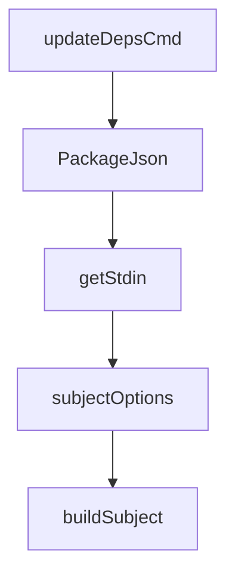

# Chapter 2: Core Document API and Query Lifecycle

Welcome to **Chapter 2: Core Document API and Query Lifecycle**. In this part of **Fireproof Tutorial: Local-First Document Database for AI-Native Apps**, you will build an intuitive mental model first, then move into concrete implementation details and practical production tradeoffs.


Fireproof exposes familiar document-database operations with explicit support for change streams and query indexes.

## Core Operations

| Operation | Purpose |
|:----------|:--------|
| `put` | insert or update document |
| `get` | retrieve by `_id` |
| `del` / `remove` | delete by `_id` |
| `query` | indexed lookups |
| `changes` | incremental change feed |
| `allDocs` | full document scan |

## Implementation Notes

In the core implementation, `DatabaseImpl` delegates durable operations through a ledger write queue and CRDT-backed data model.

## Practical Pattern

Use `changes` or subscriptions to avoid full reload loops when building reactive interfaces.

## Source References

- [DatabaseImpl API surface](https://github.com/fireproof-storage/fireproof/blob/main/core/base/database.ts)

## Summary

You now understand the document lifecycle and read/query semantics.

Next: [Chapter 3: React Hooks and Live Local-First UX](03-react-hooks-and-live-local-first-ux.md)

## Depth Expansion Playbook

## Source Code Walkthrough

### `cli/update-deps-cmd.ts`

The `updateDepsCmd` function in [`cli/update-deps-cmd.ts`](https://github.com/fireproof-storage/fireproof/blob/HEAD/cli/update-deps-cmd.ts) handles a key part of this chapter's functionality:

```ts

// eslint-disable-next-line @typescript-eslint/no-unused-vars
export function updateDepsCmd(sthis: SuperThis) {
  const cmd = command({
    name: "updateDeps",
    description: "Update all matching dependencies to a specified version across the monorepo",
    version: "1.0.0",
    args: {
      ver: option({
        type: string,
        long: "ver",
        short: "V",
        description: "The version to update to (e.g., 0.24.3 or 0.24.2-dev-clerk)",
      }),
      pkg: multioption({
        type: array(string),
        long: "pkg",
        short: "p",
        description: "Package name regex pattern to match (can be specified multiple times)",
        defaultValue: () => ["use-fireproof", "@fireproof/.*"],
        defaultValueIsSerializable: true,
      }),
      currentDir: option({
        type: string,
        long: "currentDir",
        short: "C",
        description: "Directory to search for package.json files",
        defaultValue: () => process.cwd(),
        defaultValueIsSerializable: true,
      }),
      dryRun: flag({
        long: "dry-run",
```

This function is important because it defines how Fireproof Tutorial: Local-First Document Database for AI-Native Apps implements the patterns covered in this chapter.

### `cli/update-deps-cmd.ts`

The `PackageJson` interface in [`cli/update-deps-cmd.ts`](https://github.com/fireproof-storage/fireproof/blob/HEAD/cli/update-deps-cmd.ts) handles a key part of this chapter's functionality:

```ts
import { SuperThis } from "@fireproof/core-types-base";

interface PackageJson {
  dependencies?: Record<string, string>;
  devDependencies?: Record<string, string>;
}

// Find all package.json files recursively using zx glob (respects .gitignore)
async function findPackageJsonFiles(dir: string): Promise<string[]> {
  const files = await glob([`${dir}/**/package.json`, `!${dir}/**/node_modules/**`], {
    gitignore: true,
  });
  return files;
}

// Find packages matching the regex patterns in a package.json
async function findMatchingPackages(packageJsonPath: string, patterns: string[]): Promise<string[]> {
  let pkg: PackageJson;
  try {
    const content = await readFile(packageJsonPath, "utf-8");
    pkg = JSON.parse(content) as PackageJson;
  } catch (e) {
    console.warn(`⚠️  Skipping unreadable/invalid JSON: ${packageJsonPath}`);
    return [];
  }

  const allDeps = {
    ...(pkg.dependencies ?? {}),
    ...(pkg.devDependencies ?? {}),
  };

  const matchingPackages = new Set<string>();
```

This interface is important because it defines how Fireproof Tutorial: Local-First Document Database for AI-Native Apps implements the patterns covered in this chapter.

### `cli/device-id-cmd.ts`

The `getStdin` function in [`cli/device-id-cmd.ts`](https://github.com/fireproof-storage/fireproof/blob/HEAD/cli/device-id-cmd.ts) handles a key part of this chapter's functionality:

```ts
import { sts } from "@fireproof/core-runtime";

function getStdin(): Promise<string> {
  return new Promise<string>((resolve) => {
    let data = "";
    process.stdin.setEncoding("utf8");
    process.stdin.on("readable", () => {
      let chunk;
      while ((chunk = process.stdin.read()) !== null) {
        data += chunk;
      }
    });
    process.stdin.on("end", () => resolve(data));
  });
}

// Reusable subject options for certificates and CSRs
// Common Name is always required
function subjectOptions() {
  return {
    commonName: option({
      long: "common-name",
      short: "cn",
      description: "Common Name (required, e.g., 'My Device' or 'device-serial')",
      type: string,
    }),
    organization: option({
      long: "organization",
      short: "o",
      description: "Organization name",
      type: string,
      defaultValue: () => "You did not set the Organization",
```

This function is important because it defines how Fireproof Tutorial: Local-First Document Database for AI-Native Apps implements the patterns covered in this chapter.

### `cli/device-id-cmd.ts`

The `subjectOptions` function in [`cli/device-id-cmd.ts`](https://github.com/fireproof-storage/fireproof/blob/HEAD/cli/device-id-cmd.ts) handles a key part of this chapter's functionality:

```ts
// Reusable subject options for certificates and CSRs
// Common Name is always required
function subjectOptions() {
  return {
    commonName: option({
      long: "common-name",
      short: "cn",
      description: "Common Name (required, e.g., 'My Device' or 'device-serial')",
      type: string,
    }),
    organization: option({
      long: "organization",
      short: "o",
      description: "Organization name",
      type: string,
      defaultValue: () => "You did not set the Organization",
    }),
    locality: option({
      long: "locality",
      short: "l",
      description: "Locality/City",
      type: string,
      defaultValue: () => "You did not set the City",
    }),
    state: option({
      long: "state",
      short: "s",
      description: "State or Province",
      type: string,
      defaultValue: () => "You did not set the State",
    }),
    country: option({
```

This function is important because it defines how Fireproof Tutorial: Local-First Document Database for AI-Native Apps implements the patterns covered in this chapter.


## How These Components Connect


