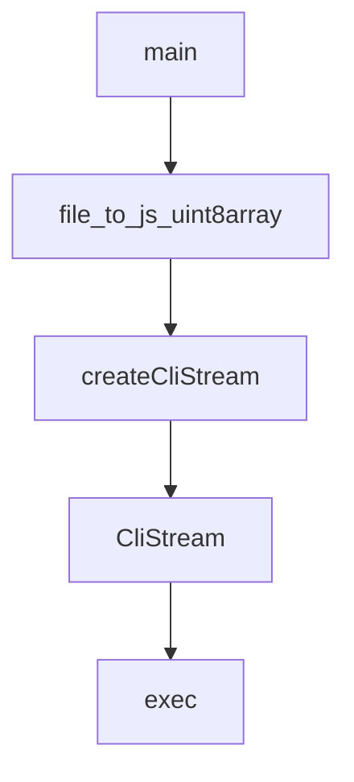

# Chapter 2: Core Document API and Query Lifecycle

Welcome to **Chapter 2: Core Document API and Query Lifecycle**. In this part of **Fireproof Tutorial: Local-First Document Database for AI-Native Apps**, you will build an intuitive mental model first, then move into concrete implementation details and practical production tradeoffs.


Fireproof exposes familiar document-database operations with explicit support for change streams and query indexes.

## Core Operations

| Operation | Purpose |
|:----------|:--------|
| `put` | insert or update document |
| `get` | retrieve by `_id` |
| `del` / `remove` | delete by `_id` |
| `query` | indexed lookups |
| `changes` | incremental change feed |
| `allDocs` | full document scan |

## Implementation Notes

In the core implementation, `DatabaseImpl` delegates durable operations through a ledger write queue and CRDT-backed data model.

## Practical Pattern

Use `changes` or subscriptions to avoid full reload loops when building reactive interfaces.

## Source References

- [DatabaseImpl API surface](https://github.com/fireproof-storage/fireproof/blob/main/core/base/database.ts)

## Summary

You now understand the document lifecycle and read/query semantics.

Next: [Chapter 3: React Hooks and Live Local-First UX](03-react-hooks-and-live-local-first-ux.md)

## Source Code Walkthrough

### `smoke/patch-fp-version.js`

The `main` function in [`smoke/patch-fp-version.js`](https://github.com/fireproof-storage/fireproof/blob/HEAD/smoke/patch-fp-version.js) handles a key part of this chapter's functionality:

```js
}

async function main() {
  const args = process.argv.reverse();
  const packageJsonName = args[1];
  const version = args[0];
  // eslint-disable-next-line no-undef, no-console
  console.log(`Update Version in ${packageJsonName} to ${version}`);
  const packageJson = JSON.parse(await fs.readFile(packageJsonName));
  for (const i of ["devDependencies", "dependencies", "peerDependencies"]) {
    patch(packageJson[i], version);
  }
  await fs.writeFile(packageJsonName, JSON.stringify(packageJson, null, 2));
}

main().catch((e) => {
  // eslint-disable-next-line no-undef, no-console
  console.error(e);
  process.exit(1);
});

```

This function is important because it defines how Fireproof Tutorial: Local-First Document Database for AI-Native Apps implements the patterns covered in this chapter.

### `scripts/convert_uint8.py`

The `file_to_js_uint8array` function in [`scripts/convert_uint8.py`](https://github.com/fireproof-storage/fireproof/blob/HEAD/scripts/convert_uint8.py) handles a key part of this chapter's functionality:

```py
import os

def file_to_js_uint8array(input_file, output_file):
    with open(input_file, 'rb') as f:
        content = f.read()
    
    uint8array = ', '.join(str(byte) for byte in content)
    
    js_content = f"const fileContent = new Uint8Array([{uint8array}]);\n\n"
    js_content += "// You can use this Uint8Array as needed in your JavaScript code\n"
    js_content += "// For example, to create a Blob:\n"
    js_content += "// const blob = new Blob([fileContent], { type: 'application/octet-stream' });\n"
    
    with open(output_file, 'w') as f:
        f.write(js_content)

if __name__ == "__main__":
    if len(sys.argv) != 2:
        print("Usage: python script.py <input_file>")
        sys.exit(1)

    input_file = sys.argv[1]
    output_file = os.path.splitext(input_file)[0] + '.js'

    file_to_js_uint8array(input_file, output_file)
    print(f"Converted {input_file} to {output_file}")
```

This function is important because it defines how Fireproof Tutorial: Local-First Document Database for AI-Native Apps implements the patterns covered in this chapter.

### `cli/create-cli-stream.ts`

The `createCliStream` function in [`cli/create-cli-stream.ts`](https://github.com/fireproof-storage/fireproof/blob/HEAD/cli/create-cli-stream.ts) handles a key part of this chapter's functionality:

```ts
export type HandlerReturnType = never;

export function createCliStream(): CliStream<HandlerArgsType, HandlerReturnType> {
  const tstream = new TransformStream<WrapCmdTSMsg<unknown>>();
  const writer = tstream.writable.getWriter();
  const pending = new Set<Promise<void>>();
  return {
    stream: tstream.readable,
    close: async () => {
      await Promise.allSettled(pending);
      writer.releaseLock();
      await tstream.writable.close();
    },
    enqueue: ((wrappedFunc: (a: unknown) => unknown) => {
      return (args: unknown) => {
        const queued = Promise.resolve(wrappedFunc(args))
          .then((result) => {
            const cmdTsMsg = {
              type: "msg.cmd-ts",
              cmdTs: {
                raw: args,
                outputFormat: "text",
              },
              result,
            } satisfies WrapCmdTSMsg<unknown>;
            return writer.write(cmdTsMsg);
          })
          .then(() => undefined)
          .finally(() => pending.delete(queued));
        pending.add(queued);
        return undefined;
      };
```

This function is important because it defines how Fireproof Tutorial: Local-First Document Database for AI-Native Apps implements the patterns covered in this chapter.

### `cli/create-cli-stream.ts`

The `CliStream` interface in [`cli/create-cli-stream.ts`](https://github.com/fireproof-storage/fireproof/blob/HEAD/cli/create-cli-stream.ts) handles a key part of this chapter's functionality:

```ts
export type EnqueueFn<Args extends readonly unknown[], Return, RealReturn = unknown> = (fn: (...a: Args) => RealReturn) => Return;

export interface CliStream<Args extends readonly unknown[], Return, RealReturn = unknown> {
  stream: ReadableStream<RealReturn>;
  enqueue(fn: (...a: Args) => RealReturn): Return;
  close(): Promise<void>;
}

export type HandlerArgsType = Parameters<Parameters<typeof command>[0]["handler"]>;
export type HandlerReturnType = never;

export function createCliStream(): CliStream<HandlerArgsType, HandlerReturnType> {
  const tstream = new TransformStream<WrapCmdTSMsg<unknown>>();
  const writer = tstream.writable.getWriter();
  const pending = new Set<Promise<void>>();
  return {
    stream: tstream.readable,
    close: async () => {
      await Promise.allSettled(pending);
      writer.releaseLock();
      await tstream.writable.close();
    },
    enqueue: ((wrappedFunc: (a: unknown) => unknown) => {
      return (args: unknown) => {
        const queued = Promise.resolve(wrappedFunc(args))
          .then((result) => {
            const cmdTsMsg = {
              type: "msg.cmd-ts",
              cmdTs: {
                raw: args,
                outputFormat: "text",
              },
```

This interface is important because it defines how Fireproof Tutorial: Local-First Document Database for AI-Native Apps implements the patterns covered in this chapter.


## How These Components Connect


