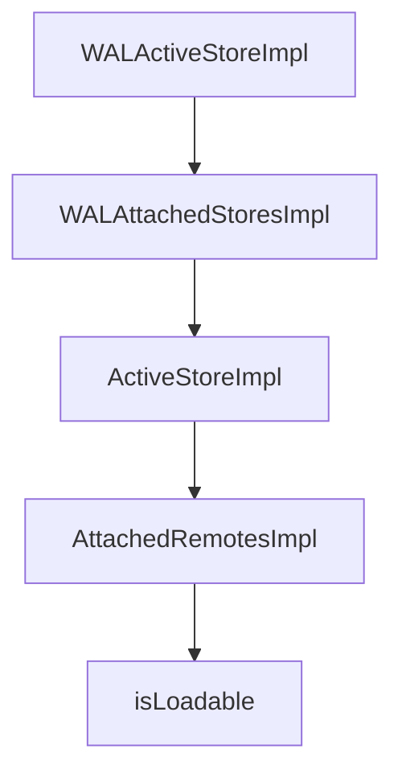

# Chapter 3: React Hooks and Live Local-First UX

Welcome to **Chapter 3: React Hooks and Live Local-First UX**. In this part of **Fireproof Tutorial: Local-First Document Database for AI-Native Apps**, you will build an intuitive mental model first, then move into concrete implementation details and practical production tradeoffs.


Fireproof provides React hooks so local writes and query updates stay synchronized in UI state.

## Hook Roles

| Hook | Role |
|:-----|:-----|
| `useFireproof` | initialize database and expose helper hooks |
| `useDocument` | manage mutable draft + submit flow |
| `useLiveQuery` | live query results with automatic updates |

## Typical Flow

1. create database with `useFireproof("my-ledger")`
2. edit docs through `useDocument`
3. render lists via `useLiveQuery`

This model removes much of the manual cache invalidation and loading-state orchestration common in CRUD apps.

## Source References

- [Fireproof README: React usage](https://github.com/fireproof-storage/fireproof/blob/main/README.md)
- [React tutorial docs](https://use-fireproof.com/docs/react-tutorial)

## Summary

You now have the React mental model for real-time local-first Fireproof UIs.

Next: [Chapter 4: Ledger, CRDT, and Causal Consistency](04-ledger-crdt-and-causal-consistency.md)

## Source Code Walkthrough

### `core/blockstore/attachable-store.ts`

The `WALActiveStoreImpl` class in [`core/blockstore/attachable-store.ts`](https://github.com/fireproof-storage/fireproof/blob/HEAD/core/blockstore/attachable-store.ts) handles a key part of this chapter's functionality:

```ts
}

class WALActiveStoreImpl extends WALActiveStore {
  readonly ref: ActiveStore;
  readonly active: WALStore;
  protected readonly attached: WALAttachedStores;

  constructor(ref: ActiveStore, active: WALStore, attached: WALAttachedStores) {
    super();
    this.ref = ref;
    this.active = active;
    this.attached = attached;
  }

  local(): WALStore {
    return this.attached.local();
  }
  remotes(): WALStore[] {
    return this.attached.remotes();
  }
}

class WALAttachedStoresImpl implements WALAttachedStores {
  readonly attached: AttachedStores;
  constructor(attached: AttachedStores) {
    this.attached = attached;
  }
  local(): WALStore {
    return this.attached.local().active.wal;
  }
  remotes(): WALStore[] {
    return (
```

This class is important because it defines how Fireproof Tutorial: Local-First Document Database for AI-Native Apps implements the patterns covered in this chapter.

### `core/blockstore/attachable-store.ts`

The `WALAttachedStoresImpl` class in [`core/blockstore/attachable-store.ts`](https://github.com/fireproof-storage/fireproof/blob/HEAD/core/blockstore/attachable-store.ts) handles a key part of this chapter's functionality:

```ts
}

class WALAttachedStoresImpl implements WALAttachedStores {
  readonly attached: AttachedStores;
  constructor(attached: AttachedStores) {
    this.attached = attached;
  }
  local(): WALStore {
    return this.attached.local().active.wal;
  }
  remotes(): WALStore[] {
    return (
      this.attached
        .remotes()
        .filter(({ active }) => active.wal)
        // eslint-disable-next-line @typescript-eslint/no-non-null-assertion
        .map(({ active }) => active.wal!)
    );
  }
}

class ActiveStoreImpl<T extends DataAndMetaAndWalStore> implements ActiveStore {
  readonly active: T;
  readonly attached: AttachedRemotesImpl;

  constructor(active: T, attached: AttachedRemotesImpl) {
    this.active = active;
    this.attached = attached;
  }

  local(): LocalActiveStore {
    return this.attached.local();
```

This class is important because it defines how Fireproof Tutorial: Local-First Document Database for AI-Native Apps implements the patterns covered in this chapter.

### `core/blockstore/attachable-store.ts`

The `ActiveStoreImpl` class in [`core/blockstore/attachable-store.ts`](https://github.com/fireproof-storage/fireproof/blob/HEAD/core/blockstore/attachable-store.ts) handles a key part of this chapter's functionality:

```ts
}

class FileActiveStoreImpl extends FileActiveStore {
  readonly ref: ActiveStore;
  readonly active: FileStore;
  protected readonly attached: FileAttachedStores;

  constructor(ref: ActiveStore, active: FileStore, attached: FileAttachedStores) {
    super();
    this.ref = ref;
    this.active = active;
    this.attached = attached;
  }
  local(): FileStore {
    return this.attached.local();
  }
  remotes(): FileStore[] {
    return this.attached.remotes();
  }
}

class CarActiveStoreImpl extends CarActiveStore {
  readonly ref: ActiveStore;
  readonly active: CarStore;
  protected readonly attached: CarAttachedStores;

  constructor(ref: ActiveStore, active: CarStore, attached: CarAttachedStores) {
    super();
    this.ref = ref;
    this.active = active;
    this.attached = attached;
  }
```

This class is important because it defines how Fireproof Tutorial: Local-First Document Database for AI-Native Apps implements the patterns covered in this chapter.

### `core/blockstore/attachable-store.ts`

The `AttachedRemotesImpl` class in [`core/blockstore/attachable-store.ts`](https://github.com/fireproof-storage/fireproof/blob/HEAD/core/blockstore/attachable-store.ts) handles a key part of this chapter's functionality:

```ts
class ActiveStoreImpl<T extends DataAndMetaAndWalStore> implements ActiveStore {
  readonly active: T;
  readonly attached: AttachedRemotesImpl;

  constructor(active: T, attached: AttachedRemotesImpl) {
    this.active = active;
    this.attached = attached;
  }

  local(): LocalActiveStore {
    return this.attached.local();
  }
  remotes(): ActiveStore[] {
    return this.attached.remotes();
    // return  [
    //   this.attached.remotes().filter(i => i !== this.active)
    // ]
  }

  baseStores(): BaseStore[] {
    const bs: BaseStore[] = [this.active.car, this.active.file, this.active.meta];
    if (this.active.wal) {
      bs.push(this.active.wal);
    }
    return bs;
  }
  carStore(): CarActiveStore {
    return new CarActiveStoreImpl(this, this.active.car, new CarAttachedStoresImpl(this.attached));
  }
  fileStore(): FileActiveStore {
    return new FileActiveStoreImpl(this, this.active.file, new FileAttachedStoresImpl(this.attached));
  }
```

This class is important because it defines how Fireproof Tutorial: Local-First Document Database for AI-Native Apps implements the patterns covered in this chapter.


## How These Components Connect


