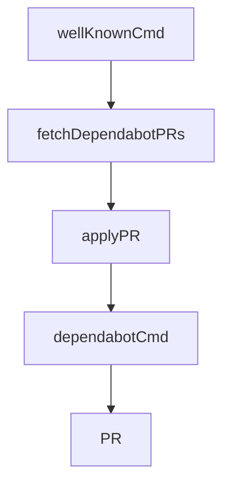

# Chapter 3: React Hooks and Live Local-First UX

Welcome to **Chapter 3: React Hooks and Live Local-First UX**. In this part of **Fireproof Tutorial: Local-First Document Database for AI-Native Apps**, you will build an intuitive mental model first, then move into concrete implementation details and practical production tradeoffs.


Fireproof provides React hooks so local writes and query updates stay synchronized in UI state.

## Hook Roles

| Hook | Role |
|:-----|:-----|
| `useFireproof` | initialize database and expose helper hooks |
| `useDocument` | manage mutable draft + submit flow |
| `useLiveQuery` | live query results with automatic updates |

## Typical Flow

1. create database with `useFireproof("my-ledger")`
2. edit docs through `useDocument`
3. render lists via `useLiveQuery`

This model removes much of the manual cache invalidation and loading-state orchestration common in CRUD apps.

## Source References

- [Fireproof README: React usage](https://github.com/fireproof-storage/fireproof/blob/main/README.md)
- [React tutorial docs](https://use-fireproof.com/docs/react-tutorial)

## Summary

You now have the React mental model for real-time local-first Fireproof UIs.

Next: [Chapter 4: Ledger, CRDT, and Causal Consistency](04-ledger-crdt-and-causal-consistency.md)

## Depth Expansion Playbook

## Source Code Walkthrough

### `cli/well-known-cmd.ts`

The `wellKnownCmd` function in [`cli/well-known-cmd.ts`](https://github.com/fireproof-storage/fireproof/blob/HEAD/cli/well-known-cmd.ts) handles a key part of this chapter's functionality:

```ts
import { exportSPKI } from "jose";

export function wellKnownCmd(_sthis: SuperThis) {
  return command({
    name: "well-known",
    description: "Fetch well-known JWKS from URLs",
    version: "1.0.0",
    args: {
      json: flag({
        long: "json",
        description: "Output as JSON (default)",
        defaultValue: () => false,
      }),
      jsons: flag({
        long: "jsons",
        description: "Output as single-line quoted JSON string",
        defaultValue: () => false,
      }),
      pem: flag({
        long: "pem",
        description: "Output as PEM format per key",
        defaultValue: () => false,
      }),
      env: flag({
        long: "env",
        description: "Output as environment variables with single-lined PEM",
        defaultValue: () => false,
      }),
      presetKey: option({
        type: string,
        long: "presetKey",
        defaultValue: () => "",
```

This function is important because it defines how Fireproof Tutorial: Local-First Document Database for AI-Native Apps implements the patterns covered in this chapter.

### `cli/dependabot-cmd.ts`

The `fetchDependabotPRs` function in [`cli/dependabot-cmd.ts`](https://github.com/fireproof-storage/fireproof/blob/HEAD/cli/dependabot-cmd.ts) handles a key part of this chapter's functionality:

```ts
}

async function fetchDependabotPRs(): Promise<PR[]> {
  try {
    const result = await $`gh pr list --author app/dependabot --json number,title,author,url,headRefName --limit 100`;
    const prs = JSON.parse(result.stdout) as PR[];
    return prs;
  } catch (error) {
    console.error("Failed to fetch Dependabot PRs:", error);
    throw error;
  }
}

async function applyPR(pr: PR, rebase: boolean): Promise<void> {
  try {
    console.log(`\nProcessing PR #${pr.number}: ${pr.title}`);

    if (rebase) {
      // Rebase and merge the PR
      await $`gh pr merge ${pr.number} --auto --rebase`;
      console.log(`✓ Rebased and merged PR #${pr.number}`);
    } else {
      // Just checkout the PR
      await $`gh pr checkout ${pr.number}`;
      console.log(`✓ Checked out PR #${pr.number}`);
    }
  } catch (error) {
    console.error(`✗ Failed to process PR #${pr.number}:`, error);
    throw error;
  }
}

```

This function is important because it defines how Fireproof Tutorial: Local-First Document Database for AI-Native Apps implements the patterns covered in this chapter.

### `cli/dependabot-cmd.ts`

The `applyPR` function in [`cli/dependabot-cmd.ts`](https://github.com/fireproof-storage/fireproof/blob/HEAD/cli/dependabot-cmd.ts) handles a key part of this chapter's functionality:

```ts
}

async function applyPR(pr: PR, rebase: boolean): Promise<void> {
  try {
    console.log(`\nProcessing PR #${pr.number}: ${pr.title}`);

    if (rebase) {
      // Rebase and merge the PR
      await $`gh pr merge ${pr.number} --auto --rebase`;
      console.log(`✓ Rebased and merged PR #${pr.number}`);
    } else {
      // Just checkout the PR
      await $`gh pr checkout ${pr.number}`;
      console.log(`✓ Checked out PR #${pr.number}`);
    }
  } catch (error) {
    console.error(`✗ Failed to process PR #${pr.number}:`, error);
    throw error;
  }
}

// eslint-disable-next-line @typescript-eslint/no-unused-vars
export function dependabotCmd(sthis: SuperThis) {
  const cmd = command({
    name: "dependabot",
    description: "Fetch and apply Dependabot PRs",
    version: "1.0.0",
    args: {
      rebase: flag({
        long: "rebase",
        short: "r",
        description: "Automatically rebase and merge the PRs",
```

This function is important because it defines how Fireproof Tutorial: Local-First Document Database for AI-Native Apps implements the patterns covered in this chapter.

### `cli/dependabot-cmd.ts`

The `dependabotCmd` function in [`cli/dependabot-cmd.ts`](https://github.com/fireproof-storage/fireproof/blob/HEAD/cli/dependabot-cmd.ts) handles a key part of this chapter's functionality:

```ts

// eslint-disable-next-line @typescript-eslint/no-unused-vars
export function dependabotCmd(sthis: SuperThis) {
  const cmd = command({
    name: "dependabot",
    description: "Fetch and apply Dependabot PRs",
    version: "1.0.0",
    args: {
      rebase: flag({
        long: "rebase",
        short: "r",
        description: "Automatically rebase and merge the PRs",
      }),
      apply: flag({
        long: "apply",
        short: "a",
        description: "Apply (checkout) all Dependabot PRs",
      }),
      prNumber: option({
        long: "pr",
        short: "p",
        type: string,
        defaultValue: () => "",
        description: "Apply a specific PR number",
      }),
      list: flag({
        long: "list",
        short: "l",
        description: "List all Dependabot PRs (default action)",
      }),
    },
    handler: async (args) => {
```

This function is important because it defines how Fireproof Tutorial: Local-First Document Database for AI-Native Apps implements the patterns covered in this chapter.


## How These Components Connect


