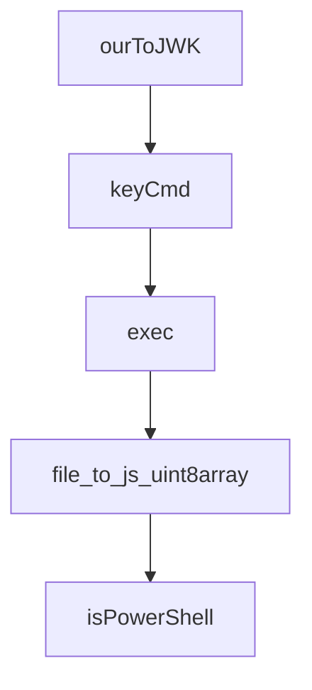

# Chapter 4: Ledger, CRDT, and Causal Consistency

Welcome to **Chapter 4: Ledger, CRDT, and Causal Consistency**. In this part of **Fireproof Tutorial: Local-First Document Database for AI-Native Apps**, you will build an intuitive mental model first, then move into concrete implementation details and practical production tradeoffs.


Fireproof uses ledger and CRDT structures to preserve causal order and integrity across concurrent writers.

## Integrity Model

- write operations go through a queue
- CRDT clock tracks causal progression
- content-addressed history enables verifiable state evolution

## Why It Matters

In collaborative or AI-assisted editing scenarios, this reduces the chance of silent state corruption when concurrent updates happen.

## Source References

- [Ledger implementation](https://github.com/fireproof-storage/fireproof/blob/main/core/base/ledger.ts)
- [Database implementation](https://github.com/fireproof-storage/fireproof/blob/main/core/base/database.ts)
- [Architecture docs](https://use-fireproof.com/docs/architecture)

## Summary

You now understand the core consistency model behind Fireproof write and merge behavior.

Next: [Chapter 5: Storage Gateways and Sync Topology](05-storage-gateways-and-sync-topology.md)

## Depth Expansion Playbook

## Source Code Walkthrough

### `cli/cloud-token-key-cmd.ts`

The `ourToJWK` function in [`cli/cloud-token-key-cmd.ts`](https://github.com/fireproof-storage/fireproof/blob/HEAD/cli/cloud-token-key-cmd.ts) handles a key part of this chapter's functionality:

```ts
import { z } from "zod/v4";

async function ourToJWK(env: string, sthis: SuperThis): Promise<Result<{ keys: (JWKPublic | JWKPrivate)[] }>> {
  const rCryptoKeys = await exception2Result(() => rt.sts.env2jwk(env, undefined, sthis));
  if (rCryptoKeys.isErr()) {
    return Result.Err(rCryptoKeys);
  }
  const cryptoKeys = rCryptoKeys.Ok();

  // Convert each key individually for better error reporting
  const keys: (JWKPrivate | JWKPublic)[] = [];
  for (const key of cryptoKeys) {
    const rKey = await exception2Result(() => exportJWK(key));
    if (rKey.isErr()) {
      return Result.Err(rKey);
    }
    const parsed = z.union([JWKPublicSchema, JWKPrivateSchema]).safeParse(rKey.Ok());
    if (!parsed.success) {
      return Result.Err(`Invalid JWK public key: ${parsed.error.message}`);
    }
    keys.push(parsed.data);
  }

  return Result.Ok({ keys });
}

export function keyCmd(sthis: SuperThis) {
  return command({
    name: "cli-key-cmds",
    description: "handle keys for cloud token generation",
    version: "1.0.0",
    args: {
```

This function is important because it defines how Fireproof Tutorial: Local-First Document Database for AI-Native Apps implements the patterns covered in this chapter.

### `cli/cloud-token-key-cmd.ts`

The `keyCmd` function in [`cli/cloud-token-key-cmd.ts`](https://github.com/fireproof-storage/fireproof/blob/HEAD/cli/cloud-token-key-cmd.ts) handles a key part of this chapter's functionality:

```ts
}

export function keyCmd(sthis: SuperThis) {
  return command({
    name: "cli-key-cmds",
    description: "handle keys for cloud token generation",
    version: "1.0.0",
    args: {
      generatePair: flag({
        long: "generatePair",
        short: "g",
      }),
      ourToJWK: option({
        long: "ourToJWK",
        short: "o",
        defaultValue: () => "",
        type: string,
      }),
      JWKToour: option({
        long: "JWKToour",
        short: "j",
        defaultValue: () => "",
        type: string,
      }),
    },
    handler: async (args) => {
      switch (true) {
        case !!args.ourToJWK:
          {
            const r = await ourToJWK(args.ourToJWK, sthis);
            if (r.isErr()) {
              // eslint-disable-next-line no-console
```

This function is important because it defines how Fireproof Tutorial: Local-First Document Database for AI-Native Apps implements the patterns covered in this chapter.

### `cli/run.js`

The `exec` function in [`cli/run.js`](https://github.com/fireproof-storage/fireproof/blob/HEAD/cli/run.js) handles a key part of this chapter's functionality:

```js
import * as process from "process";

function exec(cmd, args) {
  // process.env.PATH = `${[
  //   `${runDirectory}`,
  //   path.join(runDirectory, "./node_modules/.bin")
  // ].join(":")}:${process.env.PATH}`
  const tsc = spawn(cmd, args, {
    stdio: "inherit", // inherits stdin, stdout, and stderr
  });

  tsc.on("close", (code) => {
    process.exit(code);
  });

  tsc.on("error", (error) => {
    // eslint-disable-next-line no-console, no-undef
    console.error(`Failed to start ${cmd}: ${error.message}`);
    process.exit(1);
  });
}

// const idxTsc = process.argv.findIndex(i => i === 'tsc')
const idxRunIdx = process.argv.findIndex((i) => i.endsWith("run.js"));
const runDirectory = path.dirname(process.argv[idxRunIdx]);
const mainJs = path.join(runDirectory, "main.js");
//const mainWithDistJs = path.join(runDirectory, "dist", "npm", "main.js");
//const mainJs = fs.existsSync(mainPublishedJs) ? mainPublishedJs : fs.existsSync(mainWithDistJs) ? mainWithDistJs : undefined;
if (fs.existsSync(mainJs)) {
  // make windows happy file://
  const addFile = `file://${mainJs}`;
  // eslint-disable-next-line no-console, no-undef
```

This function is important because it defines how Fireproof Tutorial: Local-First Document Database for AI-Native Apps implements the patterns covered in this chapter.

### `scripts/convert_uint8.py`

The `file_to_js_uint8array` function in [`scripts/convert_uint8.py`](https://github.com/fireproof-storage/fireproof/blob/HEAD/scripts/convert_uint8.py) handles a key part of this chapter's functionality:

```py
import os

def file_to_js_uint8array(input_file, output_file):
    with open(input_file, 'rb') as f:
        content = f.read()
    
    uint8array = ', '.join(str(byte) for byte in content)
    
    js_content = f"const fileContent = new Uint8Array([{uint8array}]);\n\n"
    js_content += "// You can use this Uint8Array as needed in your JavaScript code\n"
    js_content += "// For example, to create a Blob:\n"
    js_content += "// const blob = new Blob([fileContent], { type: 'application/octet-stream' });\n"
    
    with open(output_file, 'w') as f:
        f.write(js_content)

if __name__ == "__main__":
    if len(sys.argv) != 2:
        print("Usage: python script.py <input_file>")
        sys.exit(1)

    input_file = sys.argv[1]
    output_file = os.path.splitext(input_file)[0] + '.js'

    file_to_js_uint8array(input_file, output_file)
    print(f"Converted {input_file} to {output_file}")
```

This function is important because it defines how Fireproof Tutorial: Local-First Document Database for AI-Native Apps implements the patterns covered in this chapter.


## How These Components Connect


