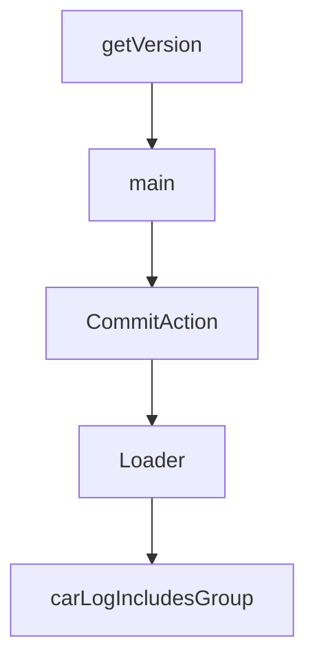

# Chapter 5: Storage Gateways and Sync Topology

Welcome to **Chapter 5: Storage Gateways and Sync Topology**. In this part of **Fireproof Tutorial: Local-First Document Database for AI-Native Apps**, you will build an intuitive mental model first, then move into concrete implementation details and practical production tradeoffs.


Fireproof supports multiple storage gateways and environment-aware persistence paths.

## Gateway Landscape

| Gateway | Typical Runtime |
|:--------|:----------------|
| IndexedDB | browser local persistence |
| File-based gateways | Node and filesystem runtimes |
| Memory gateway | tests and ephemeral sessions |
| Cloud protocols | synchronized multi-device flows |

## Topology Guidance

- start local with browser/file gateway
- layer sync after local behavior is correct
- test conflict and recovery paths early for collaboration-heavy apps

## Source References

- [IndexedDB gateway](https://github.com/fireproof-storage/fireproof/blob/main/core/gateways/indexeddb/gateway-impl.ts)
- [Gateway modules tree](https://github.com/fireproof-storage/fireproof/tree/main/core/gateways)

## Summary

You now have a storage and sync topology model for different deployment targets.

Next: [Chapter 6: Files, Attachments, and Rich Data Flows](06-files-attachments-and-rich-data-flows.md)

## Depth Expansion Playbook

## Source Code Walkthrough

### `smoke/get-fp-version.js`

The `getVersion` function in [`smoke/get-fp-version.js`](https://github.com/fireproof-storage/fireproof/blob/HEAD/smoke/get-fp-version.js) handles a key part of this chapter's functionality:

```js
import * as process from "node:process";

function getVersion(version = "refs/tags/v0.0.0-smoke") {
  if (process.env.GITHUB_REF && process.env.GITHUB_REF.startsWith("refs/tags/v")) {
    version = process.env.GITHUB_REF;
  }
  return version.split("/").slice(-1)[0].replace(/^v/, "");
}

async function main() {
  const gitHead = (await $`git rev-parse --short HEAD`).stdout.trim();
  const dateTick = (await $`date +%s`).stdout.trim();
  // eslint-disable-next-line no-console, no-undef
  console.log(getVersion(`refs/tags/v0.0.0-smoke-${gitHead}-${dateTick}`));
}

main().catch((e) => {
  // eslint-disable-next-line no-console, no-undef
  console.error(e);
  process.exit(1);
});

```

This function is important because it defines how Fireproof Tutorial: Local-First Document Database for AI-Native Apps implements the patterns covered in this chapter.

### `smoke/get-fp-version.js`

The `main` function in [`smoke/get-fp-version.js`](https://github.com/fireproof-storage/fireproof/blob/HEAD/smoke/get-fp-version.js) handles a key part of this chapter's functionality:

```js
}

async function main() {
  const gitHead = (await $`git rev-parse --short HEAD`).stdout.trim();
  const dateTick = (await $`date +%s`).stdout.trim();
  // eslint-disable-next-line no-console, no-undef
  console.log(getVersion(`refs/tags/v0.0.0-smoke-${gitHead}-${dateTick}`));
}

main().catch((e) => {
  // eslint-disable-next-line no-console, no-undef
  console.error(e);
  process.exit(1);
});

```

This function is important because it defines how Fireproof Tutorial: Local-First Document Database for AI-Native Apps implements the patterns covered in this chapter.

### `core/blockstore/loader.ts`

The `CommitAction` class in [`core/blockstore/loader.ts`](https://github.com/fireproof-storage/fireproof/blob/HEAD/core/blockstore/loader.ts) handles a key part of this chapter's functionality:

```ts
// }

class CommitAction implements CommitParams {
  readonly carLog: CarLog;
  readonly encoder: AsyncBlockEncoder<24, Uint8Array>;
  readonly threshold: number;
  readonly attached: AttachedStores;
  readonly opts: CommitOpts;
  readonly commitQueue: CommitQueueIf<CarGroup>;
  readonly logger: Logger;

  constructor(
    logger: Logger,
    carLog: CarLog,
    commitQueue: CommitQueueIf<CarGroup>,
    encoder: AsyncBlockEncoder<24, Uint8Array>,
    attached: AttachedStores,
    threshold: number,
    opts: CommitOpts,
  ) {
    this.logger = logger;
    this.carLog = carLog;
    this.commitQueue = commitQueue;
    this.attached = attached;
    // this.carLog = carLog;
    this.encoder = encoder;
    this.threshold = threshold;
    this.opts = opts;
  }

  async writeCar(block: AnyBlock): Promise<void> {
    await this.attached.local().active.car.save(block);
```

This class is important because it defines how Fireproof Tutorial: Local-First Document Database for AI-Native Apps implements the patterns covered in this chapter.

### `core/blockstore/loader.ts`

The `Loader` class in [`core/blockstore/loader.ts`](https://github.com/fireproof-storage/fireproof/blob/HEAD/core/blockstore/loader.ts) handles a key part of this chapter's functionality:

```ts
// await params.metaStore.save(newDbMeta);

export class Loader implements Loadable {
  // readonly name: string;
  readonly blockstoreParent?: BlockFetcher;
  readonly ebOpts: BlockstoreRuntime;
  readonly logger: Logger;
  readonly commitQueue: CommitQueueIf<CarGroup>;
  isCompacting = false;
  readonly cidCache: KeyedResolvOnce<FPBlock>;
  private readonly maxConcurrentCarReader: ReturnType<typeof pLimit>;
  private readonly maxConcurrentWrite = pLimit(1);
  readonly seenCompacted: LRUSet<string>;
  // readonly processedCars: Set<string> = new Set<string>();
  readonly sthis: SuperThis;
  readonly taskManager: TaskManager;

  readonly carLog: CarLog = new CarLog();
  // key?: string;
  // keyId?: string;
  // remoteMetaStore?: MetaStore;
  // remoteCarStore?: DataStore;
  // remoteFileStore?: DataStore;

  readonly attachedStores: AttachedStores;

  async tryToLoadStaleCars(store: ActiveStore) {
    const staleLoadcars: Promise<FPBlock<CarBlockItem>>[] = [];
    for (const { value: rvalue } of this.cidCache.values()) {
      if (rvalue.isErr()) {
        this.logger.Error().Err(rvalue).Msg("error loading car");
        return;
```

This class is important because it defines how Fireproof Tutorial: Local-First Document Database for AI-Native Apps implements the patterns covered in this chapter.


## How These Components Connect


