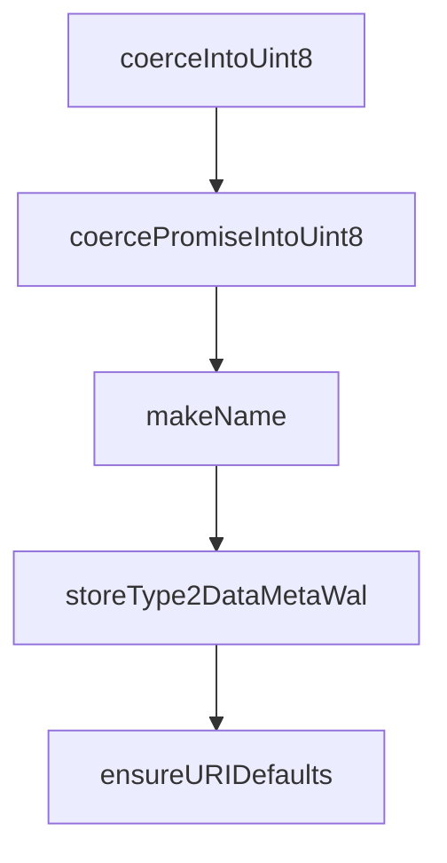

# Chapter 5: Storage Gateways and Sync Topology

Welcome to **Chapter 5: Storage Gateways and Sync Topology**. In this part of **Fireproof Tutorial: Local-First Document Database for AI-Native Apps**, you will build an intuitive mental model first, then move into concrete implementation details and practical production tradeoffs.


Fireproof supports multiple storage gateways and environment-aware persistence paths.

## Gateway Landscape

| Gateway | Typical Runtime |
|:--------|:----------------|
| IndexedDB | browser local persistence |
| File-based gateways | Node and filesystem runtimes |
| Memory gateway | tests and ephemeral sessions |
| Cloud protocols | synchronized multi-device flows |

## Topology Guidance

- start local with browser/file gateway
- layer sync after local behavior is correct
- test conflict and recovery paths early for collaboration-heavy apps

## Source References

- [IndexedDB gateway](https://github.com/fireproof-storage/fireproof/blob/main/core/gateways/indexeddb/gateway-impl.ts)
- [Gateway modules tree](https://github.com/fireproof-storage/fireproof/tree/main/core/gateways)

## Summary

You now have a storage and sync topology model for different deployment targets.

Next: [Chapter 6: Files, Attachments, and Rich Data Flows](06-files-attachments-and-rich-data-flows.md)

## Source Code Walkthrough

### `core/runtime/utils.ts`

The `coerceIntoUint8` function in [`core/runtime/utils.ts`](https://github.com/fireproof-storage/fireproof/blob/HEAD/core/runtime/utils.ts) handles a key part of this chapter's functionality:

```ts
  id: () => "fp-txtOps",
  encode: (input: string) => txtEncoder.encode(input),
  decode: (input: ToUInt8) => txtDecoder.decode(coerceIntoUint8(input).Ok()),

  base64: {
    encode: (input: ToUInt8 | string) => {
      if (typeof input === "string") {
        const data = txtEncoder.encode(input);
        return btoa(String.fromCharCode(...data));
      }
      let charStr = "";
      for (const i of coerceIntoUint8(input).Ok()) {
        charStr += String.fromCharCode(i);
      }
      return btoa(charStr);
    },
    decodeUint8: (input: string) => {
      const data = atob(input.replace(/\s+/g, ""));
      return new Uint8Array(data.split("").map((c) => c.charCodeAt(0)));
    },
    decode: (input: string) => {
      const data = atob(input.replace(/\s+/g, ""));
      const uint8 = new Uint8Array(data.split("").map((c) => c.charCodeAt(0)));
      return txtDecoder.decode(uint8);
    },
  },
  base58: {
    encode: (input: ToUInt8 | string) => {
      if (typeof input === "string") {
        const data = txtEncoder.encode(input);
        return base58btc.encode(data);
      }
```

This function is important because it defines how Fireproof Tutorial: Local-First Document Database for AI-Native Apps implements the patterns covered in this chapter.

### `core/runtime/utils.ts`

The `coercePromiseIntoUint8` function in [`core/runtime/utils.ts`](https://github.com/fireproof-storage/fireproof/blob/HEAD/core/runtime/utils.ts) handles a key part of this chapter's functionality:

```ts
}

export async function coercePromiseIntoUint8(raw: PromiseToUInt8): Promise<Result<Uint8Array>> {
  if (raw instanceof Uint8Array) {
    return Result.Ok(raw);
  }
  if (Result.Is(raw)) {
    return raw;
  }
  if (typeof raw.then === "function") {
    try {
      return coercePromiseIntoUint8(await raw);
    } catch (e) {
      return Result.Err(e as Error);
    }
  }
  return Result.Err("Not a Uint8Array");
}

export function makeName(fnString: string) {
  const regex = /\(([^,()]+,\s*[^,()]+|\[[^\]]+\],\s*[^,()]+)\)/g;
  let found: RegExpExecArray | null = null;
  const matches = Array.from(fnString.matchAll(regex), (match) => match[1].trim());
  if (matches.length === 0) {
    found = /=>\s*{?\s*([^{}]+)\s*}?/.exec(fnString);
    if (found && found[1].includes("return")) {
      found = null;
    }
  }
  if (!found) {
    return fnString;
  } else {
```

This function is important because it defines how Fireproof Tutorial: Local-First Document Database for AI-Native Apps implements the patterns covered in this chapter.

### `core/runtime/utils.ts`

The `makeName` function in [`core/runtime/utils.ts`](https://github.com/fireproof-storage/fireproof/blob/HEAD/core/runtime/utils.ts) handles a key part of this chapter's functionality:

```ts
}

export function makeName(fnString: string) {
  const regex = /\(([^,()]+,\s*[^,()]+|\[[^\]]+\],\s*[^,()]+)\)/g;
  let found: RegExpExecArray | null = null;
  const matches = Array.from(fnString.matchAll(regex), (match) => match[1].trim());
  if (matches.length === 0) {
    found = /=>\s*{?\s*([^{}]+)\s*}?/.exec(fnString);
    if (found && found[1].includes("return")) {
      found = null;
    }
  }
  if (!found) {
    return fnString;
  } else {
    // it's a consise arrow function, match everything after the arrow
    return found[1];
  }
}

export function storeType2DataMetaWal(store: StoreType) {
  switch (store) {
    case "car":
    case "file":
      return "data";
    case "meta":
    case "wal":
      return store;
    default:
      throw new Error(`unknown store ${store}`);
  }
}
```

This function is important because it defines how Fireproof Tutorial: Local-First Document Database for AI-Native Apps implements the patterns covered in this chapter.

### `core/runtime/utils.ts`

The `storeType2DataMetaWal` function in [`core/runtime/utils.ts`](https://github.com/fireproof-storage/fireproof/blob/HEAD/core/runtime/utils.ts) handles a key part of this chapter's functionality:

```ts
}

export function storeType2DataMetaWal(store: StoreType) {
  switch (store) {
    case "car":
    case "file":
      return "data";
    case "meta":
    case "wal":
      return store;
    default:
      throw new Error(`unknown store ${store}`);
  }
}

export function ensureURIDefaults(
  sthis: SuperThis,
  names: { name: string; localURI?: URI },
  curi: CoerceURI | undefined,
  uri: URI,
  store: StoreType,
  ctx?: Partial<{
    readonly idx: boolean;
    readonly file: boolean;
  }>,
): URI {
  ctx = ctx || {};
  const ret = (curi ? URI.from(curi) : uri).build().setParam(PARAM.STORE, store).defParam(PARAM.NAME, names.name);
  if (names.localURI) {
    const rParams = names.localURI.getParamsResult({
      [PARAM.NAME]: param.OPTIONAL,
      [PARAM.STORE_KEY]: param.OPTIONAL,
```

This function is important because it defines how Fireproof Tutorial: Local-First Document Database for AI-Native Apps implements the patterns covered in this chapter.


## How These Components Connect


