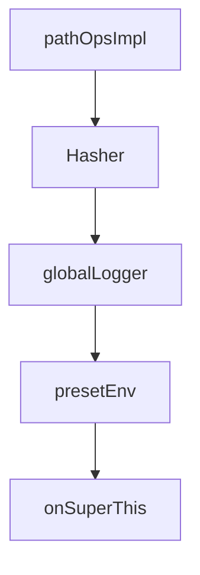

# Chapter 6: Files, Attachments, and Rich Data Flows

Welcome to **Chapter 6: Files, Attachments, and Rich Data Flows**. In this part of **Fireproof Tutorial: Local-First Document Database for AI-Native Apps**, you will build an intuitive mental model first, then move into concrete implementation details and practical production tradeoffs.


Fireproof supports richer document payloads through `_files` patterns and helper components like `ImgFile`.

## Rich Data Pattern

- store file objects in a document `_files` map
- persist metadata alongside attachments
- render media with Fireproof-aware UI components

## Example Use Cases

- profile images and asset galleries
- collaborative note attachments
- AI-generated media artifacts linked to document metadata

## Source References

- [Fireproof README: image workflows](https://github.com/fireproof-storage/fireproof/blob/main/README.md)
- [LLM docs bundle](https://use-fireproof.com/llms-full.txt)

## Summary

You now understand how to model and render rich media payloads in Fireproof documents.

Next: [Chapter 7: Runtime Coverage: Browser, Node, Deno, and Edge](07-runtime-coverage-browser-node-deno-and-edge.md)

## Depth Expansion Playbook

## Source Code Walkthrough

### `core/runtime/utils.ts`

The `pathOpsImpl` class in [`core/runtime/utils.ts`](https://github.com/fireproof-storage/fireproof/blob/HEAD/core/runtime/utils.ts) handles a key part of this chapter's functionality:

```ts
//   presetEnv: presetEnv(),
// });
class pathOpsImpl implements PathOps {
  join(...paths: string[]): string {
    return paths.map((i) => i.replace(/\/+$/, "")).join("/");
  }
  dirname(path: string) {
    return path.split("/").slice(0, -1).join("/");
  }
  basename(path: string): string {
    return path.split("/").pop() || "";
  }
  // homedir() {
  //     throw new Error("SysContainer:homedir is not available in seeded state");
  //   }
}
const pathOps = new pathOpsImpl();
const txtOps = ((txtEncoder, txtDecoder) => ({
  id: () => "fp-txtOps",
  encode: (input: string) => txtEncoder.encode(input),
  decode: (input: ToUInt8) => txtDecoder.decode(coerceIntoUint8(input).Ok()),

  base64: {
    encode: (input: ToUInt8 | string) => {
      if (typeof input === "string") {
        const data = txtEncoder.encode(input);
        return btoa(String.fromCharCode(...data));
      }
      let charStr = "";
      for (const i of coerceIntoUint8(input).Ok()) {
        charStr += String.fromCharCode(i);
      }
```

This class is important because it defines how Fireproof Tutorial: Local-First Document Database for AI-Native Apps implements the patterns covered in this chapter.

### `core/runtime/utils.ts`

The `Hasher` class in [`core/runtime/utils.ts`](https://github.com/fireproof-storage/fireproof/blob/HEAD/core/runtime/utils.ts) handles a key part of this chapter's functionality:

```ts
}

type HasherInput = Uint8Array | string | number | boolean;

class Hasher {
  private readonly hasher: XXH64;
  private readonly ende: typeof txtOps;
  constructor(ende?: typeof txtOps) {
    this.hasher = XXH.h64();
    this.ende = ende || txtOps;
  }
  update(x: HasherInput): Hasher {
    switch (true) {
      case x instanceof Uint8Array:
        this.hasher.update(x);
        break;
      case typeof x === "string":
        this.hasher.update(this.ende.encode(x));
        break;
      case typeof x === "number":
        this.hasher.update(this.ende.encode(x.toString()));
        break;
      case typeof x === "boolean":
        this.hasher.update(this.ende.encode(x ? "true" : "false"));
        break;
      default:
        throw new Error(`unsupported type ${typeof x}`);
    }
    return this;
  }
  digest(x?: HasherInput): string {
    if (!(x === undefined || x === null)) {
```

This class is important because it defines how Fireproof Tutorial: Local-First Document Database for AI-Native Apps implements the patterns covered in this chapter.

### `core/runtime/utils.ts`

The `globalLogger` function in [`core/runtime/utils.ts`](https://github.com/fireproof-storage/fireproof/blob/HEAD/core/runtime/utils.ts) handles a key part of this chapter's functionality:

```ts
//export { Result };

const _globalLogger = new ResolveOnce();
function globalLogger(): Logger {
  return _globalLogger.once(() => new LoggerImpl());
}

const registerFP_DEBUG = new ResolveOnce();

interface superThisOpts {
  readonly logger: Logger;
  readonly env: Env;
  readonly pathOps: PathOps;
  readonly crypto: CryptoRuntime;
  readonly ctx: AppContext;
  readonly txt: TextEndeCoder;
}

class SuperThisImpl implements SuperThis {
  readonly logger: Logger;
  readonly env: Env;
  readonly pathOps: PathOps;
  readonly ctx: AppContext;
  readonly txt: TextEndeCoder;
  readonly crypto: CryptoRuntime;

  constructor(opts: superThisOpts) {
    this.logger = opts.logger;
    this.env = opts.env;
    this.crypto = opts.crypto;
    this.pathOps = opts.pathOps;
    this.txt = opts.txt;
```

This function is important because it defines how Fireproof Tutorial: Local-First Document Database for AI-Native Apps implements the patterns covered in this chapter.

### `core/runtime/utils.ts`

The `presetEnv` function in [`core/runtime/utils.ts`](https://github.com/fireproof-storage/fireproof/blob/HEAD/core/runtime/utils.ts) handles a key part of this chapter's functionality:

```ts

// const pathOps =
function presetEnv(ipreset?: Map<string, string> | Record<string, string>): Map<string, string> {
  let preset: Record<string, string> = {};
  if (ipreset instanceof Map) {
    preset = Object.fromEntries<string>(ipreset.entries());
  } else if (typeof ipreset === "object" && ipreset !== null) {
    preset = ipreset;
  }
  const penv = new Map([
    // ["FP_DEBUG", "xxx"],
    // ["FP_ENV", "development"],
    ...Array.from(
      Object.entries({
        ...setPresetEnv({}),
        ...preset,
      }),
    ), // .map(([k, v]) => [k, v as string])
  ]);
  // console.log(">>>>>>", penv)
  return penv;
}
// const envImpl = envFactory({
//   symbol: "FP_ENV",
//   presetEnv: presetEnv(),
// });
class pathOpsImpl implements PathOps {
  join(...paths: string[]): string {
    return paths.map((i) => i.replace(/\/+$/, "")).join("/");
  }
  dirname(path: string) {
    return path.split("/").slice(0, -1).join("/");
```

This function is important because it defines how Fireproof Tutorial: Local-First Document Database for AI-Native Apps implements the patterns covered in this chapter.


## How These Components Connect


