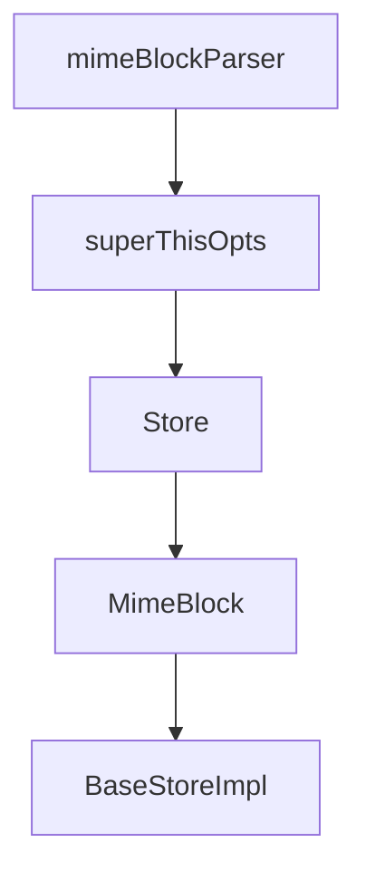

# Chapter 6: Files, Attachments, and Rich Data Flows

Welcome to **Chapter 6: Files, Attachments, and Rich Data Flows**. In this part of **Fireproof Tutorial: Local-First Document Database for AI-Native Apps**, you will build an intuitive mental model first, then move into concrete implementation details and practical production tradeoffs.


Fireproof supports richer document payloads through `_files` patterns and helper components like `ImgFile`.

## Rich Data Pattern

- store file objects in a document `_files` map
- persist metadata alongside attachments
- render media with Fireproof-aware UI components

## Example Use Cases

- profile images and asset galleries
- collaborative note attachments
- AI-generated media artifacts linked to document metadata

## Source References

- [Fireproof README: image workflows](https://github.com/fireproof-storage/fireproof/blob/main/README.md)
- [LLM docs bundle](https://use-fireproof.com/llms-full.txt)

## Summary

You now understand how to model and render rich media payloads in Fireproof documents.

Next: [Chapter 7: Runtime Coverage: Browser, Node, Deno, and Edge](07-runtime-coverage-browser-node-deno-and-edge.md)

## Source Code Walkthrough

### `core/runtime/utils.ts`

The `mimeBlockParser` function in [`core/runtime/utils.ts`](https://github.com/fireproof-storage/fireproof/blob/HEAD/core/runtime/utils.ts) handles a key part of this chapter's functionality:

```ts
}

export function mimeBlockParser(mime: string): MimeBlock[] {
  const blocks: MimeBlock[] = [];
  const lines = mime.split("\n");

  let i = 0;
  let lastProcessedIndex = -1; // Track the last line we've added to a block

  while (i < lines.length) {
    const line = lines[i];

    // Check if this line starts a PEM-style block
    // Minimum 3 dashes, allow optional whitespace before/after dashes and case-insensitive BEGIN/END
    const beginMatch = line.match(/^(-{3,})\s*(BEGIN)\s+(.+?)\s*(-{3,})$/i);

    if (beginMatch) {
      // Found a BEGIN marker
      const leadingDashes = beginMatch[1].length;
      const trailingDashes = beginMatch[4].length;
      const blockType = beginMatch[3];

      // Create a regex pattern for the matching END marker (case-insensitive)
      // Escape special regex characters in blockType
      const escapedBlockType = blockType.replace(/[.*+?^${}()|[\]\\]/g, "\\$&");
      // END marker must have the same number of leading and trailing dashes as BEGIN
      const endPattern = new RegExp(`^-{${leadingDashes}}\\s*(END)\\s+${escapedBlockType}\\s*-{${trailingDashes}}$`, "i");

      // Collect preBegin content (everything between lastProcessedIndex and current BEGIN)
      const preBegin: string[] = [];
      for (let j = lastProcessedIndex + 1; j < i; j++) {
        preBegin.push(lines[j]);
```

This function is important because it defines how Fireproof Tutorial: Local-First Document Database for AI-Native Apps implements the patterns covered in this chapter.

### `core/runtime/utils.ts`

The `superThisOpts` interface in [`core/runtime/utils.ts`](https://github.com/fireproof-storage/fireproof/blob/HEAD/core/runtime/utils.ts) handles a key part of this chapter's functionality:

```ts
const registerFP_DEBUG = new ResolveOnce();

interface superThisOpts {
  readonly logger: Logger;
  readonly env: Env;
  readonly pathOps: PathOps;
  readonly crypto: CryptoRuntime;
  readonly ctx: AppContext;
  readonly txt: TextEndeCoder;
}

class SuperThisImpl implements SuperThis {
  readonly logger: Logger;
  readonly env: Env;
  readonly pathOps: PathOps;
  readonly ctx: AppContext;
  readonly txt: TextEndeCoder;
  readonly crypto: CryptoRuntime;

  constructor(opts: superThisOpts) {
    this.logger = opts.logger;
    this.env = opts.env;
    this.crypto = opts.crypto;
    this.pathOps = opts.pathOps;
    this.txt = opts.txt;
    this.ctx = opts.ctx;
    // console.log("superThis", this);
  }

  nextId(bytes = 6): { str: string; bin: Uint8Array } {
    const bin = this.crypto.randomBytes(bytes);
    return {
```

This interface is important because it defines how Fireproof Tutorial: Local-First Document Database for AI-Native Apps implements the patterns covered in this chapter.

### `core/runtime/utils.ts`

The `Store` interface in [`core/runtime/utils.ts`](https://github.com/fireproof-storage/fireproof/blob/HEAD/core/runtime/utils.ts) handles a key part of this chapter's functionality:

```ts
  PARAM,
  PathOps,
  StoreType,
  SuperThis,
  SuperThisOpts,
  TextEndeCoder,
  PromiseToUInt8,
  ToUInt8,
  HasLogger,
} from "@fireproof/core-types-base";
import { base58btc } from "multiformats/bases/base58";
import { sha256 } from "multiformats/hashes/sha2";
import { CID } from "multiformats/cid";
import * as json from "multiformats/codecs/json";
import { XXH, XXH64 } from "@adviser/ts-xxhash";
import { z } from "zod/v4";

//export type { Logger };
//export { Result };

const _globalLogger = new ResolveOnce();
function globalLogger(): Logger {
  return _globalLogger.once(() => new LoggerImpl());
}

const registerFP_DEBUG = new ResolveOnce();

interface superThisOpts {
  readonly logger: Logger;
  readonly env: Env;
  readonly pathOps: PathOps;
  readonly crypto: CryptoRuntime;
```

This interface is important because it defines how Fireproof Tutorial: Local-First Document Database for AI-Native Apps implements the patterns covered in this chapter.

### `core/runtime/utils.ts`

The `MimeBlock` interface in [`core/runtime/utils.ts`](https://github.com/fireproof-storage/fireproof/blob/HEAD/core/runtime/utils.ts) handles a key part of this chapter's functionality:

```ts

*/
export interface MimeBlock {
  readonly preBegin?: string;
  readonly begin?: string;
  readonly end?: string;
  readonly postEnd?: string;
  readonly content: string;
}

export function mimeBlockParser(mime: string): MimeBlock[] {
  const blocks: MimeBlock[] = [];
  const lines = mime.split("\n");

  let i = 0;
  let lastProcessedIndex = -1; // Track the last line we've added to a block

  while (i < lines.length) {
    const line = lines[i];

    // Check if this line starts a PEM-style block
    // Minimum 3 dashes, allow optional whitespace before/after dashes and case-insensitive BEGIN/END
    const beginMatch = line.match(/^(-{3,})\s*(BEGIN)\s+(.+?)\s*(-{3,})$/i);

    if (beginMatch) {
      // Found a BEGIN marker
      const leadingDashes = beginMatch[1].length;
      const trailingDashes = beginMatch[4].length;
      const blockType = beginMatch[3];

      // Create a regex pattern for the matching END marker (case-insensitive)
      // Escape special regex characters in blockType
```

This interface is important because it defines how Fireproof Tutorial: Local-First Document Database for AI-Native Apps implements the patterns covered in this chapter.


## How These Components Connect


