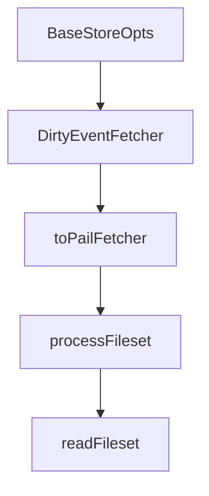

# Chapter 7: Runtime Coverage: Browser, Node, Deno, and Edge

Welcome to **Chapter 7: Runtime Coverage: Browser, Node, Deno, and Edge**. In this part of **Fireproof Tutorial: Local-First Document Database for AI-Native Apps**, you will build an intuitive mental model first, then move into concrete implementation details and practical production tradeoffs.


Fireproof is designed for broad JavaScript runtime portability with one API shape.

## Runtime Strategy

| Runtime | Notes |
|:--------|:------|
| Browser | first-class local-first target |
| Node.js | core API and file-based persistence |
| Deno | supported with runtime flags and config |
| Edge/cloud contexts | used through gateway/protocol adapters |

## Adoption Guidance

- pick one canonical runtime for baseline tests
- validate gateway behavior in each target environment
- avoid runtime-specific assumptions in shared domain logic

## Source References

- [Fireproof README: runtime support](https://github.com/fireproof-storage/fireproof/blob/main/README.md)
- [Monorepo runtime modules](https://github.com/fireproof-storage/fireproof/tree/main/core/runtime)

## Summary

You now have a portability model for deploying Fireproof across browser and server contexts.

Next: [Chapter 8: Production Operations, Security, and Debugging](08-production-operations-security-and-debugging.md)

## Source Code Walkthrough

### `core/blockstore/store.ts`

The `BaseStoreOpts` interface in [`core/blockstore/store.ts`](https://github.com/fireproof-storage/fireproof/blob/HEAD/core/blockstore/store.ts) handles a key part of this chapter's functionality:

```ts
}

export interface BaseStoreOpts {
  readonly gateway: InterceptorGateway;
  readonly loader: Loadable;
}

export abstract class BaseStoreImpl {
  // should be injectable

  abstract readonly storeType: StoreType;
  // readonly name: string;

  private _url: URI;
  readonly logger: Logger;
  readonly sthis: SuperThis;
  readonly gateway: InterceptorGateway;
  get realGateway(): SerdeGateway {
    return this.gateway.innerGW;
  }
  // readonly keybag: KeyBag;
  readonly opts: StoreOpts;
  readonly loader: Loadable;
  readonly myId: string;
  // readonly loader: Loadable;
  constructor(sthis: SuperThis, url: URI, opts: BaseStoreOpts, logger: Logger) {
    // this.name = name;
    this.myId = sthis.nextId().str;
    this._url = url;
    this.opts = opts;
    // this.keybag = opts.keybag;
    this.loader = opts.loader;
```

This interface is important because it defines how Fireproof Tutorial: Local-First Document Database for AI-Native Apps implements the patterns covered in this chapter.

### `core/base/crdt-helpers.ts`

The `DirtyEventFetcher` class in [`core/base/crdt-helpers.ts`](https://github.com/fireproof-storage/fireproof/blob/HEAD/core/base/crdt-helpers.ts) handles a key part of this chapter's functionality:

```ts
}

class DirtyEventFetcher<T> extends EventFetcher<T> {
  readonly logger: Logger;
  constructor(logger: Logger, blocks: BlockFetcher) {
    super(toPailFetcher(blocks));
    this.logger = logger;
  }
  async get(link: EventLink<T>): Promise<EventBlockView<T>> {
    try {
      return await super.get(link);
    } catch (e) {
      this.logger.Error().Ref("link", link.toString()).Err(e).Msg("Missing event");
      return { value: undefined } as unknown as EventBlockView<T>;
    }
  }
}

export async function clockChangesSince<T extends DocTypes>(
  blocks: BlockFetcher,
  head: ClockHead,
  since: ClockHead,
  opts: ChangesOptions,
  logger: Logger,
): Promise<{ result: DocUpdate<T>[]; head: ClockHead }> {
  const eventsFetcher = (
    opts.dirty ? new DirtyEventFetcher<Operation>(logger, blocks) : new EventFetcher<Operation>(toPailFetcher(blocks))
  ) as EventFetcher<Operation>;
  const keys = new Set<string>();
  const updates = await gatherUpdates<T>(
    blocks,
    eventsFetcher,
```

This class is important because it defines how Fireproof Tutorial: Local-First Document Database for AI-Native Apps implements the patterns covered in this chapter.

### `core/base/crdt-helpers.ts`

The `toPailFetcher` function in [`core/base/crdt-helpers.ts`](https://github.com/fireproof-storage/fireproof/blob/HEAD/core/base/crdt-helpers.ts) handles a key part of this chapter's functionality:

```ts
}

export function toPailFetcher(tblocks: BlockFetcher): PailBlockFetcher {
  return {
    get: async <T = unknown, C extends number = number, A extends number = number, V extends Version = 1>(
      link: Link<T, C, A, V>,
    ) => {
      const block = await tblocks.get(link);
      return block
        ? ({
            cid: block.cid,
            bytes: block.bytes,
          } as Block<T, C, A, V>)
        : undefined;
    },
  };
}

export function sanitizeDocumentFields<T>(obj: T): T {
  if (Array.isArray(obj)) {
    return obj.map((item: unknown) => {
      if (typeof item === "object" && item !== null) {
        return sanitizeDocumentFields(item);
      }
      return item;
    }) as T;
  } else if (typeof obj === "object" && obj !== null) {
    // Preserve Uint8Array for CBOR byte string encoding
    if (isUint8Array(obj)) {
      return obj;
    }
    // Special case for Date objects - convert to ISO string
```

This function is important because it defines how Fireproof Tutorial: Local-First Document Database for AI-Native Apps implements the patterns covered in this chapter.

### `core/base/crdt-helpers.ts`

The `processFileset` function in [`core/base/crdt-helpers.ts`](https://github.com/fireproof-storage/fireproof/blob/HEAD/core/base/crdt-helpers.ts) handles a key part of this chapter's functionality:

```ts
async function processFiles<T extends DocTypes>(store: StoreRuntime, blocks: CarTransaction, doc: DocSet<T>, logger: Logger) {
  if (doc._files) {
    await processFileset(logger, store, blocks, doc._files);
  }
  if (doc._publicFiles) {
    await processFileset(logger, store, blocks, doc._publicFiles /*, true*/);
  }
}

async function processFileset(
  logger: Logger,
  store: StoreRuntime,
  blocks: CarTransaction,
  files: DocFiles /*, publicFiles = false */,
) {
  const dbBlockstore = blocks.parent as unknown as EncryptedBlockstore;
  if (!dbBlockstore.loader) throw logger.Error().Msg("Missing loader, ledger name is required").AsError();
  const t = new CarTransactionImpl(dbBlockstore); // maybe this should move to encrypted-blockstore
  const didPut = [];
  // let totalSize = 0
  for (const filename in files) {
    if (File === files[filename].constructor) {
      const file = files[filename] as File;

      // totalSize += file.size
      const { cid, blocks: fileBlocks } = await store.encodeFile(file);
      didPut.push(filename);
      for (const block of fileBlocks) {
        // console.log("processFileset", block.cid.toString())
        t.putSync(await fileBlock2FPBlock(block));
      }
      files[filename] = { cid, type: file.type, size: file.size, lastModified: file.lastModified } as DocFileMeta;
```

This function is important because it defines how Fireproof Tutorial: Local-First Document Database for AI-Native Apps implements the patterns covered in this chapter.


## How These Components Connect


