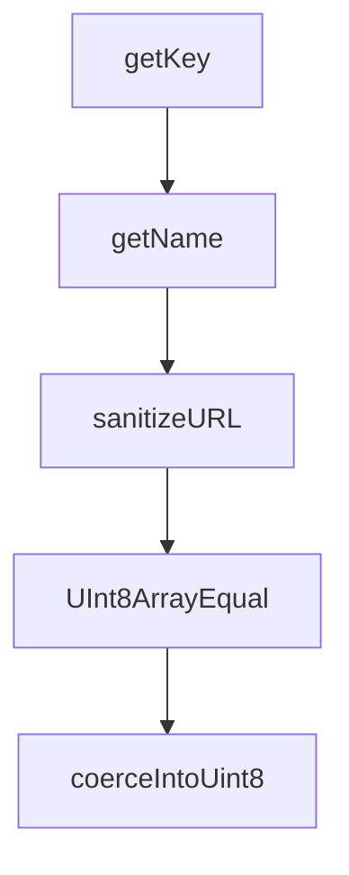

# Chapter 7: Runtime Coverage: Browser, Node, Deno, and Edge

Welcome to **Chapter 7: Runtime Coverage: Browser, Node, Deno, and Edge**. In this part of **Fireproof Tutorial: Local-First Document Database for AI-Native Apps**, you will build an intuitive mental model first, then move into concrete implementation details and practical production tradeoffs.


Fireproof is designed for broad JavaScript runtime portability with one API shape.

## Runtime Strategy

| Runtime | Notes |
|:--------|:------|
| Browser | first-class local-first target |
| Node.js | core API and file-based persistence |
| Deno | supported with runtime flags and config |
| Edge/cloud contexts | used through gateway/protocol adapters |

## Adoption Guidance

- pick one canonical runtime for baseline tests
- validate gateway behavior in each target environment
- avoid runtime-specific assumptions in shared domain logic

## Source References

- [Fireproof README: runtime support](https://github.com/fireproof-storage/fireproof/blob/main/README.md)
- [Monorepo runtime modules](https://github.com/fireproof-storage/fireproof/tree/main/core/runtime)

## Summary

You now have a portability model for deploying Fireproof across browser and server contexts.

Next: [Chapter 8: Production Operations, Security, and Debugging](08-production-operations-security-and-debugging.md)

## Depth Expansion Playbook

## Source Code Walkthrough

### `core/runtime/utils.ts`

The `getKey` function in [`core/runtime/utils.ts`](https://github.com/fireproof-storage/fireproof/blob/HEAD/core/runtime/utils.ts) handles a key part of this chapter's functionality:

```ts
}

export function getKey(url: URI, logger: Logger): string {
  const result = url.getParam(PARAM.KEY);
  if (!result) throw logger.Error().Str("url", url.toString()).Msg(`key not found`).AsError();
  return result;
}

export function getName(sthis: SuperThis, url: URI): string {
  let result = url.getParam(PARAM.NAME);
  if (!result) {
    result = sthis.pathOps.dirname(url.pathname);
    if (result.length === 0) {
      throw sthis.logger.Error().Str("url", url.toString()).Msg(`name not found`).AsError();
    }
  }
  return result;
}

// export function exception2Result<T = void>(fn: () => Promise<T>): Promise<Result<T>> {
//   return fn()
//     .then((value) => Result.Ok(value))
//     .catch((e) => Result.Err(e));
// }

export async function exceptionWrapper<T, E extends Error>(fn: () => Promise<Result<T, E>>): Promise<Result<T, E>> {
  return fn().catch((e) => Result.Err(e));
}

// // the big side effect party --- hate it
// export function sanitizeURL(url: URL) {
//   url.searchParams.sort();
```

This function is important because it defines how Fireproof Tutorial: Local-First Document Database for AI-Native Apps implements the patterns covered in this chapter.

### `core/runtime/utils.ts`

The `getName` function in [`core/runtime/utils.ts`](https://github.com/fireproof-storage/fireproof/blob/HEAD/core/runtime/utils.ts) handles a key part of this chapter's functionality:

```ts
}

export function getName(sthis: SuperThis, url: URI): string {
  let result = url.getParam(PARAM.NAME);
  if (!result) {
    result = sthis.pathOps.dirname(url.pathname);
    if (result.length === 0) {
      throw sthis.logger.Error().Str("url", url.toString()).Msg(`name not found`).AsError();
    }
  }
  return result;
}

// export function exception2Result<T = void>(fn: () => Promise<T>): Promise<Result<T>> {
//   return fn()
//     .then((value) => Result.Ok(value))
//     .catch((e) => Result.Err(e));
// }

export async function exceptionWrapper<T, E extends Error>(fn: () => Promise<Result<T, E>>): Promise<Result<T, E>> {
  return fn().catch((e) => Result.Err(e));
}

// // the big side effect party --- hate it
// export function sanitizeURL(url: URL) {
//   url.searchParams.sort();
//   // const searchParams = Object.entries(url.searchParams).sort(([a], [b]) => a.localeCompare(b));
//   // console.log("searchParams", searchParams);
//   // for (const [key] of searchParams) {
//   //   url.searchParams.delete(key);
//   // }
//   // for (const [key, value] of searchParams) {
```

This function is important because it defines how Fireproof Tutorial: Local-First Document Database for AI-Native Apps implements the patterns covered in this chapter.

### `core/runtime/utils.ts`

The `sanitizeURL` function in [`core/runtime/utils.ts`](https://github.com/fireproof-storage/fireproof/blob/HEAD/core/runtime/utils.ts) handles a key part of this chapter's functionality:

```ts

// // the big side effect party --- hate it
// export function sanitizeURL(url: URL) {
//   url.searchParams.sort();
//   // const searchParams = Object.entries(url.searchParams).sort(([a], [b]) => a.localeCompare(b));
//   // console.log("searchParams", searchParams);
//   // for (const [key] of searchParams) {
//   //   url.searchParams.delete(key);
//   // }
//   // for (const [key, value] of searchParams) {
//   //   url.searchParams.set(key, value);
//   // }
// }

export function UInt8ArrayEqual(a: Uint8Array, b: Uint8Array): boolean {
  if (a.length !== b.length) {
    return false;
  }
  for (let i = 0; i < a.length; i++) {
    if (a[i] !== b[i]) {
      return false;
    }
  }
  return true;
}

export function inplaceFilter<T>(i: T[], pred: (i: T, idx: number) => boolean): T[] {
  const founds: number[] = [];
  for (let j = 0; j < i.length; j++) {
    if (!pred(i[j], j)) {
      founds.push(j);
    }
```

This function is important because it defines how Fireproof Tutorial: Local-First Document Database for AI-Native Apps implements the patterns covered in this chapter.

### `core/runtime/utils.ts`

The `UInt8ArrayEqual` function in [`core/runtime/utils.ts`](https://github.com/fireproof-storage/fireproof/blob/HEAD/core/runtime/utils.ts) handles a key part of this chapter's functionality:

```ts
// }

export function UInt8ArrayEqual(a: Uint8Array, b: Uint8Array): boolean {
  if (a.length !== b.length) {
    return false;
  }
  for (let i = 0; i < a.length; i++) {
    if (a[i] !== b[i]) {
      return false;
    }
  }
  return true;
}

export function inplaceFilter<T>(i: T[], pred: (i: T, idx: number) => boolean): T[] {
  const founds: number[] = [];
  for (let j = 0; j < i.length; j++) {
    if (!pred(i[j], j)) {
      founds.push(j);
    }
  }
  for (let j = founds.length - 1; j >= 0; j--) {
    i.splice(founds[j], 1);
  }
  return i;
}

export function coerceIntoUint8(raw: ToUInt8): Result<Uint8Array> {
  if (raw instanceof Uint8Array) {
    return Result.Ok(raw);
  }
  if (Result.Is(raw)) {
```

This function is important because it defines how Fireproof Tutorial: Local-First Document Database for AI-Native Apps implements the patterns covered in this chapter.


## How These Components Connect


