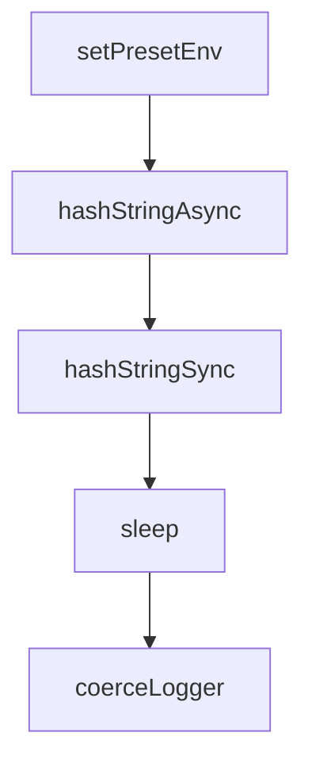

# Chapter 8: Production Operations, Security, and Debugging

Welcome to **Chapter 8: Production Operations, Security, and Debugging**. In this part of **Fireproof Tutorial: Local-First Document Database for AI-Native Apps**, you will build an intuitive mental model first, then move into concrete implementation details and practical production tradeoffs.


Production Fireproof deployments need explicit practices for observability, key handling, and test discipline.

## Operations Checklist

1. define storage and sync boundaries per environment
2. validate backup/recovery behavior of persisted stores
3. enforce version pinning in lockfiles and CI
4. run representative integration tests for gateway paths

## Debugging Controls

- use `FP_DEBUG` for targeted module logging
- standardize log format options per environment (`json`, `yaml`, etc.)
- track sync and conflict behavior during load and offline/online transitions

## Security Notes

- treat key material management as a first-class deployment concern
- audit any insecure/deprecated key extraction behavior before production use
- document trust model when syncing over shared object storage

## Source References

- [Fireproof README: debug and keybag notes](https://github.com/fireproof-storage/fireproof/blob/main/README.md)
- [CI workflow set](https://github.com/fireproof-storage/fireproof/tree/main/.github/workflows)

## Summary

You now have a practical baseline for operating Fireproof in production-grade app workflows.

## Depth Expansion Playbook

## Source Code Walkthrough

### `core/runtime/utils.ts`

The `setPresetEnv` function in [`core/runtime/utils.ts`](https://github.com/fireproof-storage/fireproof/blob/HEAD/core/runtime/utils.ts) handles a key part of this chapter's functionality:

```ts
    ...Array.from(
      Object.entries({
        ...setPresetEnv({}),
        ...preset,
      }),
    ), // .map(([k, v]) => [k, v as string])
  ]);
  // console.log(">>>>>>", penv)
  return penv;
}
// const envImpl = envFactory({
//   symbol: "FP_ENV",
//   presetEnv: presetEnv(),
// });
class pathOpsImpl implements PathOps {
  join(...paths: string[]): string {
    return paths.map((i) => i.replace(/\/+$/, "")).join("/");
  }
  dirname(path: string) {
    return path.split("/").slice(0, -1).join("/");
  }
  basename(path: string): string {
    return path.split("/").pop() || "";
  }
  // homedir() {
  //     throw new Error("SysContainer:homedir is not available in seeded state");
  //   }
}
const pathOps = new pathOpsImpl();
const txtOps = ((txtEncoder, txtDecoder) => ({
  id: () => "fp-txtOps",
  encode: (input: string) => txtEncoder.encode(input),
```

This function is important because it defines how Fireproof Tutorial: Local-First Document Database for AI-Native Apps implements the patterns covered in this chapter.

### `core/runtime/utils.ts`

The `hashStringAsync` function in [`core/runtime/utils.ts`](https://github.com/fireproof-storage/fireproof/blob/HEAD/core/runtime/utils.ts) handles a key part of this chapter's functionality:

```ts
  }
}
export async function hashStringAsync(str: string): Promise<string> {
  const bytes = json.encode(str);
  const hash = await sha256.digest(bytes);
  return CID.create(1, json.code, hash).toString();
}

export function hashStringSync(str: string): string {
  return new Hasher().update(str).digest();
}

export function hashObjectSync<T extends NonNullable<S>, S>(o: T): string {
  const hasher = new Hasher();
  toSorted(o, (x, key) => {
    switch (key) {
      case "Null":
      case "Array":
      case "Function":
        break;
      case "Date":
        hasher.update(`D:${(x as Date).toISOString()}`);
        break;
      case "Symbol":
        hasher.update(`S:(x as symbol).toString()}`);
        break;
      case "Key":
        hasher.update(`K:${x as string}`);
        break;
      case "String":
        hasher.update(`S:${x as string}`);
        break;
```

This function is important because it defines how Fireproof Tutorial: Local-First Document Database for AI-Native Apps implements the patterns covered in this chapter.

### `core/runtime/utils.ts`

The `hashStringSync` function in [`core/runtime/utils.ts`](https://github.com/fireproof-storage/fireproof/blob/HEAD/core/runtime/utils.ts) handles a key part of this chapter's functionality:

```ts
}

export function hashStringSync(str: string): string {
  return new Hasher().update(str).digest();
}

export function hashObjectSync<T extends NonNullable<S>, S>(o: T): string {
  const hasher = new Hasher();
  toSorted(o, (x, key) => {
    switch (key) {
      case "Null":
      case "Array":
      case "Function":
        break;
      case "Date":
        hasher.update(`D:${(x as Date).toISOString()}`);
        break;
      case "Symbol":
        hasher.update(`S:(x as symbol).toString()}`);
        break;
      case "Key":
        hasher.update(`K:${x as string}`);
        break;
      case "String":
        hasher.update(`S:${x as string}`);
        break;
      case "Boolean":
        hasher.update(`B:${x ? "true" : "false"}`);
        break;
      case "Number":
        hasher.update(`N:${(x as number).toString()}`);
        break;
```

This function is important because it defines how Fireproof Tutorial: Local-First Document Database for AI-Native Apps implements the patterns covered in this chapter.

### `core/runtime/utils.ts`

The `sleep` function in [`core/runtime/utils.ts`](https://github.com/fireproof-storage/fireproof/blob/HEAD/core/runtime/utils.ts) handles a key part of this chapter's functionality:

```ts
}

export function sleep(ms: number) {
  return new Promise((resolve) => setTimeout(resolve, ms));
}

/**
 * Deep clone a value
 */
export function deepClone<T>(value: T): T {
  return (structuredClone ?? ((v: T) => JSON.parse(JSON.stringify(v))))(value);
}

function coerceLogger(loggerOrHasLogger: Logger | HasLogger): Logger {
  if (IsLogger(loggerOrHasLogger)) {
    return loggerOrHasLogger;
  } else {
    return loggerOrHasLogger.logger;
  }
}

export function timerStart(loggerOrHasLogger: Logger | HasLogger, tag: string) {
  coerceLogger(loggerOrHasLogger).Debug().TimerStart(tag).Msg("Timing started");
}

export function timerEnd(loggerOrHasLogger: Logger | HasLogger, tag: string) {
  coerceLogger(loggerOrHasLogger).Debug().TimerEnd(tag).Msg("Timing ended");
}

export function deepFreeze<T extends object>(o?: T): T | undefined {
  if (!o) return undefined;
  Object.freeze(o);
```

This function is important because it defines how Fireproof Tutorial: Local-First Document Database for AI-Native Apps implements the patterns covered in this chapter.


## How These Components Connect


