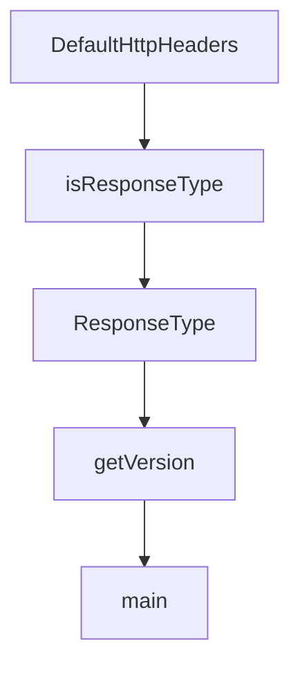

# Chapter 8: Production Operations, Security, and Debugging

Welcome to **Chapter 8: Production Operations, Security, and Debugging**. In this part of **Fireproof Tutorial: Local-First Document Database for AI-Native Apps**, you will build an intuitive mental model first, then move into concrete implementation details and practical production tradeoffs.


Production Fireproof deployments need explicit practices for observability, key handling, and test discipline.

## Operations Checklist

1. define storage and sync boundaries per environment
2. validate backup/recovery behavior of persisted stores
3. enforce version pinning in lockfiles and CI
4. run representative integration tests for gateway paths

## Debugging Controls

- use `FP_DEBUG` for targeted module logging
- standardize log format options per environment (`json`, `yaml`, etc.)
- track sync and conflict behavior during load and offline/online transitions

## Security Notes

- treat key material management as a first-class deployment concern
- audit any insecure/deprecated key extraction behavior before production use
- document trust model when syncing over shared object storage

## Source References

- [Fireproof README: debug and keybag notes](https://github.com/fireproof-storage/fireproof/blob/main/README.md)
- [CI workflow set](https://github.com/fireproof-storage/fireproof/tree/main/.github/workflows)

## Summary

You now have a practical baseline for operating Fireproof in production-grade app workflows.

## Source Code Walkthrough

### `dashboard/backend/create-handler.ts`

The `DefaultHttpHeaders` function in [`dashboard/backend/create-handler.ts`](https://github.com/fireproof-storage/fireproof/blob/HEAD/dashboard/backend/create-handler.ts) handles a key part of this chapter's functionality:

```ts
);

export function DefaultHttpHeaders(...h: CoercedHeadersInit[]): HeadersInit {
  return defaultHttpHeaders()
    .Merge(...h)
    .AsHeaderInit();
}

export type DashSqlite = BaseSQLiteDatabase<"async", ResultSet | D1Result, Record<string, never>>;

export type BindPromise<T> = (promise: Promise<T>) => Promise<T>;

class ReqResEventoEnDecoder implements EventoEnDecoder<Request, string> {
  async encode(args: Request): Promise<Result<unknown>> {
    if (args.method === "POST" || args.method === "PUT") {
      const body = (await args.json()) as unknown;
      return Result.Ok(body);
    }
    return Result.Ok(null);
  }
  decode(data: unknown): Promise<Result<string>> {
    return Promise.resolve(Result.Ok(JSON.stringify(data)));
  }
}

interface ResponseType {
  type: "Response";
  payload: {
    status: number;
    headers: HeadersInit;
    body: BodyInit;
  };
```

This function is important because it defines how Fireproof Tutorial: Local-First Document Database for AI-Native Apps implements the patterns covered in this chapter.

### `dashboard/backend/create-handler.ts`

The `isResponseType` function in [`dashboard/backend/create-handler.ts`](https://github.com/fireproof-storage/fireproof/blob/HEAD/dashboard/backend/create-handler.ts) handles a key part of this chapter's functionality:

```ts
}

function isResponseType(obj: unknown): obj is ResponseType {
  if (typeof obj !== "object" || obj === null) {
    return false;
  }
  return (obj as ResponseType).type === "Response";
}

export const fpApiEvento = Lazy(() => {
  const evento = new Evento(new ReqResEventoEnDecoder());
  evento.push(
    {
      hash: "cors-preflight",
      validate: (ctx: ValidateTriggerCtx<Request, unknown, unknown>) => {
        const { request: req } = ctx;
        if (req && req.method === "OPTIONS") {
          return Promise.resolve(Result.Ok(Option.Some("Send CORS preflight response")));
        }
        return Promise.resolve(Result.Ok(Option.None()));
      },
      handle: async (ctx: HandleTriggerCtx<Request, string, unknown>): Promise<Result<EventoResultType>> => {
        await ctx.send.send(ctx, {
          type: "Response",
          payload: {
            status: 200,
            headers: DefaultHttpHeaders({ "Content-Type": "application/json" }),
            body: JSON.stringify({ type: "ok", message: "CORS preflight" }),
          },
        } satisfies ResponseType);
        return Result.Ok(EventoResult.Stop);
      },
```

This function is important because it defines how Fireproof Tutorial: Local-First Document Database for AI-Native Apps implements the patterns covered in this chapter.

### `dashboard/backend/create-handler.ts`

The `ResponseType` interface in [`dashboard/backend/create-handler.ts`](https://github.com/fireproof-storage/fireproof/blob/HEAD/dashboard/backend/create-handler.ts) handles a key part of this chapter's functionality:

```ts
}

interface ResponseType {
  type: "Response";
  payload: {
    status: number;
    headers: HeadersInit;
    body: BodyInit;
  };
}

function isResponseType(obj: unknown): obj is ResponseType {
  if (typeof obj !== "object" || obj === null) {
    return false;
  }
  return (obj as ResponseType).type === "Response";
}

export const fpApiEvento = Lazy(() => {
  const evento = new Evento(new ReqResEventoEnDecoder());
  evento.push(
    {
      hash: "cors-preflight",
      validate: (ctx: ValidateTriggerCtx<Request, unknown, unknown>) => {
        const { request: req } = ctx;
        if (req && req.method === "OPTIONS") {
          return Promise.resolve(Result.Ok(Option.Some("Send CORS preflight response")));
        }
        return Promise.resolve(Result.Ok(Option.None()));
      },
      handle: async (ctx: HandleTriggerCtx<Request, string, unknown>): Promise<Result<EventoResultType>> => {
        await ctx.send.send(ctx, {
```

This interface is important because it defines how Fireproof Tutorial: Local-First Document Database for AI-Native Apps implements the patterns covered in this chapter.

### `smoke/get-fp-version.js`

The `getVersion` function in [`smoke/get-fp-version.js`](https://github.com/fireproof-storage/fireproof/blob/HEAD/smoke/get-fp-version.js) handles a key part of this chapter's functionality:

```js
import * as process from "node:process";

function getVersion(version = "refs/tags/v0.0.0-smoke") {
  if (process.env.GITHUB_REF && process.env.GITHUB_REF.startsWith("refs/tags/v")) {
    version = process.env.GITHUB_REF;
  }
  return version.split("/").slice(-1)[0].replace(/^v/, "");
}

async function main() {
  const gitHead = (await $`git rev-parse --short HEAD`).stdout.trim();
  const dateTick = (await $`date +%s`).stdout.trim();
  // eslint-disable-next-line no-console, no-undef
  console.log(getVersion(`refs/tags/v0.0.0-smoke-${gitHead}-${dateTick}`));
}

main().catch((e) => {
  // eslint-disable-next-line no-console, no-undef
  console.error(e);
  process.exit(1);
});

```

This function is important because it defines how Fireproof Tutorial: Local-First Document Database for AI-Native Apps implements the patterns covered in this chapter.


## How These Components Connect


