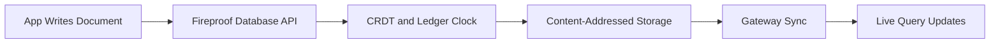

# Fireproof Tutorial: Local-First Document Database for AI-Native Apps

> Learn how to use `fireproof-storage/fireproof` to build local-first, encrypted, sync-capable applications with a unified browser/Node/Deno API and React hooks.

## Why This Track Matters

For AI-generated and collaborative apps, teams need data systems that run locally, sync later, and still preserve integrity. Fireproof is designed for that model with document APIs, live queries, and cryptographic causal consistency.

This track focuses on:

- document lifecycle and query model
- React hook workflows for live local-first UX
- gateway and sync architecture across runtimes
- production governance for encryption, debugging, and operations

## Current Snapshot (Verified February 12, 2026)

- repository: [`fireproof-storage/fireproof`](https://github.com/fireproof-storage/fireproof)
- stars: about **946**
- latest tags: `v0.24.1-dev-react19` and `v0.23.8`
- recent activity: updates on **February 11, 2026**
- project positioning: local-first embedded document database with encrypted sync

## Mental Model

## Chapter Guide

| Chapter | Key Question | Outcome |
|:--------|:-------------|:--------|
| [01 - Getting Started](01-getting-started.md) | How do I run Fireproof quickly in app code? | Working local baseline |
| [02 - Core Document API and Query Lifecycle](02-core-document-api-and-query-lifecycle.md) | How do `put/get/query/changes` behave? | Strong data model mental model |
| [03 - React Hooks and Live Local-First UX](03-react-hooks-and-live-local-first-ux.md) | How do `useFireproof`, `useLiveQuery`, and `useDocument` fit together? | Real-time UX baseline |
| [04 - Ledger, CRDT, and Causal Consistency](04-ledger-crdt-and-causal-consistency.md) | How does Fireproof maintain integrity in multi-writer scenarios? | Better correctness model |
| [05 - Storage Gateways and Sync Topology](05-storage-gateways-and-sync-topology.md) | How is data persisted and synchronized across environments? | Deployment architecture clarity |
| [06 - Files, Attachments, and Rich Data Flows](06-files-attachments-and-rich-data-flows.md) | How do image/file flows work with Fireproof docs? | Rich content implementation pattern |
| [07 - Runtime Coverage: Browser, Node, Deno, and Edge](07-runtime-coverage-browser-node-deno-and-edge.md) | Where and how can Fireproof run? | Cross-runtime strategy |
| [08 - Production Operations, Security, and Debugging](08-production-operations-security-and-debugging.md) | How do teams operate Fireproof safely at scale? | Ops and security baseline |

## What You Will Learn

- how to structure local-first document workflows for AI-native apps
- how live query/reactive patterns map to Fireproof APIs
- how sync and storage gateways support multi-environment deployments
- how to debug and secure Fireproof usage in production workflows

## Source References

- [Fireproof Repository](https://github.com/fireproof-storage/fireproof)
- [Fireproof README](https://github.com/fireproof-storage/fireproof/blob/main/README.md)
- [Database implementation](https://github.com/fireproof-storage/fireproof/blob/main/core/base/database.ts)
- [Ledger implementation](https://github.com/fireproof-storage/fireproof/blob/main/core/base/ledger.ts)
- [IndexedDB gateway](https://github.com/fireproof-storage/fireproof/blob/main/core/gateways/indexeddb/gateway-impl.ts)

## Related Tutorials

- [Supabase Tutorial](../supabase-tutorial/)
- [RagFlow Tutorial](../ragflow-tutorial/)
- [OpenCode Tutorial](../opencode-tutorial/)
- [Plandex Tutorial](../plandex-tutorial/)

---

Start with [Chapter 1: Getting Started](01-getting-started.md).
