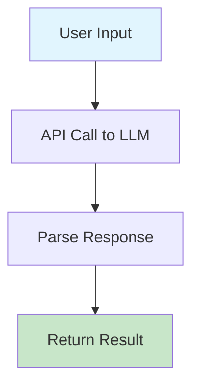
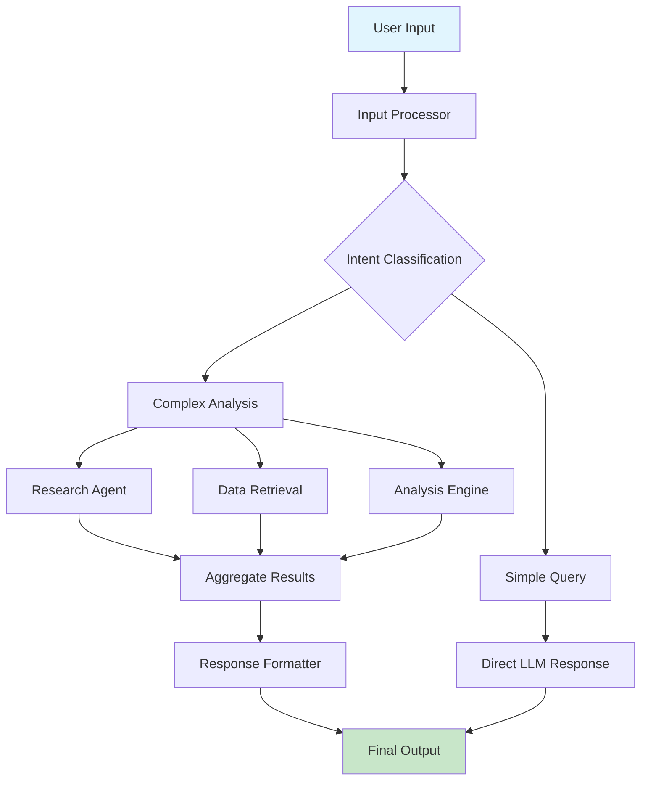
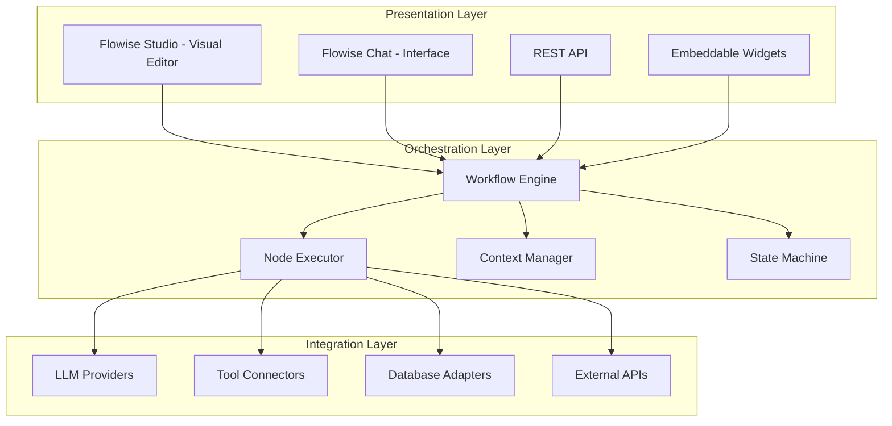
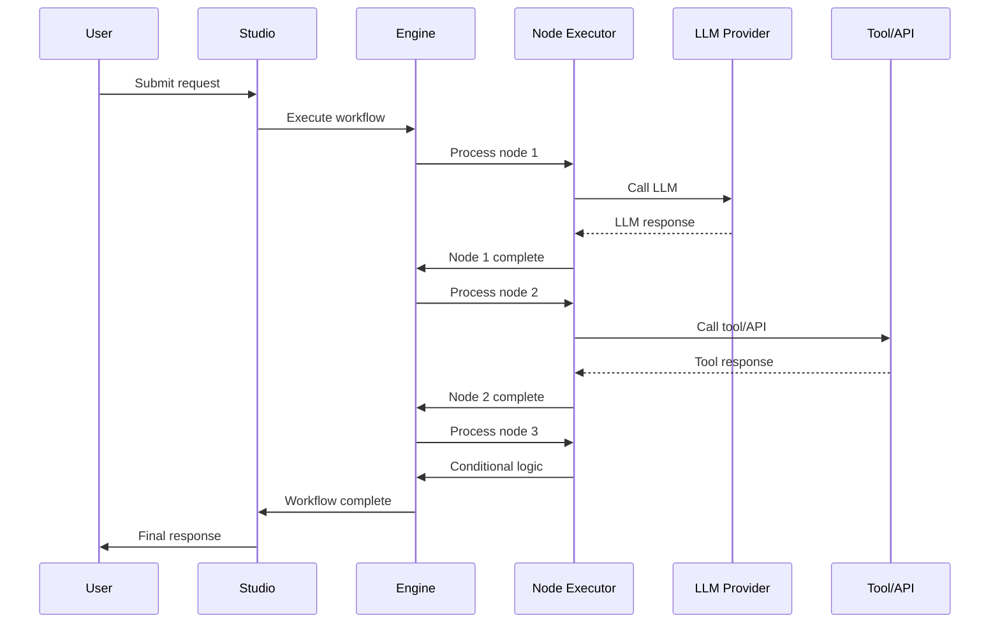
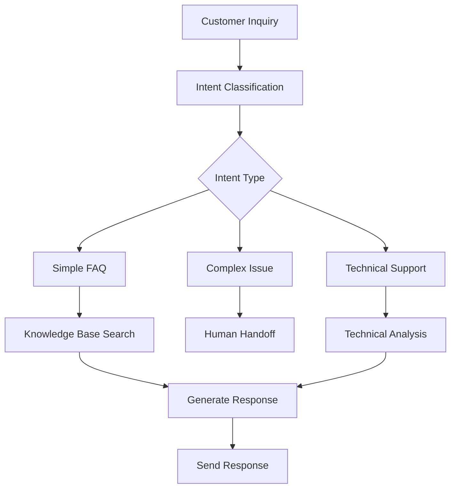
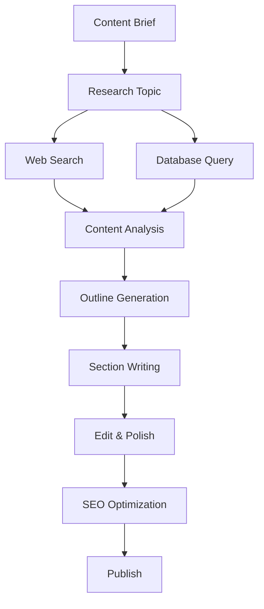
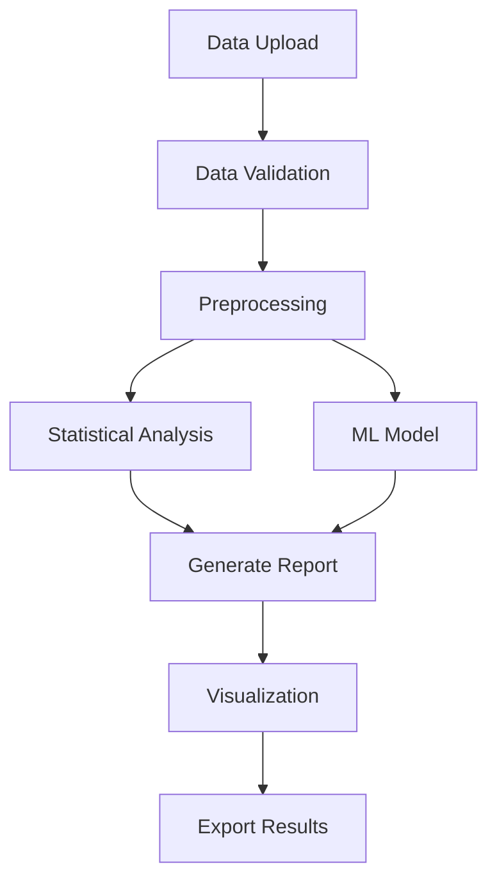

# Chapter 1: Flowise System Overview

Welcome to **Chapter 1: Flowise System Overview**. In this part of **Flowise LLM Orchestration: Deep Dive Tutorial**, you will build an intuitive mental model first, then move into concrete implementation details and practical production tradeoffs.


> Understanding Flowise's visual LLM workflow orchestration platform

## 🎯 Learning Objectives

By the end of this chapter, you'll understand:
- Flowise's role in the LLM application ecosystem
- Core architectural components and design principles
- The visual workflow paradigm for LLM applications
- Key features and capabilities that differentiate Flowise

## 🤖 The LLM Workflow Challenge

### **From Single API Calls to Complex Applications**

Traditional LLM integration often follows this pattern:



**Limitations of this approach:**
- **Single-turn conversations**: No memory or context between calls
- **Rigid processing**: Fixed pipeline with no branching or conditional logic
- **Error handling**: Basic retry logic without sophisticated recovery
- **Scalability**: Difficult to parallelize or distribute processing
- **Maintenance**: Hard-coded logic mixed with business rules

### **The Workflow Orchestration Solution**

Flowise introduces visual workflow orchestration:



## 🏗️ What is Flowise?

Flowise is an open-source, low-code platform for building customized LLM orchestration flows with a drag-and-drop interface.

### **Core Mission**
> **Democratize LLM workflow creation** by providing visual tools that make complex AI pipelines accessible to developers and non-technical users alike.

### **Key Design Principles**

| Principle | Description | Impact |
|:----------|:------------|:-------|
| **Visual First** | Drag-and-drop workflow builder | Eliminates coding barriers |
| **Modular Architecture** | Reusable components and templates | Promotes consistency and reuse |
| **Extensible** | Plugin system for custom nodes | Adapts to specific use cases |
| **Production Ready** | Built-in scaling, monitoring, and error handling | Enterprise-grade reliability |
| **Multi-Provider** | Supports 100+ LLM providers and tools | Avoids vendor lock-in |

## 🏛️ Flowise Architecture Overview

### **Three-Layer Architecture**



### **Core Components**

1. **Flowise Studio**: Visual workflow builder and management interface
2. **Workflow Engine**: Executes complex multi-step LLM processes
3. **Node System**: Modular components for different operations
4. **Context Manager**: Maintains state and memory across workflow steps
5. **Integration Layer**: Connects to external services and data sources

## 🔄 Workflow Execution Model

### **Node-Based Processing**

Flowise workflows are composed of interconnected nodes, each handling a specific operation:

```javascript
// Example workflow definition
const customerSupportWorkflow = {
  "nodes": [
    {
      "id": "input_1",
      "type": "chatPrompt",
      "data": {
        "prompt": "How can I help you today?"
      }
    },
    {
      "id": "llm_1",
      "type": "chatOpenAI",
      "data": {
        "modelName": "gpt-3.5-turbo",
        "temperature": 0.7,
        "maxTokens": 256
      }
    },
    {
      "id": "condition_1",
      "type": "ifElse",
      "data": {
        "condition": "contains(user_input, 'refund')"
      }
    },
    {
      "id": "tool_1",
      "type": "httpRequest",
      "data": {
        "method": "GET",
        "url": "https://api.company.com/refunds",
        "headers": {
          "Authorization": "Bearer {{API_KEY}}"
        }
      }
    }
  ],
  "edges": [
    {
      "source": "input_1",
      "target": "llm_1"
    },
    {
      "source": "llm_1",
      "target": "condition_1"
    },
    {
      "source": "condition_1",
      "target": "tool_1",
      "condition": "refund_request"
    }
  ]
};
```

### **Execution Flow**



## 🧩 Node Ecosystem

### **Built-in Node Categories**

| Category | Description | Example Nodes |
|:---------|:------------|:--------------|
| **Input/Output** | Handle data flow | Chat Prompt, Text Input, Output |
| **LLMs** | Language model interactions | OpenAI GPT, Anthropic Claude, Local models |
| **Tools** | External integrations | HTTP Request, Database Query, File Operations |
| **Logic** | Control flow | If/Else, Loops, Switch, Router |
| **Data Processing** | Transform data | JSON Parser, Text Splitter, Template |
| **Memory** | State management | Conversation Buffer, Vector Store, Cache |

### **Node Interface Standard**

All nodes implement a consistent interface:

```typescript
interface FlowiseNode {
  id: string;
  type: string;
  data: NodeData;
  position: { x: number; y: number };

  // Execution methods
  init?(context: ExecutionContext): Promise<void>;
  execute(input: NodeInput, context: ExecutionContext): Promise<NodeOutput>;
  dispose?(): Promise<void>;

  // Configuration
  getConfigSchema(): JSONSchema;
  validateConfig(config: any): boolean;

  // UI properties
  getIcon(): string;
  getLabel(): string;
  getDescription(): string;
  getCategory(): string;
}
```

## 🔧 Technology Stack

### **Frontend Architecture**

```typescript
// React Flow for visual workflow builder
import ReactFlow, {
  Node,
  Edge,
  addEdge,
  useNodesState,
  useEdgesState,
  Controls,
  Background,
} from 'reactflow';

const WorkflowCanvas = () => {
  const [nodes, setNodes, onNodesChange] = useNodesState([]);
  const [edges, setEdges, onEdgesChange] = useEdgesState([]);

  const onConnect = useCallback(
    (params) => setEdges((eds) => addEdge(params, eds)),
    [setEdges]
  );

  return (
    <div style={{ width: '100vw', height: '70vh' }}>
      <ReactFlow
        nodes={nodes}
        edges={edges}
        onNodesChange={onNodesChange}
        onEdgesChange={onEdgesChange}
        onConnect={onConnect}
        fitView
      >
        <Controls />
        <Background />
      </ReactFlow>
    </div>
  );
};
```

### **Backend Architecture**

```javascript
// Express.js server with workflow execution
const express = require('express');
const { WorkflowEngine } = require('flowise-engine');

const app = express();
const workflowEngine = new WorkflowEngine();

// API endpoints
app.post('/api/v1/workflow/:id/execute', async (req, res) => {
  try {
    const { id } = req.params;
    const { input } = req.body;

    // Load workflow
    const workflow = await workflowEngine.loadWorkflow(id);

    // Execute workflow
    const result = await workflowEngine.execute(workflow, input);

    res.json({
      success: true,
      data: result
    });

  } catch (error) {
    res.status(500).json({
      success: false,
      error: error.message
    });
  }
});

app.listen(3000, () => {
  console.log('Flowise server running on port 3000');
});
```

## 🌟 Key Differentiators

### **Visual Workflow Builder**

Unlike code-based solutions, Flowise provides:
- **Drag-and-drop interface** for workflow creation
- **Real-time validation** of workflow logic
- **Visual debugging** with execution tracing
- **Template library** for common patterns

### **Extensive Integration Ecosystem**

Flowise supports 100+ integrations out of the box:
- **LLM Providers**: OpenAI, Anthropic, Google, Hugging Face, Local models
- **Tools**: Web search, calculators, APIs, databases, file systems
- **Cloud Services**: AWS, Google Cloud, Azure, Supabase
- **Business Apps**: Slack, Discord, Notion, Airtable, Zapier

### **Enterprise Features**

Production-ready capabilities:
- **User management** and role-based access control
- **Workflow versioning** and rollback
- **Performance monitoring** and analytics
- **Auto-scaling** and load balancing
- **Backup and disaster recovery**

## 🚀 Getting Started with Flowise

### **Quick Start Options**

#### **Option 1: Flowise Cloud (Recommended for Beginners)**
```bash
# Visit https://flowiseai.com and create a free account
# Start building workflows immediately in the web interface
```

#### **Option 2: Local Development**
```bash
# Clone the repository
git clone https://github.com/FlowiseAI/Flowise.git
cd Flowise

# Install dependencies
npm install

# Start development server
npm run dev

# Access at http://localhost:3000
```

#### **Option 3: Docker Deployment**
```bash
# Run with Docker
docker run -d -p 3000:3000 flowiseai/flowise

# Or use docker-compose for full stack
curl https://raw.githubusercontent.com/FlowiseAI/Flowise/main/docker-compose.yml -o docker-compose.yml
docker-compose up -d
```

#### **Option 4: Enterprise Installation**
```bash
# For production deployments
npm run build
npm run start:prod

# With environment variables
export PORT=3000
export DATABASE_PATH=./data
export API_KEY=your-secret-key
```

## 📈 Use Cases and Applications

### **Customer Service Automation**



### **Content Generation Pipeline**



### **Data Analysis Workflows**



## 🎯 Learning Path Forward

This chapter provided the foundation for understanding Flowise's visual workflow approach. In the following chapters, we'll dive deeper into:

- **[Chapter 2: Workflow Engine](02-workflow-engine.md)** - How workflows are executed and managed
- **[Chapter 3: Node Development](03-node-development.md)** - Creating custom nodes and integrations
- **[Chapter 4: Advanced Integrations](04-advanced-integrations.md)** - Complex multi-provider workflows

## 💡 Key Takeaways

1. **Visual Orchestration**: Drag-and-drop interface makes complex LLM workflows accessible
2. **Modular Architecture**: Node-based system enables flexible, reusable components
3. **Extensive Integrations**: Support for 100+ providers and tools
4. **Production Ready**: Enterprise features for scaling and monitoring
5. **Developer Friendly**: Open source with comprehensive APIs and extensibility

## 🧪 Hands-On Exercise

**Estimated Time: 30 minutes**

1. **Set Up Flowise**: Choose one of the deployment options above and get Flowise running
2. **Explore the Interface**: Familiarize yourself with the visual workflow builder
3. **Create a Simple Workflow**: Build a basic workflow that takes user input and generates a response using an LLM
4. **Test Different Nodes**: Experiment with various built-in nodes (LLMs, tools, logic)
5. **Observe Execution**: Watch how data flows through your workflow and examine the results

---

**Ready to build workflows?** Continue to [Chapter 2: Workflow Engine](02-workflow-engine.md)

## What Problem Does This Solve?

Most teams struggle here because the hard part is not writing more code, but deciding clear boundaries for `workflow`, `graph`, `Flowise` so behavior stays predictable as complexity grows.

In practical terms, this chapter helps you avoid three common failures:

- coupling core logic too tightly to one implementation path
- missing the handoff boundaries between setup, execution, and validation
- shipping changes without clear rollback or observability strategy

After working through this chapter, you should be able to reason about `Chapter 1: Flowise System Overview` as an operating subsystem inside **Flowise LLM Orchestration: Deep Dive Tutorial**, with explicit contracts for inputs, state transitions, and outputs.

Use the implementation notes around `participant`, `Response`, `style` as your checklist when adapting these patterns to your own repository.

## How it Works Under the Hood

Under the hood, `Chapter 1: Flowise System Overview` usually follows a repeatable control path:

1. **Context bootstrap**: initialize runtime config and prerequisites for `workflow`.
2. **Input normalization**: shape incoming data so `graph` receives stable contracts.
3. **Core execution**: run the main logic branch and propagate intermediate state through `Flowise`.
4. **Policy and safety checks**: enforce limits, auth scopes, and failure boundaries.
5. **Output composition**: return canonical result payloads for downstream consumers.
6. **Operational telemetry**: emit logs/metrics needed for debugging and performance tuning.

When debugging, walk this sequence in order and confirm each stage has explicit success/failure conditions.

## Source Walkthrough

Use the following upstream sources to verify implementation details while reading this chapter:

- [Flowise](https://github.com/FlowiseAI/Flowise)
  Why it matters: authoritative reference on `Flowise` (github.com).

Suggested trace strategy:
- search upstream code for `workflow` and `graph` to map concrete implementation paths
- compare docs claims against actual runtime/config code before reusing patterns in production

## Chapter Connections

- [Tutorial Index](index.md)
- [Next Chapter: Chapter 2: Workflow Engine](02-workflow-engine.md)
- [Main Catalog](../../README.md#-tutorial-catalog)
- [A-Z Tutorial Directory](../../discoverability/tutorial-directory.md)

## Depth Expansion Playbook

<!-- depth-expansion-v2 -->

This chapter is expanded to v1-style depth for production-grade learning and implementation quality.

### Strategic Context

- tutorial: **Flowise LLM Orchestration: Deep Dive Tutorial**
- tutorial slug: **flowise-llm-orchestration**
- chapter focus: **Chapter 1: Flowise System Overview**
- system context: **Flowise Llm Orchestration**
- objective: move from surface-level usage to repeatable engineering operation

### Architecture Decomposition

1. Define the runtime boundary for `Chapter 1: Flowise System Overview`.
2. Separate control-plane decisions from data-plane execution.
3. Capture input contracts, transformation points, and output contracts.
4. Trace state transitions across request lifecycle stages.
5. Identify extension hooks and policy interception points.
6. Map ownership boundaries for team and automation workflows.
7. Specify rollback and recovery paths for unsafe changes.
8. Track observability signals for correctness, latency, and cost.

### Operator Decision Matrix

| Decision Area | Low-Risk Path | High-Control Path | Tradeoff |
|:--------------|:--------------|:------------------|:---------|
| Runtime mode | managed defaults | explicit policy config | speed vs control |
| State handling | local ephemeral | durable persisted state | simplicity vs auditability |
| Tool integration | direct API use | mediated adapter layer | velocity vs governance |
| Rollout method | manual change | staged + canary rollout | effort vs safety |
| Incident response | best effort logs | runbooks + SLO alerts | cost vs reliability |

### Failure Modes and Countermeasures

| Failure Mode | Early Signal | Root Cause Pattern | Countermeasure |
|:-------------|:-------------|:-------------------|:---------------|
| stale context | inconsistent outputs | missing refresh window | enforce context TTL and refresh hooks |
| policy drift | unexpected execution | ad hoc overrides | centralize policy profiles |
| auth mismatch | 401/403 bursts | credential sprawl | rotation schedule + scope minimization |
| schema breakage | parser/validation errors | unmanaged upstream changes | contract tests per release |
| retry storms | queue congestion | no backoff controls | jittered backoff + circuit breakers |
| silent regressions | quality drop without alerts | weak baseline metrics | eval harness with thresholds |

### Implementation Runbook

1. Establish a reproducible baseline environment.
2. Capture chapter-specific success criteria before changes.
3. Implement minimal viable path with explicit interfaces.
4. Add observability before expanding feature scope.
5. Run deterministic tests for happy-path behavior.
6. Inject failure scenarios for negative-path validation.
7. Compare output quality against baseline snapshots.
8. Promote through staged environments with rollback gates.
9. Record operational lessons in release notes.

### Quality Gate Checklist

- [ ] chapter-level assumptions are explicit and testable
- [ ] API/tool boundaries are documented with input/output examples
- [ ] failure handling includes retry, timeout, and fallback policy
- [ ] security controls include auth scopes and secret rotation plans
- [ ] observability includes logs, metrics, traces, and alert thresholds
- [ ] deployment guidance includes canary and rollback paths
- [ ] docs include links to upstream sources and related tracks
- [ ] post-release verification confirms expected behavior under load

### Source Alignment

- [Flowise](https://github.com/FlowiseAI/Flowise)
- [AI Codebase Knowledge Builder](https://github.com/The-Pocket/Tutorial-Codebase-Knowledge)

### Cross-Tutorial Connection Map

- Related tutorials are listed in this tutorial index.

### Advanced Practice Exercises

1. Build a minimal end-to-end implementation for `Chapter 1: Flowise System Overview`.
2. Add instrumentation and measure baseline latency and error rate.
3. Introduce one controlled failure and confirm graceful recovery.
4. Add policy constraints and verify they are enforced consistently.
5. Run a staged rollout and document rollback decision criteria.

### Review Questions

1. Which execution boundary matters most for this chapter and why?
2. What signal detects regressions earliest in your environment?
3. What tradeoff did you make between delivery speed and governance?
4. How would you recover from the highest-impact failure mode?
5. What must be automated before scaling to team-wide adoption?
