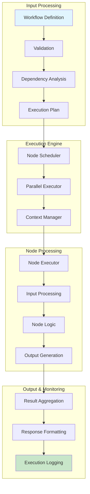
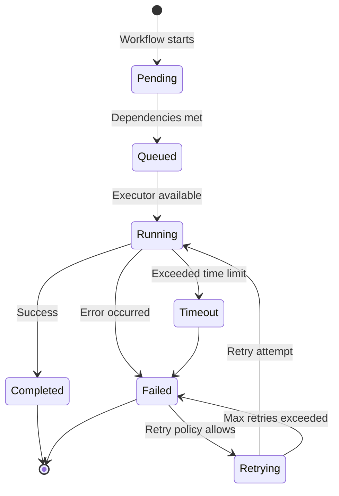

# Chapter 2: Workflow Engine

Welcome to **Chapter 2: Workflow Engine**. In this part of **Flowise LLM Orchestration: Deep Dive Tutorial**, you will build an intuitive mental model first, then move into concrete implementation details and practical production tradeoffs.


> Deep dive into Flowise's workflow execution architecture and processing model

## 🎯 Learning Objectives

By the end of this chapter, you'll understand:
- How Flowise executes workflows internally
- The node execution lifecycle and state management
- Workflow optimization and performance considerations
- Error handling and recovery mechanisms
- Debugging and monitoring workflow execution

## ⚙️ Workflow Execution Architecture

### **Execution Pipeline Overview**

Flowise's workflow engine processes workflows through a sophisticated pipeline:



### **Core Execution Components**

```typescript
// Main workflow execution engine
class WorkflowEngine {
  private nodeRegistry: Map<string, NodeFactory>;
  private contextManager: ContextManager;
  private scheduler: NodeScheduler;
  private monitor: ExecutionMonitor;

  constructor() {
    this.nodeRegistry = new Map();
    this.contextManager = new ContextManager();
    this.scheduler = new NodeScheduler();
    this.monitor = new ExecutionMonitor();
  }

  async executeWorkflow(workflowId: string, input: any): Promise<WorkflowResult> {
    const executionId = generateExecutionId();

    try {
      // Load and validate workflow
      const workflow = await this.loadWorkflow(workflowId);
      await this.validateWorkflow(workflow);

      // Initialize execution context
      const context = this.contextManager.createContext(executionId, workflow, input);

      // Start monitoring
      this.monitor.startExecution(executionId, workflow);

      // Execute workflow
      const result = await this.executeWorkflowInternal(workflow, context);

      // Complete monitoring
      this.monitor.completeExecution(executionId, result);

      return result;

    } catch (error) {
      this.monitor.failExecution(executionId, error);
      throw error;
    }
  }

  private async executeWorkflowInternal(
    workflow: WorkflowDefinition,
    context: ExecutionContext
  ): Promise<WorkflowResult> {
    // Build execution graph
    const executionGraph = this.buildExecutionGraph(workflow);

    // Schedule node execution
    const executionPlan = await this.scheduler.createExecutionPlan(executionGraph);

    // Execute nodes
    const results = await this.executeNodes(executionPlan, context);

    // Aggregate final result
    return this.aggregateResults(results, context);
  }
}
```

## 🧩 Node Execution Lifecycle

### **Node Execution States**

Each node goes through a well-defined lifecycle during execution:



### **Node Executor Implementation**

```typescript
// Node execution framework
abstract class NodeExecutor {
  protected nodeId: string;
  protected nodeType: string;
  protected config: NodeConfig;

  constructor(nodeId: string, nodeType: string, config: NodeConfig) {
    this.nodeId = nodeId;
    this.nodeType = nodeType;
    this.config = config;
  }

  // Main execution method
  async execute(input: NodeInput, context: ExecutionContext): Promise<NodeOutput> {
    const startTime = Date.now();

    try {
      // Pre-execution setup
      await this.preExecute(context);

      // Validate input
      this.validateInput(input);

      // Execute node logic
      const result = await this.executeNodeLogic(input, context);

      // Post-execution cleanup
      await this.postExecute(context);

      // Record success
      context.metrics.recordNodeSuccess(this.nodeId, Date.now() - startTime);

      return result;

    } catch (error) {
      // Record failure
      context.metrics.recordNodeFailure(this.nodeId, error, Date.now() - startTime);

      // Apply error handling strategy
      return await this.handleError(error, context);
    }
  }

  protected abstract executeNodeLogic(
    input: NodeInput,
    context: ExecutionContext
  ): Promise<NodeOutput>;

  protected async preExecute(context: ExecutionContext): Promise<void> {
    // Initialize node-specific resources
    await this.initializeResources(context);
  }

  protected async postExecute(context: ExecutionContext): Promise<void> {
    // Clean up resources
    await this.cleanupResources(context);
  }

  protected validateInput(input: NodeInput): void {
    // Validate input data against node schema
    const schema = this.getInputSchema();
    const validator = new InputValidator(schema);
    validator.validate(input);
  }

  protected async handleError(error: Error, context: ExecutionContext): Promise<NodeOutput> {
    const errorHandler = this.getErrorHandler();

    switch (errorHandler.strategy) {
      case 'retry':
        if (context.retryCount < errorHandler.maxRetries) {
          context.retryCount++;
          await this.delay(errorHandler.retryDelay);
          return this.execute(context.lastInput, context);
        }
        break;

      case 'fallback':
        return errorHandler.fallbackValue;

      case 'throw':
      default:
        throw error;
    }
  }

  protected abstract getInputSchema(): JSONSchema;
  protected abstract getErrorHandler(): ErrorHandlerConfig;
  protected abstract initializeResources(context: ExecutionContext): Promise<void>;
  protected abstract cleanupResources(context: ExecutionContext): Promise<void>;
}
```

## 📊 Context Management

### **Execution Context Architecture**

The context manager maintains state throughout workflow execution:

```typescript
// Execution context management
class ContextManager {
  private contexts: Map<string, ExecutionContext> = new Map();

  createContext(
    executionId: string,
    workflow: WorkflowDefinition,
    input: any
  ): ExecutionContext {
    const context: ExecutionContext = {
      executionId,
      workflowId: workflow.id,
      startTime: new Date(),
      status: 'running',
      input,
      output: {},
      nodeStates: new Map(),
      variables: new Map(),
      metrics: new ExecutionMetrics(),
      retryCount: 0,
      lastInput: input
    };

    this.contexts.set(executionId, context);
    return context;
  }

  getContext(executionId: string): ExecutionContext | null {
    return this.contexts.get(executionId) || null;
  }

  updateNodeState(executionId: string, nodeId: string, state: NodeState): void {
    const context = this.contexts.get(executionId);
    if (context) {
      context.nodeStates.set(nodeId, state);
    }
  }

  setVariable(executionId: string, key: string, value: any): void {
    const context = this.contexts.get(executionId);
    if (context) {
      context.variables.set(key, value);
    }
  }

  getVariable(executionId: string, key: string): any {
    const context = this.contexts.get(executionId);
    return context?.variables.get(key);
  }

  completeExecution(executionId: string, result: any): void {
    const context = this.contexts.get(executionId);
    if (context) {
      context.status = 'completed';
      context.endTime = new Date();
      context.output = result;
    }
  }

  failExecution(executionId: string, error: Error): void {
    const context = this.contexts.get(executionId);
    if (context) {
      context.status = 'failed';
      context.endTime = new Date();
      context.error = error;
    }
  }
}

interface ExecutionContext {
  executionId: string;
  workflowId: string;
  startTime: Date;
  endTime?: Date;
  status: 'running' | 'completed' | 'failed';
  input: any;
  output: any;
  nodeStates: Map<string, NodeState>;
  variables: Map<string, any>;
  metrics: ExecutionMetrics;
  retryCount: number;
  lastInput: any;
  error?: Error;
}

interface NodeState {
  status: 'pending' | 'running' | 'completed' | 'failed';
  startTime?: Date;
  endTime?: Date;
  input?: any;
  output?: any;
  error?: Error;
  retryCount?: number;
}
```

## 🔄 Dependency Resolution and Scheduling

### **Execution Graph Building**

```typescript
// Dependency analysis and execution planning
class ExecutionPlanner {
  buildExecutionGraph(workflow: WorkflowDefinition): ExecutionGraph {
    const nodes = new Map<string, ExecutionNode>();
    const edges = new Map<string, ExecutionEdge>();

    // Convert workflow nodes to execution nodes
    workflow.nodes.forEach(node => {
      nodes.set(node.id, {
        id: node.id,
        type: node.type,
        config: node.data,
        dependencies: [],
        dependents: [],
        status: 'pending'
      });
    });

    // Build dependency relationships
    workflow.edges.forEach(edge => {
      const sourceNode = nodes.get(edge.source)!;
      const targetNode = nodes.get(edge.target)!;

      // Add dependency
      targetNode.dependencies.push(edge.source);
      sourceNode.dependents.push(edge.target);

      // Create execution edge
      edges.set(`${edge.source}-${edge.target}`, {
        id: `${edge.source}-${edge.target}`,
        source: edge.source,
        target: edge.target,
        condition: edge.condition
      });
    });

    return { nodes, edges };
  }

  createExecutionPlan(graph: ExecutionGraph): ExecutionPlan {
    const plan: ExecutionPlan = {
      stages: [],
      totalNodes: graph.nodes.size
    };

    // Topological sort to create execution stages
    const visited = new Set<string>();
    const visiting = new Set<string>();
    const stages: string[][] = [];

    const visitNode = (nodeId: string) => {
      if (visited.has(nodeId)) return;
      if (visiting.has(nodeId)) {
        throw new Error(`Circular dependency detected involving node ${nodeId}`);
      }

      visiting.add(nodeId);

      const node = graph.nodes.get(nodeId)!;
      for (const dependency of node.dependencies) {
        visitNode(dependency);
      }

      visiting.delete(nodeId);
      visited.add(nodeId);

      // Add to appropriate stage
      const stageIndex = Math.max(...node.dependencies.map(dep => {
        // Find which stage this dependency is in
        for (let i = 0; i < stages.length; i++) {
          if (stages[i].includes(dep)) return i;
        }
        return -1;
      }).concat(-1)) + 1;

      if (!stages[stageIndex]) stages[stageIndex] = [];
      stages[stageIndex].push(nodeId);
    };

    // Visit all nodes
    graph.nodes.forEach((_, nodeId) => {
      if (!visited.has(nodeId)) {
        visitNode(nodeId);
      }
    });

    plan.stages = stages;
    return plan;
  }
}

interface ExecutionGraph {
  nodes: Map<string, ExecutionNode>;
  edges: Map<string, ExecutionEdge>;
}

interface ExecutionNode {
  id: string;
  type: string;
  config: any;
  dependencies: string[];
  dependents: string[];
  status: 'pending' | 'running' | 'completed' | 'failed';
}

interface ExecutionEdge {
  id: string;
  source: string;
  target: string;
  condition?: string;
}

interface ExecutionPlan {
  stages: string[][];
  totalNodes: number;
}
```

### **Parallel Execution Engine**

```typescript
// Parallel workflow execution
class ParallelExecutor {
  private maxConcurrency: number;
  private semaphore: Semaphore;

  constructor(maxConcurrency: number = 10) {
    this.maxConcurrency = maxConcurrency;
    this.semaphore = new Semaphore(maxConcurrency);
  }

  async executePlan(
    plan: ExecutionPlan,
    graph: ExecutionGraph,
    context: ExecutionContext
  ): Promise<Map<string, NodeResult>> {
    const results = new Map<string, NodeResult>();

    // Execute stages sequentially
    for (const stage of plan.stages) {
      // Execute nodes in stage in parallel
      const stagePromises = stage.map(nodeId =>
        this.executeNodeWithSemaphore(nodeId, graph, context)
      );

      const stageResults = await Promise.allSettled(stagePromises);

      // Process results
      stage.forEach((nodeId, index) => {
        const result = stageResults[index];

        if (result.status === 'fulfilled') {
          results.set(nodeId, result.value);
          graph.nodes.get(nodeId)!.status = 'completed';
        } else {
          results.set(nodeId, { success: false, error: result.reason });
          graph.nodes.get(nodeId)!.status = 'failed';
        }
      });

      // Check if we should continue (all nodes in stage completed)
      const allSuccessful = stageResults.every(r => r.status === 'fulfilled');
      if (!allSuccessful) {
        // Handle partial failures based on workflow configuration
        await this.handleStageFailure(stage, stageResults, context);
      }
    }

    return results;
  }

  private async executeNodeWithSemaphore(
    nodeId: string,
    graph: ExecutionGraph,
    context: ExecutionContext
  ): Promise<NodeResult> {
    await this.semaphore.acquire();

    try {
      const node = graph.nodes.get(nodeId)!;
      const executor = this.createNodeExecutor(node);

      // Get node input from context and previous node outputs
      const input = this.buildNodeInput(nodeId, graph, context, results);

      const result = await executor.execute(input, context);
      return { success: true, output: result };

    } finally {
      this.semaphore.release();
    }
  }

  private buildNodeInput(
    nodeId: string,
    graph: ExecutionGraph,
    context: ExecutionContext,
    results: Map<string, NodeResult>
  ): NodeInput {
    const node = graph.nodes.get(nodeId)!;
    const input: NodeInput = {};

    // Add workflow input if this is an input node
    if (node.type === 'input' || node.type === 'chatPrompt') {
      input.workflowInput = context.input;
    }

    // Add outputs from dependency nodes
    for (const dependencyId of node.dependencies) {
      const depResult = results.get(dependencyId);
      if (depResult?.success) {
        input[dependencyId] = depResult.output;
      }
    }

    // Add context variables
    input.variables = Object.fromEntries(context.variables);

    return input;
  }

  private async handleStageFailure(
    stage: string[],
    results: PromiseSettledResult<NodeResult>[],
    context: ExecutionContext
  ): Promise<void> {
    // Implement failure handling strategy
    const failedNodes = stage.filter((_, index) =>
      results[index].status === 'rejected'
    );

    if (failedNodes.length > 0) {
      // Check if workflow should continue or fail
      const continueOnFailure = context.workflow.config?.continueOnFailure || false;

      if (!continueOnFailure) {
        throw new WorkflowExecutionError(
          `Stage failed with ${failedNodes.length} failed nodes: ${failedNodes.join(', ')}`
        );
      }

      // Log failures and continue
      failedNodes.forEach(nodeId => {
        const result = results[stage.indexOf(nodeId)];
        console.error(`Node ${nodeId} failed:`, result.reason);
      });
    }
  }
}

// Semaphore for concurrency control
class Semaphore {
  private permits: number;
  private waiting: Array<() => void> = [];

  constructor(permits: number) {
    this.permits = permits;
  }

  async acquire(): Promise<void> {
    if (this.permits > 0) {
      this.permits--;
      return;
    }

    return new Promise(resolve => {
      this.waiting.push(resolve);
    });
  }

  release(): void {
    this.permits++;
    if (this.waiting.length > 0) {
      const resolve = this.waiting.shift()!;
      this.permits--;
      resolve();
    }
  }
}
```

## 📈 Performance Optimization

### **Execution Metrics and Monitoring**

```typescript
// Execution performance monitoring
class ExecutionMetrics {
  private nodeMetrics: Map<string, NodeMetrics> = new Map();
  private startTime: number = Date.now();

  recordNodeSuccess(nodeId: string, duration: number): void {
    this.recordNodeMetric(nodeId, {
      status: 'success',
      duration,
      timestamp: Date.now()
    });
  }

  recordNodeFailure(nodeId: string, error: Error, duration: number): void {
    this.recordNodeMetric(nodeId, {
      status: 'failure',
      duration,
      error: error.message,
      timestamp: Date.now()
    });
  }

  getWorkflowMetrics(): WorkflowMetrics {
    const nodeMetrics = Array.from(this.nodeMetrics.values());
    const totalDuration = Date.now() - this.startTime;

    return {
      totalDuration,
      totalNodes: nodeMetrics.length,
      successfulNodes: nodeMetrics.filter(m => m.status === 'success').length,
      failedNodes: nodeMetrics.filter(m => m.status === 'failure').length,
      averageNodeDuration: nodeMetrics.reduce((sum, m) => sum + m.duration, 0) / nodeMetrics.length,
      slowestNode: nodeMetrics.reduce((slowest, current) =>
        current.duration > slowest.duration ? current : slowest
      )
    };
  }

  getNodeMetrics(nodeId: string): NodeMetrics | null {
    return this.nodeMetrics.get(nodeId) || null;
  }

  private recordNodeMetric(nodeId: string, metrics: NodeMetrics): void {
    this.nodeMetrics.set(nodeId, metrics);
  }
}

interface NodeMetrics {
  status: 'success' | 'failure';
  duration: number;
  timestamp: number;
  error?: string;
}

interface WorkflowMetrics {
  totalDuration: number;
  totalNodes: number;
  successfulNodes: number;
  failedNodes: number;
  averageNodeDuration: number;
  slowestNode: NodeMetrics;
}
```

## 🧪 Hands-On Exercise

**Estimated Time: 45 minutes**

1. **Build a Complex Workflow**: Create a workflow with multiple branches, parallel execution, and conditional logic
2. **Monitor Execution**: Use Flowise's built-in monitoring to observe node execution times and identify bottlenecks
3. **Test Error Handling**: Introduce failures in nodes and observe how the workflow handles them
4. **Optimize Performance**: Experiment with different node arrangements and measure execution times
5. **Debug Execution Flow**: Use the visual debugger to step through workflow execution

---

**Ready to create custom nodes?** Continue to [Chapter 3: Node Development](03-node-development.md)

## What Problem Does This Solve?

Most teams struggle here because the hard part is not writing more code, but deciding clear boundaries for `context`, `nodeId`, `input` so behavior stays predictable as complexity grows.

In practical terms, this chapter helps you avoid three common failures:

- coupling core logic too tightly to one implementation path
- missing the handoff boundaries between setup, execution, and validation
- shipping changes without clear rollback or observability strategy

After working through this chapter, you should be able to reason about `Chapter 2: Workflow Engine` as an operating subsystem inside **Flowise LLM Orchestration: Deep Dive Tutorial**, with explicit contracts for inputs, state transitions, and outputs.

Use the implementation notes around `node`, `nodes`, `workflow` as your checklist when adapting these patterns to your own repository.

## How it Works Under the Hood

Under the hood, `Chapter 2: Workflow Engine` usually follows a repeatable control path:

1. **Context bootstrap**: initialize runtime config and prerequisites for `context`.
2. **Input normalization**: shape incoming data so `nodeId` receives stable contracts.
3. **Core execution**: run the main logic branch and propagate intermediate state through `input`.
4. **Policy and safety checks**: enforce limits, auth scopes, and failure boundaries.
5. **Output composition**: return canonical result payloads for downstream consumers.
6. **Operational telemetry**: emit logs/metrics needed for debugging and performance tuning.

When debugging, walk this sequence in order and confirm each stage has explicit success/failure conditions.

## Source Walkthrough

Use the following upstream sources to verify implementation details while reading this chapter:

- [Flowise](https://github.com/FlowiseAI/Flowise)
  Why it matters: authoritative reference on `Flowise` (github.com).

Suggested trace strategy:
- search upstream code for `context` and `nodeId` to map concrete implementation paths
- compare docs claims against actual runtime/config code before reusing patterns in production

## Chapter Connections

- [Tutorial Index](index.md)
- [Previous Chapter: Chapter 1: Flowise System Overview](01-system-overview.md)
- [Next Chapter: Chapter 3: Node Development](03-node-development.md)
- [Main Catalog](../../README.md#-tutorial-catalog)
- [A-Z Tutorial Directory](../../discoverability/tutorial-directory.md)
