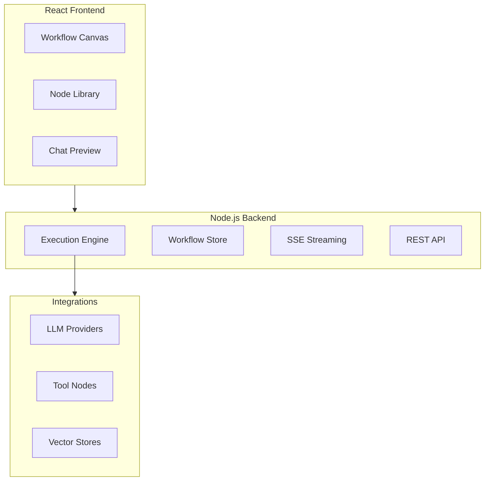

# Flowise LLM Orchestration: Deep Dive Tutorial

> **Project**: [Flowise](https://github.com/FlowiseAI/Flowise) — An open-source visual tool for building LLM workflows with a drag-and-drop interface.

## Why This Track Matters

Flowise makes LLM orchestration visual and accessible — a drag-and-drop canvas for building production pipelines without boilerplate, with auto-generated APIs for every workflow you create.

This track focuses on:
- building LLM workflows visually with Flowise's node canvas
- developing custom nodes to extend Flowise with new integrations
- connecting LLM providers, vector stores, and tools in production pipelines
- deploying and monitoring Flowise workflows with Docker

## What Is Flowise?

Flowise is an open-source visual workflow builder for LLM applications. It provides a drag-and-drop canvas for connecting AI models, data sources, and tools into production-ready pipelines — without writing boilerplate code.

| Feature | Description |
|---------|-------------|
| **Visual Canvas** | Drag-and-drop workflow builder with real-time preview |
| **Node Library** | 100+ pre-built nodes for LLMs, tools, and data sources |
| **Streaming** | Real-time streaming responses with SSE |
| **Multi-Model** | OpenAI, Anthropic, Google, HuggingFace, Ollama |
| **Custom Nodes** | Extensible architecture for building custom integrations |
| **API Export** | Auto-generated REST APIs for every workflow |

## Mental Model

## Chapter Guide

| Chapter | Topic | What You'll Learn |
|---------|-------|-------------------|
| [1. System Overview](01-system-overview.md) | Architecture | Monorepo structure, component relationships |
| [2. Workflow Engine](02-workflow-engine.md) | Execution | Node graph execution, data flow, streaming |
| [3. Node Development](03-node-development.md) | Extensibility | Building custom nodes, input/output types |
| [4. Advanced Integrations](04-advanced-integrations.md) | Connections | LLM providers, vector stores, tools |
| [5. Production Deployment](05-production-deployment.md) | Operations | Docker, scaling, monitoring |
| [6. Security and Governance](06-security-governance.md) | Security | Secret handling, policy controls, tool safety |
| [7. Observability](07-observability.md) | Monitoring | Tracing, metrics, and failure analysis |
| [8. Extension Ecosystem](08-extension-ecosystem.md) | Growth | Extension contracts, distribution, compatibility |

## Tech Stack

| Component | Technology |
|-----------|-----------|
| **Backend** | Node.js, Express |
| **Frontend** | React, ReactFlow |
| **Database** | SQLite / PostgreSQL / MySQL |
| **Streaming** | Server-Sent Events |
| **Deployment** | Docker, npm |

---

Ready to begin? Start with [Chapter 1: System Overview](01-system-overview.md).

---

*Built with insights from the [Flowise repository](https://github.com/FlowiseAI/Flowise) and community documentation.*

## Navigation & Backlinks

- [Start Here: Chapter 1: Flowise System Overview](01-system-overview.md)
- [Back to Main Catalog](../../README.md#-tutorial-catalog)
- [Browse A-Z Tutorial Directory](../../discoverability/tutorial-directory.md)
- [Search by Intent](../../discoverability/query-hub.md)
- [Explore Category Hubs](../../README.md#category-hubs)

## Full Chapter Map

1. [Chapter 1: Flowise System Overview](01-system-overview.md)
2. [Chapter 2: Workflow Engine](02-workflow-engine.md)
3. [Chapter 3: Node Development](03-node-development.md)
4. [Chapter 4: Advanced Integrations](04-advanced-integrations.md)
5. [Chapter 5: Production Deployment](05-production-deployment.md)
6. [Chapter 6: Security and Governance](06-security-governance.md)
7. [Chapter 7: Observability](07-observability.md)
8. [Chapter 8: Extension Ecosystem](08-extension-ecosystem.md)

## Current Snapshot (auto-updated)

- repository: [FlowiseAI/Flowise](https://github.com/FlowiseAI/Flowise)
- stars: about **34K**
- project positioning: popular open-source visual LLM workflow builder with 100+ pre-built nodes

## What You Will Learn

- how Flowise's node graph execution engine processes data flow and streaming responses
- how to build custom nodes with typed inputs and outputs for new integrations
- how to connect LLM providers, vector stores, and external tools in visual workflows
- how to deploy Flowise with Docker and manage security, governance, and observability

## Source References

- [Flowise](https://github.com/FlowiseAI/Flowise)

*Generated by [AI Codebase Knowledge Builder](https://github.com/The-Pocket/Tutorial-Codebase-Knowledge)*
